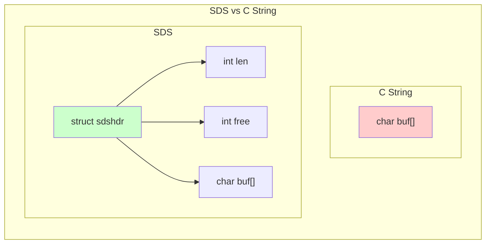
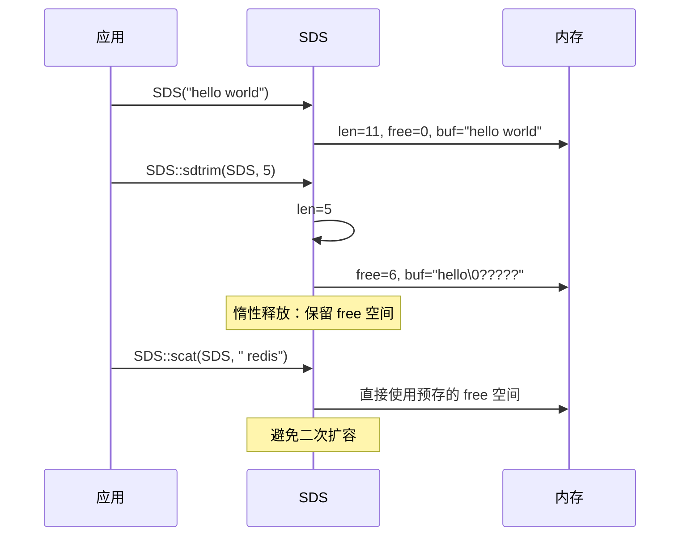
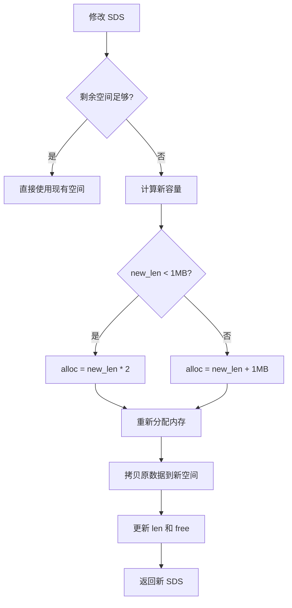

# String 底层 SDS 结构

> **目标级别**：P5/P6
> **面试频率**：🔴 高频
> **面试官最关心的 3 个问题**：
> 1. SDS 是什么？为什么要自己实现字符串？
> 2. SDS 比 C 字符串好在哪里？
> 3. SDS 的内存分配策略是怎样的？

面试官问：「Redis 源码看过吗？」你说「看过一点」——然后面试官紧接着追问「那 SDS 的 header 结构是什么样的？惰性空间释放又是什么？」你沉默了。

这就是 Redis 源码面试的真实面貌：不仅要会用，还要理解底层实现。

## 一、SDS 简介

SDS（Simple Dynamic String）是 Redis 自定义的字符串类型，源码位于 `src/sds.h` 和 `src/sds.c`。



### SDS 的三种编码

```c
// src/sds.h
typedef char *sds;  // sds 实际是指向 char buf[] 的指针

// SDS Header 结构
struct sdshdr {
    int len;      // 已使用字节数
    int free;     // 剩余可用字节数
    char buf[];   // 柔性数组，存储实际字符串
};
```

## 二、SDS vs C 字符串

### 2.1 特性对比

| 特性 | C 字符串 | SDS | 优势 |
|------|----------|-----|------|
| **获取长度** | `O(n)` 遍历 | `O(1)` 记录 `len` | 快速获取字符串长度 |
| **缓冲区溢出** | 容易 | 自动扩容 | 防止内存溢出 |
| **二进制安全** | 否 | 是 | 可以存储二进制数据 |
| **内存分配** | 每次修改都重新分配 | 空间预分配+惰性释放 | 减少内存分配次数 |
| **字符串拼接** | `O(n)` 每次需重新分配 | `O(n)` 预分配 | 支持多次拼接 |

### 2.2 为什么 SDS 更安全？

```c
// C 字符串：以 '\0' 结尾，遇到 '\0' 就截断
char buf[] = "hello\0world";
printf("%s", buf);  // 只输出 "hello"

// SDS：记录长度，不依赖 '\0' 判断
struct sdshdr {
    int len;    // len = 11
    int free;
    char buf[]; // "hello\0world" 完整存储
};
```

### 2.3 缓冲区溢出对比

```c
// C 字符串：strcpy 不检查目标缓冲区大小
char buf[10] = "hello";
strcpy(buf, "world12345");  // 溢出！覆盖其他内存

// SDS：先检查容量，不够则自动扩容
sds s = sdsnew("hello");
s = sdscat(s, "world12345");  // 自动扩容，安全
```

## 三、SDS 内存分配策略

### 3.1 空间预分配

SDS 扩容时会预分配额外空间，减少后续扩容次数：

```c
// 扩容逻辑（伪代码）
if (new_len < 1024 * 1024) {
    // 小于 1MB：额外分配同等空间
    alloc = new_len * 2;
} else {
    // 大于 1MB：额外分配 1MB
    alloc = new_len + 1024 * 1024;
}
```

| 新字符串长度 | 预分配策略 | 示例 |
|-------------|-------------|------|
| `< 1MB` | `alloc = len * 2` | len=10，alloc=20 |
| `>= 1MB` | `alloc = len + 1MB` | len=2MB，alloc=3MB |

### 3.2 惰性空间释放

SDS 缩短字符串时，不会立即释放多余空间：



### 3.3 扩容流程图



## 四、SDS 核心操作

### 4.1 创建字符串

```c
// sds.c
sds sdsnew(const char *init) {
    size_t initlen = (init == NULL) ? 0 : strlen(init);
    return sdsnewlen(init, initlen);
}

sds sdsnewlen(const void *init, size_t initlen) {
    struct sdshdr *sh;
    sds s;

    // 分配 header + 字符串空间
    sh = malloc(sizeof(struct sdshdr) + initlen + 1);
    s = (char*)sh + sizeof(struct sdshdr);
    sh->len = initlen;
    sh->free = 0;

    if (initlen && init)
        memcpy(s, init, initlen);
    s[initlen] = '\0';

    return s;
}
```

### 4.2 追加字符串

```c
sds sdscat(sds s, const char *t) {
    return sdscatlen(s, t, strlen(t));
}

sds sdscatlen(sds s, const void *t, size_t len) {
    struct sdshdr *sh = (void*)(s - sizeof(struct sdshdr));
    size_t curlen = sh->len;

    // 先扩容
    s = sdsMakeRoomFor(s, len);
    sh = (void*)(s - sizeof(struct sdshdr));

    // 拷贝新数据
    memcpy(sh->buf + curlen, t, len);
    sh->buf[curlen + len] = '\0';
    sh->len = curlen + len;

    return s;
}
```

### 4.3 获取长度

```c
// O(1) 获取长度
static inline size_t sdslen(const sds s) {
    struct sdshdr *sh = (void*)(s - sizeof(struct sdshdr));
    return sh->len;
}
```

## 五、面试追问链设计

> **第一层**：SDS 和 C 字符串有什么区别？
> **第二层**：SDS 的空间预分配策略是什么？
> **第三层**：为什么要预分配 2 倍空间而不是刚好够用？

> **第一层**：什么是惰性空间释放？
> **第二层**：惰性空间释放有什么好处？
> **第三层**：如果不使用惰性释放，会有什么问题？

> **第一层**：SDS 是二进制安全的，什么叫二进制安全？
> **第二层**：为什么 C 字符串不是二进制安全的？
> **第三层**：哪些场景需要二进制安全？

## 六、常见面试陷阱

**⚠️ 陷阱 1**：只说"SDS 比 C 字符串好"
- 面试官会追问"好在哪里"，要能说出具体数据结构的差异
- 至少要能画出 SDS 的 header 结构图

**⚠️ 陷阱 2**：不知道预分配阈值
- 1MB 是 Redis 源码中的magic number
- 要能说出 1MB 前后分配策略的不同

**⚠️ 陷阱 3**：混淆概念
- 惰性空间释放 ≠ 延迟释放
- 惰性空间释放是为了避免频繁的内存分配和释放

## 七、对比总结表

| 维度 | C 字符串 | SDS |
|------|----------|-----|
| 长度获取 | `O(n)` 遍历 | `O(1)` |
| 内存分配 | 每次重新分配 | 预分配+惰性释放 |
| 二进制安全 | 否 | 是 |
| 缓冲区溢出 | 容易 | 自动扩容 |
| API 复杂度 | 简单 | 稍复杂 |
| 适用场景 | 简单字符串 | Redis 所有字符串场景 |

## 八、加分回答

> **💡 面试加分点**：如果能说出 Redis 3.2+ 版本引入的 SDS 优化，会给面试官留下深刻印象：
>
> 1. **SDS 5.x 版本**：引入 `sdshdr5/8/16/32/64` 五种 header，根据字符串长度选择最小 header
> 2. **embstr 编码**：短字符串（`<= 44` 字节）使用嵌入式 SDS，避免两次内存分配
> 3. **int 编码**：纯数字字符串直接用 `long long` 类型存储，不分配额外内存
>
> ```c
> // Redis 3.2+ 新 header 优化
> struct __attribute__ ((__packed__)) sdshdr16 {
>     uint16_t len;   // 2 字节，最大 64KB
>     uint16_t alloc; // 2 字节
>     unsigned char flags; // 1 字节
>     char buf[];
> };
> ```
