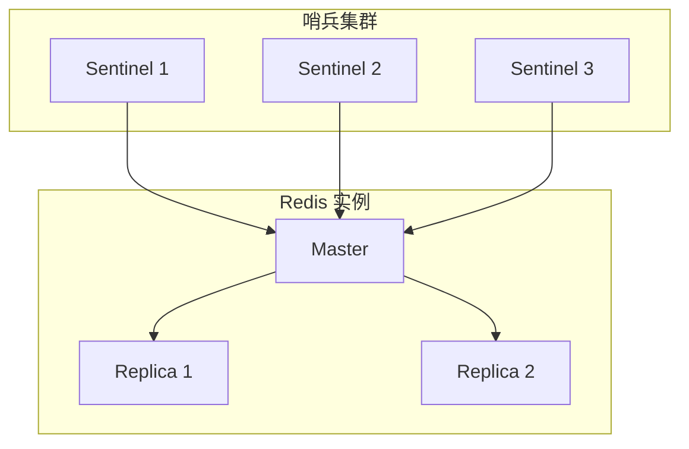
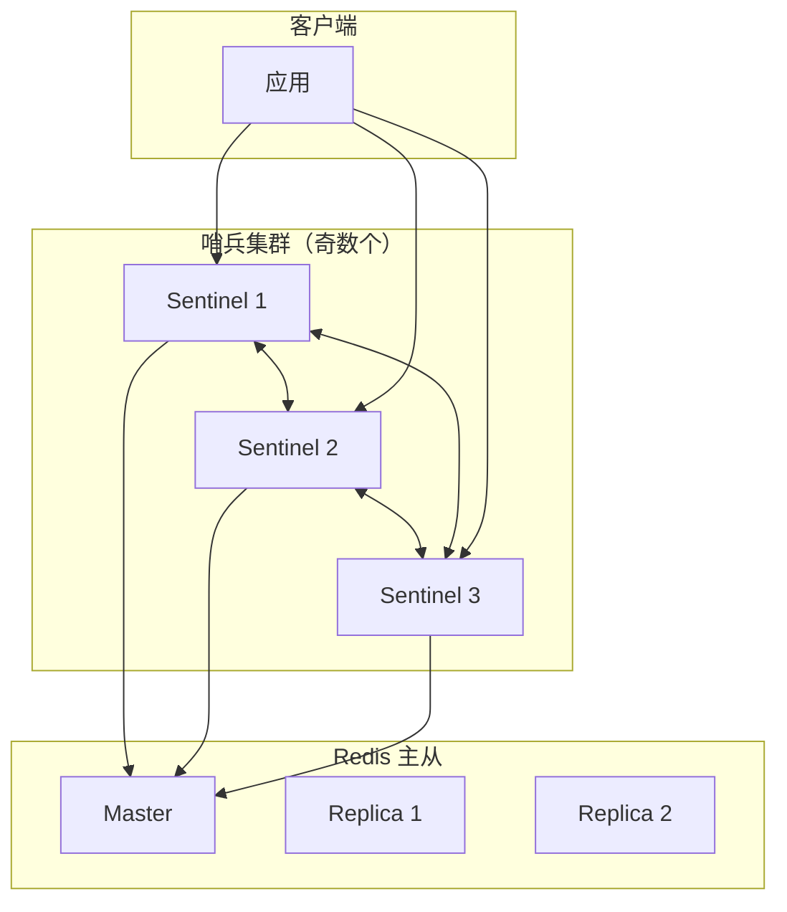
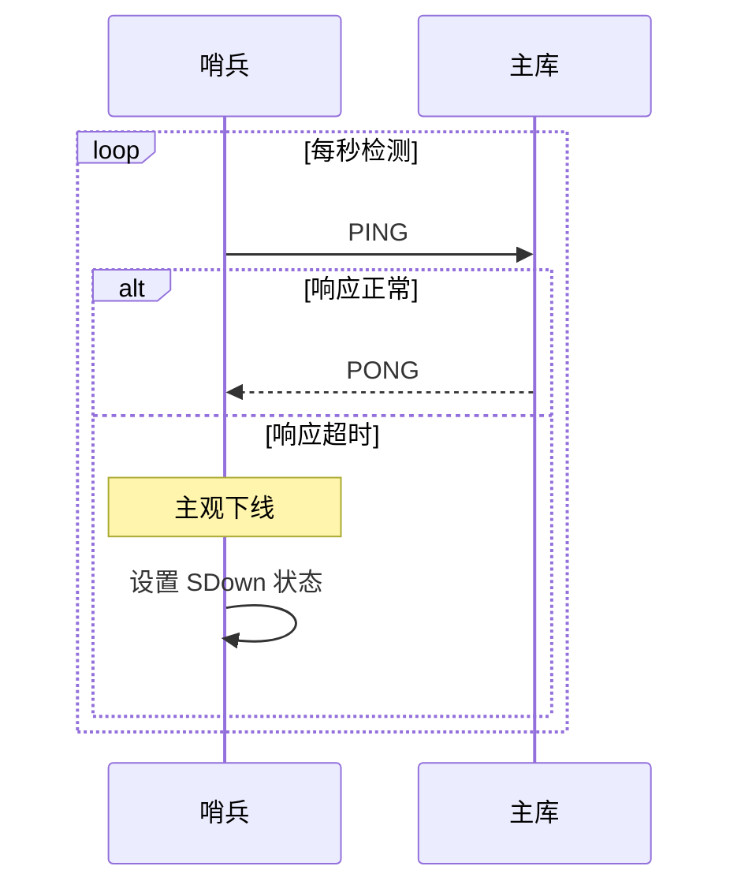
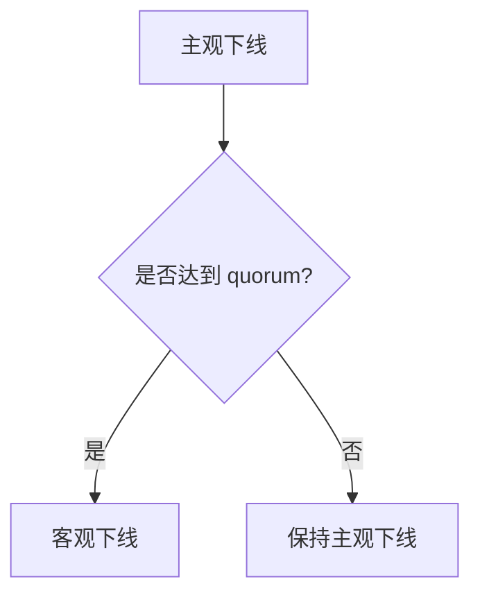
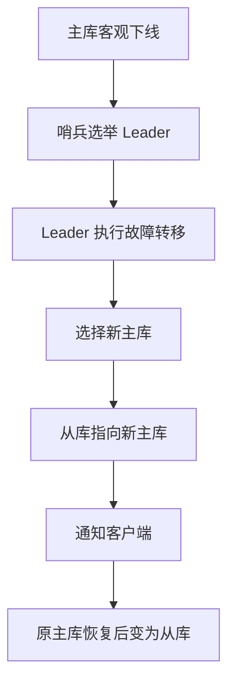
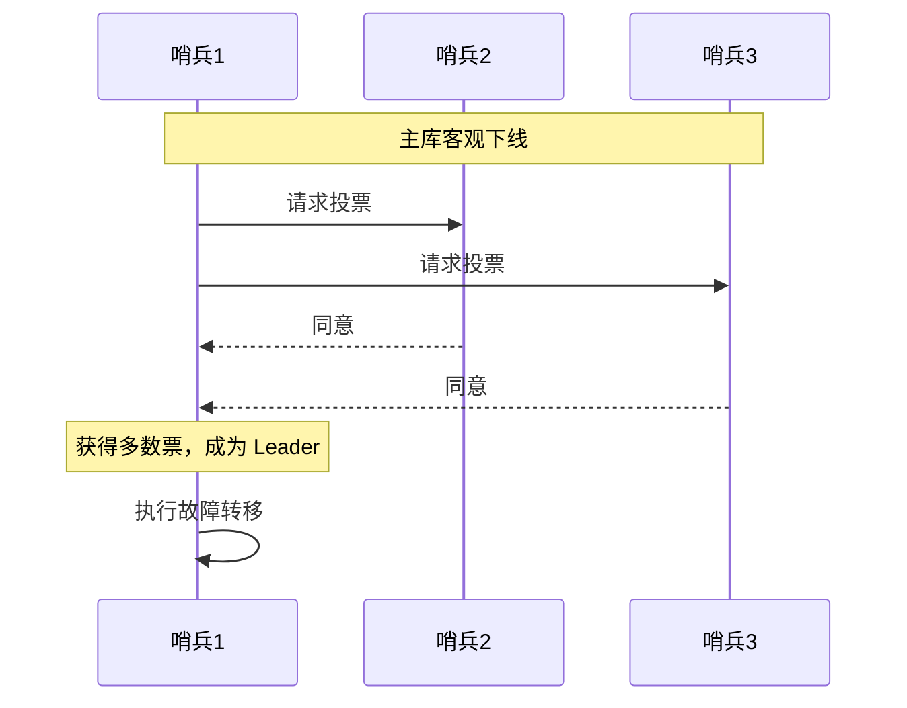
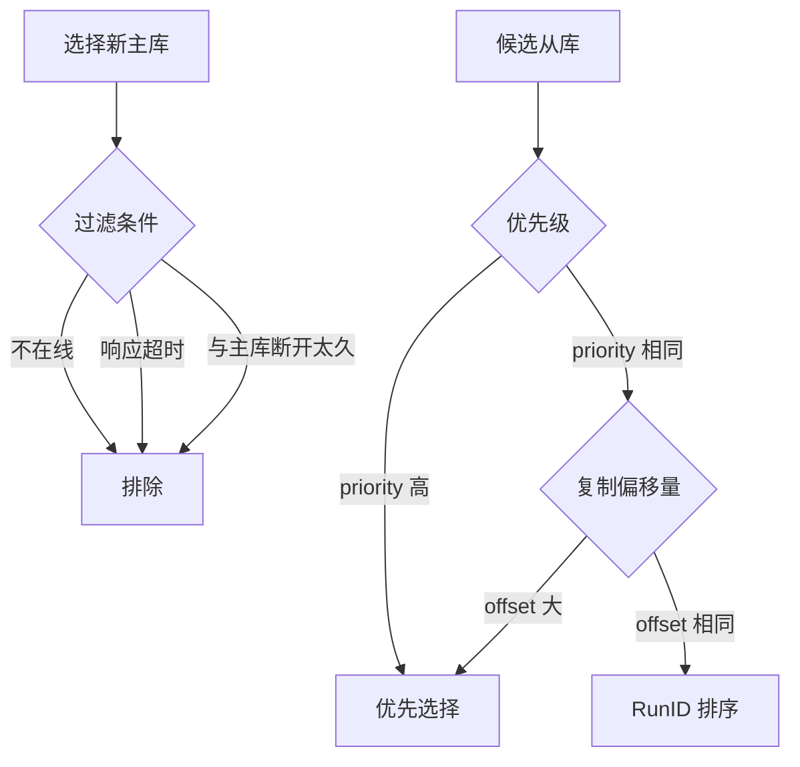
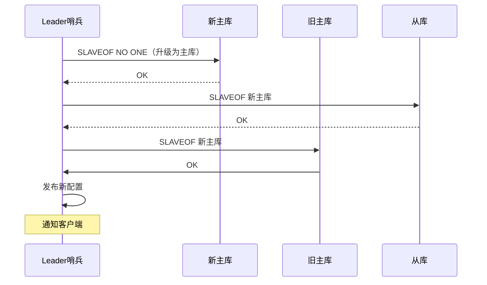
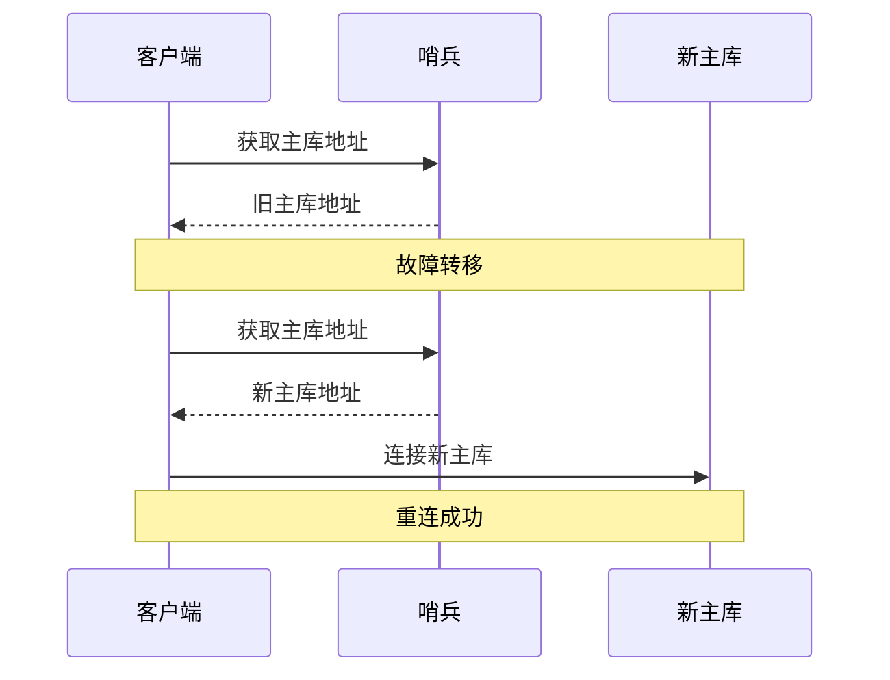
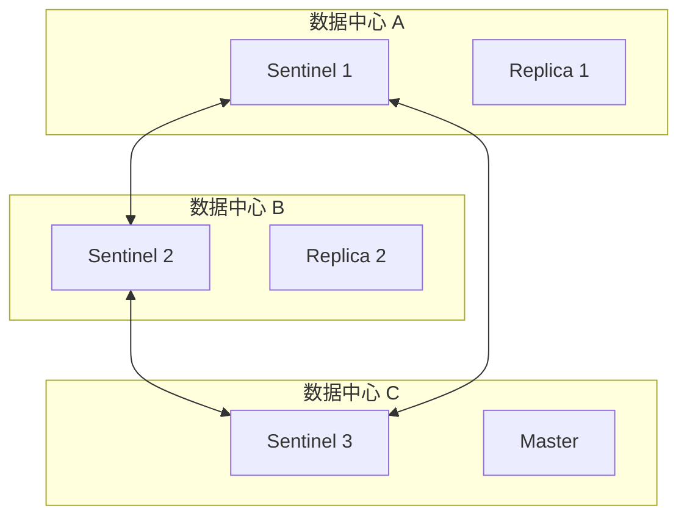

# Redis 哨兵机制

> **目标级别**：P5/P6
> **面试频率**：🔴 高频
> **面试官最关心的 3 个问题**：
> 1. Redis 哨兵是什么？解决了什么问题？
> 2. 哨兵是如何检测主库故障的？
> 3. 主从切换的过程是怎样的？

面试官问：「Redis 主库挂了，业务怎么办？」你说「人工介入」——然后面试官追问「人工介入太慢了，有没有自动化的方案？」你沉默了。

这就是哨兵的价值：自动化故障检测与恢复。

## 一、哨兵概述

### 1.1 什么是哨兵

**哨兵（Sentinel）**：Redis 的高可用解决方案，负责监控主从库的运行状态、自动故障转移、通知客户端。



### 1.2 哨兵解决的问题

| 问题 | 说明 |
|------|------|
| **故障检测** | 监控主库是否存活 |
| **自动切换** | 主库挂了自动选从库升级 |
| **通知机制** | 告知客户端主库变更 |
| **配置中心** | 提供新的主库地址 |

### 1.3 哨兵与主从复制的区别

| 维度 | 主从复制 | 哨兵 |
|------|----------|------|
| **作用** | 数据同步 | 高可用 |
| **是否必须** | 否 | 否 |
| **自动化** | 手动配置 | 自动切换 |
| **故障恢复** | 人工介入 | 自动切换 |

## 二、哨兵工作原理

### 2.1 哨兵架构



### 2.2 哨兵配置

```bash
# sentinel.conf
sentinel monitor mymaster 127.0.0.1 6379 2
# 监控 mymaster，主库地址 127.0.0.1:6379
# 2 表示至少 2 个哨兵同意才进行故障转移

sentinel down-after-milliseconds mymaster 30000
# 主库主观下线时间（毫秒）

sentinel parallel-syncs mymaster 1
# 故障转移后，最多同时同步的从库数量

sentinel failover-timeout mymaster 180000
# 故障转移超时时间（毫秒）
```

## 三、故障检测机制

### 3.1 主观下线（SDown）

**主观下线**：单个哨兵认为主库不可用。



### 3.2 客观下线（ODown）

**客观下线**：多个哨兵都认为主库不可用，触发故障转移。



```bash
# sentinel monitor 配置的 quorum 决定
sentinel monitor mymaster 127.0.0.1 6379 2
# 需要 2 个哨兵同意才客观下线
```

### 3.3 Sentinel + Hello 频道

哨兵之间通过 `__sentinel__:hello` 频道互相感知：

```bash
# 发布自己的信息
PUBLISH __sentinel__:hello "{...}"

# 订阅其他哨兵的信息
SUBSCRIBE __sentinel__:hello
```

## 四、故障转移流程

### 4.1 流程总览



### 4.2 哨兵 Leader 选举

使用 Raft 算法选举 Leader：



**选举规则**：
1. 半数以上哨兵同意
2. 先到先得
3. 优先级高的优先

### 4.3 选择新主库



**选择标准**：
1. 过滤不健康的从库
2. 按优先级排序
3. 优先级相同，选复制偏移量最大的
4. 还相同，选 RunID 最小的

### 4.4 故障转移过程



## 五、客户端感知

### 5.1 客户端连接方式

```java
// 传统方式：连接固定地址
RedisClient client = new RedisClient("127.0.0.1", 6379);

// 哨兵方式：连接哨兵，由哨兵提供主库地址
RedisSentinelConfiguration config = new RedisSentinelConfiguration()
    .master("mymaster")
    .sentinel("127.0.0.1", 26379)
    .sentinel("127.0.0.1", 26380)
    .sentinel("127.0.0.1", 26381);

JedisPoolConfig poolConfig = new JedisPoolConfig();
JedisSentinelPool pool = new JedisSentinelPool("mymaster", sentinels, poolConfig);
Jedis jedis = pool.getResource();
```

### 5.2 订阅切换事件

```java
// 订阅 +switch-master 事件
JedisSentinelPool pool = new JedisSentinelPool("mymaster", sentinels);

pool.addListener((e, r) -> {
    if (e instanceof JedisSentinelPool.MasterChangedEvent) {
        JedisSentinelPool.MasterChangedEvent event =
            (JedisSentinelPool.MasterChangedEvent) e;
        System.out.println("主库切换: " + event.getMasterAddress());
    }
});
```

### 5.3 客户端重连



## 六、哨兵部署建议

### 6.1 部署架构



**建议**：
- 哨兵部署在不同的物理机上
- 哨兵数量为奇数（2n+1）
- 哨兵数量 `<=` Redis 实例数量

### 6.2 配置建议

```bash
# sentinel.conf

# 监控配置
sentinel monitor mymaster 127.0.0.1 6379 2
sentinel down-after-milliseconds mymaster 30000

# 故障转移配置
sentinel parallel-syncs mymaster 1
sentinel failover-timeout mymaster 180000

# 认证配置
sentinel auth-pass mymaster password

# 通知配置
sentinel notification-script mymaster /path/to/notify.sh
sentinel client-reconfig-script mymaster /path/to/reconfig.sh
```

## 七、面试追问链设计

> **第一层**：Redis 哨兵是什么？解决了什么问题？
> **第二层**：主观下线和客观下线有什么区别？
> **第三层**：哨兵之间是怎么通信的？

> **第一层**：哨兵 Leader 是怎么选举的？
> **第二层**：新主库是怎么选择的？
> **第三层**：故障转移过程中，客户端能正常访问吗？

> **第一层**：哨兵集群至少需要几个？
> **第二层**：哨兵能监控多个主库吗？
> **第三层**：哨兵和 Redis Cluster 有什么区别？

## 八、常见面试陷阱

**⚠️ 陷阱 1**：认为哨兵数量越多越好

哨兵数量越多，通信开销越大，而且可能影响故障检测的灵敏度。一般 3 个哨兵就够了。

**⚠️ 陷阱 2**：不理解故障转移的代价

故障转移期间（约 10-30 秒），写操作会失败。哨兵只是提高可用性，不是零停机。

**⚠️ 陷阱 3**：忽视脑裂问题

哨兵切换期间，可能出现主库和从库同时存在的情况（脑裂），需要配置 `min-replicas-to-write`。

## 九、对比总结表

| 维度 | 哨兵 | 主从复制 | Redis Cluster |
|------|------|----------|---------------|
| **作用** | 高可用 | 数据备份 | 分片集群 |
| **故障恢复** | 自动切换 | 手动 | 自动 |
| **写能力** | 主库单点 | 主库单点 | 多主库 |
| **读能力** | 从库扩展 | 从库扩展 | 多从库 |
| **复杂度** | 中 | 低 | 高 |
| **数据分片** | 否 | 否 | 是 |

## 十、加分回答

> **💡 面试加分点**：哨兵的命令：

```bash
# 查看哨兵状态
redis-cli -p 26379 INFO sentinel

# 查看监控的主库
redis-cli -p 26379 SENTINEL masters

# 查看指定主库详情
redis-cli -p 26379 SENTINEL master mymaster

# 查看从库列表
redis-cli -p 26379 SENTINEL replicas mymaster

# 强制故障转移（测试用）
redis-cli -p 26379 SENTINEL failover mymaster
```

> **💡 面试加分点**：Redis 7.0 的哨兵增强：

1. **改进的故障检测**：更快的客观下线判断
2. **更好的通知机制**：支持更多事件类型
3. **性能优化**：减少不必要的网络通信
