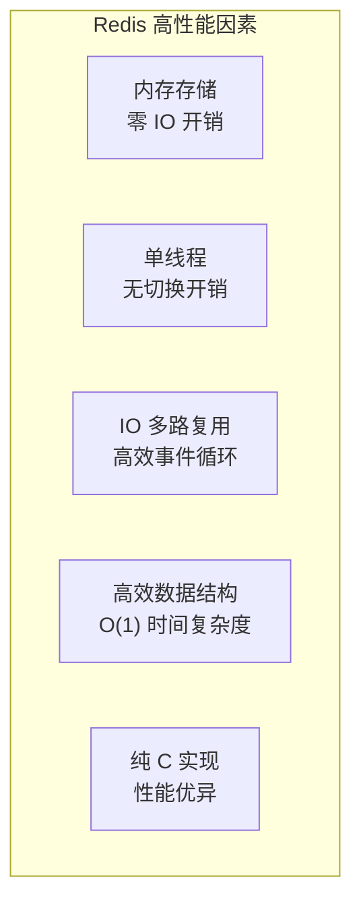
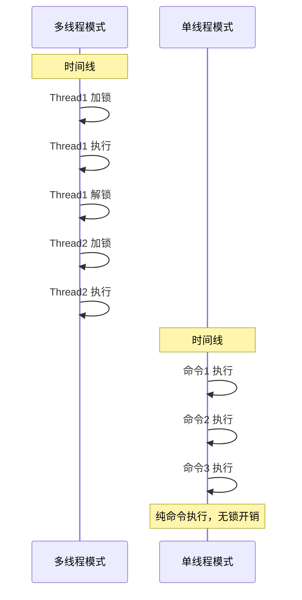
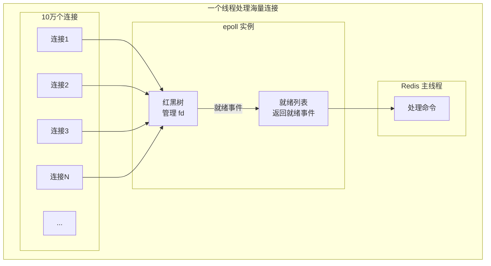
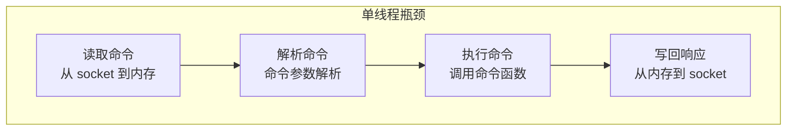

# Redis 单线程为什么快

> **目标级别**：P5/P6
> **面试频率**：🔴 高频
> **面试官最关心的 3 个问题**：
> 1. Redis 单线程为什么这么快？
> 2. Redis 的性能瓶颈在哪里？
> 3. 为什么单线程能支撑高并发？

面试官问：「Redis 为什么这么快？」你说「因为是内存数据库」——然后面试官紧接着追问「那 Memcached 也是内存数据库，为什么没 Redis 快？」你沉默了。

这就是 Redis 性能面试的真实面貌：不仅要说出「是什么」，还要理解「为什么这样设计」。

## 一、Redis 高性能的核心因素



## 二、五大核心因素详解

### 2.1 内存存储

| 对比项 | 磁盘数据库 | Redis |
|--------|-----------|-------|
| 存储介质 | 磁盘（毫秒级） | 内存（纳秒级） |
| 随机读写 | 慢 | 快 |
| 顺序读写 | 较快 | 快 |
| 性能差距 | 1x | 10万x |

**为什么内存快？**

- 磁盘需要机械臂寻道 + 磁盘旋转
- SSD 虽然快，但仍比内存慢 100-1000 倍
- 内存是电子存储，无机械运动

### 2.2 单线程模型

| 对比项 | 多线程 | 单线程 |
|--------|--------|--------|
| 上下文切换 | 频繁 | 无 |
| 锁竞争 | 存在 | 无 |
| 编程复杂度 | 高 | 低 |
| 资源占用 | 高 | 低 |

**无锁优势**：



### 2.3 IO 多路复用

Redis 使用 epoll（Linux）或 kqueue（macOS）实现高效的事件监听：

| 方案 | select | poll | epoll |
|------|--------|------|-------|
| 最大连接数 | 1024 | 无限制 | 无限制 |
| 时间复杂度 | `O(n)` | `O(n)` | `O(1)` |
| Redis 使用 | ❌ | ❌ | ✅ |

**核心原理**：



### 2.4 高效数据结构

| 数据结构 | 时间复杂度 | 说明 |
|----------|------------|------|
| SDS | `O(1)` 获取长度 | 不用遍历字符串 |
| Hash Table | `O(1)` 查找 | 哈希算法 + 数组 |
| SkipList | `O(log n)` 范围查询 | 跳表实现 ZSet |
| ZipList | 紧凑存储 | 节省内存，适用于小数据 |

### 2.5 纯 C 语言实现

| 优势 | 说明 |
|------|------|
| **接近硬件** | 无运行时开销 |
| **性能优异** | 比 Python/Go 快 10-100 倍 |
| **可控内存** | 自己管理内存分配策略 |
| **系统调用** | 直接调用 Linux 系统调用 |

## 三、性能瓶颈分析

### 3.1 Redis 6.0 之前的瓶颈



**瓶颈**：网络 IO（步骤 1 和 4）占用大量时间

### 3.2 为什么不用多线程解决瓶颈？

| 方案 | 问题 |
|------|------|
| 多线程执行命令 | 引入锁竞争、复杂度大增 |
| 多进程 | 内存复制开销、数据共享困难 |
| **Redis 6.0 方案** | 多线程只处理 IO |

## 四、性能对比数据

### 4.1 QPS 对比

| 数据库 | QPS | 说明 |
|--------|-----|------|
| Redis | 10-20万 | 纯内存，无 IO |
| Memcached | 10-20万 | 纯内存，无 IO |
| MySQL | 1-5千 | 磁盘 IO 瓶颈 |
| PostgreSQL | 1-5千 | 磁盘 IO 瓶颈 |

### 4.2 延迟对比

| 操作 | 延迟 | 说明 |
|------|------|------|
| 内存读写 | 50-100 ns | 极快 |
| Redis 命令 | 0.1-1 ms | 包括网络开销 |
| Memcached | 0.1-1 ms | 包括网络开销 |
| MySQL 查询 | 1-10 ms | 磁盘 IO |

## 五、单线程的局限

### 5.1 不适合 CPU 密集型

| 操作类型 | Redis | 建议 |
|----------|-------|------|
| 简单读写 | ✅ 高效 | 继续用 Redis |
| 复杂计算 | ❌ 受限 | 用后台���务或 Lua |
| 大 Key 扫描 | ❌ 阻塞 | 使用 SCAN 命令 |
| 持久化操作 | ✅ 后台线程 | 不影响主流程 |

### 5.2 阻塞操作

```bash
# 这些操作会阻塞单线程
KEYS *           # 全量扫描，禁止使用
SMEMBERS large_set  # 大集合，禁止使用
SORT list        # 大列表排序，禁止使用

# 应该用
SCAN 0 MATCH *   # 增量扫描
SSCAN large_set  # 大集合迭代
```

## 六、面试追问链设计

> **第一层**：Redis 单线程为什么快？
> **第二层**：Memcached 也是内存数据库，为什么没 Redis 快？
> **第三层**：Redis 的性能瓶颈在哪里？

> **第一层**：Redis 用了哪些优化技术？
> **第二层**：什么是 IO 多路复用？为什么 Redis 用它？
> **第三层**：epoll 和 select 的区别是什么？

> **第一层**：Redis 单线程有什么局限？
> **第二层**：如何避免单线程阻塞？
> **第三层**：Redis 6.0 多线程是怎么解决这个问题的？

## 七、常见面试陷阱

**⚠️ 陷阱 1**：只说「内存数据库所以快」
- 内存快只是原因之一，还要说 IO 多路复用、数据结构
- 面试官会追问：Memcached 也是内存，为什么 Redis 更快？

**⚠️ 陷阱 2**：忽视单线程的局限
- 不是所有场景都适合单线程
- 阻塞操作（大 Key、冷数据）会让单线程变慢

**⚠️ 陷阱 3**：不知道 Redis 6.0 之前的架构
- 误以为 Redis 一直是多线程
- 要能说出 6.0 之前纯单线程的实现

## 八、对比总结表

| 优化点 | Redis | 其他方案 |
|--------|-------|----------|
| **存储介质** | 内存 vs 磁盘 | 内存是最快的 |
| **线程模型** | 单线程 vs 多线程 | 无锁是最简单的 |
| **IO 模型** | IO 多路复用 vs 阻塞 IO | epoll 是最高效的 |
| **数据结构** | SDS vs C String | 专门优化过的 |
| **语言** | C vs 高级语言 | 编译型 vs 解释型 |

## 九、加分回答

> **💡 面试加分点**：如果能说出 Redis 的性能优化细节，会给面试官留下深刻印象：
>
> 1. **对象编码优化**：RedisObject 使用 embstr 编码短字符串，避免两次 malloc
> 2. **内存预分配**：SDS 预分配策略，减少内存分配次数
> 3. **对象复用**：RedisObject 在内存池中分配，避免频繁分配释放
> 4. **AOF 优化**：使用额外的独立子进程刷盘，不阻塞主线程
