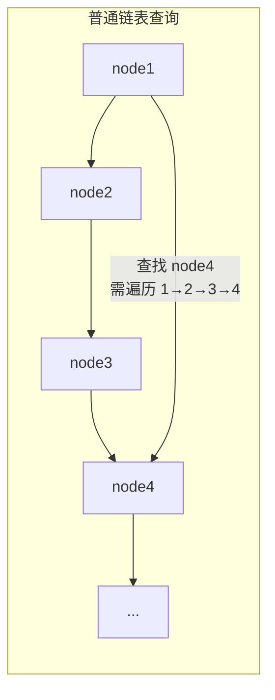
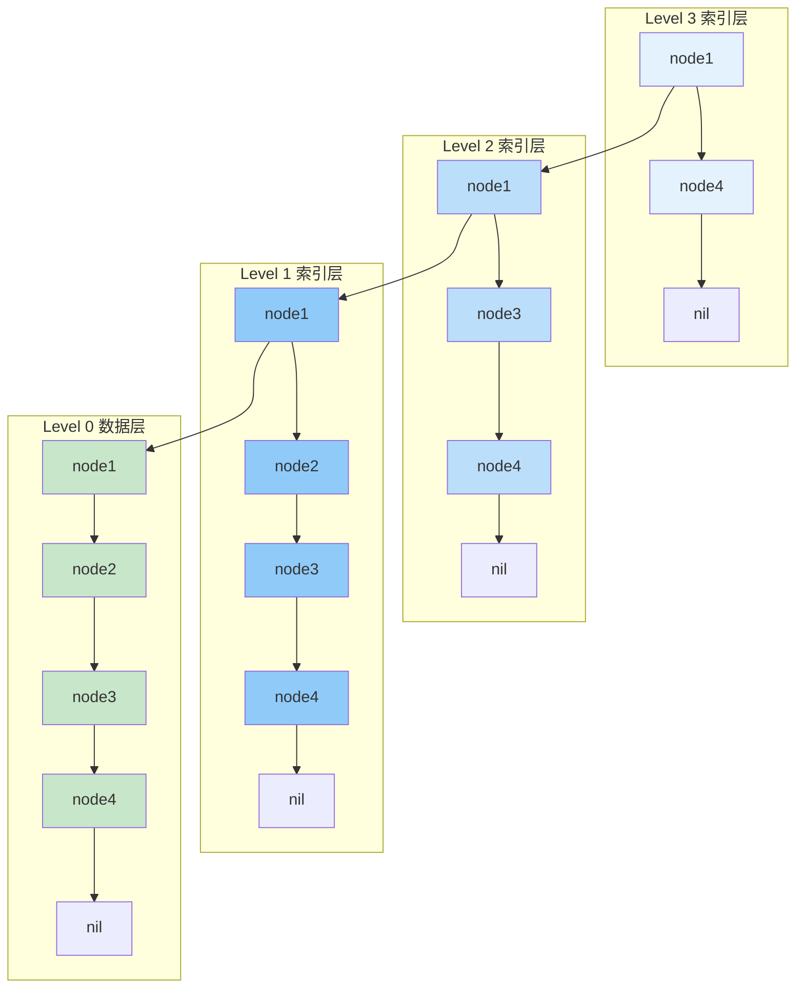
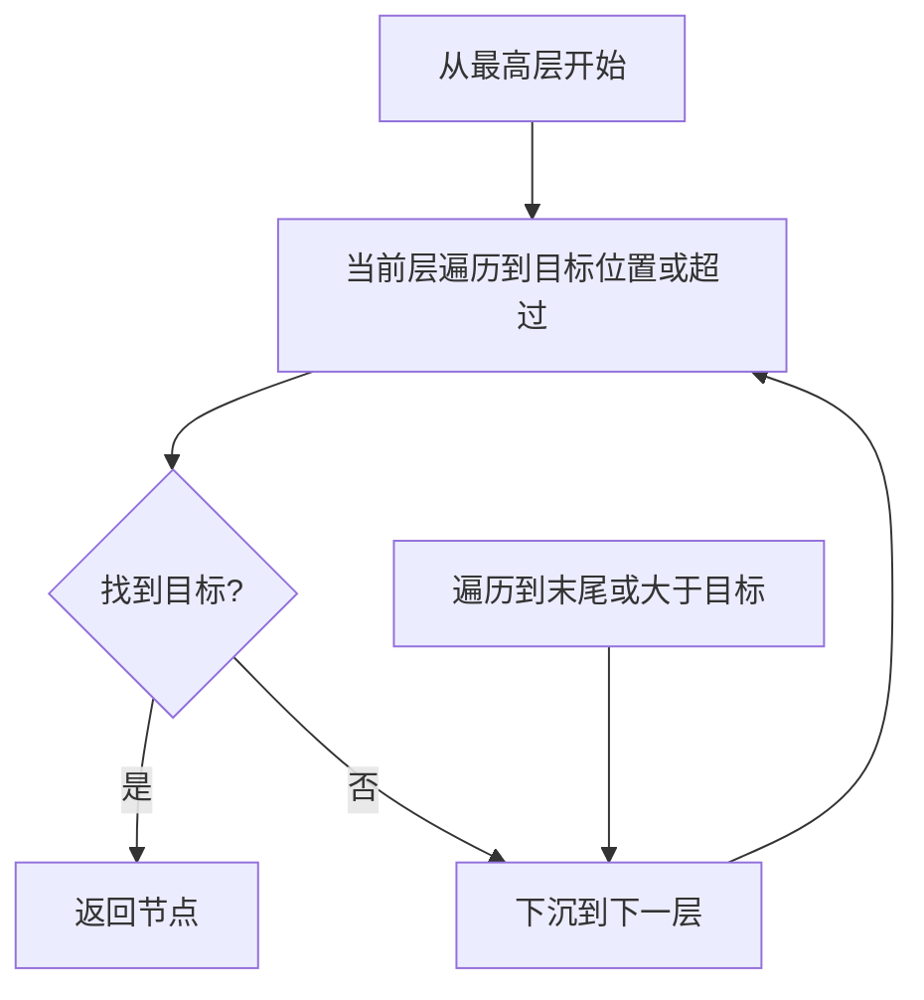
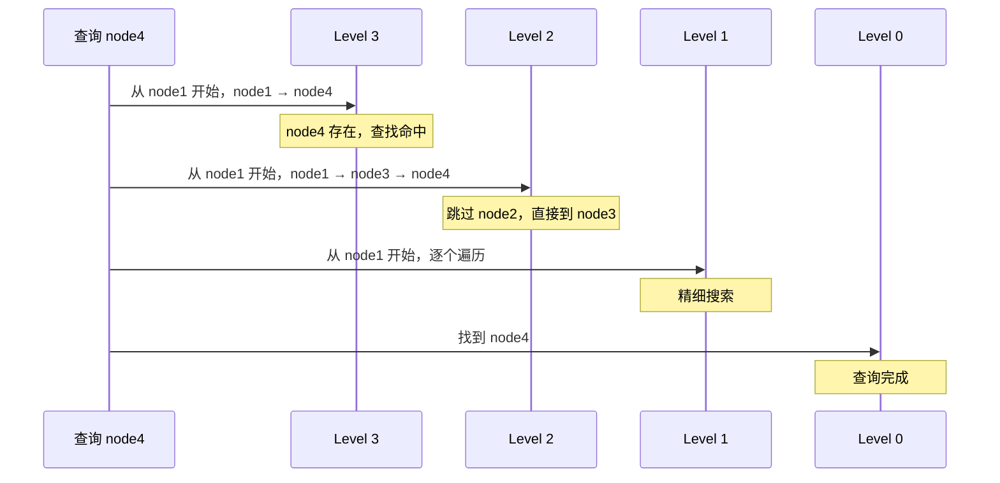
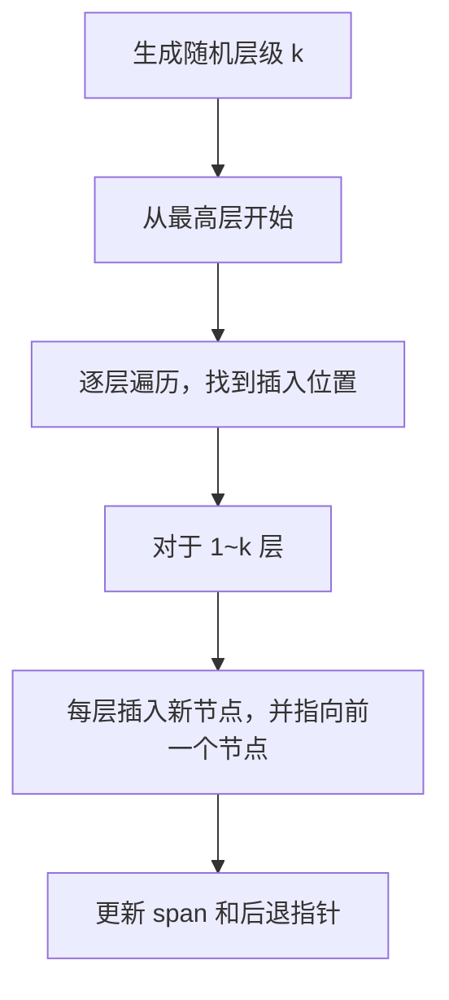
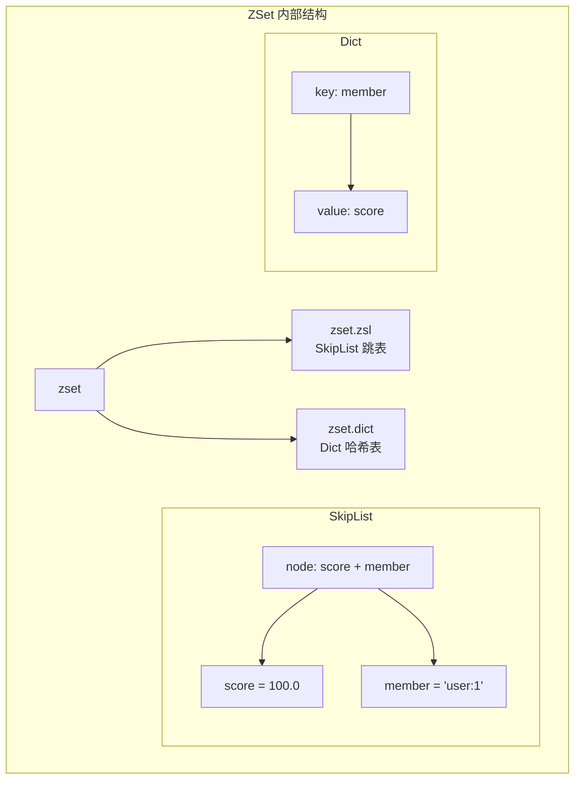

# ZSet 底层跳表原理

> **目标级别**：P5/P6
> **面试频率**：🔴 高频
> **面试官最关心的 3 个问题**：
> 1. 跳表是什么？为什么要用跳表而不是红黑树？
> 2. 跳表的查询/插入过程是怎样的？
> 3. Redis 跳表是如何实现的？

面试官问：「ZSet 的底层是什么？」你说「跳表」——然后面试官紧接着追问「跳表是怎么查询的？为什么不用红黑树？」你沉默了。

这就是 Redis 跳表面试的真实面貌：不仅要回答"是什么"，还要理解"为什么这样设计"。

## 一、跳表引入

### 1.1 为什么需要跳表？

普通链表查询需要从头遍历，时间复杂度是 `O(n)`：



### 1.2 跳表的设计思想

跳表通过在链表上建立多级索引，实现类似二分查找的效果：



## 二、跳表查询过程

### 2.1 查询流程图



### 2.2 查询示例



### 2.3 时间复杂度分析

| 操作 | 时间复杂度 | 说明 |
|------|------------|------|
| 查找 | `O(log n)` | 每层最多遍历 4 个节点 |
| 插入 | `O(log n)` | 查找位置 + 插入节点 |
| 删除 | `O(log n)` | 查找位置 + 删除节点 |

**为什么是 `O(log n)`？**

假设跳表有 `k` 层索引，最底层有 `n` 个元素：
- 第 `k` 层索引有 2 个元素（`n/2^(k-1) = 2`）
- 第 `k-1` 层有 4 个元素
- ...
- 第 1 层有 `n/2` 个元素

每层最多遍历常数个节点，所以时间复杂度是 `O(log n)`。

## 三、跳表插入过程

### 3.1 随机层级生成

跳表使用随机函数决定新节点的层数：

```c
// Redis 源码：跳表层级生成
int zslRandomLevel(void) {
    int level = 1;
    // 50% 概率生成 Level 2
    while (random() < 0.5 && level < ZSKIPLIST_MAXLEVEL)
        level++;
    return level;
}
```

| 随机层级 | 概率 |
|----------|------|
| 1 | 50% |
| 2 | 25% |
| 3 | 12.5% |
| 4 | 6.25% |
| ... | ... |

### 3.2 插入流程图



### 3.3 Redis 跳表节点结构

```c
// src/server.h
typedef struct zskiplistNode {
    // 成员对象（robj *）指针
    void *obj;
    // 分值，double 类型
    double score;
    // 后退指针
    struct zskiplistNode *backward;
    // 层结构数组
    struct zskiplistLevel {
        // 前进指针
        struct zskiplistNode *forward;
        // 当前节点到下一个节点的跨度
        unsigned int span;
    } level[];
} zskiplistNode;

typedef struct zskiplist {
    // 表头节点
    struct zskiplistNode *header;
    // 表尾节点
    struct zskiplistNode *tail;
    // 节点数量
    unsigned long length;
    // 最大层数
    int level;
} zskiplist;
```

## 四、跳表 vs 红黑树

### 4.1 为什么 Redis 用跳表而不是红黑树？

| 维度 | 跳表 | 红黑树 |
|------|------|--------|
| **实现复杂度** | 简单，约 200 行 | 复杂，需实现旋转和变色 |
| **范围查询** | 天然支持，直接遍历 | 需中序遍历 |
| **插入/删除** | 只需修改相邻节点指针 | 需旋转和变色，可能触发多次调整 |
| **可扩展性** | 层级可动态调整 | 树结构固定 |
| **并发安全** | 只需锁定局部节点 | 整棵树可能需要锁定 |
| **内存开销** | 每个节点有多个指针 | 每个节点 2 个指针 + 1 个颜色位 |
| **Redis 选择** | ✅ 实现简单，功能完整 | ❌ 实现复杂 |

### 4.2 功能对比

| 功能 | 跳表 | 红黑树 |
|------|------|--------|
| 按 score 排序 | ✅ | ✅ |
| 按 score 范围查询 | ✅ 直接遍历 | ✅ 中序遍历 |
| 按 member 查找 | ❌ 需配合哈希表 | ❌ 需配合哈希表 |
| 获取排名 | ✅ span 记录 | ✅ 需计算 |
| 获取指定排名元素 | ✅ | ✅ |

### 4.3 时间复杂度对比

| 操作 | 跳表 | 红黑树 |
|------|------|--------|
| 查找 | `O(log n)` | `O(log n)` |
| 插入 | `O(log n)` | `O(log n)` |
| 删除 | `O(log n)` | `O(log n)` |
| 范围遍历 | `O(log n + m)` | `O(log n + m)` |

## 五、ZSet 的双数据结构

Redis ZSet 使用跳表 + 哈希表组合：



**为什么需要两个结构？**

| 操作 | 跳表 | 哈希表 |
|------|------|--------|
| 按 score 范围查询 | ✅ `O(log n + m)` | ❌ |
| 按 member 查找 score | ❌ `O(n)` | ✅ `O(1)` |

**⚠️ 注意**：当 ZSet 元素数量较少时，Redis 使用 ZipList 编码而非 SkipList，这是为了节省内存。

## 六、面试追问链设计

> **第一层**：跳表是怎么查询的？
> **第二层**：跳表的层级是怎么决定的？
> **第三层**：为什么 Redis 用跳表而不是红黑树？

> **第一层**：ZSet 底层是什么结构？
> **第二层**：为什么要同时用跳表和哈希表？
> **第三层**：如果只有跳表，没有哈希表，能实现 `ZSCORE` 命令吗？

> **第一层**：跳表的空间复杂度是多少？
> **第二层**：如何控制跳表的内存占用？
> **第三层**：跳表和链表的空间开销差多少？

## 七、常见面试陷阱

**⚠️ 陷阱 1**：说跳表"没有实际用途"
- 跳表是 Redis ZSet 的核心实现，也是面试高频考点
- 要能画出跳表结构并解释查询过程

**⚠️ 陷阱 2**：不知道 Redis 跳表有哈希表配合
- ZSet 的 member → score 查找必须靠哈希表
- 单纯用跳表无法实现 `ZSCORE` 命令

**⚠️ 陷阱 3**：混淆跳表和二分查找
- 跳表是链表实现，不是数组实现
- 二分查找需要随机访问，跳表是顺序访问

## 八、对比总结表

| 特性 | SkipList | RedBlackTree | 数组二分 |
|------|----------|--------------|----------|
| **数据结构** | 链表 | 树 | 数组 |
| **查找复杂度** | `O(log n)` | `O(log n)` | `O(log n)` |
| **插入复杂度** | `O(log n)` | `O(log n)` | `O(n)` |
| **删除复杂度** | `O(log n)` | `O(log n)` | `O(n)` |
| **范围查询** | ✅ | ✅ | ✅ |
| **内存占用** | 较高 | 较低 | 最低 |
| **实现复杂度** | 简单 | 复杂 | 简单 |
| **使用场景** | Redis ZSet | C++ map | 有序数组 |

## 九、加分回答

> **💡 面试加分点**：如果能说出跳表在生产环境中的应用场景，会给面试官留下深刻印象：
>
> 1. **LevelDB/RocksDB**：MemTable 使用跳表实现
> 2. **MySQL InnoDB**：自适应哈希索引使用跳表
> 3. **Java ConcurrentSkipListMap**：并发跳表实现
> 4. **Redis 为什么不选红黑树**：实现简单 + 范围查询天然 + 更容易做并发控制
