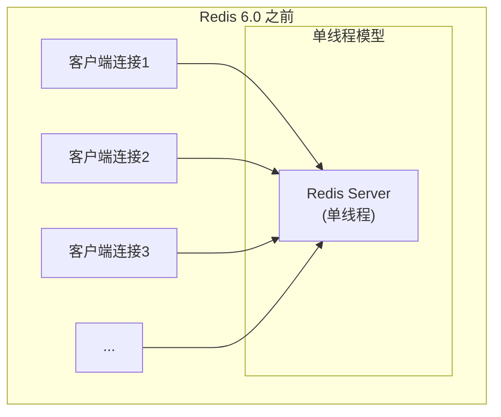
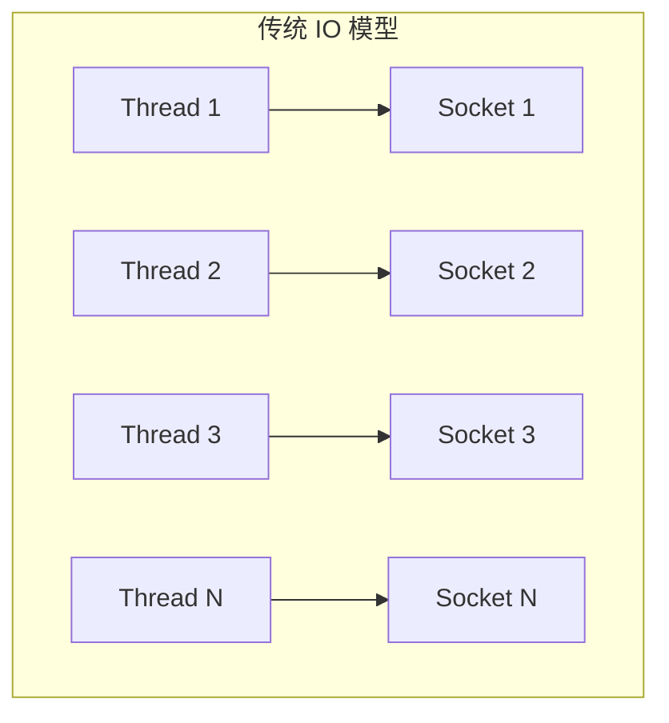
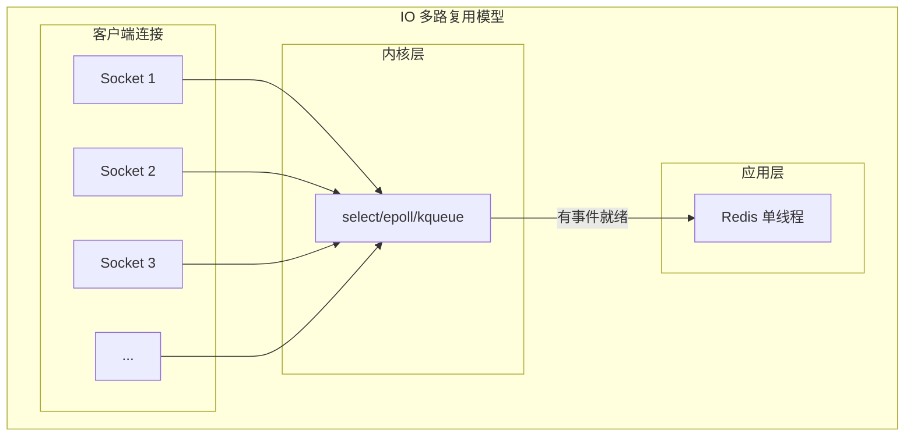
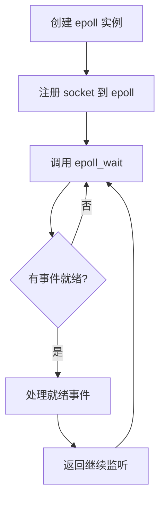
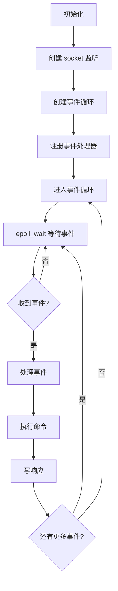
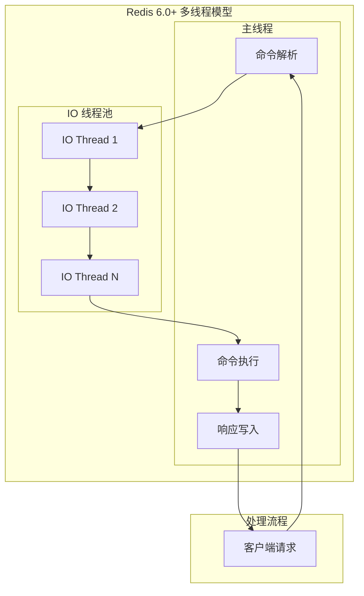

# Redis 线程模型

> **目标级别**：P5/P6
> **面试频率**：🔴 高频
> **面试官最关心的 3 个问题**：
> 1. Redis 是单线程还是多线程？
> 2. Redis 为什么不用多线程处理命令？
> 3. Redis 6.0 之前真的是纯单线程吗？

面试官问：「Redis 是单线程的吗？」你说「是」——然后面试官紧接着追问「那为什么 Redis 6.0 要引入多线程？IO 多路复用又是什么？」你沉默了。

这就是 Redis 线程模型面试的真实面貌：不仅要回答"是什么"，还要理解"为什么这样设计"。

## 一、Redis 线程模型概述



### 1.1 Redis 的线程分工

Redis 的「单线程」指的是**命令处理线程**是单线程：

| 线程类型 | 说明 |
|----------|------|
| **主线程** | 处理客户端命令请求（`O(n)` 操作） |
| **后台线程** | 关闭文件、AOF 刷盘、异步删除 |
| **子进程** | RDB 持久化（fork 进程） |
| **多线程** | Redis 6.0+ 的 IO 线程（仅处理网络 IO） |

## 二、IO 多路复用

### 2.1 为什么需要 IO 多路复用？

传统 IO 模型中，每个连接都需要一个线程处理：



**问题**：
- 每个连接一个线程，上下文切换开销大
- 线程数量有限，无法支撑海量连接
- CPU 大部分时间在等待 IO

### 2.2 IO 多路复用原理

IO 多路复用允许一个线程同时监控多个文件描述符：



**核心思想**：用一个线程监听多个 socket，当某个 socket 可读/可写时通知应用程序。

### 2.3 epoll 工作流程



### 2.4 epoll vs select vs poll

| 特性 | select | poll | epoll |
|------|--------|------|-------|
| **最大fd限制** | 1024 | 无限制 | 无限制 |
| **时间复杂度** | `O(n)` | `O(n)` | `O(1)` |
| **内核拷贝** | fdset | 数组 | 红黑树 |
| **工作模式** | 遍历 | 遍历 | 回调 |
| **跨平台** | ✅ | ✅ | ❌（Linux） |
| **Redis 使用** | ❌ | ❌ | ✅ |

## 三、Redis 事件处理机制

### 3.1 Redis 事件循环



### 3.2 事件类型

| 事件类型 | 说明 | 示例 |
|----------|------|------|
| **File Event** | 文件描述符事件 | 客户端请求、服务端响应 |
| **Time Event** | 定时事件 | 过期 key 清理、RDB 触发 |

### 3.3 Redis 处理流程

```mermaid
sequenceDiagram
    participant Client as 客户端
    participant Redis as Redis Server
    participant Loop as 事件循环
    participant DB as 数据库

    Client->>Redis: 发送命令 SET key value
    Redis->>Loop: socket 可读
    Loop->>Redis: 读取命令
    Redis->>DB: 执行命令
    DB->>Redis: 返回结果
    Redis->>Client: 写入响应
```

## 四、Redis 6.0 多线程设计

### 4.1 为什么引入多线程？

Redis 6.0 之前，瓶颈在于**网络 IO** 而非 CPU：

| 瓶颈 | 说明 |
|------|------|
| **CPU** | 大部分命令是 `O(1)` 或 `O(n)`，不占 CPU |
| **网络 IO** | 从 socket 读取命令、写入响应，占大量时间 |

### 4.2 多线程架构



**多线程只用于网络 IO**，命令执行仍然是单线程。

### 4.3 线程分工

| 阶段 | 线程模式 | 说明 |
|------|----------|------|
| 读取命令 | 多线程（IO线程池） | 从 socket 读取数据到缓冲区 |
| 解析命令 | 主线程 | 解析命令参数 |
| 执行命令 | 主线程 | 调用命令处理函数 |
| 写响应 | 多线程（IO线程池） | 将响应写回 socket |

### 4.4 配置项

```bash
# 启用多线程 IO
io-threads 4

# 多线程是否用于写操作
io-threads-do-reads yes
```

## 五、线程模型对比

| 维度 | Redis 单线程 | Redis 多线程 | 多进程模型 |
|------|--------------|--------------|------------|
| **并发能力** | 中等 | 高 | 高 |
| **复杂度** | 低 | 中 | 高 |
| **内存占用** | 低 | 低 | 高 |
| **数据共享** | 简单 | 简单 | 需 IPC |
| **适用场景** | 小规模场景 | 大规模场景 | 跨机器 |

## 六、面试追问链设计

> **第一层**：Redis 是单线程的吗？
> **第二层**：Redis 哪些操作不是单线程的？
> **第三层**：为什么 Redis 要用单线程处理命令？

> **第一层**：什么是 IO 多路复用？
> **第二层**：epoll 和 select 有什么区别？
> **第三层**：Redis 用的是什么多路复用机制？

> **第一层**：Redis 6.0 为什么要引入多线程？
> **第二层**：多线程模式下，主线程和 IO 线程如何协作？
> **第三层**：为什么不直接把命令执行也改成多线程？

## 七、常见面试陷阱

**⚠️ 陷阱 1**：认为 Redis 完全单线程
- 后台线程、RDB fork 进程、Redis 6.0+ IO 线程
- 要能区分哪些操作是单线程，哪些不是

**⚠️ 陷阱 2**：混淆 IO 多路复用和线程池
- IO 多路复用是一个线程监听多个 socket
- 线程池是多个线程处理不同任务

**⚠️ 陷阱 3**：不知道 epoll 的边缘触发
- Redis 使用水平触发（LT）模式
- 边缘触发（ET）需要非阻塞配合

## 八、对比总结表

| 特性 | 传统阻塞 IO | IO 多路复用 | 多线程+阻塞 IO |
|------|-------------|-------------|----------------|
| **线程数** | N（每个连接一个） | 1 | N |
| **资源占用** | 高 | 低 | 中 |
| **并发能力** | 低 | 高 | 高 |
| **编程复杂度** | 低 | 中 | 高 |
| **适用场景** | 连接少 | 高并发 | 计算密集 |

## 九、加分回答

> **💡 面试加分点**：如果能说出 Redis 的 ae 事件库实现细节，会给面试官留下深刻印象：
>
> 1. **aeEventLoop**：Redis 的事件循环结构
> 2. **aeApiPoll**：根据平台选择最优的 IO 多路复用实现
> 3. **事件掩码**：处理 EPOLLIN/EPOLLOUT/EPOLLERR 等事件类型
> 4. **Redis 6.0 之前用单线程的原因**：不是不能并行，而是不需要，因为 Redis 的瓶颈在内存而不是 CPU
