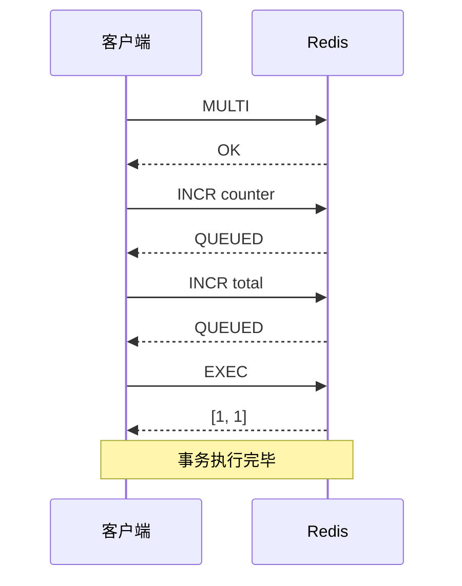
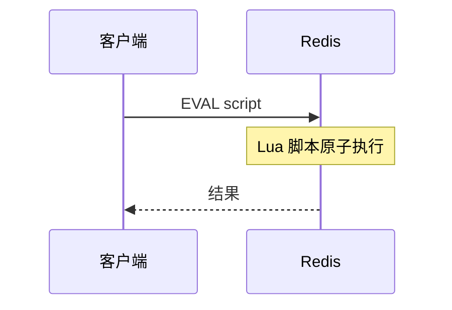

# Redis 事务

> **目标级别**：P5/P6
> **面试频率**：🟡 中频
> **面试官最关心的 3 个问题**：
> 1. Redis 事务有哪些命令？与数据库事务有什么区别？
> 2. Redis 事务能保证原子性吗？
> 3. Redis 事务和 Lua 脚本有什么关系？

面试官问：「Redis 支持事务吗？」你说「支持」——然后面试官追问「Redis 事务能回滚吗？如果执行到一半失败了怎么办？」你沉默了。

这就是 Redis 事务与数据库事务的根本区别。

## 一、Redis 事务概述

### 1.1 事务命令

| 命令 | 说明 |
|------|------|
| **MULTI** | 开启事务，后续命令进入队列 |
| **EXEC** | 执行队列中的所有命令 |
| **DISCARD** | 清空队列，取消事务 |
| **WATCH** | 乐观锁，监视 key 变化 |

### 1.2 事务流程



### 1.3 基本使用

```bash
# 开启事务
127.0.0.1:6379> MULTI
OK

# 命令入队
127.0.0.1:6379> INCR user:1:balance
QUEUED
127.0.0.1:6379> DECR user:1:total
QUEUED

# 执行事务
127.0.0.1:6379> EXEC
1) (integer) 1
2) (integer) 0

# 取消事务
127.0.0.1:6379> MULTI
OK
127.0.0.1:6379> INCR key
QUEUED
127.0.0.1:6379> DISCARD
OK
```

## 二、事务与原子性

### 2.1 Redis 事务 vs 数据库事务

| 维度 | 数据库事务 | Redis 事务 |
|------|------------|------------|
| **原子性** | 支持（自动回滚） | 部分支持（不支持自动回滚） |
| **一致性** | 保证 | 不保证 |
| **隔离性** | 支持多隔离级别 | 无隔离性 |
| **持久性** | 支持 | 依赖持久化策略 |

### 2.2 Redis 事务不保证原子性

```bash
# Redis 事务执行失败不会回滚
127.0.0.1:6379> MULTI
OK

127.0.0.1:6379> SET key1 value1
QUEUED

127.0.0.1:6379> HSET key2 field value  # HSET 操作 hash，key2 可能是 string
QUEUED

127.0.0.1:6379> EXEC
1) OK
2) (error) WRONGTYPE Operation against a key holding the wrong kind of value

# 第一个命令执行成功，第二个失败
# 不会回滚第一个命令！
```

### 2.3 为什么会这样设计

Redis 作者 Antirez 的解释：

> Redis 是内存数据库，追求高性能。如果支持回滚，需要记录执行前的状态，增加复杂度。
>
> 大多数使用 Redis 事务的场景，并不需要回滚能力。

## 三、WATCH 乐观锁

### 3.1 WATCH 原理

```mermaid
sequenceDiagram
    participant C as 客户端
    participant R as Redis

    C->>R: WATCH key
    R-->>C: OK

    C->>R: MULTI
    R-->>C: OK

    C->>R: INCR key
    QUEUED

    C->>R: EXEC

    Note over R: 检查 key 是否变化

    alt key 未变化
        R-->>C: [1]
    else key 已变化
        R-->>C: (nil)
        Note over C: 事务取消
    end
```

### 3.2 WATCH 使用示例

```java
// 场景：扣款场景，防止超卖
public boolean deductBalance(String userId, int amount) {
    String balanceKey = "user:" + userId + ":balance";

    // 监视 balance key
    redis.watch(balanceKey);

    // 获取当前余额
    int balance = Integer.parseInt(redis.get(balanceKey));
    if (balance < amount) {
        redis.unwatch();
        return false;
    }

    // 开启事务
    redis.multi();
    redis.decrby(balanceKey, amount);
    redis.decrby("total", amount);

    // 执行事务
    List<Object> result = redis.exec();

    return result != null; // null 表示被其他请求修改过
}
```

### 3.3 WATCH 注意事项

| 注意点 | 说明 |
|--------|------|
| **WATCH 是一次性的** | EXEC 或 UNWATCH 后监视自动取消 |
| **监视多个 key** | 任一 key 变化都会取消事务 |
| **集群环境** | WATCH 只在同一节点生效 |

```java
// 监视多个 key
redis.watch("key1", "key2", "key3");

// 取消监视
redis.unwatch(); // 取消所有监视
```

## 四、事务失败处理

### 4.1 命令语法错误

```bash
# 命令入队时就报错，整个事务不会执行
127.0.0.1:6379> MULTI
OK

127.0.0.1:6379> INCR key
QUEUED

127.0.0.1:6379> INCRBYFLOAT key "not a number"  # 语法错误
(error) ERR syntax error

127.0.0.1:6379> EXEC
(error) EXECABORT Transaction discarded because of previous errors.
```

### 4.2 运行时错误

```bash
# 命令入队成功，但执行时失败
# 其他命令仍会执行，不会回滚
127.0.0.1:6379> MULTI
OK

127.0.0.1:6379> SET key1 value1
QUEUED

127.0.0.1:6379> HSET key2 field value
QUEUED

127.0.0.1:6379> EXEC
1) OK
2) (error) WRONGTYPE Operation against a key holding the wrong kind of value
# key1 设置成功，key2 设置失败
```

### 4.3 应用层处理

```java
public void processTransaction() {
    while (true) {
        try {
            redis.watch("balance");

            int balance = Integer.parseInt(redis.get("balance"));
            if (balance < 100) {
                redis.unwatch();
                throw new RuntimeException("余额不足");
            }

            redis.multi();
            redis.decrby("balance", 100);
            redis.decrby("total", 100);

            List<Object> result = redis.exec();

            if (result != null) {
                // 成功
                return;
            }
            // else: 被其他请求修改，重试

        } catch (WatchException e) {
            // 被监视的 key 发生变化，重试
            continue;
        }
    }
}
```

## 五、Lua 脚本

### 5.1 为什么用 Lua 脚本

| 需求 | 事务 | Lua 脚本 |
|------|------|----------|
| **原子性** | 部分支持 | 完全支持 |
| **回滚** | 不支持 | 不需要 |
| **条件执行** | 不支持 | 支持 |
| **性能** | 一般 | 高（服务端执行） |

### 5.2 Lua 脚本使用

```bash
# 执行 Lua 脚本
127.0.0.1:6379> EVAL "return redis.call('GET', KEYS[1])" 1 mykey

# 带参数
127.0.0.1:6379> EVAL "
    local balance = redis.call('GET', KEYS[1])
    if tonumber(balance) >= tonumber(ARGV[1]) then
        redis.call('DECRBY', KEYS[1], ARGV[1])
        return 1
    else
        return 0
    end
" 1 user:balance 100
```

### 5.3 Lua 脚本示例

```java
// 扣款 Lua 脚本
String deductScript = `
    local balance = redis.call('GET', KEYS[1])
    if balance and tonumber(balance) >= tonumber(ARGV[1]) then
        redis.call('DECRBY', KEYS[1], ARGV[1])
        return 1
    end
    return 0
`;

Jedis jedis = new Jedis("127.0.0.1", 6379);
String[] keys = {"user:1:balance"};
String[] args = {"100"};

Long result = (Long) jedis.eval(deductScript, keys, args);
```



### 5.4 Lua 脚本缓存

```java
// 预加载 Lua 脚本
String script = "return redis.call('GET', KEYS[1])";
String scriptSha = jedis.scriptLoad(script);

// 执行
jedis.evalsha(scriptSha, keys, args);
```

```bash
# 查看已缓存的脚本
redis-cli SCRIPT LIST

# 检查脚本是否存在
redis-cli SCRIPT EXISTS <sha1>
```

## 六、事务与集群

### 6.1 集群下的限制

Redis Cluster 不支持跨槽位的事务：

```bash
# 假设 key1 和 key2 在不同槽位
127.0.0.1:6379> MULTI
OK

127.0.0.1:6379> SET key1 value1
QUEUED

127.0.0.1:6379> SET key2 value2
QUEUED

127.0.0.1:6379> EXEC
(error) CROSSSLOT Keys in request don't hash to the same slot
```

### 6.2 解决方案：使用 Hash Tag

```bash
# 使用 Hash Tag，让两个 key 在同一槽位
127.0.0.1:6379> MULTI
OK

127.0.0.1:6379> SET user:{1}:profile value1
QUEUED

127.0.0.1:6379> SET user:{1}:balance value2
QUEUED

127.0.0.1:6379> EXEC
1) OK
2) OK
```

## 七、面试追问链设计

> **第一层**：Redis 事务有哪些命令？
> **第二层**：Redis 事务能保证原子性吗？
> **第三层**：Redis 事务和数据库事务有什么区别？

> **第一层**：WATCH 是怎么实现的？
> **第二层**：WATCH 在高并发下会有什么性能问题？
> **第三层**：如何解决 WATCH 的 ABA 问题？

> **第一层**：Lua 脚本和事务有什么区别？
> **第二层**：Lua 脚本有什么优势？
> **第三层**：如何防止 Lua 脚本执行时间过长？

## 八、常见面试陷阱

**⚠️ 陷阱 1**：误以为 Redis 事务支持回滚

Redis 事务不支持自动回滚，EXEC 执行后即使有命令失败也不会回滚之前成功的命令。

**⚠️ 陷阱 2**：滥用 WATCH

WATCH 在高并发下可能导致大量重试，影响性能。应该尽量减少监视的 key 数量。

**⚠️ 陷阱 3**：在集群模式下忽视槽位限制

Redis Cluster 不支持跨槽位的事务，需要使用 Hash Tag 将相关 key 放在同一槽位。

## 九、对比总结表

| 维度 | 无事务 | MULTI/EXEC | WATCH | Lua 脚本 |
|------|--------|------------|-------|----------|
| **原子性** | 无 | 队列原子 | 队列原子 | 完全原子 |
| **回滚** | 无 | 无 | 无 | 无 |
| **条件执行** | 无 | 无 | 支持 | 支持 |
| **错误处理** | 无 | 部分 | 部分 | 完整 |
| **性能** | 高 | 中 | 中 | 高 |

## 十、加分回答

> **💡 面试加分点**：Redis 脚本特性：

1. **原子性**：Lua 脚本在执行过程中不会被其他命令打断
2. **可复用**：使用 `SCRIPT LOAD` 和 `EVALSHA` 缓存脚本
3. **时间限制**：`lua-time-limit` 默认 5 秒，超时后返回错误

> **💡 面试加分点**：脚本管理命令：

```bash
# 加载脚本
SCRIPT LOAD "return redis.call('GET', KEYS[1])"

# 执行脚本
EVALSHA <sha1> <numkeys> <key1> <key2> ... <arg1> <arg2> ...

# 杀死正在执行的脚本
SCRIPT KILL
```
