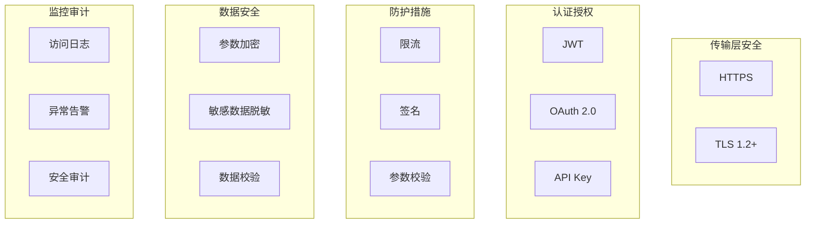

# 接口安全设计

> **目标级别**：P6
> **面试频率**：🟡 中频
> **面试官最关心的 3 个问题**：
> 1. 接口安全需要考虑哪些方面？
> 2. 常见的接口安全问题有哪些？
> 3. 如何设计安全的接口？

---

面试官问：「你设计的接口安全吗？有哪些防护措施？」你说「用了 HTTPS」——然后面试官追问「除了 HTTPS 呢？接口被恶意调用怎么办？」

接口安全是系统设计中的重要环节。从传输安全、认证授权到防攻击、防泄漏，需要多层面防护。

## 一、接口安全全景图



## 二、传输层安全

### 2.1 HTTPS 配置

```yaml
# Spring Boot HTTPS 配置
server:
  ssl:
    enabled: true
    key-store: classpath:keystore.p12
    key-store-password: ${SSL_PASSWORD}
    key-store-type: PKCS12
    protocol: TLS
    enabled-protocols: TLSv1.2, TLSv1.3
    ciphers: TLS_ECDHE_RSA_WITH_AES_256_GCM_SHA384, TLS_ECDHE_RSA_WITH_AES_128_GCM_SHA256
```

### 2.2 证书校验

```java
// ✅ 证书校验配置
@Configuration
public class SSLConfig {
    
    @Bean
    public RestTemplate restTemplate() throws KeyStoreException, NoSuchAlgorithmException, KeyManagementException {
        TrustStrategy acceptingTrustStrategy = (X509Certificate[] chain, String authType) -> true;
        
        SSLContext sslContext = SSLContexts.custom()
            .loadTrustMaterial(new ClassPathResource("truststore.jks"), "changeit".toCharArray())
            .loadTrustMaterial(new TrustSelfSignedStrategy())
            .build();
        
        return new RestTemplateBuilder()
            .setSslBundle(SslBundle.of(sslContext))
            .build();
    }
}
```

## 三、认证授权

### 3.1 JWT 认证

```java
// ✅ JWT 认证
@Service
public class JwtAuthService {
    
    private static final String SECRET_KEY = "your-256-bit-secret";
    private static final long EXPIRATION = 3600000;  // 1 小时
    
    public String generateToken(String userId, List<String> roles) {
        return Jwts.builder()
            .setSubject(userId)
            .claim("roles", roles)
            .setIssuedAt(new Date())
            .setExpiration(new Date(System.currentTimeMillis() + EXPIRATION))
            .signWith(SignatureAlgorithm.HS256, SECRET_KEY)
            .compact();
    }
    
    public Claims validateToken(String token) {
        try {
            return Jwts.parser()
                .setSigningKey(SECRET_KEY)
                .parseClaimsJws(token)
                .getBody();
        } catch (JwtException e) {
            throw new AuthenticationException("Invalid token");
        }
    }
}

// 认证过滤器
@Component
public class JwtAuthFilter extends OncePerRequestFilter {
    
    @Override
    protected void doFilterInternal(HttpServletRequest request, HttpServletResponse response, FilterChain chain) 
            throws ServletException, IOException {
        
        String token = request.getHeader("Authorization");
        if (token != null && token.startsWith("Bearer ")) {
            String jwt = token.substring(7);
            Claims claims = jwtAuthService.validateToken(jwt);
            SecurityContextHolder.getContext().setAuthentication(
                new UsernamePasswordAuthenticationToken(claims.getSubject(), null, Collections.emptyList())
            );
        }
        
        chain.doFilter(request, response);
    }
}
```

### 3.2 API Key + 签名

```java
// ✅ API Key + 签名认证
@Service
public class ApiAuthService {
    
    public String generateSignature(String apiKey, String secretKey, String timestamp, String requestBody) {
        // 签名算法：MD5(apiKey + timestamp + requestBody + secretKey)
        String content = apiKey + timestamp + requestBody + secretKey;
        return DigestUtils.md5Hex(content);
    }
    
    public boolean validateSignature(String apiKey, String signature, String timestamp, String requestBody) {
        // 检查时间戳是否过期（5 分钟）
        if (System.currentTimeMillis() - Long.parseLong(timestamp) > 5 * 60 * 1000) {
            return false;
        }
        
        String secretKey = getSecretKey(apiKey);
        String expectedSignature = generateSignature(apiKey, secretKey, timestamp, requestBody);
        return expectedSignature.equals(signature);
    }
}

// 客户端签名示例
public class ApiClient {
    
    public void call(String apiKey, String secretKey, String endpoint, Object params) {
        String timestamp = String.valueOf(System.currentTimeMillis());
        String body = JSON.toJSONString(params);
        String signature = apiAuthService.generateSignature(apiKey, secretKey, timestamp, body);
        
        HttpRequest request = HttpRequest.newBuilder()
            .uri(URI.create(endpoint))
            .header("X-API-Key", apiKey)
            .header("X-Timestamp", timestamp)
            .header("X-Signature", signature)
            .POST(HttpRequest.BodyPublishers.ofString(body))
            .build();
    }
}
```

## 四、防护措施

### 4.1 参数校验

```java
// ✅ 参数校验注解
public class CreateOrderRequest {
    
    @NotNull(message = "用户ID不能为空")
    private Long userId;
    
    @NotEmpty(message = "商品不能为空")
    @Size(min = 1, max = 100, message = "商品数量必须在1-100之间")
    private List<OrderItem> items;
    
    @DecimalMin(value = "0.01", message = "金额必须大于0")
    @DecimalMax(value = "999999.99", message = "金额超出限制")
    private BigDecimal amount;
}

// 全局异常处理
@RestControllerAdvice
public class ValidationExceptionHandler {
    
    @ExceptionHandler(MethodArgumentNotValidException.class)
    public Result<?> handleValidationException(MethodArgumentNotValidException e) {
        List<String> errors = e.getBindingResult().getFieldErrors().stream()
            .map(error -> error.getField() + ": " + error.getDefaultMessage())
            .collect(Collectors.toList());
        return Result.error("参数校验失败", errors);
    }
}
```

### 4.2 SQL 注入防护

```java
// ✅ 使用参数化查询
@Select("SELECT * FROM user WHERE id = #{id}")
User findById(@Param("id") Long id);

@Select("SELECT * FROM user WHERE name = #{name} AND status = #{status}")
List<User> findByNameAndStatus(@Param("name") String name, @Param("status") Integer status);

// ❌ 禁止使用字符串拼接
@Select("SELECT * FROM user WHERE name = '" + name + "'")  // SQL 注入风险
```

### 4.3 XSS 防护

```java
// ✅ HTML 转义
@Component
public class XssFilter implements Filter {
    
    @Override
    public void doFilter(ServletRequest request, ServletResponse response, FilterChain chain) 
            throws IOException, ServletException {
        chain.doFilter(new XssHttpServletRequestWrapper((HttpServletRequest) request), response);
    }
}

// 使用 OWASP Java HTML Sanitizer
@Component
public class HtmlSanitizer {
    
    private static final PolicyFactory POLICY = new HtmlPolicyBuilder()
        .allowElements("a", "p", "div", "span")
        .allowAttributes("href").onElements("a")
        .allowUrlProtocols("http", "https")
        .build();
    
    public String sanitize(String html) {
        return POLICY.sanitize(html);
    }
}
```

## 五、限流防护

```java
// ✅ 接口限流
@Component
public class RateLimitFilter implements Filter {
    
    private Map<String, RateLimiter> limiters = new ConcurrentHashMap<>();
    
    @Override
    public void doFilter(ServletRequest request, ServletResponse response, FilterChain chain) 
            throws IOException, ServletException {
        HttpServletRequest httpRequest = (HttpServletRequest) request;
        String clientId = getClientId(httpRequest);
        
        RateLimiter limiter = limiters.computeIfAbsent(clientId, k -> 
            RateLimiter.create(100));  // 每秒 100 请求
        
        if (!limiter.tryAcquire()) {
            HttpServletResponse httpResponse = (HttpServletResponse) response;
            httpResponse.setStatus(429);
            httpResponse.getWriter().write("{\"code\":429,\"message\":\"请求过于频繁\"}");
            return;
        }
        
        chain.doFilter(request, response);
    }
}
```

## 六、高频面试题

### 🔴 第一层：接口安全需要考虑哪些方面？

**问题**：接口安全设计需要考虑哪些方面？

**参考答案**：

| 方面 | 措施 |
|------|------|
| **传输安全** | HTTPS、TLS |
| **身份认证** | JWT、OAuth、API Key |
| **授权控制** | RBAC、数据权限 |
| **参数校验** | 参数类型、长度、范围 |
| **SQL 注入** | 参数化查询 |
| **XSS** | HTML 转义 |
| **限流防刷** | 限流、熔断 |
| **日志审计** | 访问日志、安全告警 |

---

### 🔴 第二层：常见的接口安全问题？

**问题**：有哪些常见的接口安全问题？

**参考答案**：

| 问题 | 危害 | 防护措施 |
|------|------|----------|
| **SQL 注入** | 数据泄露/破坏 | 参数化查询 |
| **XSS** | 窃取 Cookie | HTML 转义 |
| **CSRF** | 跨站请求伪造 | Token 验证 |
| **重放攻击** | 重复请求 | Nonce + 时间戳 |
| **暴力破解** | 密码破解 | 限流 + 验证码 |
| **参数篡改** | 业务逻辑攻击 | 参数校验 + 签名 |

---

### 🟡 第三层：如何防止 CSRF？

**问题**：CSRF 攻击是什么？怎么防护？

**参考答案**：

1. **CSRF Token**：服务端生成 Token，客户端提交时携带
2. **Referer 校验**：检查请求来源
3. **SameSite Cookie**：设置 Cookie 的 SameSite 属性
4. **双重提交**：Cookie 和表单都携带 Token

---

## 七、常见陷阱

### ⚠️ 陷阱 1：依赖 HTTPS 解决所有问题

HTTPS 只解决传输层安全，不解决业务层安全问题。

### ⚠️ 陷阱 2：只校验前端参数

前端校验不可靠，必须在后端也校验。

### ⚠️ 陷阱 3：密码明文传输

即使使用 HTTPS，敏感数据也应额外加密。

### ⚠️ 陷阱 4：忽略错误信息

错误信息不应泄露敏感实现细节。

---

## 八、加分回答

### 💡 OAuth 2.0 实现

```java
// ✅ OAuth 2.0 授权码模式
@RestController
@RequestMapping("/oauth")
public class OAuthController {
    
    @GetMapping("/authorize")
    public String authorize(@RequestParam String clientId, @RequestParam String redirectUri) {
        // 用户登录后，生成授权码
        String code = generateCode();
        return "redirect:" + redirectUri + "?code=" + code;
    }
    
    @PostMapping("/token")
    public TokenResponse getToken(@RequestBody TokenRequest request) {
        // 验证授权码，换取 Access Token
        return tokenService.exchangeCode(request);
    }
}
```

### 💡 安全最佳实践

1. **最小权限**：接口只返回必要数据
2. **参数白名单**：只允许预期的参数
3. **敏感数据加密**：即使数据库泄露也不泄露
4. **接口版本控制**：新版本可以禁用旧版本
5. **定期安全审计**：检查潜在安全漏洞

---

## 九、扩展思考

如何设计一个安全的支付接口？

> **答案**：
>
> 1. **签名验证**：请求参数签名
> 2. **商户认证**：API Key + Secret Key
> 3. **限流保护**：防止刷单
> 4. **金额校验**：服务端二次校验
> 5. **回调验证**：回调 URL 签名验证
> 6. **日志审计**：完整支付日志
> 7. **风控系统**：异常交易检测
