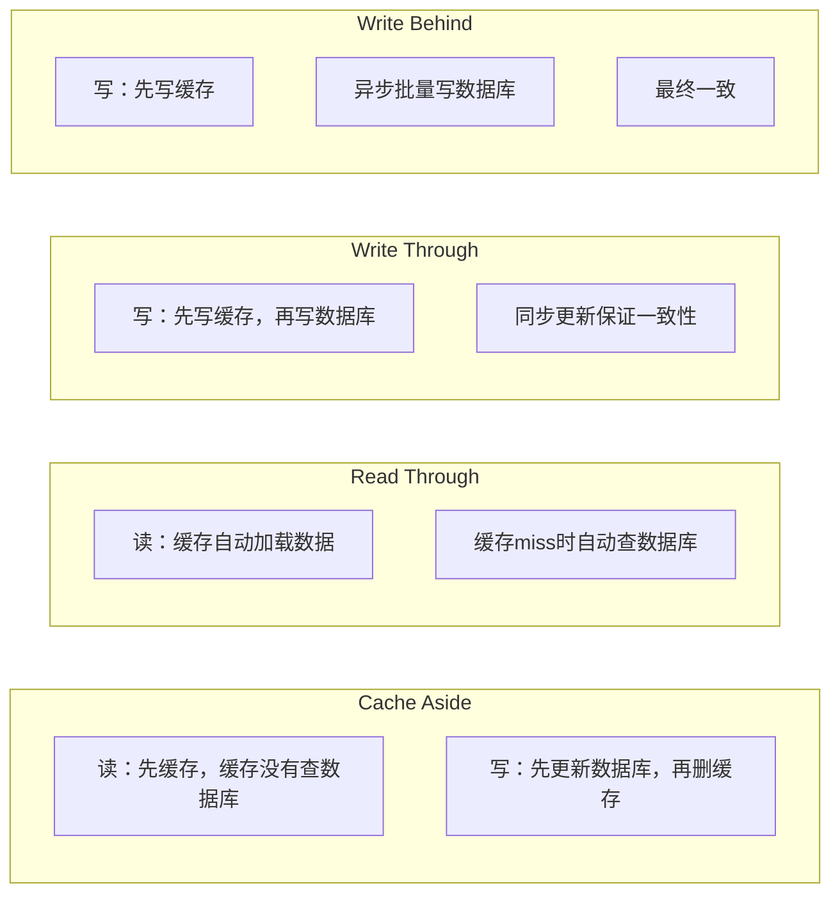
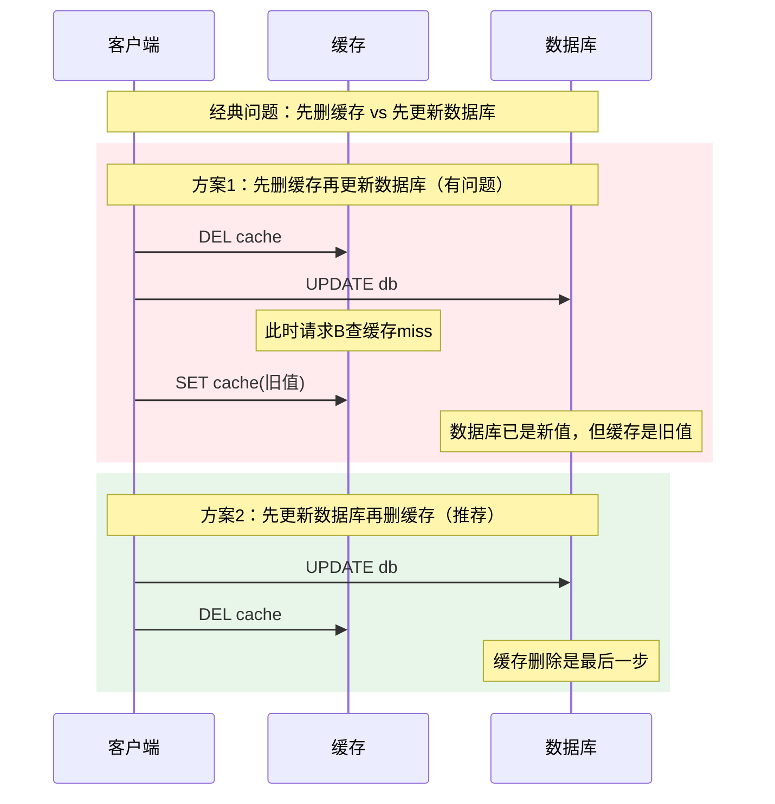
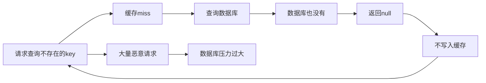
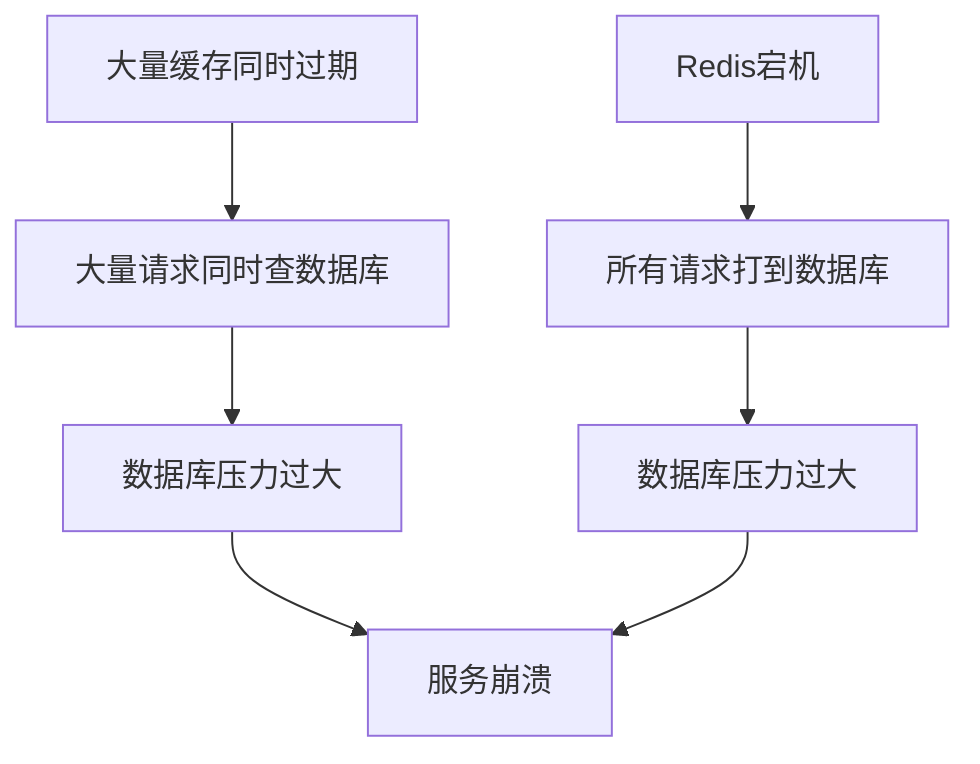

# 缓存一致性场景

> **目标级别**：P6
> **面试频率**：🔴 高频
> **面试官最关心的 3 个问题**：
> 1. 缓存和数据库如何保持一致？
> 2. Cache Aside、Read Through、Write Through 有什么区别？
> 3. 如何解决缓存穿透、击穿、雪崩？

---

面试官问：「你们用缓存吗？缓存和数据库怎么保持一致的？」你说「先更新数据库，再删缓存」——然后面试官追问「这样做有什么问题？并发情况下怎么解决？」

缓存一致性是分布式系统中最经典的问题之一。没有完美的方案，只有最适合业务场景的选择。

## 一、缓存模式对比



| 模式 | 一致性 | 性能 | 实现复杂度 | 适用场景 |
|------|--------|------|------------|----------|
| **Cache Aside** | 弱一致 | ⭐⭐⭐⭐ | ⭐⭐ | 读多写少 |
| **Read Through** | 弱一致 | ⭐⭐⭐⭐ | ⭐⭐⭐ | 读多写少 |
| **Write Through** | 强一致 | ⭐⭐⭐ | ⭐⭐⭐ | 写多读少 |
| **Write Behind** | 最终一致 | ⭐⭐⭐⭐⭐ | ⭐⭐⭐⭐ | 写多读少 |

## 二、Cache Aside 详解

### 2.1 读写流程

```java
// 读操作
public User getUser(Long id) {
    // 1. 先查缓存
    User user = redis.get("user:" + id);
    if (user != null) {
        return user;  // 缓存命中
    }
    
    // 2. 缓存未命中，查数据库
    user = userDao.findById(id);
    if (user != null) {
        // 3. 写入缓存
        redis.setex("user:" + id, 3600, user);
    }
    return user;
}

// 写操作
public void updateUser(User user) {
    // 1. 先更新数据库
    userDao.update(user);
    
    // 2. 删除缓存（而不是更新）
    redis.del("user:" + user.getId());
}
```

### 2.2 并发问题分析



### 2.3 并发问题解决方案

```java
// 解决方案1：延迟双删
public void updateUser(User user) {
    // 1. 先删缓存
    redis.del("user:" + user.getId());
    
    // 2. 更新数据库
    userDao.update(user);
    
    // 3. 延迟一段时间后再删缓存（sleep）
    try {
        Thread.sleep(100);
    } catch (InterruptedException e) {}
    redis.del("user:" + user.getId());
}

// 解决方案2：设置缓存过期时间
public User getUser(Long id) {
    User user = redis.get("user:" + id);
    if (user != null) {
        return user;
    }
    
    user = userDao.findById(id);
    if (user != null) {
        // 设置较短的过期时间
        redis.setex("user:" + id, 60, user);
    }
    return user;
}

// 解决方案3：加分布式锁
public void updateUserWithLock(User user) {
    String lockKey = "lock:user:" + user.getId();
    String lockValue = UUID.randomUUID().toString();
    
    try {
        // 获取分布式锁
        if (redis.setnx(lockKey, lockValue, 10)) {
            // 1. 更新数据库
            userDao.update(user);
            
            // 2. 删除缓存
            redis.del("user:" + user.getId());
        }
    } finally {
        // 释放锁
        if (lockValue.equals(redis.get(lockKey))) {
            redis.del(lockKey);
        }
    }
}
```

## 三、缓存经典问题

### 3.1 缓存穿透



```java
// 解决方案1：缓存空值
public User getUser(Long id) {
    User user = redis.get("user:" + id);
    if (user != null) {
        return user;
    }
    
    // 缓存空值，防止穿透
    if ("EMPTY".equals(user)) {
        return null;
    }
    
    user = userDao.findById(id);
    if (user == null) {
        // 写入空值，过期时间短一些
        redis.setex("user:" + id, 60, "EMPTY");
        return null;
    }
    
    redis.setex("user:" + id, 3600, user);
    return user;
}

// 解决方案2：布隆过滤器
public class BloomFilterUser {
    private BloomFilter<Long> bloomFilter;
    
    public void init() {
        bloomFilter = BloomFilter.create(Funnels.longFunnel(), 1000000, 0.01);
        // 初始化时加载所有存在的用户ID
        List<Long> userIds = userDao.findAllIds();
        userIds.forEach(bloomFilter::put);
    }
    
    public User getUser(Long id) {
        // 先检查布隆过滤器
        if (!bloomFilter.mightContain(id)) {
            return null;  // 一定不存在
        }
        
        // 可能存在，查缓存和数据库
        return getUserFromCacheOrDb(id);
    }
}
```

### 3.2 缓存击穿

```java
// 解决方案1：互斥锁
public User getUserWithLock(Long id) {
    String key = "user:" + id;
    User user = redis.get(key);
    if (user != null) {
        return user;
    }
    
    String lockKey = "lock:" + key;
    String lockValue = UUID.randomUUID().toString();
    
    try {
        if (redis.setnx(lockKey, lockValue, 10)) {
            // 获取锁成功，查询数据库
            user = userDao.findById(id);
            if (user != null) {
                redis.setex(key, 3600, user);
            }
        } else {
            // 获取锁失败，短暂等待后重试
            Thread.sleep(50);
            return getUserWithLock(id);
        }
    } finally {
        if (lockValue.equals(redis.get(lockKey))) {
            redis.del(lockKey);
        }
    }
    return user;
}

// 解决方案2：逻辑过期
public User getUserWithLogicalExpire(Long id) {
    String key = "user:" + id;
    UserCached userCached = redis.get(key);
    
    if (userCached == null) {
        // 缓存不存在，查询数据库并写入
        User user = userDao.findById(id);
        userCached = new UserCached(user, System.currentTimeMillis() + 3600000);
        redis.setex(key, 3600, userCached);
        return user;
    }
    
    // 检查逻辑过期
    if (userCached.isLogicalExpired()) {
        // 已过期，获取锁重建
        String lockKey = "lock:" + key;
        if (redis.setnx(lockKey, "1", 10)) {
            // 异步重建缓存
            CompletableFuture.runAsync(() -> {
                User user = userDao.findById(id);
                redis.setex(key, 3600, new UserCached(user, System.currentTimeMillis() + 3600000));
            });
        }
    }
    
    return userCached.getUser();
}
```

### 3.3 缓存雪崩



```java
// 解决方案1：过期时间加随机值
public void setUser(Long id, User user) {
    // 过期时间 = 基础时间 + 随机偏移量
    int expireSeconds = 3600 + RandomUtils.nextInt(0, 300);
    redis.setex("user:" + id, expireSeconds, user);
}

// 解决方案2：多级缓存
@Component
public class MultiLevelCache {
    // L1: 本地缓存（Caffeine/Guava）
    private Cache<Long, User> localCache = Caffeine.newBuilder()
        .maximumSize(10000)
        .expireAfterWrite(30, TimeUnit.SECONDS)
        .build();
    
    // L2: Redis
    @Autowired
    private RedisTemplate redisTemplate;
    
    public User getUser(Long id) {
        // 先查本地缓存
        User user = localCache.getIfPresent(id);
        if (user != null) {
            return user;
        }
        
        // 再查 Redis
        user = (User) redisTemplate.opsForValue().get("user:" + id);
        if (user != null) {
            localCache.put(id, user);
            return user;
        }
        
        // 最后查数据库
        user = userDao.findById(id);
        if (user != null) {
            localCache.put(id, user);
            redisTemplate.opsForValue().set("user:" + id, user, 3600, TimeUnit.SECONDS);
        }
        return user;
    }
}

// 解决方案3：Redis 集群 + 限流
@Configuration
public class RedisConfig {
    @Bean
    public RedisTemplate<String, Object> redisTemplate() {
        RedisTemplate<String, Object> template = new RedisTemplate<>();
        template.setConnectionFactory(
            new LettuceConnectionFactory(
                new RedisClusterConfiguration(
                    Arrays.asList(
                        new RedisNode("127.0.0.1", 6379),
                        new RedisNode("127.0.0.1", 6380)
                    )
                )
            )
        );
        return template;
    }
}
```

## 四、高频面试题

### 🔴 第一层：缓存和数据库如何保持一致？

**问题**：请描述你知道的缓存一致性方案。

**参考答案**：

| 方案 | 流程 | 优缺点 |
|------|------|--------|
| **Cache Aside** | 读：先缓存后数据库<br/>写：先数据库后删缓存 | 简单，但可能短暂不一致 |
| **Write Through** | 写：先缓存后数据库 | 强一致，但性能差 |
| **Write Behind** | 写：先缓存后异步写数据库 | 性能好，但可能丢数据 |

---

### 🔴 第二层：如何解决缓存穿透？

**问题**：缓存穿透怎么处理？

**参考答案**：

1. **缓存空值**：将查询结果为 null 的也写入缓存
2. **布隆过滤器**：在缓存层前加布隆过滤器过滤不存在的 key
3. **参数校验**：对请求参数做基础校验

---

### 🟡 第三层：缓存击穿和雪崩有什么区别？

**问题**：缓存击穿和缓存雪崩的区别是什么？

**参考答案**：

| 问题 | 区别 | 解决方案 |
|------|------|----------|
| **缓存击穿** | 单一热点 key 过期 | 互斥锁、逻辑过期 |
| **缓存雪崩** | 大量 key 同时过期 | 过期时间随机、限流 |

---

## 五、常见陷阱

### ⚠️ 陷阱 1：先更新缓存再更新数据库

如果数据库更新失败，缓存就是脏数据。

### ⚠️ 陷阱 2：缓存过期时间设置相同

导致缓存同时失效，引发雪崩。

### ⚠️ 陷阱 3：缓存 value 过大

大 value 会导致序列化/反序列化慢，网络传输慢。

### ⚠️ 陷阱 4：只删除缓存不监控

缓存删除后应该监控缓存命中率。

---

## 六、加分回答

### 💡 使用 Canal 监听数据库变更

```java
// Canal 配置
@Configuration
public class CanalConfig {
    @Bean
    public CanalConnector canalConnector() {
        return Canal.connectors()
            .addConnector(new CanalConnector("127.0.0.1", 11111, "example", "", ""));
    }
}

// 监听数据变更
@Canal(table = "user")
public class UserCanalListener {
    @Insert
    public void onInsert(Entry entry) {
        // 删除缓存
        redis.del("user:" + getUserId(entry));
    }
}
```

### 💡 使用分布式事务

```java
// Seata AT 模式
@GlobalTransactional
public void updateUser(User user) {
    userDao.update(user);
    redisTemplate.delete("user:" + user.getId());
}
```

---

## 七、扩展思考

如何设计一个高可用的缓存系统？

> **答案**：
>
> 1. **缓存高可用**：Redis Cluster/Sentinel
> 2. **本地缓存**：多级缓存减少 Redis 压力
> 3. **监控告警**：缓存命中率、响应时间监控
> 4. **容量规划**：预估数据量，避免内存不足
> 5. **故障切换**：Redis 不可用时降级到数据库
