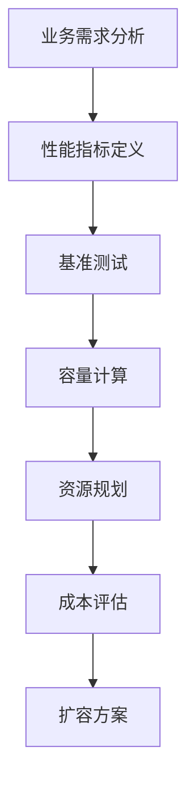
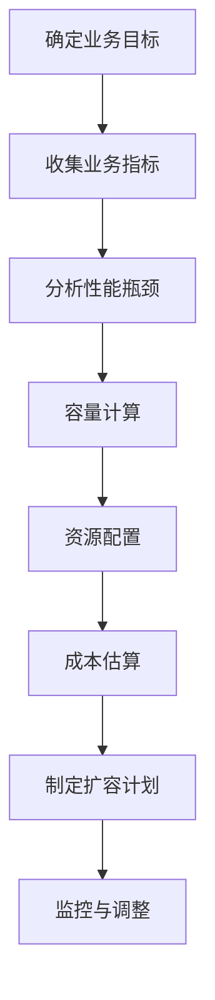

# 系统容量评估

> **目标级别**：P7
> **面试频率**：🟡 中频
> **面试官最关心的 3 个问题**：
> 1. 如何评估系统的容量？
> 2. 如何计算需要多少资源？
> 3. 如何进行容量规划？

---

面试官问：「系统要支持 10 万并发，需要多少台服务器？」你说「不知道，加机器试试」——然后面试官追问「能不能算出来？怎么算？」

容量评估是架构师的核心能力之一。它帮助我们在系统设计阶段就确定资源需求，避免上线后才发现性能问题。

## 一、容量评估流程



## 二、性能指标定义

### 2.1 核心指标

| 指标 | 说明 | 常见目标 |
|------|------|----------|
| **QPS** | 每秒请求数 | 根据业务确定 |
| **TPS** | 每秒事务数 | 根据业务确定 |
| **响应时间 P99** | 99% 请求的响应时间 | `<` 200ms |
| **并发用户数** | 同时在线用户数 | 根据 DAU 估算 |
| **成功率** | 请求成功率 | `>` 99.9% |

### 2.2 指标计算

```java
// ✅ 根据 DAU 计算 QPS 和并发
public class CapacityCalculator {
    
    /**
     * 计算 QPS
     * 公式：QPS = DAU × 平均日使用次数 / (24 × 3600 × 峰值系数)
     */
    public double calculateQPS(long dau, int avgUsagePerDay, double peakFactor) {
        double avgQPS = (double) dau * avgUsagePerDay / (24 * 3600);
        return avgQPS * peakFactor;
    }
    
    /**
     * 计算并发用户数
     * 公式：并发 = DAU × 在线率 × 人均在线时长 / 平均请求时长
     */
    public int calculateConcurrentUsers(long dau, double onlineRate, 
            int avgOnlineMinutes, int avgRequestSeconds) {
        return (int) (dau * onlineRate * avgOnlineMinutes * 60 / avgRequestSeconds);
    }
}

// 示例计算
public class ExampleCalculation {
    
    public static void main(String[] args) {
        CapacityCalculator calculator = new CapacityCalculator();
        
        // 假设：
        // DAU = 100 万
        // 平均每用户每天访问 20 次
        // 峰值系数 = 5
        
        long dau = 1_000_000;
        double avgQPS = calculator.calculateQPS(dau, 20, 5);
        System.out.println("预估峰值 QPS: " + avgQPS);  // ≈ 115
        
        // 并发用户数计算
        // 在线率 10%，人均在线 30 分钟，平均请求 2 秒
        int concurrentUsers = calculator.calculateConcurrentUsers(
            dau, 0.1, 30, 2);
        System.out.println("预估并发用户: " + concurrentUsers);  // ≈ 2500
    }
}
```

## 三、资源计算

### 3.1 CPU 资源估算

```java
// ✅ CPU 资源估算
public class CpuCalculator {
    
    /**
     * 计算需要的 CPU 核心数
     * 公式：CPU 核心数 = QPS × 平均 CPU 时间 / 单核 TPS
     */
    public int calculateCpuCores(double qps, int avgCpuTimeMs, int singleCoreTPS) {
        double cpuPerRequest = (double) avgCpuTimeMs / 1000;
        double requiredTPS = qps * cpuPerRequest;
        return (int) Math.ceil(requiredTPS / singleCoreTPS);
    }
}

// 示例
public class CpuExample {
    
    public static void main(String[] args) {
        CpuCalculator calculator = new CpuCalculator();
        
        // 假设：
        // QPS = 1000
        // 每个请求平均 CPU 时间 = 50ms
        // 单核每秒处理 20 个请求
        // 安全系数 = 2
        
        int cores = calculator.calculateCpuCores(1000, 50, 20);
        int finalCores = (int) Math.ceil(cores * 2);  // 安全系数
        System.out.println("需要的 CPU 核心数: " + finalCores);  // ≈ 10
    }
}
```

### 3.2 内存资源估算

```java
// ✅ 内存资源估算
public class MemoryCalculator {
    
    /**
     * 计算 JVM 堆内存
     * 公式：堆内存 = 单请求内存 × 并发请求数 × 峰值系数 / 内存利用率
     */
    public long calculateHeapSize(int memoryPerRequestKB, int concurrentRequests, 
            double peakFactor, double memoryUtilization) {
        long memoryBytes = (long) memoryPerRequestKB * 1024L * concurrentRequests * peakFactor;
        return (long) (memoryBytes / memoryUtilization);
    }
}

// 示例
public class MemoryExample {
    
    public static void main(String[] args) {
        MemoryCalculator calculator = new MemoryCalculator();
        
        // 假设：
        // 每个请求占用 500KB 内存
        // 并发请求数 = 100
        // 峰值系数 = 3
        // 内存利用率 = 0.7
        
        long heapSize = calculator.calculateHeapSize(500, 100, 3, 0.7);
        System.out.println("JVM 堆内存: " + (heapSize / 1024 / 1024) + "MB");  // ≈ 210MB
    }
}
```

### 3.3 数据库资源估算

```java
// ✅ 数据库连接数估算
public class DbConnectionCalculator {
    
    /**
     * 计算需要的数据库连接数
     * 公式：连接数 = 线程池大小 × 服务实例数 × 安全系数
     */
    public int calculateConnections(int threadPoolSize, int serviceInstances, double safetyFactor) {
        return (int) Math.ceil(threadPoolSize * serviceInstances * safetyFactor);
    }
}

// 示例
public class DbExample {
    
    public static void main(String[] args) {
        // 假设：
        // 线程池大小 = 50
        // 服务实例数 = 10
        // 安全系数 = 2
        
        int connections = 50 * 10 * 2;
        System.out.println("需要的数据库连接数: " + connections);  // = 1000
        // 需要确保数据库 max_connections >= 1000
    }
}
```

## 四、容量评估模板

```java
// ✅ 容量评估报告模板
public class CapacityReport {
    
    // 业务指标
    long expectedDAU;           // 预期日活
    int peakQPS;                // 峰值 QPS
    int concurrentUsers;         // 并发用户数
    int avgResponseTime;         // 平均响应时间(ms)
    int p99ResponseTime;        // P99 响应时间(ms)
    double targetSuccessRate;    // 目标成功率
    
    // 计算指标
    int requiredCpuCores;       // 所需 CPU 核心数
    long requiredHeapMB;         // 所需 JVM 堆内存(MB)
    int requiredConnections;     // 所需数据库连接数
    int requiredInstances;       // 所需服务实例数
    
    // 资源配置
    String cpuSpec;             // CPU 规格
    int memoryPerInstance;      // 每实例内存
    String dbSpec;              // 数据库规格
    int dbConnectionsPerInstance;// 每实例数据库连接数
    
    // 扩容策略
    String scalingPolicy;         // 扩容策略
    int minInstances;            // 最小实例数
    int maxInstances;            // 最大实例数
}
```

## 五、容量规划流程



## 六、高频面试题

### 🔴 第一层：如何评估系统容量？

**问题**：给定业务指标，如何评估系统需要的资源？

**参考答案**：

```java
// 评估步骤
// 1. 计算峰值 QPS
// 2. 计算并发用户数
// 3. 计算 CPU 资源
// 4. 计算内存资源
// 5. 计算数据库资源
// 6. 计算网络带宽

// 公式汇总
// QPS = DAU × 日使用次数 / (24 × 3600) × 峰值系数
// 并发 = DAU × 在线率 × 人均时长 / 请求时长
// CPU = QPS × 单请求 CPU 时间 / 单核 TPS × 安全系数
// 内存 = 单请求内存 × 并发 / 利用率 × 安全系数
```

---

### 🔴 第二层：服务器数量怎么算？

**问题**：需要多少台服务器？

**参考答案**：

```java
// 计算步骤
// 1. 确定单机 QPS 上限
// 2. 确定单实例资源上限
// 3. 计算实例数

// 示例
// 峰值 QPS = 10000
// 单机 QPS 上限 = 1000
// 实例数 = 10000 / 1000 × 1.5 = 15 台

int requiredInstances = (int) Math.ceil(
    peakQPS * safetyFactor / singleInstanceQPS
);
```

---

### 🟡 第三层：如何进行容量规划？

**问题**：容量规划怎么做？

**参考答案**：

1. **现状分析**：现有系统容量
2. **增长预测**：业务增长预期
3. **性能测试**：获取单实例能力
4. **资源计算**：计算所需资源
5. **成本评估**：评估资源成本
6. **扩容计划**：制定扩容时间表

---

## 七、常见陷阱

### ⚠️ 陷阱 1：只看平均值

平均值会掩盖峰值问题，要看 P99/P999。

### ⚠️ 陷阱 2：忽略安全系数

没有安全系数可能导致突发流量无响应。

### ⚠️ 陷阱 3：忽略依赖服务

只考虑自己，不考虑下游服务能力。

### ⚠️ 陷阱 4：忽略网络带宽

高并发下网络带宽可能是瓶颈。

---

## 八、加分回答

### 💡 使用弹性计算

```java
// ✅ 根据流量弹性扩缩容
@Configuration
public class ElasticConfig {
    
    @Bean
    public AutoScaler autoScaler() {
        return new AutoScaler()
            .minInstances(5)
            .maxInstances(50)
            .targetQPS(100)
            .scaleUpThreshold(0.8)    // CPU > 80% 时扩容
            .scaleDownThreshold(0.3)   // CPU < 30% 时缩容
            .cooldownSeconds(300);     // 冷却时间 5 分钟
    }
}
```

### 💡 容量规划最佳实践

1. **预留安全余量**：资源 × 1.5~2 倍
2. **分阶段扩容**：不要一步到位
3. **监控容量趋势**：提前发现瓶颈
4. **定期压测**：验证系统能力
5. **弹性架构**：支持快速扩容

---

## 九、扩展思考

如何预估系统未来一年的容量？

> **答案**：
>
> 1. **增长趋势分析**：分析历史增长数据
> 2. **业务预期**：产品规划和营销活动
> 3. **季节性因素**：节假日、促销活动
> 4. **技术演进**：新功能可能带来的流量变化
> 5. **分阶段规划**：
>    - Q1: 满足当前需求 + 20%
>    - Q2: 增长 50% 后的需求
>    - Q3: 增长 100% 后的需求
>    - Q4: 年度峰值需求
