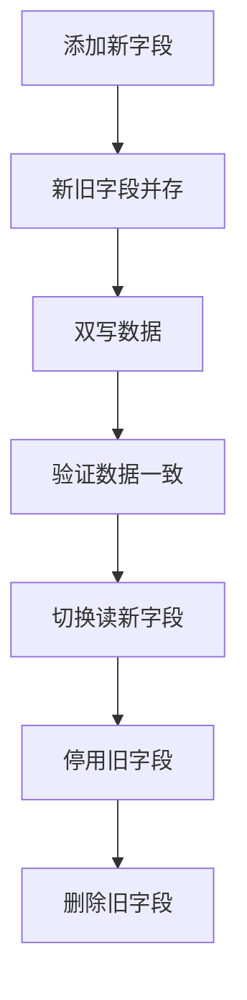

# 系统兼容性设计

> **目标级别**：P6
> **面试频率**：🟢 低频
> **面试官最关心的 3 个问题**：
> 1. API 兼容性如何保证？
> 2. 如何设计向前兼容的接口？
> 3. 数据库变更如何保证兼容性？

---

面试官问：「系统升级需要改数据库表结构，怎么保证兼容性？」你说「停机升级」——然后面试官追问「有没有不停机的方案？」

系统兼容性设计是大型系统长期演进的基石。好的兼容性设计可以让系统升级变得平滑可控。

## 一、API 兼容性

### 1.1 RESTful API 兼容性

```java
// ✅ 扩展字段：添加新字段不影响老版本
{
    "id": 1,
    "name": "张三",
    "email": "zhangsan@example.com"
}

// 升级后（新增字段）
{
    "id": 1,
    "name": "张三",
    "email": "zhangsan@example.com",
    "phone": "13800138000",  // 新增字段
    "level": "VIP"           // 新增字段
}

// ❌ 破坏性变更
// - 删除字段
// - 修改字段类型
// - 修改字段名称
// - 修改字段含义
```

### 1.2 版本控制

```java
// ✅ URL 版本控制
@RestController
@RequestMapping("/api/v1")
public class UserControllerV1 {
    @GetMapping("/user/{id}")
    public UserV1 getUser(@PathVariable Long id) {
        return userService.getUser(id);
    }
}

@RestController
@RequestMapping("/api/v2")
public class UserControllerV2 {
    @GetMapping("/user/{id}")
    public UserV2 getUser(@PathVariable Long id) {
        return userService.getUserV2(id);
    }
}

// ✅ Header 版本控制
@RestController
public class UserController {
    
    @GetMapping("/user/{id}")
    public User getUser(
        @PathVariable Long id,
        @RequestHeader(value = "X-API-Version", defaultValue = "1.0") String version) {
        
        if ("2.0".equals(version)) {
            return userService.getUserV2(id);
        }
        return userService.getUser(id);
    }
}
```

### 1.3 字段兼容性规则

| 变更类型 | 是否安全 | 说明 |
|----------|----------|------|
| **添加字段** | ✅ 安全 | 老客户端忽略新字段 |
| **添加可选字段** | ✅ 安全 | 老客户端可忽略 |
| **删除字段** | ❌ 不安全 | 可能导致解析错误 |
| **修改字段类型** | ❌ 不安全 | 可能导致序列化失败 |
| **修改字段含义** | ❌ 不安全 | 客户端逻辑可能出错 |

## 二、数据库兼容性

### 2.1 扩展性表结构

```sql
-- ✅ 预留扩展字段
CREATE TABLE user (
    id BIGINT PRIMARY KEY,
    name VARCHAR(50),
    email VARCHAR(100),
    -- 预留扩展字段
    ext1 VARCHAR(255),
    ext2 VARCHAR(255),
    ext3 VARCHAR(255),
    -- JSON 扩展字段
    extra JSON,
    created_at DATETIME,
    updated_at DATETIME
);

-- ✅ 使用 JSON 字段
CREATE TABLE user (
    id BIGINT PRIMARY KEY,
    name VARCHAR(50),
    email VARCHAR(100),
    extra JSON  -- 存储动态属性
);

-- 写入
INSERT INTO user (id, name, email, extra) 
VALUES (1, '张三', 'zhangsan@example.com', 
    '{"level": "VIP", "tags": ["活跃", "高价值"]}');

-- 查询
SELECT * FROM user WHERE JSON_EXTRACT(extra, '$.level') = 'VIP';
```

### 2.2 安全变更流程



```sql
-- 安全的字段变更流程

-- 1. 添加新字段
ALTER TABLE user ADD COLUMN phone_new VARCHAR(20);

-- 2. 代码双写
-- 应用代码同时写入 phone 和 phone_new

-- 3. 数据迁移
UPDATE user SET phone_new = phone WHERE phone_new IS NULL;

-- 4. 切换读
-- 应用代码改为读 phone_new

-- 5. 删除旧字段（可选，保留一段时间）
ALTER TABLE user DROP COLUMN phone;
```

### 2.3 索引兼容性

```sql
-- ✅ 创建索引时不锁定表
CREATE INDEX idx_user_phone ON user(phone) NONCLUSTERED;

-- MySQL 5.6+ 支持在线 DDL
ALTER TABLE user ADD INDEX idx_user_phone (phone), ALGORITHM=INPLACE, LOCK=NONE;

-- PostgreSQL 创建索引不阻塞
CREATE INDEX CONCURRENTLY idx_user_phone ON user(phone);
```

## 三、消息队列兼容性

### 3.1 消息格式演进

```java
// ✅ 消息设计：使用版本号 + 可选字段
public class UserEvent {
    private String eventId;
    private String eventType;
    private long timestamp;
    private String version;  // 消息版本
    
    // V1 字段
    private Long userId;
    private String userName;
    
    // V2 新增字段（V1 消费者会忽略）
    private String email;
    private String phone;
    
    // V2 新增字段（V1 消费者会忽略）
    private String level;
    
    // 使用 Map 存储可选字段
    private Map<String, Object> extra;
}

// 序列化时忽略 null 字段
@JsonInclude(JsonInclude.Include.NON_NULL)
public class UserEvent {
    // ...
}
```

### 3.2 消费者兼容性

```java
// ✅ 消费者兼容处理
@Component
public class UserEventConsumer {
    
    @RabbitListener(queues = "user-event")
    public void handleUserEvent(Message message) {
        UserEvent event = parseMessage(message);
        
        // 处理必要字段
        Long userId = event.getUserId();
        
        // 安全地处理可选字段
        if (event.getEmail() != null) {
            processEmail(event.getEmail());
        }
        
        if (event.getPhone() != null) {
            processPhone(event.getPhone());
        }
        
        // 处理 extra 中的未知字段
        if (event.getExtra() != null) {
            event.getExtra().forEach((key, value) -> {
                // 未知字段可以记录日志但不影响处理
                log.debug("Unknown field: {}", key);
            });
        }
    }
}
```

## 四、前后端兼容性

### 4.1 接口防腐层

```java
// ✅ 防腐层：隔离外部系统变化
@Service
public class UserFacade {
    
    // 内部统一模型
    public InternalUser getUser(Long id) {
        // 调用外部 API
        ExternalUser external = externalUserService.getUser(id);
        
        // 转换为内部模型
        InternalUser internal = new InternalUser();
        internal.setId(external.getId());
        internal.setName(external.getName());
        
        // 安全处理可能变化的字段
        if (external.getEmail() != null) {
            internal.setEmail(external.getEmail());
        }
        
        return internal;
    }
}
```

### 4.2 响应包装

```java
// ✅ 统一响应包装
public class ApiResponse<T> {
    private int code;
    private String message;
    private T data;
    private Map<String, Object> extra;  // 扩展字段
    
    // 老客户端忽略 extra
    // 新客户端可以读取 extra
}
```

## 五、高频面试题

### 🔴 第一层：如何保证 API 兼容性？

**问题**：API 升级如何保证兼容性？

**参考答案**：

1. **只增不减**：添加新字段，不删除/修改老字段
2. **版本控制**：URL 或 Header 版本控制
3. **可选字段**：新字段设为可选
4. **灰度发布**：逐步切换版本

---

### 🟡 第二层：数据库变更如何兼容？

**问题**：数据库表结构变更如何保证兼容性？

**参考答案**：

1. **添加字段而非修改**：新增字段，保留老字段
2. **双写阶段**：代码同时写新旧字段
3. **数据迁移**：迁移完成后切换读
4. **在线 DDL**：使用 ALGORITHM=INPLACE

---

### 🟢 第三层：消息队列消息格式如何演进？

**问题**：MQ 消息格式升级怎么保证兼容？

**参考答案**：

1. **使用版本号**：消息中包含版本信息
2. **可选字段**：新字段设为可选
3. **消费者容错**：忽略未知字段
4. **向后兼容**：老消费者能处理新消息

---

## 六、常见陷阱

### ⚠️ 陷阱 1：删除字段

删除字段会导致老客户端解析失败。

### ⚠️ 陷阱 2：修改字段类型

类型变更会导致序列化/反序列化问题。

### ⚠️ 陷阱 3：字段语义变化

字段含义变化会导致客户端逻辑错误。

### ⚠️ 陷阱 4：没有版本控制

没有版本控制导致无法回滚。

---

## 七、加分回答

### 💡 使用 JSON Schema 验证

```java
// 定义 JSON Schema
String schema = """
    {
        "$schema": "http://json-schema.org/draft-07/schema#",
        "type": "object",
        "properties": {
            "id": {"type": "integer"},
            "name": {"type": "string"},
            "email": {"type": "string"}
        },
        "required": ["id", "name"]
    }
    """;

// 验证消息
JSONObject data = new JSONObject(message);
if (!SchemaValidator.validate(schema, data)) {
    throw new ValidationException("Invalid message format");
}
```

### 💡 兼容性测试

```java
@Test
public void testApiCompatibility() {
    // 测试老版本客户端能处理新响应
    ApiResponse response = api.getUser(1);
    
    // 断言必要字段存在
    assertNotNull(response.getId());
    assertNotNull(response.getName());
    
    // 断言可选字段（可能不存在）
    if (response.getEmail() != null) {
        assertTrue(response.getEmail().contains("@"));
    }
}
```

---

## 八、扩展思考

如何设计一个可演进的系统？

> **答案**：
>
> 1. **接口版本化**：预留版本升级空间
> 2. **数据模型扩展性**：使用 JSON 或预留字段
> 3. **插件化架构**：核心稳定，扩展灵活
> 4. **防腐层**：隔离外部依赖变化
> 5. **自动化测试**：兼容性测试自动化
