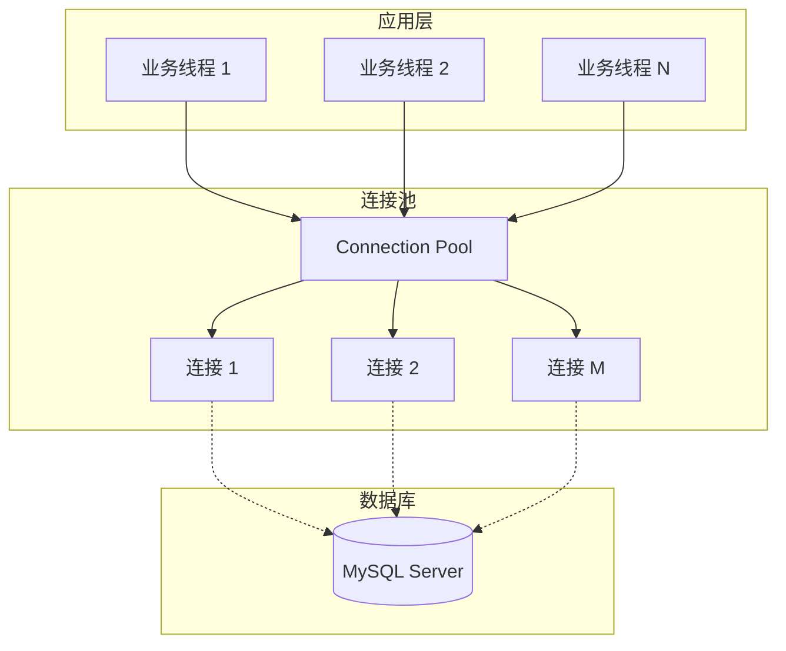
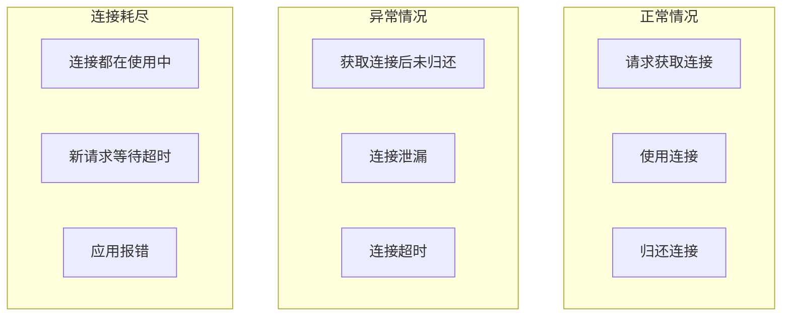

# 数据库连接池满排查

> **目标级别**：P6
> **面试频率**：🔴 高频
> **面试官最关心的 3 个问题**：
> 1. 数据库连接池满的原因有哪些？
> 2. 如何排查连接池问题？
> 3. 如何合理配置连接池？

---

面试官问：「线上报数据库连接池满了，怎么排查？」你说「重启」——然后面试官追问「重启后还会发生吗？怎么根本解决？」

数据库连接池是应用与数据库之间的桥梁。连接池耗尽意味着应用无法获取新的数据库连接，所有依赖数据库的操作都会失败。

## 一、连接池工作原理



## 二、连接池满的原因



| 原因 | 说明 | 严重程度 |
|------|------|----------|
| **连接泄漏** | 获取连接后未关闭 | 🔴 严重 |
| **慢查询** | SQL 执行时间过长 | 🟡 中等 |
| **连接池过小** | 配置的连接数不够 | 🟡 中等 |
| **数据库压力大** | 数据库处理能力不足 | 🟡 中等 |
| **长事务** | 事务占用连接时间过长 | 🔴 严重 |
| **网络问题** | 网络延迟导致连接超时 | 🟢 一般 |

## 三、排查步骤

### 3.1 第一步：确认连接池状态

```sql
-- MySQL 查看当前连接数
SHOW STATUS LIKE 'Threads_connected';

-- 查看最大连接数
SHOW VARIABLES LIKE 'max_connections';

-- 查看每个数据库的连接数
SHOW PROCESSLIST;

-- 查看连接详情
SELECT 
    id, user, host, db, command, time, state, info
FROM information_schema.PROCESSLIST
WHERE db = 'your_database'
ORDER BY time DESC;
```

```bash
# Druid 连接池监控
# 访问 /druid/index.html 查看监控面板
```

### 3.2 第二步：分析连接占用

```sql
-- 查看长时间运行的查询
SELECT 
    id, user, host, db, command, time, state, info
FROM information_schema.PROCESSLIST
WHERE command != 'Sleep'
ORDER BY time DESC
LIMIT 20;

-- 查看锁等待
SELECT 
    trx_id, trx_state, trx_started, trx_rows_locked,
    trx_mysql_thread_id, trx_query
FROM information_schema.INNODB_TRX;

-- 查看当前锁
SELECT 
    lock_id, lock_trx_id, lock_mode, lock_type,
    lock_table, lock_index, lock_space, lock_page
FROM information_schema.INNODB_LOCKS;
```

### 3.3 第三步：定位问题代码

```java
// ⚠️ 错误示例：连接泄漏
public void badExample() {
    Connection conn = dataSource.getConnection();
    try {
        // 业务逻辑
        doSomething(conn);
    } finally {
        // ⚠️ 没有关闭连接，如果异常跳过
    }
}

// ✅ 正确示例：使用 try-with-resources
public void goodExample() {
    try (Connection conn = dataSource.getConnection()) {
        doSomething(conn);
    } // 自动关闭
}

// ✅ 正确示例：手动关闭
public void goodExample2() {
    Connection conn = null;
    try {
        conn = dataSource.getConnection();
        doSomething(conn);
    } catch (SQLException e) {
        // 处理异常
    } finally {
        if (conn != null) {
            try {
                conn.close();  // 归还到连接池
            } catch (SQLException e) {
                // ignore
            }
        }
    }
}
```

## 四、常见问题场景

### 4.1 场景一：连接未关闭

```java
// ⚠️ 错误示例
public User getUserById(Long id) {
    Connection conn = null;
    PreparedStatement ps = null;
    ResultSet rs = null;
    
    try {
        conn = ds.getConnection();
        ps = conn.prepareStatement("SELECT * FROM user WHERE id = ?");
        ps.setLong(1, id);
        rs = ps.executeQuery();
        
        if (rs.next()) {
            return parseUser(rs);
        }
        return null;
        // ⚠️ 提前 return，连接未关闭
    } catch (SQLException e) {
        throw new RuntimeException(e);
    } finally {
        // ⚠️ 缺少关闭逻辑，或者只在部分路径关闭
    }
}

// ✅ 正确示例
public User getUserById(Long id) {
    try (Connection conn = ds.getConnection();
         PreparedStatement ps = conn.prepareStatement("SELECT * FROM user WHERE id = ?")) {
        ps.setLong(1, id);
        try (ResultSet rs = ps.executeQuery()) {
            if (rs.next()) {
                return parseUser(rs);
            }
            return null;
        }
    } catch (SQLException e) {
        throw new RuntimeException(e);
    }
}
```

### 4.2 场景二：长事务占用连接

```java
// ⚠️ 错误示例：大事务
@Transactional
public void batchImport(List<Record> records) {
    // 整个批量导入在一个事务中
    for (Record record : records) {
        process(record);  // 每次都查询、更新
    }
    // 整个过程占用一个连接
}

// ✅ 正确示例：分批小事务
@Transactional
public void batchImport(List<Record> records) {
    int batchSize = 500;
    for (int i = 0; i < records.size(); i += batchSize) {
        List<Record> batch = records.subList(i, Math.min(i + batchSize, records.size()));
        processBatch(batch);
        // 每次处理后释放连接
    }
}
```

### 4.3 场景三：慢查询占用连接

```sql
-- ⚠️ 慢查询示例：全表扫描
SELECT * FROM orders WHERE status = 0;  -- 无索引

-- ✅ 优化：添加索引
CREATE INDEX idx_status ON orders(status);

-- ✅ 优化：限制返回行数
SELECT * FROM orders WHERE status = 0 LIMIT 1000;
```

## 五、连接池配置优化

### 5.1 Druid 配置

```java
// ✅ 推荐配置
DruidDataSource dataSource = new DruidDataSource();
dataSource.setInitialSize(10);              // 初始连接数
dataSource.setMinIdle(10);                  // 最小空闲连接
dataSource.setMaxActive(50);                // 最大连接数（与数据库一致）
dataSource.setMaxWait(3000);                // 获取连接最大等待时间
dataSource.setTimeBetweenEvictionRunsMillis(60000);  // 清理线程间隔
dataSource.setMinEvictableIdleTimeMillis(300000);   // 最小空闲时间
dataSource.setValidationQuery("SELECT 1");  // 验证连接
dataSource.setTestWhileIdle(true);          // 空闲时验证
dataSource.setTestOnBorrow(false);          // 获取时验证（关闭，性能更好）
dataSource.setTestOnReturn(false);          // 归还时验证
dataSource.setPoolPreparedStatements(true); // 开启 PreparedStatement 缓存
dataSource.setMaxPoolPreparedStatementPerConnectionSize(20);
```

### 5.2 HikariCP 配置

```java
// ✅ 推荐配置
HikariConfig config = new HikariConfig();
config.setJdbcUrl("jdbc:mysql://localhost:3306/db");
config.setUsername("user");
config.setPassword("pass");
config.setMaximumPoolSize(50);              // 最大连接数
config.setMinimumIdle(10);                  // 最小空闲连接
config.setConnectionTimeout(30000);         // 获取连接超时
config.setIdleTimeout(600000);             // 空闲超时
config.setMaxLifetime(1800000);             // 最大生命周期
config.setConnectionTestQuery("SELECT 1");  // 测试查询
config.setPoolName("MyHikariPool");
```

## 六、高频面试题

### 🔴 第一层：数据库连接池满了怎么排查？

**问题**：线上报连接池满了，怎么快速定位问题？

**参考答案**：

```bash
# 1. 查看数据库连接数
SHOW PROCESSLIST;

# 2. 查看连接占用情况
SELECT id, user, host, db, command, time, info 
FROM information_schema.PROCESSLIST 
WHERE db = 'your_db'
ORDER BY time DESC;

# 3. 查看慢查询
SHOW FULL PROCESSLIST WHERE Time > 10;

# 4. 查看锁等待
SELECT * FROM information_schema.INNODB_LOCK_WAITS;
```

---

### 🔴 第二层：如何避免连接池耗尽？

**问题**：有什么方法可以避免连接池问题？

**参考答案**：

| 方法 | 说明 |
|------|------|
| **正确关闭连接** | 使用 try-with-resources |
| **减少事务时间** | 拆分大事务，避免长事务 |
| **优化慢查询** | 添加索引，优化 SQL |
| **合理配置** | 连接数与数据库 max_connections 匹配 |
| **监控告警** | 连接数超过阈值告警 |
| **超时设置** | 设置合理的查询超时 |

---

### 🟡 第三层：连接池配置核心参数？

**问题**：连接池的核心配置参数有哪些？

**参考答案**：

| 参数 | Druid | HikariCP | 说明 |
|------|-------|----------|------|
| 最小连接 | initialSize | minimumIdle | 池中最小连接数 |
| 最大连接 | maxActive | maximumPoolSize | 池中最大连接数 |
| 获取超时 | maxWait | connectionTimeout | 获取连接等待时间 |
| 空闲超时 | minIdle | idleTimeout | 空闲连接存活时间 |
| 最大生命周期 | - | maxLifetime | 连接最大生命周期 |
| 验证查询 | validationQuery | connectionTestQuery | 检测连接有效性 |

---

## 七、常见陷阱

### ⚠️ 陷阱 1：忽略连接的关闭

finally 块中也要正确处理异常情况。

### ⚠️ 陷阱 2：maxActive 设置过大

连接数不是越大越好，要与数据库承受能力匹配。

### ⚠️ 陷阱 3：忽略数据库连接上限

MySQL 默认 max_connections=151，需要同步调整。

### ⚠️ 陷阱 4：测试连接时性能损耗

TestOnBorrow/TestOnReturn 会影响性能，建议使用 TestWhileIdle。

---

## 八、加分回答

### 💡 使用 APM 监控连接池

```java
// Druid 监控配置
servletRegistrationBean.setInitParameters(Map.of(
    "exclusions", "*.js,*.gif,*.jpg,*.png,*.css,*.ico,/druid/*"
));
```

### 💡 使用连接池监控指标

```java
// Druid 监控数据
DruidDataSource dataSource = (DruidDataSource) ctx.getBean("dataSource");
DruidPooledConnection conn = dataSource.getConnection();
DruidPooledConnection.StatsRecord stats = conn.getStatsRecorder();
// 记录连接使用情况到监控系统
```

---

## 九、扩展思考

为什么连接池配置了 maxActive=100，但数据库连接数显示只有 80？

> **答案**：
>
> 1. **连接池预热**：initialSize 可能小于 maxActive，启动时不会立即创建所有连接
> 2. **连接回收**：minIdle 限制了空闲连接数，空闲连接会被回收
> 3. **连接泄漏检测**：Druid 会关闭泄漏的连接
> 4. **获取超时**：获取连接超时导致部分请求失败，实际未获取到连接
> 5. **数据库限制**：数据库 max_connections 可能小于应用配置
