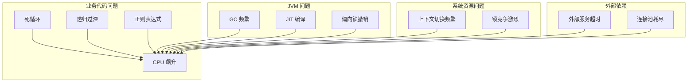
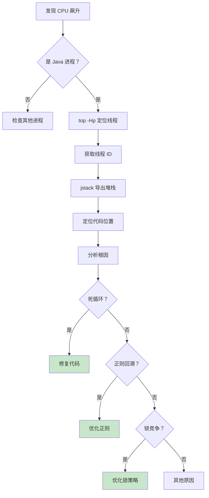

# 线上 CPU 飙升排查

> **目标级别**：P6
> **面试频率**：🔴 高频
> **面试官最关心的 3 个问题**：
> 1. 如何快速定位 CPU 飙升的原因？
> 2. 常见的 CPU 飙升原因有哪些？
> 3. 如何避免 CPU 飙升问题？

---

面试官问：「线上服务 CPU 100%，你怎么排查？」你说「重启」——面试官摇了摇头。

CPU 飙升是生产环境最常见的问题之一。重启能解决一时，但下次还会发生。真正的工程师需要系统化的排查思路，快速定位根因并彻底解决问题。

## 一、常见 CPU 飙升原因



| 原因类型 | 常见场景 | 紧急程度 |
|----------|----------|----------|
| **死循环** | 无限循环、未终止的流处理 | 🔴 紧急 |
| **正则回溯** | 复杂正则表达式、贪婪匹配 | 🔴 紧急 |
| **GC 频繁** | 内存分配过快、对象过大 | 🟡 一般 |
| **锁竞争** | synchronized 竞争、阻塞 | 🟡 一般 |
| **正则表达式** | 复杂匹配、灾难性回溯 | 🔴 紧急 |
| **JIT 编译** | 预热期编译开销 | 🟢 可忽略 |

## 二、排查步骤

### 2.1 第一步：确认 CPU 飙升

```bash
# 查看 CPU 使用情况
top -c

# 按 CPU 使用率排序
top -Hp <pid>

# 查看 Java 进程 CPU 使用
ps -p <pid> -o %cpu
```

### 2.2 第二步：定位高 CPU 线程

```bash
# 找出 CPU 占用最高的线程 ID（转换为十六进制）
top -Hp <pid>
# 假设输出中 TID 为 12345

# 转换为十六进制
printf '%x\n' 12345
# 输出: 3039

# 导出线程堆栈
jstack <pid> > /tmp/thread.log

# 查找该线程的堆栈
grep -A 50 '3039' /tmp/thread.log
```

### 2.3 第三步：分析线程堆栈

```java
# 示例线程堆栈
"http-nio-8080-exec-10" #12345 daemon prio=5 os_prio=0 cpu=2500.00ms elapsed=120.00s
    java.lang.Thread.State: RUNNABLE
    at com.example.Service.processData(Service.java:45)
    at com.example.Controller.handle(Controller.java:78)
    at sun.reflect.GeneratedMethodAccessor123.invoke()
```

**关键信息**：

- `cpu=2500.00ms`：该线程累计占用 2.5 秒 CPU
- `RUNNABLE` 状态：线程正在执行
- 代码行号：Service.java:45

### 2.4 第四步：使用 Arthas 快速定位

```bash
# 启动 Arthas
java -jar arthas-boot.jar

# 定位 CPU 占用最高的线程
thread -n 5

# 查看线程详细信息
thread <tid>

# 监控方法执行时间
trace com.example.Service processData
```

## 三、常见场景分析

### 3.1 场景一：死循环

```java
// 错误示例：死循环
public void process(List<Item> items) {
    for (int i = 0; i >= 0; i++) {  // ⚠️ 应该是 i < items.size()
        processItem(items.get(i));
    }
}

// 正确示例
public void process(List<Item> items) {
    for (int i = 0; i < items.size(); i++) {  // ✅
        processItem(items.get(i));
    }
}
```

### 3.2 场景二：正则表达式灾难性回溯

```java
// 错误示例：灾难性回溯
String pattern = "(a+)+b";  // ⚠️ 当 a 连续出现时，复杂度指数级增长
Pattern.matches(pattern, input);

// 正确示例：优化正则
String pattern = "a+b";  // ✅ 如果只需要匹配 a 重复后跟 b
// 或者使用原子组、占有量词等
```

```java
// 真实案例：邮箱验证
// 错误
String emailRegex = "^([a-z0-9_\\.-]+)@([\\da-z\\.-]+)\\.([a-z\\.]{2,6})$";

// 正则回溯风险测试
String badInput = "aaaaaaaaaaaaaaaaaaaaaaaaaa!";  // 会导致严重回溯
```

### 3.3 场景三：Stream 操作不当

```java
// 错误示例：链式调用导致重复计算
list.stream()
    .filter(x -> x > 0)
    .map(x -> expensiveOperation(x))  // ⚠️ 每个元素都要执行
    .collect(Collectors.toList());

// 正确示例：减少中间操作
List<Integer> filtered = list.stream()
    .filter(x -> x > 0)
    .collect(Collectors.toList());

List<Result> result = filtered.stream()
    .map(x -> expensiveOperation(x))  // ✅ 只对过滤后的元素操作
    .collect(Collectors.toList());
```

### 3.4 场景四：递归过深

```java
// 错误示例：递归层级过深
public long fibonacci(int n) {
    return fibonacci(n - 1) + fibonacci(n - 2);  // ⚠️ 指数级复杂度
}

// 正确示例：使用循环或尾递归优化
public long fibonacci(int n) {
    if (n <= 1) return n;
    long a = 0, b = 1;
    for (int i = 2; i <= n; i++) {
        long c = a + b;
        a = b;
        b = c;
    }
    return b;
}
```

## 四、排查流程图



## 五、解决方案总结

| 问题类型 | 解决方案 | 预防措施 |
|----------|----------|----------|
| **死循环** | 代码审查、边界检查 | Code Review、单元测试 |
| **正则回溯** | 优化正则、使用原子组 | 正则测试、性能测试 |
| **GC 频繁** | 对象池、减少内存分配 | 监控 GC、容量规划 |
| **锁竞争** | 减小锁粒度、CAS | 锁优化、并发测试 |
| **流式处理** | 批处理、限流 | 压测、容量评估 |

---

## 六、高频面试题

### 🔴 第一层：CPU 飙升如何排查？

**问题**：线上服务 CPU 100%，如何快速定位问题？

**参考答案**：

```bash
# 1. 确认是哪个进程 CPU 高
top -c

# 2. 定位到具体的 Java 进程
ps -ef | grep java

# 3. 找出 CPU 占用最高的线程
top -Hp <pid>

# 4. 导出线程堆栈
jstack <pid> > /tmp/thread.log

# 5. 将线程 ID 转为十六进制，查找对应堆栈
grep -A 30 '0x3039' /tmp/thread.log
```

> **追问 1**：如果线程堆栈指向 `WAITING` 状态，说明什么？
>
> **答案**：说明线程在等待锁或 I/O，不是 CPU 密集型操作。CPU 高可能是其他线程导致的。

> **追问 2**：如何判断是 GC 导致的 CPU 高？
>
> **答案**：查看 GC 日志，如果 `user/sys` 时间占比高，且 `GC count` 频繁，说明是 GC 频繁导致的。

---

### 🟡 第二层：正则表达式导致 CPU 高？

**问题**：如何判断是正则表达式导致的 CPU 高？

**参考答案**：

1. **代码审查**：查找所有 `Pattern.matches()` 和 `String.matches()` 调用
2. **使用 Arthas**：`trace` 监控正则相关方法的执行时间
3. **常见危险模式**：
   - `(a+)+b`
   - `(a*)*b`
   - `(.*)*`
   - 嵌套量词

---

### 🟢 第三层：JIT 编译导致的 CPU 尖刺？

**问题**：预热期 CPU 高是正常现象吗？

**参考答案**：

- **正常现象**：JIT 编译器在预热期会消耗 CPU
- **判断方法**：观察启动后 5-10 分钟的 CPU 使用率
- **优化方案**：使用 `-XX:+TieredCompilation` 启用分层编译，减少预热时间

---

## 七、常见陷阱

### ⚠️ 陷阱 1：只看 `top` 不看 `top -Hp`

只看进程级别的 CPU，无法定位到具体的线程。必须用 `top -Hp` 定位线程。

### ⚠️ 陷阱 2：忽略 `WAITING` 线程

`WAITING` 状态的线程不占用 CPU，但可能是锁竞争导致其他线程 CPU 高。

### ⚠️ 陷阱 3：重启后不分析根因

重启只能解决一时，不解决根本问题，下次还会发生。

### ⚠️ 陷阱 4：忽略 JVM 参数

`-XX:+PrintCompilation` 可以看到 JIT 编译日志，帮助判断是否是编译问题。

---

## 八、加分回答

### 💡 使用 Arthas 进行在线诊断

```bash
# 启动 Arthas
java -jar arthas-boot.jar <pid>

# 查看 CPU 占用最高的 5 个线程
thread -n 5

# 查看线程状态统计
thread -s

# 监控方法执行时间
trace com.example.Service * '#cost > 100'

# 查看方法调用路径
stack com.example.Service process
```

### 💡 使用火焰图分析

```bash
# 使用 perf 生成火焰图
perf record -e cpu-clock -p <pid> -g -- sleep 30

# 生成火焰图
perf script | ./FlameGraph/stackcollapse-perf.pl | \
    ./FlameGraph/flamegraph.pl > /tmp/flamegraph.svg
```

---

## 九、对比总结表

| 排查工具 | 适用场景 | 优点 | 缺点 |
|----------|----------|------|------|
| `top` | 确认 CPU 高的进程 | 系统自带，快速 | 无法定位代码 |
| `jstack` | 导出线程堆栈 | 定位代码行号 | 需要离线分析 |
| `Arthas` | 在线实时诊断 | 功能强大，实时 | 需要引入依赖 |
| `perf` + 火焰图 | 性能分析 | 直观，可视化 | 需要额外工具 |

---

## 十、扩展思考

如果 CPU 飙升是间歇性的，如何排查？

> **答案**：
>
> 1. **开启定时采样**：每分钟采样一次线程堆栈
> 2. **使用 APM 工具**：SkyWalking、Pinpoint 等
> 3. **分析日志**：结合业务日志时间点分析
> 4. **压测复现**：在测试环境复现问题
