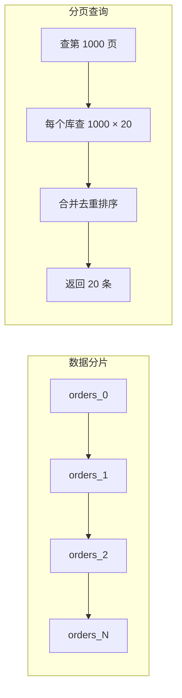

# 跨库分页查询

> **目标级别**：P6
> **面试频率**：🟡 中频
> **面试官最关心的 3 个问题**：
> 1. 分库分表后如何实现分页查询？
> 2. 跨库分页查询有什么性能问题？
> 3. 如何优化跨库分页查询？

---

面试官问：「分库分表后怎么查第 1000 页的数据？」你说「每个库都查，然后合并」——然后面试官追问「第 1000 页每页 20 条，需要查多少数据？」

跨库分页是分库分表后最难解决的问题之一。简单的分页在单库时代很容易，但分库后变得非常复杂。

## 一、分库分表后的分页问题



**问题**：查第 N 页，需要扫描 `(N-1) × PageSize × ShardCount` 条数据。

## 二、常见方案

### 2.1 方案一：禁止跳页查询

```java
// ✅ 方案：只支持上一页下一页
@Service
public class PaginationService {
    
    // 使用游标分页，避免 Offset
    public PageResult<Order> queryOrders(Long userId, String cursor, int pageSize) {
        // cursor 上一页最后一条的 ID
        String lastId = StringUtils.isBlank(cursor) ? null : cursor;
        
        // 每个分片只查 pageSize + 1 条
        List<Order> orders = new ArrayList<>();
        for (int i = 0; i < shardCount; i++) {
            List<Order> shardOrders = queryFromShard(i, userId, lastId, pageSize + 1);
            orders.addAll(shardOrders);
        }
        
        // 合并后排序
        orders.sort((a, b) -> b.getId().compareTo(a.getId()));
        
        // 返回 pageSize 条
        if (orders.size() > pageSize) {
            return PageResult.of(orders.subList(0, pageSize), 
                orders.get(pageSize).getId().toString());
        }
        return PageResult.of(orders, null);
    }
}
```

### 2.2 方案二：使用时间分片

```java
// ✅ 按时间分片，支持按月查询
@Service
public class TimeBasedPagination {
    
    public List<Order> queryByMonth(Long userId, String yearMonth, int page, int size) {
        // 先找到对应的时间分片
        String tableName = "orders_" + yearMonth.replace("-", "");
        
        // 直接在对应分片查询
        String sql = "SELECT * FROM " + tableName + 
            " WHERE user_id = ? ORDER BY id DESC LIMIT ? OFFSET ?";
        
        return jdbcTemplate.query(sql, userId, size, (page - 1) * size);
    }
}
```

### 2.3 方案三：使用 ES 作为搜索层

```java
// ✅ 使用 Elasticsearch 处理跨库分页
@Service
public class ElasticsearchPagination {
    
    @Autowired
    private ElasticsearchRestTemplate elasticsearchTemplate;
    
    public Page<Order> queryOrders(Long userId, int page, int size) {
        // ES 中存储全量数据
        NativeQuery query = NativeQuery.builder()
            .withQuery(q -> q.term(t -> t.field("userId").value(userId)))
            .withSort(s -> s.field(f -> f.field("id").order(SortOrder.Desc)))
            .withPageable(PageRequest.of(page - 1, size))
            .build();
        
        SearchHits<Order> hits = elasticsearchTemplate.search(query, Order.class);
        
        return hits.getPageable().toPage();
    }
}
```

### 2.4 方案四：双写 + 汇总表

```java
// ✅ 将数据同步到汇总表
@Component
public class AggregationTableSync {
    
    @Transactional
    public void syncToAggregation(Order order) {
        // 写入分片表
        orderDao.insert(order);
        
        // 写入汇总表（异步）
        CompletableFuture.runAsync(() -> {
            aggregationDao.insert(order);
        });
    }
}

// 从汇总表分页查询
@Service
public class AggregationPagination {
    
    public Page<Order> queryOrders(Long userId, int page, int size) {
        // 从汇总表查询（单库单表）
        return aggregationDao.findByUserId(userId, page, size);
    }
}
```

## 三、分页方案对比

| 方案 | 优点 | 缺点 | 适用场景 |
|------|------|------|----------|
| **禁止跳页** | 实现简单，性能好 | 不支持跳页 | 列表展示 |
| **时间分片** | 查询简单 | 只能按时间 | 历史数据查询 |
| **ES 搜索** | 支持复杂查询 | 数据同步复杂 | 搜索场景 |
| **汇总表** | 查询简单 | 延迟同步 | 统计报表 |

## 四、深分页优化

```java
// ✅ 基于 ID 的深度分页优化
@Service
public class DeepPaginationOptimization {
    
    public List<Order> queryById(Long userId, Long lastId, int size) {
        // 方案1：基于上一页最后 ID 查询
        String sql = "SELECT * FROM orders " +
            "WHERE user_id = ? AND id < ? " +
            "ORDER BY id DESC LIMIT ?";
        
        return jdbcTemplate.query(sql, userId, lastId, size);
    }
    
    // 方案2：记录总页数，减少查询
    @Cacheable(value = "order:count", key = "#userId")
    public Long getTotalCount(Long userId) {
        // 汇总各分片数量
        long total = 0;
        for (int i = 0; i < shardCount; i++) {
            total += countFromShard(i, userId);
        }
        return total;
    }
}
```

## 五、高频面试题

### 🔴 第一层：分库分表后如何分页查询？

**问题**：数据分库后怎么查第 N 页的数据？

**参考答案**：

1. **禁止跳页**：只支持上一页下一页
2. **时间分片**：按时间维度分片
3. **ES 搜索**：使用 Elasticsearch 处理
4. **汇总表**：同步到汇总表查询

---

### 🟡 第二层：跨库分页的性能问题？

**问题**：跨库分页有什么性能问题？

**参考答案**：

- **Offset 问题**：查第 N 页需要跳过 `(N-1) × PageSize × ShardCount` 条数据
- **全量扫描**：每个分片都要扫描
- **合并排序**：跨分片排序开销大

---

### 🟢 第三层：如何优化深分页？

**问题**：深分页查询怎么优化？

**参考答案**：

1. **游标分页**：使用 ID 或时间作为游标
2. **限制页数**：禁止查询超过 100 页
3. **预计算**：提前计算总页数
4. **ES 替代**：使用 ES 处理复杂分页

---

## 六、常见陷阱

### ⚠️ 陷阱 1：使用 LIMIT offset

LIMIT offset 会扫描并丢弃前面所有数据。

### ⚠️ 陷阱 2：COUNT 所有分片

跨分片 COUNT 非常慢。

### ⚠️ 陷阱 3：没有限制最大页数

深分页查询可能导致性能问题。

### ⚠️ 陷阱 4：忽略数据倾斜

某些分片数据过多导致查询不均。

---

## 七、加分回答

### 💡 使用 ShardingSphere 分页

```yaml
# ShardingSphere 配置
sharding:
  tables:
    orders:
      actualDataNodes: ds_${0..3}.orders_${0..15}
      tableStrategy:
        standard:
          shardingColumn: user_id
          shardingAlgorithmName: orders_mod
      keyGenerateStrategy:
        column: id
        keyGeneratorName: snowflake
```

### 💡 分页优化总结

1. **优先使用游标**：避免 OFFSET
2. **限制最大页数**：保护系统
3. **使用搜索服务**：ES/OpenSearch
4. **异步统计**：COUNT 异步化
