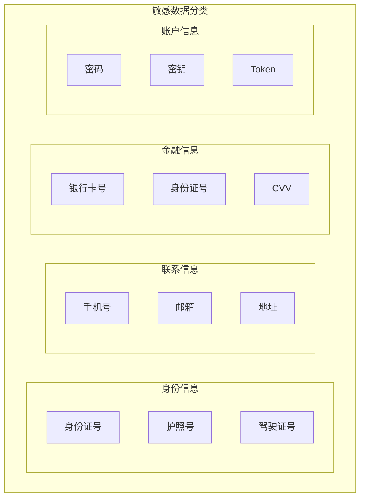

# 敏感数据脱敏

> **目标级别**：P6
> **面试频率**：🟡 中频
> **面试官最关心的 3 个问题**：
> 1. 哪些数据需要脱敏？
> 2. 常见的脱敏策略有哪些？
> 3. 如何实现脱敏？

---

面试官问：「接口返回的用户手机号需要脱敏吗？怎么实现？」你说「加个掩码」——然后面试官追问「脱敏后还能用吗？如果需要展示完整数据呢？」

敏感数据脱敏是数据安全的重要环节，需要在数据保护和业务可用之间找到平衡。

## 一、需要脱敏的数据



| 类别 | 字段 | 脱敏策略 |
|------|------|----------|
| **身份信息** | 身份证号 | 脱敏中间段 |
| **联系信息** | 手机号 | 显示前 3 后 4 |
| **金融信息** | 银行卡号 | 只显示后 4 位 |
| **账户信息** | 密码 | 不可逆加密 |
| **地址信息** | 家庭地址 | 模糊化处理 |

## 二、常见脱敏策略

### 2.1 脱敏策略对比

| 策略 | 说明 | 适用场景 | 可逆性 |
|------|------|----------|--------|
| **掩码** | 部分字符替换为 * | 手机号、邮箱 | 否 |
| **截断** | 只保留部分信息 | 银行卡号 | 否 |
| **泛化** | 降低精度 | 金额、日期 | 否 |
| **哈希** | 单向哈希 | 密码、身份证 | 否 |
| **加密** | 可解密 | 需要还原的场景 | 可 |
| **令牌化** | 映射到令牌 | API 接口 | 可 |

### 2.2 手机号脱敏

```java
// ✅ 手机号脱敏：138****1234
public class PhoneMasking {
    
    public static String mask(String phone) {
        if (StringUtils.isBlank(phone) || phone.length() `<` 11) {
            return phone;
        }
        return phone.substring(0, 3) + "****" + phone.substring(7);
    }
}

// 测试
// mask("13800138000") → "138****8000"
// mask("") → ""
// mask(null) → null
```

### 2.3 身份证号脱敏

```java
// ✅ 身份证号脱敏：320***********1234
public class IdCardMasking {
    
    public static String mask(String idCard) {
        if (StringUtils.isBlank(idCard) || idCard.length() != 18) {
            return idCard;
        }
        return idCard.substring(0, 6) + "********" + idCard.substring(14);
    }
}

// 测试
// mask("320123199001011234") → "320123********1234"
```

### 2.4 银行卡号脱敏

```java
// ✅ 银行卡号脱敏：******1234
public class BankCardMasking {
    
    public static String mask(String cardNumber) {
        if (StringUtils.isBlank(cardNumber) || cardNumber.length() < 12) {
            return cardNumber;
        }
        // 只保留后 4 位
        return "******" + cardNumber.substring(cardNumber.length() - 4);
    }
}

// 测试
// mask("6222021234567890123") → "******0123"
```

### 2.5 邮箱脱敏

```java
// ✅ 邮箱脱敏：t***@example.com
public class EmailMasking {
    
    public static String mask(String email) {
        if (StringUtils.isBlank(email) || !email.contains("@")) {
            return email;
        }
        
        String[] parts = email.split("@");
        String username = parts[0];
        String domain = parts[1];
        
        if (username.length() <= 2) {
            return username + "***@" + domain;
        }
        
        return username.substring(0, 2) + "***@" + domain;
    }
}

// 测试
// mask("test@example.com") → "te***@example.com"
// mask("ab@example.com") → "ab***@example.com"
```

## 三、脱敏实现方案

### 3.1 注解方式

```java
// ✅ 脱敏注解
@Target(ElementType.FIELD)
@Retention(RetentionPolicy.RUNTIME)
public @interface Sensitive {
    SensitiveType value();
}

public enum SensitiveType {
    PHONE,      // 手机号
    EMAIL,      // 邮箱
    ID_CARD,    // 身份证
    BANK_CARD,  // 银行卡
    NAME,       // 姓名
    ADDRESS     // 地址
}

// ✅ 使用注解
public class User {
    private Long id;
    
    @Sensitive(SensitiveType.PHONE)
    private String phone;
    
    @Sensitive(SensitiveType.EMAIL)
    private String email;
    
    @Sensitive(SensitiveType.ID_CARD)
    private String idCard;
}
```

### 3.2 脱敏工具类

```java
// ✅ Jackson 脱敏序列化
@Component
public class SensitiveJsonSerializer extends JsonSerializer<String> {
    
    @Override
    public void serialize(String value, JsonGenerator gen, SerializerProvider serializers) 
            throws IOException {
        Field field = getCurrentField();
        Sensitive annotation = field.getAnnotation(Sensitive.class);
        
        if (annotation == null) {
            gen.writeString(value);
            return;
        }
        
        String masked = mask(value, annotation.value());
        gen.writeString(masked);
    }
    
    private String mask(String value, SensitiveType type) {
        return switch (type) {
            case PHONE -> PhoneMasking.mask(value);
            case EMAIL -> EmailMasking.mask(value);
            case ID_CARD -> IdCardMasking.mask(value);
            case BANK_CARD -> BankCardMasking.mask(value);
        };
    }
}
```

### 3.3 全局配置

```yaml
# application.yml
sensitive:
  enabled: true
  rules:
    phone: "***mask**
    email: "***@***
    id_card: "***mask***
    bank_card: "**********last4"
```

## 四、数据库脱敏

### 4.1 脱敏存储

```sql
-- ✅ 敏感字段加密存储
CREATE TABLE user (
    id BIGINT PRIMARY KEY,
    name VARCHAR(50),
    phone_encrypted VARCHAR(255),  -- 加密存储
    id_card_encrypted VARCHAR(255), -- 加密存储
    password VARCHAR(255)           -- Hash 存储
);

-- ✅ 脱敏字段单独存储
CREATE TABLE user (
    id BIGINT PRIMARY KEY,
    name VARCHAR(50),
    phone VARCHAR(11),           -- 明文（如果业务需要搜索）
    phone_masked VARCHAR(15),     -- 脱敏存储
    password VARCHAR(255)
);
```

### 4.2 动态脱敏

```sql
-- ✅ 根据用户权限动态脱敏
SELECT 
    id,
    name,
    CASE 
        WHEN has_view_permission THEN phone
        ELSE mask_phone(phone)
    END AS phone,
    CASE 
        WHEN has_view_permission THEN id_card
        ELSE mask_id_card(id_card)
    END AS id_card
FROM user;
```

## 五、高频面试题

### 🔴 第一层：哪些数据需要脱敏？

**问题**：请列举需要脱敏的敏感数据。

**参考答案**：

| 类别 | 示例 | 脱敏方式 |
|------|------|----------|
| **身份信息** | 身份证号、护照 | 脱敏中间段 |
| **联系信息** | 手机号、邮箱 | 显示部分 |
| **金融信息** | 银行卡号、CVV | 只显示后 4 位 |
| **账户信息** | 密码、密钥 | 不可逆加密 |
| **位置信息** | 家庭住址 | 模糊化 |

---

### 🔴 第二层：脱敏后还能用吗？

**问题**：脱敏后数据还能正常使用吗？

**参考答案**：

- **展示场景**：脱敏后可以用于展示
- **业务查询**：需要保留可搜索字段（如手机号前 3 位）
- **数据分析**：使用脱敏数据做聚合分析
- **精确场景**：需要权限控制，查看原始数据

---

### 🟡 第三层：密码怎么存储？

**问题**：密码应该如何存储？

**参考答案**：

1. **不使用可逆加密**：不能加密存储密码
2. **使用 Hash**：BCrypt、PBKDF2、SHA-256 + salt
3. **加盐存储**：每个用户使用不同的盐值
4. **多次 Hash**：增加破解难度

---

## 六、常见陷阱

### ⚠️ 陷阱 1：脱敏不彻底

只对部分字段脱敏，忽略其他敏感字段。

### ⚠️ 陷阱 2：日志脱敏遗漏

日志中没有对敏感数据进行脱敏处理。

### ⚠️ 陷阱 3：数据库直接存储明文

密码等敏感信息必须加密/哈希存储。

### ⚠️ 陷阱 4：脱敏数据用于统计

脱敏数据可能影响统计准确性。

---

## 七、加分回答

### 💡 日志脱敏

```java
// ✅ 日志脱敏
@Component
public class LogMaskingConverter {
    
    @Override
    public String convert(String log) {
        return maskPhone(maskIdCard(maskBankCard(log)));
    }
}

// 使用 Logback MDC
@Component
public class LogbackFilter implements Filter {
    
    @Override
    public String filter(String msg) {
        // 对日志内容进行脱敏
        return SensitiveMasking.maskAll(msg);
    }
}
```

### 💡 API 响应脱敏

```java
// ✅ API 统一响应脱敏
@RestControllerAdvice
public class SensitiveResponseAdvice implements ResponseBodyAdvice<Object> {
    
    @Override
    public Object beforeBodyWrite(Object body, ...) {
        return maskSensitiveData(body);
    }
    
    private Object maskSensitiveData(Object body) {
        // 遍历对象，对标注 @Sensitive 的字段脱敏
    }
}
```

---

## 八、扩展思考

如何实现不同用户看到不同脱敏级别？

> **答案**：
>
> 1. **权限控制**：根据用户角色决定是否查看完整数据
> 2. **动态脱敏**：SQL 层根据权限动态脱敏
> 3. **数据分级**：敏感数据分级，分配不同权限
> 4. **审计日志**：记录敏感数据访问
