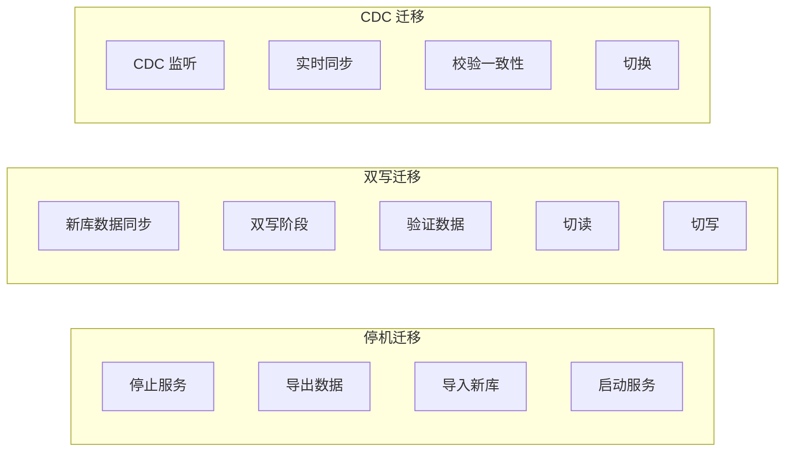
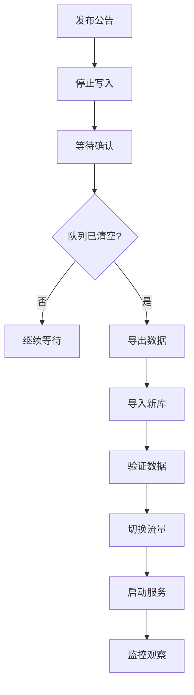
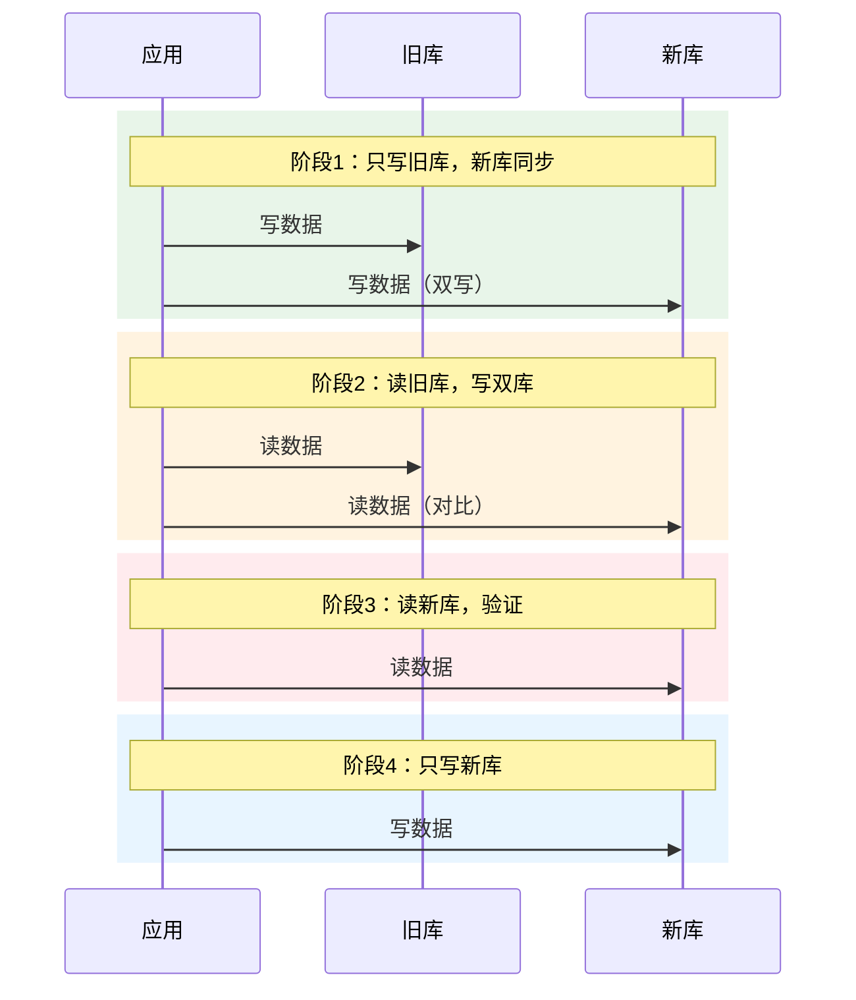

# 数据迁移方案

> **目标级别**：P6
> **面试频率**：🟡 中频
> **面试官最关心的 3 个问题**：
> 1. 数据迁移的常见方案有哪些？
> 2. 如何保证迁移过程中的数据一致性？
> 3. 如何验证迁移结果？

---

面试官问：「需要把数据库迁移到新架构，怎么做？」你说「先导数据，再切流量」——然后面试官追问「迁移过程中有数据写入怎么办？怎么验证迁移正确？」

数据迁移是大型系统升级中风险最高的工作之一，需要周密的计划和回滚方案。

## 一、迁移方案对比



| 方案 | 停机时间 | 风险 | 适用场景 |
|------|----------|------|----------|
| **停机迁移** | 小时级 | 低 | 非核心系统 |
| **双写迁移** | 分钟级 | 中 | 业务可改造 |
| **CDC 迁移** | 秒级 | 高 | 实时性要求高 |

## 二、停机迁移

### 2.1 迁移流程



### 2.2 迁移脚本

```bash
#!/bin/bash
# 停机迁移脚本

# 1. 导出数据
mysqldump -h old-host -u root -p old_db orders > orders.sql
gzip orders.sql

# 2. 导入数据
mysql -h new-host -u root -p new_db < orders.sql

# 3. 验证数据量
OLD_COUNT=$(mysql -h old-host -u root -p -N -e "SELECT COUNT(*) FROM orders;")
NEW_COUNT=$(mysql -h new-host -u root -p -N -e "SELECT COUNT(*) FROM orders;")

if [ "$OLD_COUNT" != "$NEW_COUNT" ]; then
    echo "数据量不一致，OLD: $OLD_COUNT, NEW: $NEW_COUNT"
    exit 1
fi

# 4. 验证校验和
OLD_CHECKSUM=$(mysql -h old-host -u root -p -N -e "SELECT SUM(amount) FROM orders;")
NEW_CHECKSUM=$(mysql -h new-host -u root -p -N -e "SELECT SUM(amount) FROM orders;")

if [ "$OLD_CHECKSUM" != "$NEW_CHECKSUM" ]; then
    echo "校验和不一致"
    exit 1
fi

echo "迁移验证成功"
```

## 三、双写迁移

### 3.1 迁移阶段



### 3.2 代码实现

```java
// 双写服务
@Service
public class DualWriteService {
    
    @Autowired
    private OrderDao oldOrderDao;
    
    @Autowired
    private OrderDao newOrderDao;
    
    @Transactional
    public void createOrder(Order order) {
        // 1. 写旧库
        oldOrderDao.insert(order);
        
        // 2. 写新库（双写）
        try {
            newOrderDao.insert(order);
        } catch (Exception e) {
            // 记录双写失败
            log.error("双写失败，写入新库异常", e);
            // 可以选择是否回滚旧库
        }
    }
}
```

### 3.3 数据校验

```java
// 数据校验服务
@Service
public class DataVerification {
    
    @Autowired
    private OrderDao oldOrderDao;
    
    @Autowired
    private OrderDao newOrderDao;
    
    // 定期校验
    @Scheduled(fixedRate = 60000)
    public void verifyData() {
        // 1. 抽样校验
        List<Long> ids = oldOrderDao.randomSelect(100);
        
        for (Long id : ids) {
            Order oldOrder = oldOrderDao.findById(id);
            Order newOrder = newOrderDao.findById(id);
            
            if (!oldOrder.equals(newOrder)) {
                log.error("数据不一致，ID: {}", id);
                alertService.sendAlert("数据不一致");
            }
        }
        
        // 2. 数量校验
        long oldCount = oldOrderDao.count();
        long newCount = newOrderDao.count();
        
        if (oldCount != newCount) {
            log.error("数量不一致，OLD: {}, NEW: {}", oldCount, newCount);
        }
    }
}
```

## 四、CDC 迁移

### 4.1 使用 Canal

```java
// Canal 配置
@Configuration
public class CanalConfig {
    
    @Bean
    public CanalConnector canalConnector() {
        return Canal.connectors()
            .addConnector(new CanalConnector("127.0.0.1", 11111, "example", "", ""));
    }
}

// 监听数据变更
@Component
public class DataSyncListener {
    
    @Autowired
    private OrderDao newOrderDao;
    
    @Canal(table = "orders")
    public void onInsert(Entry entry) {
        RowChange rowChange = RowChange.parseFrom(entry.getStoreValue());
        
        for (RowData rowData : rowChange.getRowDatasList()) {
            if (rowChange.getEventType() == EventType.INSERT) {
                Order order = parseOrder(rowData.getAfterColumnsList());
                newOrderDao.insert(order);
            } else if (rowChange.getEventType() == EventType.UPDATE) {
                Order order = parseOrder(rowData.getAfterColumnsList());
                newOrderDao.update(order);
            } else if (rowChange.getEventType() == EventType.DELETE) {
                Long id = getId(rowData.getBeforeColumnsList());
                newOrderDao.delete(id);
            }
        }
    }
}
```

### 4.2 增量数据校验

```java
@Service
public class IncrementalVerify {
    
    public void verifyIncrement(Date startTime, Date endTime) {
        // 1. 查询旧库增量
        List<Order> oldOrders = oldOrderDao.findByUpdateTime(startTime, endTime);
        
        // 2. 查询新库增量
        List<Order> newOrders = newOrderDao.findByUpdateTime(startTime, endTime);
        
        // 3. 对比
        Map<Long, Order> newOrderMap = newOrders.stream()
            .collect(Collectors.toMap(Order::getId, o -> o));
        
        for (Order oldOrder : oldOrders) {
            Order newOrder = newOrderMap.get(oldOrder.getId());
            
            if (newOrder == null) {
                log.error("新库缺失数据，ID: {}", oldOrder.getId());
            } else if (!oldOrder.equals(newOrder)) {
                log.error("数据不一致，ID: {}", oldOrder.getId());
            }
        }
    }
}
```

## 五、回滚方案

```java
// 回滚策略
@Service
public class RollbackStrategy {
    
    // 记录回滚点
    public void saveRollbackPoint(String phase) {
        RollbackPoint point = new RollbackPoint();
        point.setPhase(phase);
        point.setTime(new Date());
        rollbackPointDao.insert(point);
    }
    
    // 执行回滚
    @Transactional
    public void rollback() {
        // 1. 停止双写
        // 2. 切回旧库
        // 3. 记录回滚原因
        // 4. 通知相关方
    }
}
```

## 六、高频面试题

### 🔴 第一层：数据迁移有哪些方案？

**问题**：数据迁移的常见方案有哪些？

**参考答案**：

| 方案 | 停机时间 | 风险 | 说明 |
|------|----------|------|------|
| **停机迁移** | 小时级 | 低 | 停机导出导入 |
| **双写迁移** | 分钟级 | 中 | 同时写新旧库 |
| **CDC 迁移** | 秒级 | 高 | 变更数据捕获 |

---

### 🔴 第二层：如何保证迁移一致性？

**问题**：迁移过程中如何保证数据一致？

**参考答案**：

1. **双写阶段**：新旧库同时写入
2. **数据校验**：抽样对比、全量对比
3. **增量校验**：增量数据实时校验
4. **校验和验证**：对比数据校验和

---

### 🟡 第三层：迁移失败如何回滚？

**问题**：迁移出问题怎么回滚？

**参考答案**：

1. **保留旧库**：迁移前备份
2. **记录回滚点**：记录各阶段状态
3. **快速切换**：支持秒级切回旧库
4. **灰度切流**：逐步切换，发现问题及时回滚

---

## 七、常见陷阱

### ⚠️ 陷阱 1：忽略增量数据

迁移期间的新数据没有同步。

### ⚠️ 陷阱 2：没有回滚方案

迁移失败无法快速回滚。

### ⚠️ 陷阱 3：忽略数据校验

没有校验导致迁移后数据不一致。

### ⚠️ 陷阱 4：迁移窗口估计不足

低估迁移时间导致长时间停机。

---

## 八、加分回答

### 💡 使用 Flyway 管理数据库版本

```xml
<!-- Flyway 依赖 -->
<dependency>
    <groupId>org.flywaydb</groupId>
    <artifactId>flyway-core</artifactId>
</dependency>
```

```java
// Flyway 迁移
@Configuration
public class FlywayConfig {
    
    @Bean(initMethod = "migrate")
    public Flyway flyway(DataSource dataSource) {
        Flyway flyway = Flyway.configure()
            .dataSource(dataSource)
            .locations("db/migration")
            .baselineOnMigrate(true)
            .build();
        return flyway;
    }
}
```

### 💡 迁移监控

```java
// 迁移进度监控
@Service
public class MigrationMonitor {
    
    public MigrationProgress getProgress() {
        MigrationProgress progress = new MigrationProgress();
        progress.setTotalRows(oldOrderDao.count());
        progress.setMigratedRows(newOrderDao.count());
        progress.setProgress(
            (double) progress.getMigratedRows() / progress.getTotalRows() * 100
        );
        progress.setLagSeconds(calculateLag());
        return progress;
    }
}
```

---

## 九、扩展思考

如何评估迁移风险？

> **答案**：
>
> 1. **数据量评估**：评估迁移时间和资源
> 2. **业务影响评估**：评估停机窗口影响
> 3. **回滚风险评估**：回滚方案是否可行
> 4. **技术风险评估**：新架构是否稳定
> 5. **人员风险评估**：团队是否熟悉新架构
