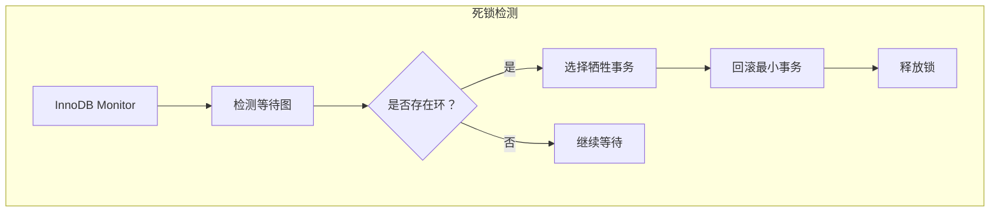
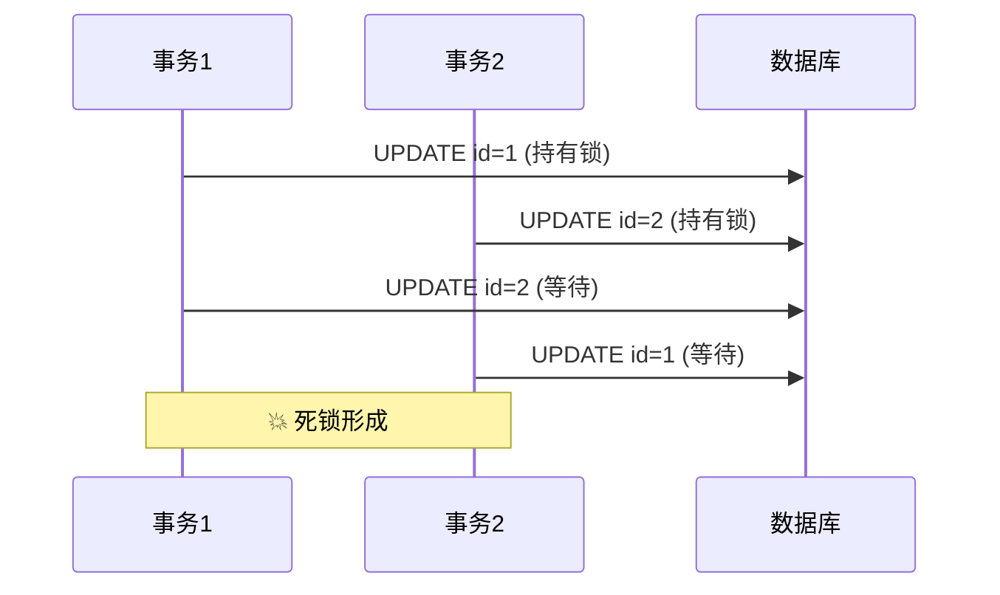
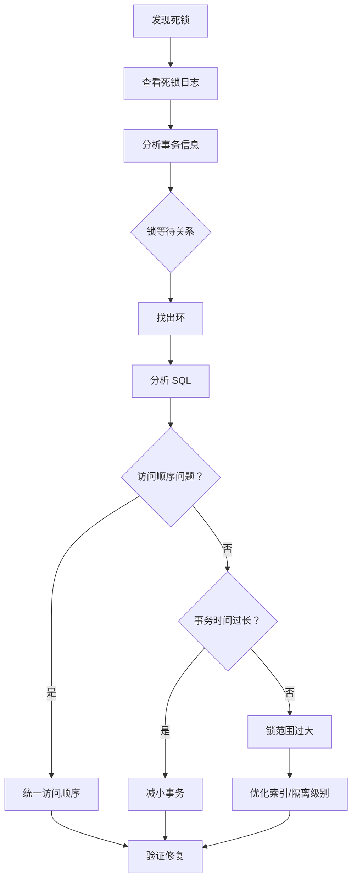

# 数据库死锁案例

> **目标级别**：P6
> **面试频率**：🟡 中频
> **面试官最关心的 3 个问题**：
> 1. MySQL 是如何检测死锁的？
> 2. 如何排查数据库死锁？
> 3. 如何避免数据库死锁？

---

面试官问：「线上报了死锁错误，怎么排查？」你说「重启事务」——然后面试官追问「死锁是怎么发生的？怎么从根本上避免？」

数据库死锁是 MySQL 中常见的问题。与 Java 死锁不同，MySQL 有自己的死锁检测机制。

## 一、MySQL 死锁检测机制



InnoDB 使用**等待图**（Wait-For Graph）算法检测死锁。当检测到环时，InnoDB 会回滚** undo log 记录最小的事务**。

## 二、常见死锁场景

### 2.1 场景一：不同事务访问顺序不一致

```sql
-- 事务 1
BEGIN;
UPDATE account SET balance = balance - 100 WHERE id = 1;  -- 锁定 id=1
UPDATE account SET balance = balance + 100 WHERE id = 2;  -- 等待 id=2

-- 事务 2（在事务 1 执行前执行）
BEGIN;
UPDATE account SET balance = balance - 100 WHERE id = 2;  -- 锁定 id=2
UPDATE account SET balance = balance + 100 WHERE id = 1;  -- 等待 id=1
-- 💥 死锁！
```



### 2.2 场景二：索引导致的锁范围扩大

```sql
-- 表结构
CREATE TABLE orders (
    id BIGINT PRIMARY KEY,
    user_id BIGINT,
    status INT,
    INDEX idx_status (status)
);

-- 事务 1：更新 status=1 的订单
BEGIN;
UPDATE orders SET status = 2 WHERE status = 1;
-- 会锁定所有 status=1 的记录，加上索引范围锁

-- 事务 2：更新 id=100 的订单
BEGIN;
UPDATE orders SET status = 3 WHERE id = 100;
-- 假设 id=100 的记录 status=1，会被事务 1 锁定
-- 💥 死锁！
```

### 2.3 场景三：gap lock 导致的死锁

```sql
-- 事务 1：插入记录
BEGIN;
INSERT INTO orders (id, user_id) VALUES (100, 1);
-- 锁定区间 (prev, 100)

-- 事务 2：插入相近记录
BEGIN;
INSERT INTO orders (id, user_id) VALUES (101, 1);
-- 锁定区间 (100, 101)

-- 事务 1：删除记录
DELETE FROM orders WHERE id = 100;
-- 等待事务 2 释放区间锁

-- 事务 2：删除记录
DELETE FROM orders WHERE id = 101;
-- 等待事务 1 释放区间锁
-- 💥 死锁！
```

## 三、死锁排查步骤

### 3.1 第一步：查看死锁日志

```sql
-- 查看最近死锁信息
SHOW ENGINE INNODB STATUS;

-- 输出示例
------------------------
LATEST DETECTED DEADLOCK
------------------------
*** (1) TRANSACTION:
TRANSACTION 12345, ACTIVE 10 sec inserting
mysql tables in use 1, locked 1
LOCK WAIT 2 lock struct(s), heap size 1136, 1 row lock(s)
---sql语句---

*** (2) TRANSACTION:
TRANSACTION 12346, ACTIVE 5 sec inserting
mysql tables in use 1, locked 1
LOCK WAIT 2 lock struct(s), heap size 1136, 1 row lock(s)
---sql语句---

*** WE ROLL BACK TRANSACTION (12345)
```

### 3.2 第二步：分析锁等待

```sql
-- 查看当前锁
SELECT 
    ENGINE,
    LOCK_TYPE,
    LOCK_TABLE,
    LOCK_INDEX,
    LOCK_SPACE,
    LOCK_PAGE,
    LOCK_REC,
    LOCK_DATA
FROM information_schema.INNODB_LOCKS;

-- 查看锁等待
SELECT 
    REQUESTING_ENGINE_LOCK_ID,
    REQUESTING_ENGINE_TRANSACTION_ID,
    BLOCKING_ENGINE_LOCK_ID,
    BLOCKING_ENGINE_TRANSACTION_ID
FROM information_schema.INNODB_LOCK_WAITS;

-- 查看事务详情
SELECT 
    trx_id,
    trx_state,
    trx_started,
    trx_requestED_LOCK_ID,
    trx_weight,
    trx_mysql_THREAD_ID,
    trx_query
FROM information_schema.INNODB_TRX;
```

### 3.3 第三步：分析 SQL

```sql
-- 查看具体 SQL
SHOW FULL PROCESSLIST;

-- 或者
SELECT * FROM performance_schema.events_statements_current 
WHERE THREAD_ID IN (
    SELECT THREAD_ID FROM performance_schema.threads 
    WHERE PROCESSLIST_ID = <thread_id>
);
```

## 四、解决方案

### 4.1 方案一：统一访问顺序

```sql
-- ✅ 所有事务按相同顺序访问资源
-- 始终先访问 id 小的记录

-- 事务 1
BEGIN;
SELECT * FROM account WHERE id = 1 FOR UPDATE;
SELECT * FROM account WHERE id = 2 FOR UPDATE;
COMMIT;

-- 事务 2
BEGIN;
SELECT * FROM account WHERE id = 1 FOR UPDATE;  -- ✅ 与事务1一致
SELECT * FROM account WHERE id = 2 FOR UPDATE;
COMMIT;
```

### 4.2 方案二：减少事务时间

```sql
-- ⚠️ 错误示例：大事务
BEGIN;
SELECT * FROM large_table;  -- 全表扫描
-- 大量操作
COMMIT;  -- 长时间持有锁

-- ✅ 正确示例：小事务
BEGIN;
UPDATE table SET col = ? WHERE id = ?;
COMMIT;  -- 快速释放锁
```

### 4.3 方案三：使用低隔离级别

```sql
-- 使用 READ COMMITTED 减少锁范围
SET SESSION TRANSACTION ISOLATION LEVEL READ COMMITTED;

-- 或在应用层设置
connection.setTransactionIsolation(Connection.TRANSACTION_READ_COMMITTED);
```

### 4.4 方案四：添加适当的索引

```sql
-- 确保查询使用索引，避免全表扫描导致的锁扩大
CREATE INDEX idx_user_status ON orders(user_id, status);

-- 验证索引
EXPLAIN UPDATE orders SET status = 2 WHERE status = 1;
-- type: index (全索引扫描，会锁定更多记录)
-- type: range (索引范围查询，锁范围更精确)
```

## 五、排查流程图



## 六、高频面试题

### 🔴 第一层：MySQL 如何检测死锁？

**问题**：MySQL 是如何检测死锁的？

**参考答案**：

- InnoDB 使用**等待图**（Wait-For Graph）算法
- 维护一个锁的事务链表和等待链表
- 定期检测是否存在环形等待
- 检测到死锁后，回滚 **undo log 最小的事务**

---

### 🔴 第二层：如何避免数据库死锁？

**问题**：有什么方法可以从根本上避免死锁？

**参考答案**：

| 方法 | 说明 |
|------|------|
| **统一访问顺序** | 所有事务按相同顺序访问记录 |
| **减小事务** | 减少事务持锁时间 |
| **合理索引** | 确保查询走索引，避免锁扩大 |
| **降低隔离级别** | 使用 READ COMMITTED |
| **避免大事务** | 拆分批量操作 |
| **设置锁超时** | `innodb_lock_wait_timeout` |

---

### 🟡 第三层：死锁和锁等待有什么区别？

**问题**：死锁和普通的锁等待有什么区别？

**参考答案**：

| 对比维度 | 锁等待 | 死锁 |
|----------|--------|------|
| **等待关系** | 单向等待 | 环形等待 |
| **处理方式** | 等待锁释放 | 检测后回滚 |
| **超时处理** | 超过 innodb_lock_wait_timeout 报错 | 立即检测并处理 |
| **影响范围** | 只影响等待的事务 | 影响多个事务 |

---

## 七、常见陷阱

### ⚠️ 陷阱 1：认为死锁会自动解决

死锁确实会自动解决（回滚一个事务），但业务可能因此失败。

### ⚠️ 陷阱 2：忽略 gap lock

间隙锁是 InnoDB 在 REPEATABLE READ 下的默认行为。

### ⚠️ 陷阱 3：只关注 UPDATE 锁

INSERT、DELETE 也会产生锁，可能导致死锁。

### ⚠️ 陷阱 4：innodb_lock_wait_timeout 设置过长

超时时间过长会导致长时间阻塞，影响用户体验。

---

## 八、加分回答

### 💡 使用监控提前发现

```sql
-- 设置死锁告警
INSTALL PLUGIN sonic_slave_awareness SONAME 'sonic_slave_awareness.so';

-- 或者在应用层监控
try {
    // 业务操作
} catch (DeadlockFoundWhenPickingLockException e) {
    // 死锁异常，重试逻辑
    retry();
}
```

### 💡 死锁重试机制

```java
@Retryable(maxAttempts = 3, backoff = @Backoff(delay = 100))
public void transfer(Long fromId, Long toId, BigDecimal amount) {
    // 转账操作
}
```

---

## 九、对比总结表

| 死锁类型 | 原因 | 解决方案 |
|----------|------|----------|
| **顺序不一致** | 不同事务访问顺序不同 | 统一访问顺序 |
| **索引锁扩大** | 查询未走索引或索引不当 | 优化索引 |
| **gap lock** | 范围查询/插入操作 | 降低隔离级别 |
| **外键锁** | 级联更新/删除 | 使用延迟删除 |

---

## 十、扩展思考

为什么 InnoDB 选择回滚 undo log 最小的事务？

> **答案**：
>
> 1. **代价最小**：回滚的事务越少，损失越小
> 2. **undo log 记录**：记录了事务修改的数据量
> 3. **性能考虑**：回滚大事务代价更高
> 4. **公平性**：小事务通常是临时性的，大事务可能是核心业务
