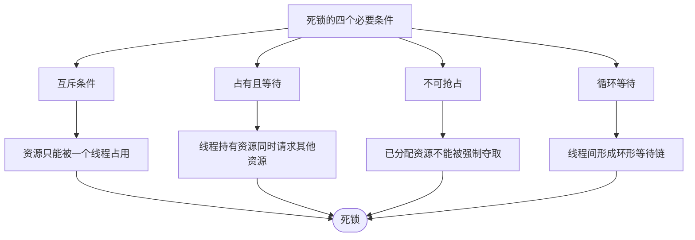
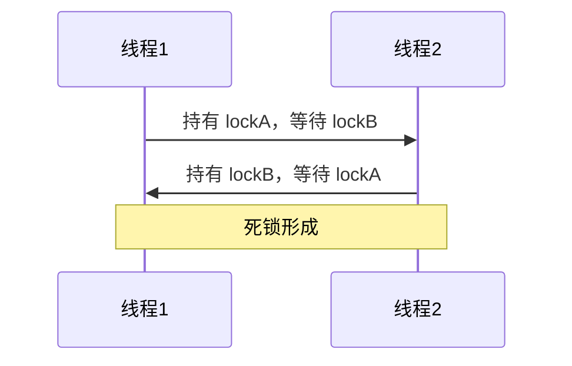
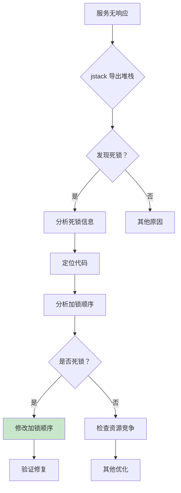
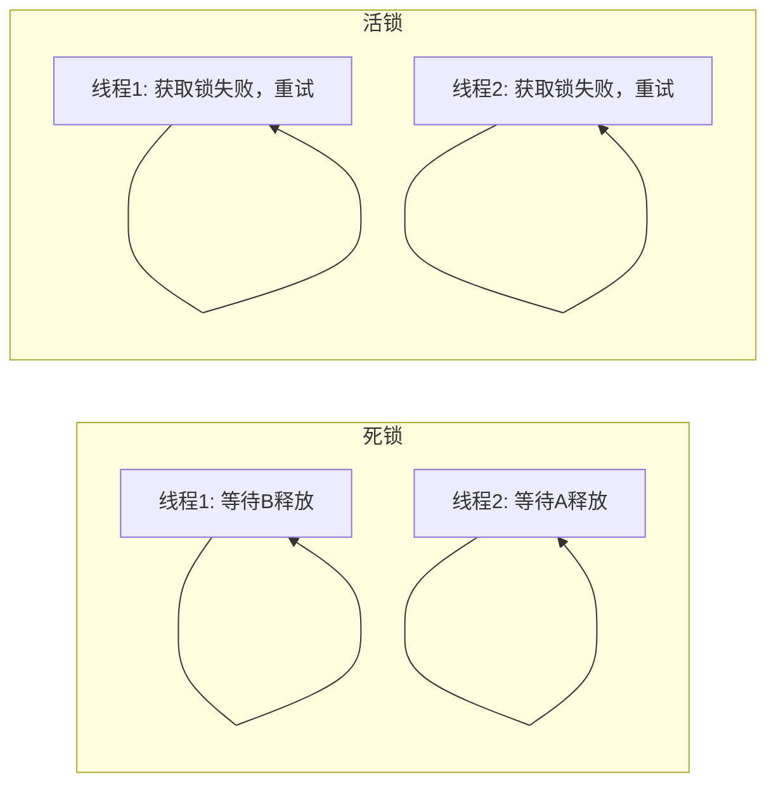

# 死锁排查与解决

> **目标级别**：P6
> **面试频率**：🔴 高频
> **面试官最关心的 3 个问题**：
> 1. 什么是死锁？如何排查？
> 2. 如何避免死锁？
> 3. 活锁和死锁有什么区别？

---

面试官问：「线上服务突然卡死了，怎么排查？」你说「重启」——面试官追问「重启后还会发生，怎么定位根因？」你沉默了。

死锁是 Java 服务最严重的问题之一。它不像 CPU 高或内存泄漏那样有明显的性能衰退，而是直接让服务完全卡死，无法响应任何请求。

## 一、死锁的四个必要条件



| 条件 | 说明 | 是否可以打破 |
|------|------|--------------|
| **互斥** | 资源只能被一个线程占用 | ❌ 不能打破 |
| **占有且等待** | 持有资源同时等待其他资源 | ✅ 可以打破 |
| **不可抢占** | 已分配资源不能被强制夺取 | ✅ 可以打破 |
| **循环等待** | 形成资源环形等待链 | ✅ 可以打破 |

## 二、常见死锁场景

### 2.1 场景一：数据库死锁

```java
// ⚠️ 错误示例：不同顺序加锁导致死锁
@Service
public class TransferService {
    
    @Transactional
    public void transfer(Long fromId, Long toId, BigDecimal amount) {
        // 用户 A 转给用户 B
        if (fromId < toId) {
            lock(fromId);
            lock(toId);
        } else {
            lock(toId);
            lock(fromId);  // ⚠️ 可能导致死锁
        }
        
        try {
            deduct(fromId, amount);
            add(toId, amount);
        } finally {
            unlock(toId);
            unlock(fromId);
        }
    }
}
```

```sql
-- 同样问题发生在数据库层面
-- 事务 1: UPDATE account SET balance = balance - 100 WHERE id = 1
--         UPDATE account SET balance = balance + 100 WHERE id = 2
-- 事务 2: UPDATE account SET balance = balance - 100 WHERE id = 2
--         UPDATE account SET balance = balance + 100 WHERE id = 1
-- 如果两个事务同时执行，可能导致死锁
```

### 2.2 场景二：synchronized 嵌套

```java
// ⚠️ 错误示例：锁嵌套导致死锁
public class LockNested {
    private final Object lockA = new Object();
    private final Object lockB = new Object();
    
    public void methodA() {
        synchronized (lockA) {
            System.out.println("methodA: 持有 lockA");
            try {
                Thread.sleep(100);
            } catch (InterruptedException e) {}
            synchronized (lockB) {
                // ⚠️ 如果另一个线程持有 lockB 并等待 lockA
                System.out.println("methodA: 持有 lockB");
            }
        }
    }
    
    public void methodB() {
        synchronized (lockB) {
            System.out.println("methodB: 持有 lockB");
            try {
                Thread.sleep(100);
            } catch (InterruptedException e) {}
            synchronized (lockA) {
                // ⚠️ 如果另一个线程持有 lockA 并等待 lockB
                System.out.println("methodB: 持有 lockA");
            }
        }
    }
}
```

### 2.3 场景三：线程池死锁

```java
// ⚠️ 错误示例：任务嵌套导致死锁
public class ThreadPoolDeadlock {
    private static ExecutorService executor = Executors.newFixedThreadPool(2);
    
    public static void main(String[] args) {
        Future<?> future = executor.submit(() -> {
            System.out.println("任务1 开始");
            try {
                // 任务1 等待任务2 完成
                Future<?> inner = executor.submit(() -> {
                    System.out.println("任务2 执行");
                    return null;
                });
                inner.get();  // ⚠️ 等待任务2，但线程池已满
            } catch (Exception e) {}
            System.out.println("任务1 结束");
        });
    }
}
// 单线程池 + 任务嵌套 = 死锁
```

## 三、死锁排查步骤

### 3.1 第一步：发现问题

```bash
# 现象：服务完全无响应，但进程存活

# 1. 查看进程状态
ps -ef | grep java
# PID   TT  STAT      TIME COMMAND
# 12345 ?    R+       0:00 java Application  <-- 进程 Running 但无响应

# 2. 查看线程数
ps -eLf | grep java | wc -l
```

### 3.2 第二步：导出线程堆栈

```bash
# 导出线程堆栈
jstack <pid> > /tmp/thread.log

# 查看输出
# 如果发现 "Found 1 deadlock" 说明确实存在死锁
```

### 3.3 第三步：分析死锁信息

```bash
# jstack 输出中的死锁信息
Found one Java-level deadlock:
=============================
"Thread-1":
  waiting for monitor entry [0x00000000d5e3f000]:
  java.lang.Object@7d9e6a2f
  - locked by "Thread-0"

"Thread-0":
  waiting for monitor entry [0x00000000d5e3f010]:
  java.lang.Object@7d9e6a3f
  - locked by "Thread-1"

Found 1 Java-level deadlock,拴死锁线程
```



### 3.4 第四步：定位代码

```java
// 从堆栈中找到具体代码
"Thread-1" #12345 prio=5 os_prio=0 tid=0x00007f8a142a8000
   java.lang.Thread.State: BLOCKED
    at com.example.service.LockNested.methodB(LockNested.java:45)
    - waiting to lock 0x00000000d5e3f010 which is held by Thread-0
    
    at com.example.service.LockNested.main(LockNested.java:60)
```

## 四、解决方案

### 4.1 方案一：固定加锁顺序

```java
// ✅ 正确示例：统一加锁顺序
public class TransferService {
    
    public void transfer(Long fromId, Long toId, BigDecimal amount) {
        // 始终按 ID 大小顺序加锁
        Long first = fromId < toId ? fromId : toId;
        Long second = fromId < toId ? toId : fromId;
        
        lock(first);
        lock(second);
        
        try {
            deduct(fromId, amount);
            add(toId, amount);
        } finally {
            unlock(second);
            unlock(first);
        }
    }
}
```

### 4.2 方案二：使用 ReentrantLock

```java
// ✅ 正确示例：使用 tryLock 避免死锁
public class LockExample {
    private final ReentrantLock lockA = new ReentrantLock();
    private final ReentrantLock lockB = new ReentrantLock();
    
    public void transfer(Long fromId, Long toId, BigDecimal amount) {
        while (true) {
            // 尝试获取两个锁
            if (lockA.tryLock(1, TimeUnit.SECONDS)) {
                try {
                    if (lockB.tryLock(1, TimeUnit.SECONDS)) {
                        try {
                            // 执行转账
                            doTransfer(fromId, toId, amount);
                            return;
                        } finally {
                            lockB.unlock();
                        }
                    }
                } finally {
                    lockA.unlock();
                }
            }
            // 获取失败，休眠后重试
            Thread.sleep(100);
        }
    }
}
```

### 4.3 方案三：避免嵌套锁

```java
// ✅ 正确示例：提取方法避免嵌套
public class LockExample {
    private final Object lockA = new Object();
    
    // 方法1：只持有 lockA
    public void methodA() {
        synchronized (lockA) {
            doSomethingA();
        }
    }
    
    // 方法2：只持有 lockB
    public void methodB() {
        synchronized (lockB) {
            doSomethingB();
        }
    }
    
    // 方法3：调用其他方法
    public void methodC() {
        synchronized (lockA) {
            methodB();  // ⚠️ 这里不释放 lockA
        }
    }
}

// ✅ 正确示例：重构后
public class LockExample {
    public void methodC() {
        synchronized (lockA) {
            doSomethingA();  // 直接执行而不是调用
        }
        doSomethingB();  // 不需要锁，或者用不同的锁
    }
}
```

### 4.4 方案四：数据库死锁解决

```sql
-- 方案1：按固定顺序访问
-- 始终先访问 ID 小的表
BEGIN;
SELECT * FROM account WHERE id = 1 FOR UPDATE;
SELECT * FROM account WHERE id = 2 FOR UPDATE;
UPDATE account SET balance = balance - 100 WHERE id = 1;
UPDATE account SET balance = balance + 100 WHERE id = 2;
COMMIT;

-- 方案2：设置锁等待超时
SET innodb_lock_wait_timeout = 5;

-- 方案3：减少事务持锁时间
-- 不要在事务中做复杂计算
-- 批量操作改为逐条
```

## 五、排查流程图



## 六、高频面试题

### 🔴 第一层：如何排查死锁？

**问题**：线上服务死锁了，如何排查？

**参考答案**：

```bash
# 1. 导出线程堆栈
jstack <pid> > /tmp/thread.log

# 2. 搜索死锁信息
grep -A 30 'deadlock' /tmp/thread.log

# 3. 分析死锁线程和持有的锁
# 4. 定位到具体代码行
```

---

### 🔴 第二层：如何避免死锁？

**问题**：有什么方法可以避免死锁？

**参考答案**：

| 方法 | 说明 |
|------|------|
| **固定加锁顺序** | 所有线程按相同顺序获取锁 |
| **tryLock 超时** | 使用 ReentrantLock.tryLock()，超时则放弃 |
| **减少锁粒度** | 减小锁保护的范围 |
| **避免嵌套锁** | 不要在持有一个锁时获取另一个锁 |
| **开放调用** | 将锁外的方法调用改为方法内部调用 |
| **设置锁超时** | 数据库设置 `innodb_lock_wait_timeout` |

---

### 🟡 第三层：活锁和死锁的区别？

**问题**：活锁和死锁有什么区别？

**参考答案**：

| 对比维度 | 死锁 | 活锁 |
|----------|------|------|
| **状态** | 线程阻塞，无法继续 | 线程活跃，但无法前进 |
| **原因** | 互相等待对方释放锁 | 不断重试但总是失败 |
| **表现** | 完全无响应 | 持续占用 CPU |
| **解决** | 打破等待链 | 引入随机性或后退 |



---

## 七、常见陷阱

### ⚠️ 陷阱 1：认为加锁顺序不重要

只要有多个锁，就可能死锁。必须统一加锁顺序。

### ⚠️ 陷阱 2：在 finally 中 unlock 顺序错误

如果 unlock 顺序与 lock 顺序相反，可能导致其他问题。

### ⚠️ 陷阱 3：忽略数据库锁

Java 代码没有死锁，但 SQL 执行可能产生数据库死锁。

### ⚠️ 陷阱 4：忽略分布式锁

分布式环境下，本地没有死锁，但分布式锁可能出现死锁。

---

## 八、加分回答

### 💡 使用 Arthas 监控锁

```bash
# 1. 查看线程锁信息
thread -b

# 2. 查看锁竞争
jstack -l <pid> | grep -A 10 'Waiting'

# 3. 监控方法加锁
monitor -c 5 com.example.Service transfer
```

### 💡 使用 Hprof 分析死锁

```bash
# 生成 Hprof 文件
jmap -dump:format=b,file=/tmp/java.hprof <pid>

# 使用 MAT 打开
# 分析线程状态和锁持有情况
```

---

## 九、扩展思考

如果死锁发生在分布式环境下，如何解决？

> **答案**：
>
> 1. **使用分布式锁**：Redis/ZooKeeper 分布式锁
> 2. **锁超时机制**：设置合理的锁超时，避免永久等待
> 3. **幂等设计**：无论执行多少次结果一致
> 4. **重试机制**：死锁时自动重试
> 5. **设计审查**：分布式事务设计时充分考虑并发场景
