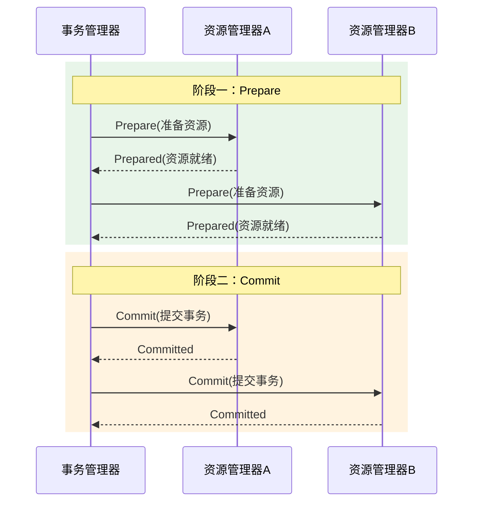
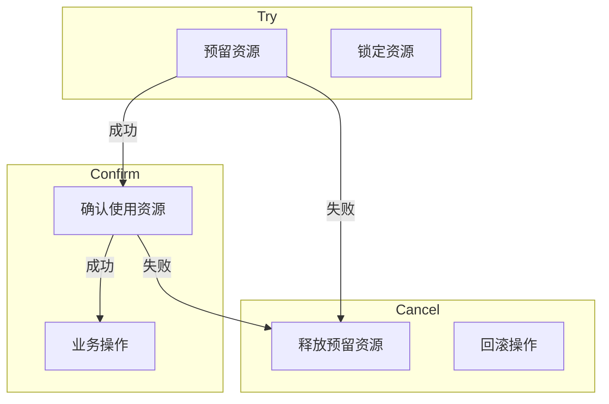

# 分布式事务场景

> **目标级别**：P6/P7
> **面试频率**：🔴 高频
> **面试官最关心的 3 个问题**：
> 1. 分布式事务有哪些解决方案？
> 2. 2PC、3PC、TCC 有什么区别？
> 3. 如何选择分布式事务方案？

---

面试官问：「你们用分布式事务吗？怎么保证数据一致性的？」你说「用 Seata」——然后面试官追问「Seata 用的什么模式？AT 还是 TCC？有什么区别？」

分布式事务是微服务架构中最核心的问题之一。不同场景需要选择不同的解决方案，没有银弹。

## 一、分布式事务问题

```mermaid
flowchart LR
    subgraph 服务 A
        A1[用户服务]
        A2[本地事务]
    end
    
    subgraph 服务 B
        B1[订单服务]
        B2[本地事务]
    end
    
    subgraph 服务 C
        C1[库存服务]
        C2[本地事务]
    end
    
    A2 -->|下单| B2
    B2 -->|扣库存| C2
    
    note over A2,C2: 网络问题导致部分成功部分失败
```

分布式事务的根源：**每个服务只能保证自己的本地事务，无法感知其他服务的事务状态**。

## 二、解决方案对比

| 方案 | 一致性 | 性能 | 复杂度 | 适用场景 |
|------|--------|------|--------|----------|
| **2PC** | 强一致 | ⭐⭐ | ⭐⭐ | 数据库层面 |
| **3PC** | 强一致 | ⭐⭐ | ⭐⭐⭐ | 减少阻塞 |
| **TCC** | 最终一致 | ⭐⭐⭐⭐ | ⭐⭐⭐⭐ | 高性能需求 |
| **Saga** | 最终一致 | ⭐⭐⭐⭐ | ⭐⭐⭐ | 长事务 |
| **本地消息表** | 最终一致 | ⭐⭐⭐ | ⭐⭐ | 低成本方案 |
| **MQ 事务消息** | 最终一致 | ⭐⭐⭐⭐ | ⭐⭐⭐ | 异步解耦 |

## 三、2PC（两阶段提交）

### 3.1 工作流程



### 3.2 实现原理

```java
// Seata AT 模式（基于 2PC）
@GlobalTransactional
public void createOrder(OrderDTO order) {
    // 1. 扣减库存（本地事务）
    inventoryService.deduct(order.getProductId(), order.getQuantity());
    
    // 2. 创建订单（本地事务）
    orderService.create(order);
    
    // 3. 扣减余额（本地事务）
    accountService.deduct(order.getUserId(), order.getAmount());
}
```

### 3.3 2PC 的问题

| 问题 | 说明 |
|------|------|
| **同步阻塞** | Prepare 阶段所有资源锁定 |
| **单点故障** | 事务管理器挂掉导致阻塞 |
| **数据不一致** | 部分 commit 失败 |

## 四、TCC（Try-Confirm-Cancel）

### 4.1 工作流程



### 4.2 TCC 实现

```java
// TCC 接口定义
public interface TccAction {
    
    // 预留资源
    @TwoPhaseBusinessAction(
        name = "deductInventory",
        commitMethod = "confirm",
        rollbackMethod = "cancel"
    )
    boolean try(
        @BusinessActionContextParameter(paramName = "productId") Long productId,
        @BusinessActionContextParameter(paramName = "quantity") Integer quantity
    );
    
    // 确认执行
    boolean confirm(BusinessActionContext context);
    
    // 回滚执行
    boolean cancel(BusinessActionContext context);
}

// TCC 实现
@Service
public class InventoryTccAction implements TccAction {
    
    @Override
    @Transactional
    public boolean try(Long productId, Integer quantity) {
        // 1. 检查库存是否足够
        Inventory inv = inventoryDao.findByProductId(productId);
        if (inv.getStock() `<` quantity) {
            return false;  // 库存不足，try 失败
        }
        
        // 2. 冻结库存（预留）
        inventoryDao.freezeStock(productId, quantity);
        return true;
    }
    
    @Override
    public boolean confirm(BusinessActionContext context) {
        // 真正扣减库存
        Long productId = context.getActionContext("productId");
        Integer quantity = context.getActionContext("quantity");
        inventoryDao.deductStock(productId, quantity);
        return true;
    }
    
    @Override
    public boolean cancel(BusinessActionContext context) {
        // 释放冻结的库存
        Long productId = context.getActionContext("productId");
        Integer quantity = context.getActionContext("quantity");
        inventoryDao.unfreezeStock(productId, quantity);
        return true;
    }
}
```

### 4.3 TCC 的问题

| 问题 | 说明 | 解决方案 |
|------|------|----------|
| **空回滚** | Try 未执行但执行了 Cancel | 记录状态，检查 |
| **幂等性** | Confirm/Cancel 多次执行 | 幂等控制 |
| **悬挂** | Cancel 在 Confirm 之后执行 | 状态机控制 |

## 五、Saga 模式

```java
// Saga 编排：定义补偿事务
@SagaStart
public void createOrder(OrderDTO order) {
    // 调用库存服务
    inventoryService.deduct(order.getProductId(), order.getQuantity());
}

@Compensable(compensateMethod = "cancelInventory")
public void cancelInventory(Long productId, Integer quantity) {
    // 补偿操作
    inventoryService.increaseStock(productId, quantity);
}
```

## 六、本地消息表

```java
// 1. 业务表和消息表在同一个本地事务
@Transactional
public void createOrder(Order order) {
    // 插入订单
    orderDao.insert(order);
    
    // 插入消息表（在同一事务中）
    messageDao.insert(new Message(order));
    
    // 消息状态：PENDING
}

// 2. 定时任务扫描消息表，发送消息
@Component
public class MessageSender {
    
    @Scheduled(fixedDelay = 1000)
    public void sendMessages() {
        List<Message> messages = messageDao.findPending(100);
        for (Message msg : messages) {
            try {
                // 发送消息
                mqProducer.send(msg.getTopic(), msg.getContent());
                
                // 更新状态
                messageDao.updateStatus(msg.getId(), MessageStatus.SENT);
            } catch (Exception e) {
                // 失败重试
                messageDao.incrementRetry(msg.getId());
            }
        }
    }
}

// 3. 消费者确认处理
@RabbitListener
public void handleStockDeduct(Message msg) {
    try {
        inventoryService.deduct(msg.getProductId(), msg.getQuantity());
        // 处理成功
    } catch (Exception e) {
        // 处理失败，消息重新入队
        throw e;
    }
}
```

## 七、MQ 事务消息

```java
// RocketMQ 事务消息
@Service
public class OrderService {
    
    @Autowired
    private RocketMQTemplate rocketMQTemplate;
    
    public void createOrder(OrderDTO order) {
        // 1. 发送半消息
        rocketMQTemplate.sendMessageInTransaction(
            "order-topic",
            MessageBuilder.withPayload(order).build(),
            order  // 事务状态回查参数
        );
    }
}

// 事务监听器
@RocketMQTransactionListener
public class OrderTransactionListener implements RocketMQLocalTransactionListener {
    
    @Override
    public RocketMQLocalTransactionState executeLocalTransaction(Message msg, Object arg) {
        try {
            // 执行业务操作
            OrderDTO order = (OrderDTO) arg;
            orderDao.insert(order);
            
            // 提交本地事务
            return RocketMQLocalTransactionState.COMMIT;
        } catch (Exception e) {
            // 回滚
            return RocketMQLocalTransactionState.ROLLBACK;
        }
    }
    
    @Override
    public RocketMQLocalTransactionState checkLocalTransaction(Message msg) {
        // 事务状态回查
        String orderId = msg.getHeaders().get("orderId");
        Order order = orderDao.findById(orderId);
        
        if (order != null) {
            return RocketMQLocalTransactionState.COMMIT;
        }
        return RocketMQLocalTransactionState.UNKNOWN;
    }
}
```

## 八、高频面试题

### 🔴 第一层：分布式事务有哪些解决方案？

**问题**：分布式事务的常见解决方案有哪些？

**参考答案**：

| 方案 | 原理 | 特点 |
|------|------|------|
| **2PC** | 两阶段提交 | 强一致，但有阻塞 |
| **TCC** | Try-Confirm-Cancel | 最终一致，性能好 |
| **Saga** | 补偿事务 | 最终一致，适合长事务 |
| **本地消息表** | 本地事务 + 消息 | 最终一致，简单 |
| **MQ 事务消息** | 半消息 + 回查 | 最终一致，可靠 |

---

### 🔴 第二层：2PC 和 TCC 有什么区别？

**问题**：2PC 和 TCC 的区别是什么？

**参考答案**：

| 对比维度 | 2PC | TCC |
|----------|-----|-----|
| **阶段** | Prepare + Commit | Try + Confirm + Cancel |
| **资源锁定** | 数据库锁定 | 业务锁定（冻结） |
| **性能** | 较差（阻塞） | 较好（异步） |
| **侵入性** | 无（数据库支持） | 高（业务改造） |
| **数据一致性** | 强一致 | 最终一致 |

---

### 🟡 第三层：如何选择分布式事务方案？

**问题**：什么场景下应该选择哪种方案？

**参考答案**：

| 场景 | 推荐方案 |
|------|----------|
| **强一致性要求** | 2PC / Seata AT |
| **高性能要求** | TCC / RocketMQ |
| **长事务** | Saga |
| **低成本快速实现** | 本地消息表 |
| **跨服务调用** | TCC / Saga |

---

## 九、常见陷阱

### ⚠️ 陷阱 1：所有场景都用分布式事务

不是所有场景都需要强一致，能用最终一致就不要用强一致。

### ⚠️ 陷阱 2：TCC 预留资源设置过长

Try 阶段预留资源时间过长会影响系统吞吐量。

### ⚠️ 陷阱 3：忽略幂等性

Confirm/Cancel 可能被重复调用，必须保证幂等。

### ⚠️ 陷阱 4：事务边界划分不当

大事务拆分不合理会导致性能问题。

---

## 十、加分回答

### 💡 Seata AT 模式原理

```sql
-- Seata AT 模式会自动生成 undo_log
CREATE TABLE `undo_log` (
  `id` bigint NOT NULL AUTO_INCREMENT,
  `branch_id` bigint NOT NULL,
  `xid` varchar(100) NOT NULL,
  `context` varchar(128) NOT NULL,
  `rollback_info` longblob NOT NULL,
  `log_status` int NOT NULL,
  `log_created` datetime NOT NULL,
  `log_modified` datetime NOT NULL,
  PRIMARY KEY (`id`)
);
```

### 💡 分布式事务最佳实践

1. **尽量避免分布式事务**：通过业务设计减少跨库调用
2. **优先最终一致**：能用 MQ 异步解耦就不要强一致
3. **做好幂等**：所有操作必须保证幂等
4. **监控告警**：事务执行时间监控、失败告警

---

## 十一、扩展思考

为什么 Redis Cluster 不支持跨节点的事务？

> **答案**：
>
> 1. **Redis 事务使用 WATCH** 监视键，只支持单节点
> 2. **MULTI/EXEC** 只能在单节点执行
> 3. **分布式事务需要 Seata 等框架**
> 4. **如果需要跨节点一致性**，使用 Redisson 的 RedLock 或 Seata
