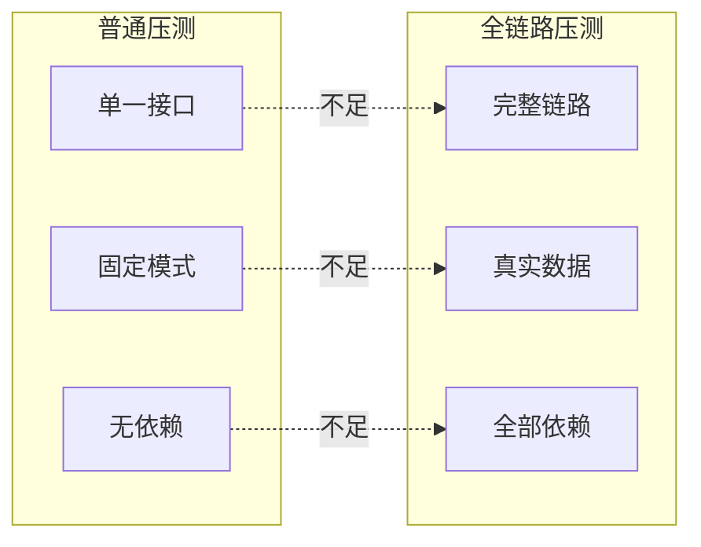
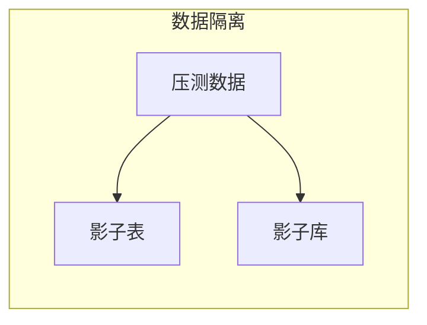
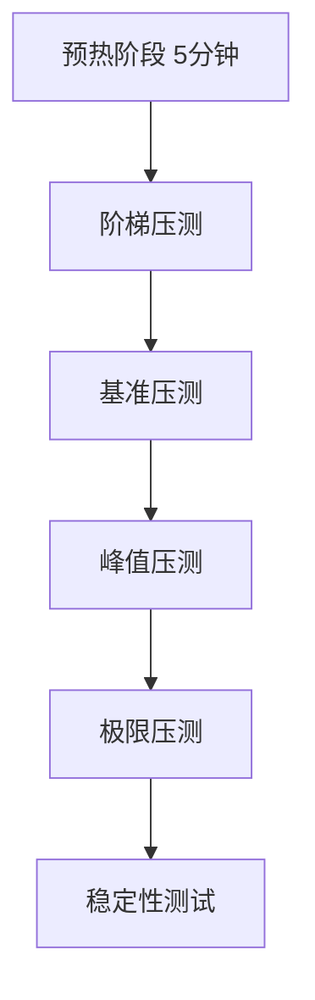

# 全链路压测设计

> **目标级别**：P7
> **面试频率**：🟢 低频
> **面试官最关心的 3 个问题**：
> 1. 什么是全链路压测？和普通压测有什么区别？
> 2. 全链路压测的关键技术是什么？
> 3. 如何设计压测方案？

---

面试官问：「双十一之前，你们做压测吗？怎么做的？」你说「用 JMeter 压单个接口」——然后面试官追问「单接口压测能反映真实场景吗？依赖链路怎么覆盖？」

全链路压测是大型互联网公司在双十一等大促前的必备工作，它能够真实模拟用户行为，发现系统的真实瓶颈。

## 一、全链路压测 vs 普通压测



| 对比维度 | 普通压测 | 全链路压测 |
|----------|----------|------------|
| **覆盖范围** | 单接口 | 完整链路 |
| **测试数据** | 测试数据 | 脱敏生产数据 |
| **依赖处理** | Mock | 真实调用 |
| **发现问题** | 局部瓶颈 | 系统瓶颈 |
| **成本** | 低 | 高 |

## 二、全链路压测的关键技术

### 2.1 流量染色

```java
// ✅ 压测流量标识
public class PressureTestHeader {
    public static final String HEADER = "X-PT-ID";
    public static final String VALUE = "pressure-test";
}

// Gateway 识别压测流量
@Component
public class PressureTestFilter implements GlobalFilter {
    
    @Override
    public Mono<Void> filter(ServerWebExchange exchange, GatewayFilterChain chain) {
        String ptId = exchange.getRequest().getHeaders().getFirst(PressureTestHeader.HEADER);
        
        if (PressureTestHeader.VALUE.equals(ptId)) {
            // 标记为压测流量
            exchange.getAttributes().put("isPressureTest", true);
        }
        
        return chain.filter(exchange);
    }
}
```

### 2.2 数据隔离



```java
// ✅ 影子表：压测数据写入 _pt 表
@Service
public class OrderService {
    
    @Autowired
    private JdbcTemplate jdbcTemplate;
    
    @Autowired
    private RequestContext requestContext;
    
    public void createOrder(Order order) {
        String tableName = isPressureTest() ? "orders_pt" : "orders";
        
        String sql = "INSERT INTO " + tableName + " (id, user_id, amount) VALUES (?, ?, ?)";
        jdbcTemplate.update(sql, order.getId(), order.getUserId(), order.getAmount());
    }
    
    private boolean isPressureTest() {
        return requestContext.getAttribute("isPressureTest", false);
    }
}

// ✅ 影子库：独立的压测数据库
@Configuration
public class DataSourceConfig {
    
    @Autowired
    private RequestContext requestContext;
    
    @Bean
    public DataSource dataSource() {
        if (isPressureTest()) {
            return createShadowDataSource();
        }
        return createNormalDataSource();
    }
}
```

### 2.3 中间件 Mock

```java
// ✅ MQ 压测：不真实发送
@ConditionalOnProperty(name = "pressure.test.enabled", havingValue = "true")
@Service
public class MockMQService implements MQService {
    
    @Override
    public void send(String topic, String message) {
        // 只记录日志，不真实发送
        log.info("Mock MQ send: topic={}, message={}", topic, message);
    }
}

// ✅ 第三方服务 Mock
@Configuration
public class ExternalServiceMockConfig {
    
    @Bean
    @ConditionalOnProperty(name = "pressure.test.enabled", havingValue = "true")
    public ExternalUserService mockExternalUserService() {
        return new MockExternalUserService();
    }
}

public class MockExternalUserService implements ExternalUserService {
    
    @Override
    public User getUser(Long id) {
        // 返回假数据
        return new User(id, "MockUser-" + id, "mock@example.com");
    }
}
```

### 2.4 服务路由

```java
// ✅ 服务路由：压测流量路由到压测实例
@Component
public class LoadBalancer implements ReactorServiceInstanceLoadBalancer {
    
    @Override
    public Mono<Response<ServiceInstance>> choose(Request request) {
        boolean isPressureTest = isPressureTest(request);
        
        return Flux.fromIterable(this.instances)
            .filter(instance -> {
                // 压测流量只选择压测实例
                if (isPressureTest) {
                    return "pt".equals(instance.getMetadata().get("type"));
                }
                // 正常流量不选择压测实例
                return !"pt".equals(instance.getMetadata().get("type"));
            })
            .next();
    }
}
```

## 三、压测方案设计

### 3.1 压测目标设定

```java
// ✅ 压测目标定义
public class PressureTestGoal {
    // TPS 目标
    private int targetTPS;
    
    // 响应时间目标（P99）
    private int targetP99Latency;
    
    // 成功率目标
    private double targetSuccessRate;
    
    // 最大并发用户数
    private int maxConcurrentUsers;
}
```

### 3.2 压测场景设计

```java
// ✅ 压测场景
public class PressureTestScenario {
    
    // 场景1：下单链路
    public Scenario createOrderScenario() {
        return Scenario.builder()
            .name("create-order")
            .weight(30)  // 占比 30%
            .steps(Arrays.asList(
                new Step("login", weight: 1),
                new Step("browse-products", weight: 5),
                new Step("add-to-cart", weight: 3),
                new Step("create-order", weight: 1),
                new Step("pay-order", weight: 1)
            ))
            .build();
    }
    
    // 场景2：查询链路
    public Scenario queryScenario() {
        return Scenario.builder()
            .name("query")
            .weight(70)
            .steps(Arrays.asList(
                new Step("login", weight: 1),
                new Step("browse-products", weight: 10),
                new Step("get-product-detail", weight: 5),
                new Step("get-order-list", weight: 2)
            ))
            .build();
    }
}
```

### 3.3 压测执行计划



## 四、压测监控

### 4.1 核心指标监控

```yaml
# Grafana 监控面板配置
panels:
  - title: "QPS"
    metrics:
      - sum(rate(http_requests_total{is_pt="true"}[1m]))
  
  - title: "P99 Latency"
    metrics:
      - histogram_quantile(0.99, 
          rate(http_request_duration_bucket{is_pt="true"}[5m]))
  
  - title: "Error Rate"
    metrics:
      - sum(rate(http_requests_failed_total{is_pt="true"}[5m])) 
        / sum(rate(http_requests_total{is_pt="true"}[5m]))
```

### 4.2 压测报告

```java
// ✅ 压测报告生成
@Service
public class PressureTestReportGenerator {
    
    public PressureTestReport generateReport(Date startTime, Date endTime) {
        PressureTestReport report = new PressureTestReport();
        
        // 汇总各项指标
        report.setTPS(calculateTPS(startTime, endTime));
        report.setP50Latency(queryP50());
        report.setP99Latency(queryP99());
        report.setP999Latency(queryP999());
        report.setSuccessRate(querySuccessRate());
        report.setMaxConcurrentUsers(queryMaxConcurrent());
        
        // 找出瓶颈点
        report.setBottlenecks(findBottlenecks());
        
        // 生成建议
        report.setRecommendations(generateRecommendations());
        
        return report;
    }
}
```

## 五、高频面试题

### 🔴 第一层：全链路压测和普通压测有什么区别？

**问题**：全链路压测是什么？和普通压测有什么不同？

**参考答案**：

- **普通压测**：单接口、单机压测，无法反映真实场景
- **全链路压测**：
  - 覆盖完整链路
  - 使用真实数据（脱敏）
  - 真实调用下游服务
  - 能发现系统性瓶颈

---

### 🟡 第二层：全链路压测的关键技术？

**问题**：全链路压测需要哪些技术支撑？

**参考答案**：

| 技术 | 说明 |
|------|------|
| **流量染色** | 标记压测流量 |
| **数据隔离** | 影子库/影子表 |
| **中间件 Mock** | MQ/外部服务 Mock |
| **服务路由** | 流量路由隔离 |
| **容量规划** | 确定压测目标 |

---

### 🟢 第三层：如何设计压测方案？

**问题**：完整的压测方案怎么设计？

**参考答案**：

1. **确定压测目标**：QPS、响应时间、成功率
2. **设计压测场景**：模拟真实用户行为
3. **准备压测数据**：脱敏、隔离
4. **执行压测**：分阶段递进
5. **监控分析**：定位瓶颈
6. **优化复压**：持续优化

---

## 六、常见陷阱

### ⚠️ 陷阱 1：压测数据不真实

使用假数据压测无法反映真实场景。

### ⚠️ 陷阱 2：忽略数据隔离

压测数据污染生产数据。

### ⚠️ 陷阱 3：压测时间过短

短时间压测无法发现稳定性问题。

### ⚠️ 陷阱 4：只看平均值

平均值可能掩盖问题，要看 P99/P999。

---

## 七、加分回答

### 💡 使用 JMeter + Prometheus

```yaml
# JMeter 配置
jmeter:
  plugins:
    - perfmon
    - backend-listener

# backend-listener 配置
<BackendListener>
  <glyptonite>
    <host>prometheus-server</host>
    <port>9090</port>
  </glyptonite>
</BackendListener>
```

### 💡 压测工具选型

| 工具 | 适用场景 | 特点 |
|------|----------|------|
| **JMeter** | HTTP 类压测 | 功能全，配置复杂 |
| **Gatling** | HTTP 类压测 | Scala 脚本，上手难 |
| **wrk** | HTTP 类压测 | 轻量，脚本简单 |
| **Locust** | HTTP/其他协议 | Python 脚本，分布式 |
| **k6** | HTTP 类压测 | JavaScript 脚本，云原生 |

---

## 八、扩展思考

如何确定系统的最大容量？

> **答案**：
>
> 1. **逐步加压**：从 10% 目标开始，逐步增加
> 2. **关注拐点**：QPS 不再增长，延迟急剧上升
> 3. **资源饱和**：CPU、内存、连接数接近上限
> 4. **错误率上升**：错误率开始上升
> 5. **安全边界**：最大容量的 80% 作为安全容量
