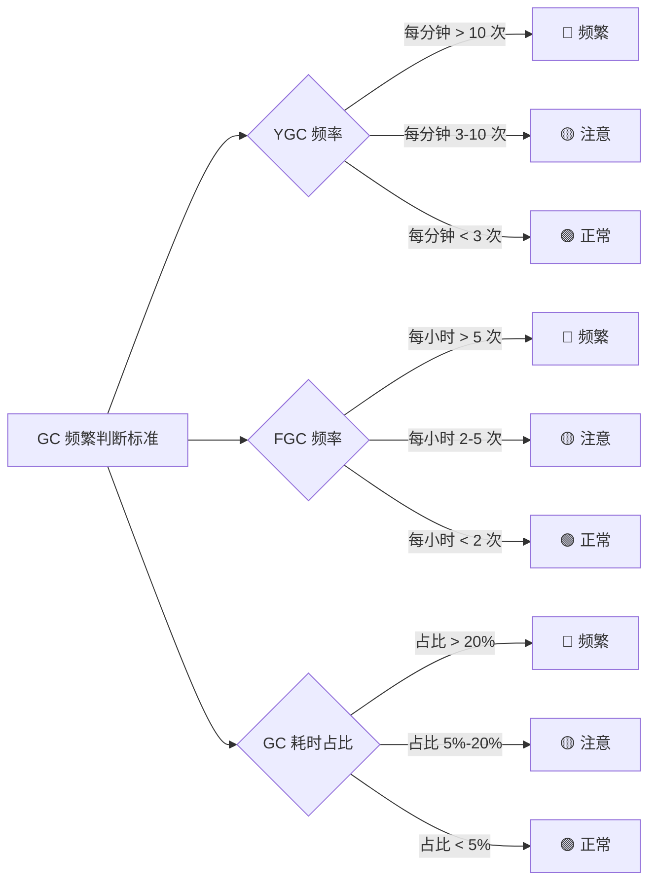
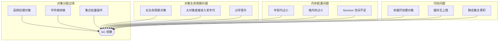
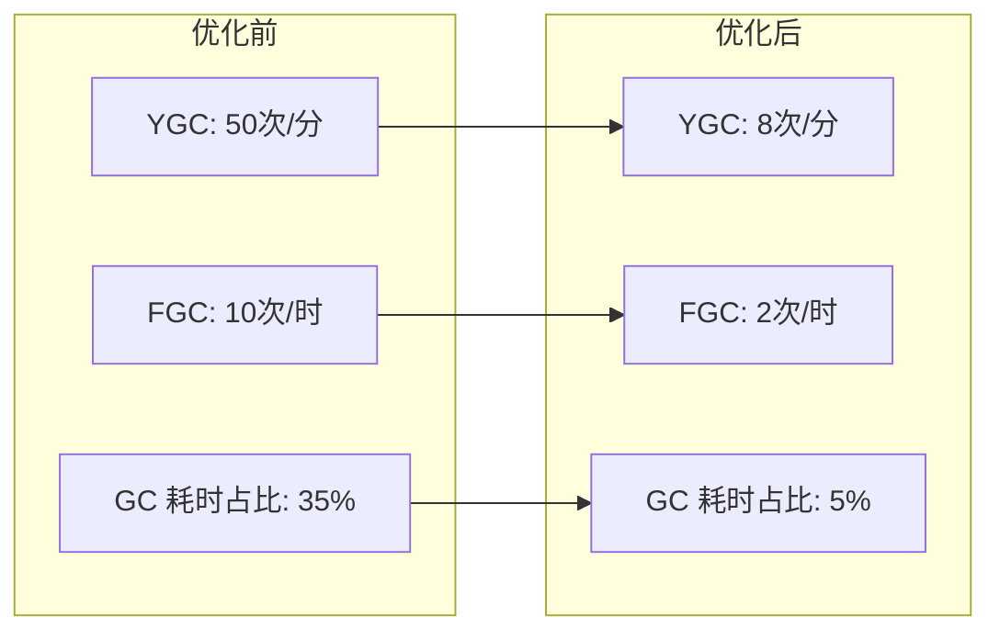

# GC 频繁排查

> **目标级别**：P6
> **面试频率**：🔴 高频
> **面试官最关心的 3 个问题**：
> 1. 如何判断 GC 是否过于频繁？
> 2. GC 频繁的根本原因是什么？
> 3. 如何优化减少 GC 频率？

---

面试官问：「线上 GC 太频繁，怎么优化？」你说「增大堆内存」——然后面试官追问「只是增大堆就能解决问题吗？」你犹豫了。

GC 频繁是 Java 服务性能问题的常见原因。但增大堆内存只是权宜之计，真正的优化需要找到频繁 GC 的根因。

## 一、如何判断 GC 频繁

### 1.1 GC 频繁的标准



### 1.2 GC 日志分析

```bash
# 开启 GC 日志
-XX:+PrintGCDetails
-XX:+PrintGCDateStamps
-Xloggc:/var/log/gc.log
-XX:+UseGCLogFileRotation
-XX:GCLogFileSize=10M
-XX:NumberOfGCLogFiles=5
```

```bash
# 使用 GCEasy 分析（在线工具）
# 上传 gc.log 到 https://gceasy.io

# 使用命令行工具
gcviewer gc.log
```

### 1.3 GC 日志解读

```bash
# Minor GC 日志
2024-01-15T10:30:00.123+0800: [ParNew: 83840K->1024K(943744K), 0.0256789 secs]
# 年轻代 GC：83840K → 1024K，耗时 25ms

# Full GC 日志
2024-01-15T10:30:05.456+0800: [Full GC (Allocation Failure)
  [CMS: 1048576K->524288K(2097152K), 5.1234567 secs]
  1572864K->524288K(4096000K), 5.2345678 secs]
# Full GC：堆 1.5G → 512M，耗时 5.2 秒
```

## 二、GC 频繁的常见原因



### 2.1 对象分配过快

```java
// ⚠️ 错误示例：循环内创建大量对象
public List<String> process(List<Long> ids) {
    List<String> result = new ArrayList<>();
    for (Long id : ids) {
        // 每个循环都创建新对象
        StringBuilder sb = new StringBuilder();
        sb.append("user_").append(id);
        result.add(sb.toString());
    }
    return result;
}

// ✅ 正确示例：复用对象或使用流
public List<String> process(List<Long> ids) {
    return ids.stream()
        .map(id -> "user_" + id)  // String intern 优化
        .collect(Collectors.toList());
}

// ✅ 正确示例：复用 StringBuilder
public List<String> process(List<Long> ids) {
    List<String> result = new ArrayList<>(ids.size());
    StringBuilder sb = new StringBuilder(50);  // 预估大小
    for (Long id : ids) {
        sb.setLength(0);  // 重置而不是新建
        sb.append("user_").append(id);
        result.add(sb.toString());
    }
    return result;
}
```

### 2.2 大对象直接进入老年代

```java
// ⚠️ 错误示例：频繁创建大对象数组
public void processBatch(List<byte[]> data) {
    for (byte[] bytes : data) {
        // 超过阈值的大对象直接进入老年代
        byte[] buffer = new byte[10 * 1024 * 1024];  // 10MB
        System.arraycopy(bytes, 0, buffer, 0, bytes.length);
        process(buffer);
    }
}

// ✅ 正确示例：使用对象池或调整阈值
public class BufferPool {
    private static final int BUFFER_SIZE = 10 * 1024 * 1024;
    private static ThreadLocal<byte[]> buffer = ThreadLocal.withInitial(
        () -> new byte[BUFFER_SIZE]
    );
    
    public void processBatch(List<byte[]> data) {
        byte[] myBuffer = buffer.get();
        for (byte[] bytes : data) {
            System.arraycopy(bytes, 0, myBuffer, 0, Math.min(bytes.length, BUFFER_SIZE));
            process(myBuffer);
        }
    }
}
```

### 2.3 过早晋升（Premature Promotion）

```java
// ⚠️ 错误示例：对象生命周期与预期不符
public class OrderService {
    public Page<Order> list(Long userId, int page, int size) {
        List<Order> orders = orderDao.findByUserId(userId);
        // ⚠️ orders 集合对象很大，如果年轻代放不下会直接晋升
        
        // 分页计算
        int from = (page - 1) * size;
        return new Page<>(orders.subList(from, Math.min(from + size, orders.size())));
    }
}

// ✅ 正确示例：直接在 SQL 层分页
public Page<Order> list(Long userId, int page, int size) {
    // 在数据库层分页，减少内存占用
    return orderDao.findByUserId(userId, page, size);
}
```

## 三、GC 优化参数

### 3.1 内存区域大小调整

| 参数 | 说明 | 建议值 |
|------|------|--------|
| `-Xms` | 初始堆大小 | 与 -Xmx 相同 |
| `-Xmx` | 最大堆大小 | 根据服务需求 |
| `-Xmn` | 年轻代大小 | 堆的 1/3 ~ 1/4 |
| `-XX:SurvivorRatio` | Eden/Survivor 比例 | 默认 8（1:1:1）|
| `-XX:MaxTenuringThreshold` | 最大晋升年龄 | 15（CMS）/ 15（G1）|

```bash
# 示例配置
java -Xms4g -Xmx4g \
    -Xmn1g \
    -XX:SurvivorRatio=8 \
    -XX:MaxTenuringThreshold=15 \
    -XX:+UseG1GC \
    -XX:MaxGCPauseMillis=200 \
    -XX:+PrintGCDetails \
    Application
```

### 3.2 G1 专用参数

| 参数 | 说明 | 建议值 |
|------|------|--------|
| `-XX:MaxGCPauseMillis` | 最大 GC 暂停时间 | 200ms |
| `-XX:G1HeapRegionSize` | Region 大小 | 1M/2M/4M/8M |
| `-XX:InitiatingHeapOccupancyPercent` | 触发 Mixed GC 阈值 | 45（默认）|

### 3.3 优化前后对比



## 四、排查步骤

### 4.1 第一步：分析 GC 日志

```bash
# 使用 GCEasy（推荐）
# 访问 https://gceasy.io 上传 gc.log

# 使用 GCViewer
java -jar gcviewer.jar gc.log
```

### 4.2 第二步：使用 jstat 监控

```bash
# 每秒输出一次
jstat -gc <pid> 1000

# 输出
 S0C    S1C    S0U    S1U      EC       EU        OC         OU       MC      MU    YGC    YGCT    FGC    FGCT     GCT   
1024.0 1024.0  0.0    0.0   83840.0  50000.0   163840.0   100000.0  0.0     0.0      50    2.345      10    5.678   8.023

# 关键指标：
# EU (Eden Used): Eden 区使用量
# OU (Old Used): 老年代使用量
# YGC: 年轻代 GC 次数
# FGC: Full GC 次数
```

### 4.3 第三步：定位问题代码

```bash
# 使用 Arthas
# 1. 监控对象创建
monitor -c 5 com.example.Service createObject

# 2. 查看方法调用频率
stack com.example.Service processBatch

# 3. 生成堆转储分析
heapdump /tmp/heap.hprof
```

## 五、高频面试题

### 🔴 第一层：GC 频繁如何排查？

**问题**：线上 GC 太频繁，怎么排查？

**参考答案**：

```bash
# 1. 开启 GC 日志，分析日志
-XX:+PrintGCDetails -Xloggc:/var/log/gc.log

# 2. 使用 GCEasy 分析
# 上传 gc.log 到 https://gceasy.io

# 3. 使用 jstat 监控
jstat -gc <pid> 1000

# 4. 分析根因
# - YGC 频繁：对象分配过快
# - FGC 频繁：老年代空间不足或对象晋升太快
```

---

### 🔴 第二层：如何优化减少 GC？

**问题**：有什么方法可以减少 GC 频率？

**参考答案**：

| 优化方向 | 具体措施 | 效果 |
|----------|----------|------|
| **减少对象创建** | 对象池、StringBuilder 复用 | ⭐⭐⭐⭐⭐ |
| **优化数据结构** | 使用基本类型而非包装类 | ⭐⭐⭐⭐ |
| **调整年轻代大小** | 增大年轻代，减少 YGC | ⭐⭐⭐ |
| **使用低延迟 GC** | G1、ZGC 替代 CMS | ⭐⭐⭐ |
| **优化代码逻辑** | 避免循环内创建对象 | ⭐⭐⭐⭐⭐ |

---

### 🟡 第三层：Minor GC 和 Full GC 的区别？

**问题**：Minor GC 和 Full GC 有什么区别？什么时候会触发？

**参考答案**：

| 对比维度 | Minor GC | Full GC |
|----------|----------|---------|
| **触发条件** | Eden 区满 | 老年代满/调用 System.gc() |
| **停顿时间** | 短（几十毫秒） | 长（几百毫秒~秒级） |
| **回收区域** | 年轻代 | 年轻代 + 老年代 + 元空间 |
| **频率** | 较频繁 | 较少 |
| **优化目标** | 减少 YGC 次数 | 尽量避免 FGC |

---

## 六、常见陷阱

### ⚠️ 陷阱 1：只调堆大小，不调比例

增大堆只是增加空间，对象还是会快速填满。需要同时调整年轻代/老年代比例。

### ⚠️ 陷阱 2：Survivor 空间不足

如果 `-XX:SurvivorRatio` 设置不当，对象会直接晋升到老年代。

### ⚠️ 陷阱 3：元空间也会 Full GC

JDK8+ 的元空间不是堆内存，`MetaspaceSize` 不够时也会触发 Full GC。

### ⚠️ 陷阱 4：软引用被回收

大量软引用对象会在内存不足时被回收，导致 GC 频繁。

---

## 七、GC 算法对比

| 算法 | 适用场景 | 优点 | 缺点 |
|------|----------|------|------|
| **Serial** | 单核、小内存 | 简单、低开销 | 停顿时间长 |
| **Parallel** | 多核、大内存 | 吞吐率高 | 停顿时间长 |
| **CMS** | 低延迟需求 | 并发收集、停顿短 | 浮动垃圾、碎片化 |
| **G1** | 大堆、均衡需求 | 可预测停顿、整合碎片 | 复杂、调优困难 |
| **ZGC** | 超大堆、超低延迟 | 停顿 < 1ms | 吞吐量略低 |

---

## 八、加分回答

### 💡 使用 ZGC 优化延迟

```bash
# ZGC 配置
java -Xms16g -Xmx16g \
    -XX:+UseZGC \
    -XX:ConcGCThreads=4 \
    -XX:ParallelGCThreads=16 \
    -XX:+ZCollectionInterval=600 \
    -XX:+ZProactive \
    Application
```

### 💡 使用异步日志减少 GC 影响

```java
// 使用 Log4j2 异步日志
// pom.xml
<dependency>
    <groupId>com.lmax</groupId>
    <artifactId>disruptor</artifactId>
    <version>3.4.4</version>
</dependency>

// log4j2.xml
<Loggers>
    <AsyncRoot level="info">
        <AppenderRef ref="File"/>
    </AsyncRoot>
</Loggers>
```

---

## 九、扩展思考

为什么现在推荐使用 G1 而不是 CMS？

> **答案**：
>
> 1. **CMS 浮动垃圾问题**：并发标记阶段产生的垃圾需要下次 Full GC 才能清理
> 2. **CMS 内存碎片**：长期运行后会产生大量内存碎片
> 3. **CMS 退化问题**：Promotion Failure 会导致 Full GC
> 4. **G1 可预测停顿**：通过 `-XX:MaxGCPauseMillis` 控制停顿时间
> 5. **G1 统一管理**：G1 将堆划分为多个 Region，更灵活
> 6. **CMS 已废弃**：JDK14 已移除 CMS
