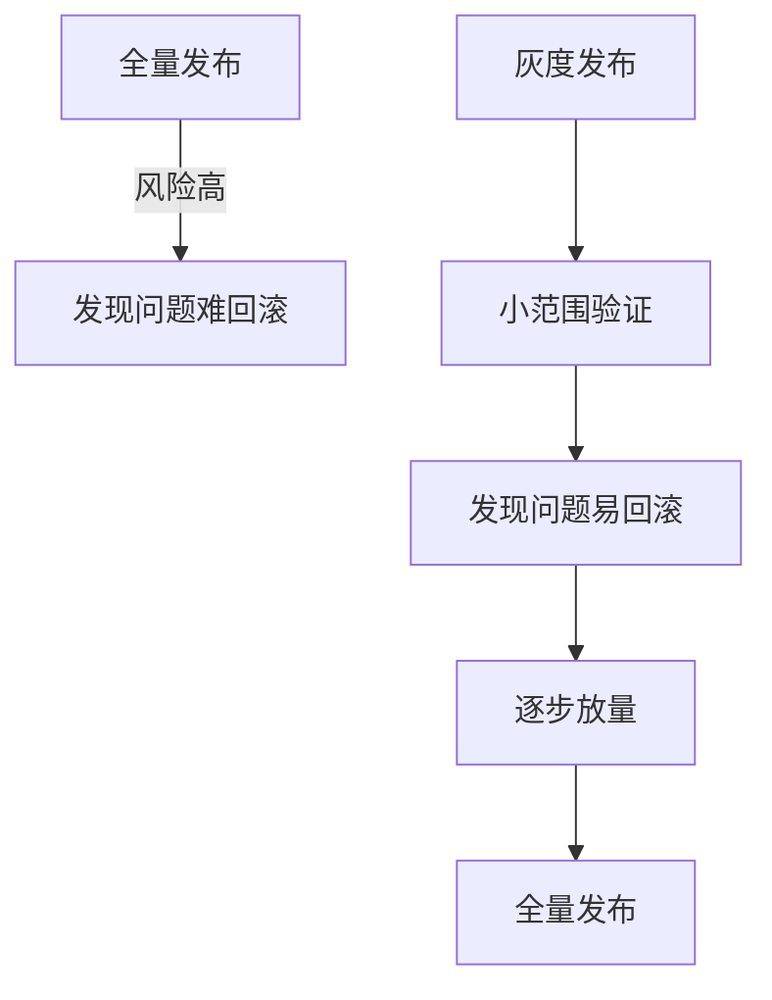
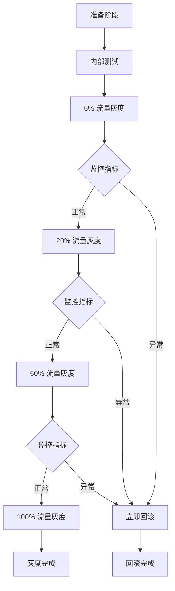

# 灰度发布方案

> **目标级别**：P6
> **面试频率**：🟢 低频
> **面试官最关心的 3 个问题**：
> 1. 灰度发布的目的是什么？
> 2. 常见的灰度策略有哪些？
> 3. 如何设计灰度发布方案？

---

面试官问：「新功能上线，怎么保证不出问题？」你说「先测试再上线」——然后面试官追问「测试没问题，上线后出问题怎么办？」

灰度发布是保障系统稳定性的重要手段。它让我们能够在小范围内验证新功能，及时发现问题并回滚。

## 一、灰度发布概述



| 发布方式 | 风险 | 回滚难度 | 适用场景 |
|----------|------|----------|----------|
| **全量发布** | 高 | 难 | 非核心/小版本 |
| **灰度发布** | 低 | 易 | 核心/大版本 |
| **金丝雀** | 低 | 易 | 基础设施变更 |

## 二、灰度策略

### 2.1 按用户比例灰度

```java
// ✅ 基于用户 ID 灰度
@Service
public class CanaryService {
    
    public boolean shouldEnableNewFeature(Long userId) {
        // 用户 ID 取模
        int mod = (int) (userId % 100);
        return mod `<` canaryPercentage;  // canaryPercentage = 10 表示 10% 流量
    }
}

// 使用切面
@Aspect
@Component
public class CanaryAspect {
    
    @Autowired
    private CanaryService canaryService;
    
    @Around("@annotation(CanaryRelease)")
    public Object around(ProceedingJoinPoint joinPoint) throws Throwable {
        Long userId = getUserId();
        
        if (canaryService.shouldEnableNewFeature(userId)) {
            // 走新逻辑
            return joinPoint.proceed();
        } else {
            // 走老逻辑
            return invokeOldLogic(joinPoint);
        }
    }
}

// 使用注解
@CanaryRelease(feature = "new-order-service")
public Order createOrder(OrderDTO order) {
    // 新逻辑
}
```

### 2.2 按用户标签灰度

```java
// ✅ 基于用户标签灰度
@Service
public class LabelBasedCanary {
    
    public boolean shouldEnableNewFeature(Long userId) {
        User user = userService.getUser(userId);
        
        // 白名单用户优先
        if (whiteList.contains(userId)) {
            return true;
        }
        
        // 按标签灰度
        switch (featureName) {
            case "vip-feature":
                return "VIP".equals(user.getLevel());
            case "internal-feature":
                return "内部员工".equals(user.getType());
            case "beta-feature":
                return user.isBetaUser();
            default:
                return false;
        }
    }
}
```

### 2.3 按流量比例灰度

```yaml
# Nginx 灰度配置
upstream backend {
    server 10.0.0.1:8080;  # 老版本
    server 10.0.0.2:8080 weight=1;  # 新版本，10% 流量
}

# 或者使用加权负载均衡
upstream backend {
    server 10.0.0.1:8080 weight=9;  # 老版本，90%
    server 10.0.0.2:8080 weight=1;  # 新版本，10%
}
```

### 2.4 按 Header 灰度

```java
// ✅ 基于请求 Header 灰度
@Service
public class HeaderBasedCanary {
    
    public boolean shouldEnableNewFeature(HttpServletRequest request) {
        String header = request.getHeader("X-Canary");
        
        if ("enable".equals(header)) {
            return true;
        }
        if ("disable".equals(header)) {
            return false;
        }
        
        // 根据版本号灰度
        String version = request.getHeader("X-App-Version");
        return compareVersion(version, "2.0.0") >= 0;
    }
}

// 配置 Gateway 路由
spring:
  cloud:
    gateway:
      routes:
        - id: service-a-new
          uri: http://service-a-new:8080
          predicates:
            - Header=X-Canary, enable
        - id: service-a
          uri: http://service-a:8080
```

## 三、灰度发布流程



## 四、灰度监控系统

### 4.1 核心监控指标

```java
// ✅ 灰度监控
@Service
public class CanaryMonitor {
    
    @Autowired
    private MetricsService metricsService;
    
    public void recordMetrics(String feature, boolean isNewVersion) {
        // 记录请求量
        metricsService.increment("canary." + feature + ".requests." + 
            (isNewVersion ? "new" : "old"));
        
        // 记录响应时间
        long latency = System.currentTimeMillis() - startTime;
        metricsService.record("canary." + feature + ".latency." + 
            (isNewVersion ? "new" : "old"), latency);
        
        // 记录错误率
        if (hasError) {
            metricsService.increment("canary." + feature + ".errors." + 
                (isNewVersion ? "new" : "old"));
        }
    }
}
```

### 4.2 灰度告警

```yaml
# Prometheus 告警规则
- alert: CanaryHighErrorRate
  expr: |
    rate(canary_errors_new[5m]) / rate(canary_requests_new[5m]) > 0.05
  for: 5m
  labels:
    severity: critical
  annotations:
    summary: "灰度版本错误率过高"

- alert: CanaryHighLatency
  expr: |
    histogram_quantile(0.95, rate(canary_latency_new_bucket[5m])) 
    > histogram_quantile(0.95, rate(canary_latency_old_bucket[5m])) * 1.5
  for: 5m
  labels:
    severity: warning
  annotations:
    summary: "灰度版本延迟高于老版本 50%"
```

## 五、金丝雀发布

```yaml
# Kubernetes 金丝雀部署
apiVersion: argoproj.io/v1alpha1
kind: Rollout
metadata:
  name: service rollout
spec:
  replicas: 10
  strategy:
    canary:
      steps:
        - setWeight: 5
        - pause: {}  # 等待人工确认
        - setWeight: 20
        - pause: {duration: 10m}
        - setWeight: 50
        - pause: {}
        - setWeight: 100
      canaryMetadata:
        labels:
          track: canary
      stableMetadata:
        labels:
          track: stable
      trafficManagement:
        - targetIngress:
            name: ingress
```

## 六、高频面试题

### 🔴 第一层：灰度发布的目的是什么？

**问题**：为什么要做灰度发布？

**参考答案**：

1. **降低风险**：在小范围验证，及时发现问题
2. **快速回滚**：出问题只影响灰度用户
3. **收集反馈**：获取真实用户反馈
4. **平稳过渡**：平滑切换，避免流量冲击

---

### 🟡 第二层：常见的灰度策略有哪些？

**问题**：有哪些灰度策略？

**参考答案**：

| 策略 | 说明 |
|------|------|
| **按用户比例** | 用户 ID 取模决定 |
| **按用户标签** | VIP、内部用户等标签 |
| **按流量比例** | Nginx 加权路由 |
| **按 Header** | 请求头控制 |
| **按地区** | 按地域灰度 |

---

### 🟢 第三层：如何设计灰度发布方案？

**问题**：完整的灰度发布方案怎么设计？

**参考答案**：

1. **灰度策略**：选择合适的灰度方式
2. **监控告警**：定义核心指标和告警规则
3. **回滚机制**：支持秒级回滚
4. **发布流程**：分阶段放量
5. **验证机制**：功能验证和指标对比

---

## 七、常见陷阱

### ⚠️ 陷阱 1：灰度后不监控

灰度发布后没有监控，无法及时发现问题。

### ⚠️ 陷阱 2：灰度比例过高

灰度比例过高可能影响大量用户。

### ⚠️ 陷阱 3：灰度时间过长

灰度时间过长导致版本碎片化。

### ⚠️ 陷阱 4：缺少回滚方案

没有快速回滚机制，问题扩大。

---

## 八、加分回答

### 💡 A/B 测试框架

```java
// A/B 测试
@Service
public class ABTestService {
    
    public String getVariant(Long userId, String experimentId) {
        // 根据用户 ID 分配 variant
        int bucket = Math.abs((userId + experimentId.hashCode()) % 100);
        
        if (bucket < 50) {
            return "A";  // 对照组
        } else {
            return "B";  // 实验组
        }
    }
}

// 使用
@GetMapping("/page")
public String getPage(HttpServletRequest request) {
    String variant = abTestService.getVariant(getUserId(request), "new-checkout");
    
    if ("A".equals(variant)) {
        return "checkout-v1";
    } else {
        return "checkout-v2";
    }
}
```

### 💡 灰度发布最佳实践

1. **小步快跑**：频繁发布，每次变更小
2. **自动化**：灰度流程自动化
3. **可观测**：完善的监控和告警
4. **快速回滚**：支持一键回滚
5. **特性开关**：使用开关控制功能

---

## 九、扩展思考

如何实现无感知的灰度切换？

> **答案**：
>
> 1. **流量染色**：在入口标记流量
> 2. **路由染色**：染色流量路由到灰度版本
> 3. **数据隔离**：灰度用户使用灰度数据
> 4. **透明切换**：用户无感知，流量逐步迁移
