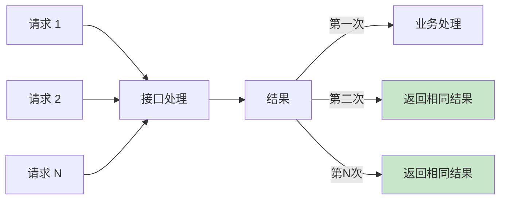
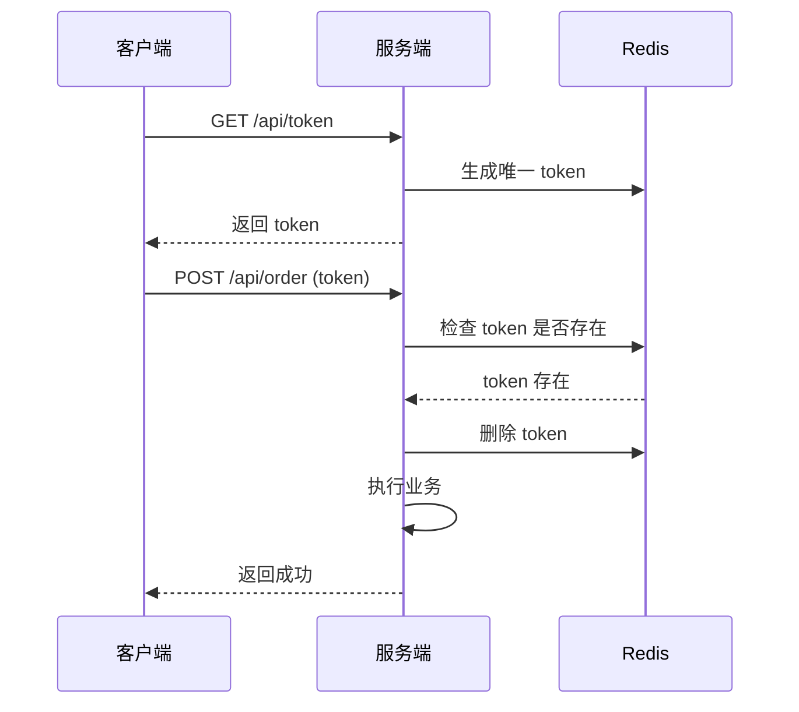
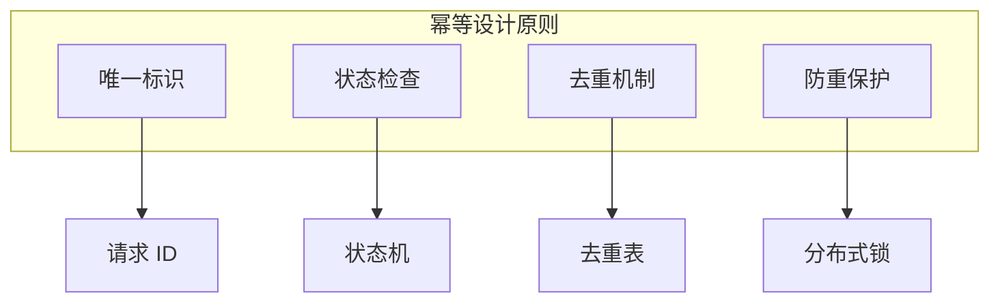

# 接口幂等性设计

> **目标级别**：P6
> **面试频率**：🔴 高频
> **面试官最关心的 3 个问题**：
> 1. 什么是接口幂等性？为什么重要？
> 2. 有哪些实现幂等性的方案？
> 3. 不同场景下如何选择幂等方案？

---

面试官问：「用户重复点击了提交按钮，怎么处理的？」你说「前端限制」——然后面试官追问「前端限制不可靠，如果前端没拦住呢？」

接口幂等性是分布式系统中最重要的问题之一。网络抖动、用户误操作、服务超时都可能导致接口被重复调用。

## 一、什么是幂等性



**幂等性**：同一个操作执行一次和执行多次的效果相同。

| 操作类型 | 是否幂等 |
|----------|----------|
| `SELECT` | ✅ 幂等 |
| `UPDATE status = 1` | ✅ 幂等 |
| `UPDATE count = count + 1` | ❌ 非幂等 |
| `INSERT` | ❌ 非幂等 |
| `DELETE` | ✅ 幂等 |

## 二、幂等性常见场景

| 场景 | 说明 | 风险 |
|------|------|------|
| **用户重复点击** | 按钮重复点击、刷新页面 | 多次扣款 |
| **网络超时重试** | HTTP 超时后重试 | 多次下单 |
| **消息重复消费** | 消息队列重试 | 多次处理 |
| **服务重启** | 事务回滚后重试 | 数据不一致 |
| **爬虫/脚本** | 恶意重复请求 | 刷单、薅羊毛 |

## 三、幂等性实现方案

### 3.1 方案一：Token 机制



```java
// 1. 获取 Token
@RestController
public class IdempotentController {
    
    @Autowired
    private RedisTemplate<String, String> redisTemplate;
    
    @GetMapping("/api/token")
    public String generateToken() {
        String token = UUID.randomUUID().toString();
        // Token 有效期 5 分钟
        redisTemplate.opsForValue().set(token, "1", 5, TimeUnit.MINUTES);
        return token;
    }
}

// 2. 业务接口使用 Token
@PostMapping("/api/order")
public Result<Order> createOrder(
    @RequestHeader("X-Idempotent-Token") String token,
    @RequestBody OrderDTO order) {
    
    // 检查 token 是否存在
    Boolean exists = redisTemplate.delete("token:" + token);
    if (!exists) {
        throw new BizException("重复请求");
    }
    
    // 执行业务
    return orderService.create(order);
}

// 3. 使用拦截器统一处理
@Component
public class IdempotentInterceptor implements HandlerInterceptor {
    
    @Override
    public boolean preHandle(HttpServletRequest request, HttpServletResponse response, Object handler) {
        String token = request.getHeader("X-Idempotent-Token");
        if (StringUtils.isBlank(token)) {
            return true;
        }
        
        // 尝试设置锁（原子操作）
        Boolean locked = redisTemplate.opsForValue()
            .setIfAbsent("lock:idempotent:" + token, "1", 5, TimeUnit.MINUTES);
        
        if (!locked) {
            throw new BizException("重复请求");
        }
        return true;
    }
}
```

### 3.2 方案二：基于状态机

```java
// 订单状态机
public enum OrderStatus {
    CREATED,      // 创建
    PAID,         // 已支付
    SHIPPED,      // 已发货
    COMPLETED,    // 已完成
    CANCELLED     // 已取消
}

// 支付接口 - 使用状态机保证幂等
@Service
public class OrderService {
    
    @Transactional
    public void payOrder(Long orderId, String payId) {
        Order order = orderDao.findById(orderId);
        
        // 检查状态
        if (order.getStatus() != OrderStatus.CREATED) {
            // 已支付过，直接返回
            return;  // 幂等：不重复扣款
        }
        
        // 检查支付流水号（防重复支付）
        if (payDao.existsByPayId(payId)) {
            return;  // 幂等：同一支付流水不重复处理
        }
        
        // 扣款
        accountService.deduct(order.getUserId(), order.getAmount());
        
        // 保存支付流水
        payDao.insert(new Pay(orderId, payId));
        
        // 更新订单状态
        orderDao.updateStatus(orderId, OrderStatus.PAID);
    }
}

// UPDATE 语句使用条件判断
@Update("UPDATE orders SET status = 'PAID', pay_id = #{payId} " +
       "WHERE id = #{orderId} AND status = 'CREATED'")
int payOrder(@Param("orderId") Long orderId, @Param("payId") String payId);
// 返回 0 表示状态不满足，幂等返回成功
```

### 3.3 方案三：分布式锁

```java
// 使用分布式锁保证幂等
@Service
public class IdempotentService {
    
    @Autowired
    private RedissonClient redissonClient;
    
    public void processWithLock(String businessId, Runnable task) {
        String lockKey = "idempotent:" + businessId;
        RLock lock = redissonClient.getLock(lockKey);
        
        try {
            // 获取锁（最多等待 0 秒，锁自动过期 30 秒）
            if (lock.tryLock(0, 30, TimeUnit.SECONDS)) {
                // 获取锁成功，执行业务
                task.run();
            } else {
                throw new BizException("请求处理中，请稍后");
            }
        } finally {
            if (lock.isHeldByCurrentThread()) {
                lock.unlock();
            }
        }
    }
    
    // 简化使用
    public <T> T processWithLock(String businessId, Supplier<T> supplier) {
        return processWithLock(businessId, (Runnable) () -> supplier.get());
    }
}

// 使用示例
public Order createOrder(OrderDTO order) {
    // 业务 ID：用户 ID + 业务类型 + 唯一标识
    String businessId = String.format("%s:%s:%s", 
        order.getUserId(), "createOrder", order.getRequestId());
    
    return processWithLock(businessId, () -> {
        return orderDao.insert(order);
    });
}
```

### 3.4 方案四：消息队列幂等

```java
// RocketMQ 消费者端幂等
@Service
public class OrderMessageConsumer {
    
    private Set<String> processedIds = new ConcurrentHashSet<>();
    
    @RocketMQMessageListener(topic = "order-topic", consumerGroup = "order-consumer")
    public void consumeOrderMessage(Message message) {
        String orderId = message.getHeaders().get("orderId");
        
        // 1. 检查是否已处理（本地缓存）
        if (processedIds.contains(orderId)) {
            return;  // 幂等：已处理过
        }
        
        // 2. 业务处理
        try {
            orderService.processOrder(orderId);
            
            // 3. 记录处理结果
            processedIds.add(orderId);
            
            // 4. 定期清理（避免内存溢出）
            if (processedIds.size() > 100000) {
                processedIds.clear();
            }
        } catch (Exception e) {
            // 失败不删除消息，会重试
            throw e;
        }
    }
}

// 或者使用 Redis 记录处理状态
@Service
public class OrderMessageConsumerWithRedis {
    
    @Autowired
    private RedisTemplate<String, String> redisTemplate;
    
    public void consumeOrderMessage(String orderId) {
        String key = "processed:order:" + orderId;
        
        // SETNX 原子操作，重复消费时直接返回
        Boolean success = redisTemplate.opsForValue().setIfAbsent(key, "1", 24, TimeUnit.HOURS);
        if (!success) {
            return;  // 已处理过
        }
        
        orderService.processOrder(orderId);
    }
}
```

## 四、幂等性设计原则



| 原则 | 说明 |
|------|------|
| **唯一标识** | 每个请求有唯一的业务标识 |
| **状态检查** | 操作前检查当前状态 |
| **去重机制** | 记录已处理的请求 |
| **防重保护** | 分布式锁阻止并发请求 |

## 五、高频面试题

### 🔴 第一层：什么是接口幂等性？

**问题**：接口幂等性是什么意思？为什么重要？

**参考答案**：

- **定义**：接口执行一次和执行多次的结果相同
- **重要性**：
  - 网络超时需要重试
  - 用户可能重复点击
  - 消息队列会重复投递
  - 服务故障重启后重试

---

### 🔴 第二层：如何实现接口幂等？

**问题**：有哪些实现幂等性的方案？

**参考答案**：

| 方案 | 适用场景 | 实现方式 |
|------|----------|----------|
| **Token 机制** | 表单提交 | 先获取 Token，业务接口携带 Token |
| **状态机** | 状态流转 | 检查当前状态 |
| **去重表** | 数据库操作 | 唯一键冲突 |
| **分布式锁** | 并发控制 | 同一业务 ID 加锁 |

---

### 🟡 第三层：消息队列如何保证幂等？

**问题**：MQ 消费时如何保证幂等？

**参考答案**：

```java
// 1. 消息 ID 去重
if (processedIds.contains(messageId)) {
    return;  // 已处理过
}

// 2. 业务 ID 去重
String key = "processed:" + businessId;
if (redis.setnx(key, "1")) {
    // 设置成功，说明未处理过
    process(message);
}
```

---

## 六、常见陷阱

### ⚠️ 陷阱 1：只在前端做幂等

前端限制不可靠，必须在后端也做幂等。

### ⚠️ 陷阱 2：Token 验证后不删除

Token 验证通过后必须删除，否则无效。

### ⚠️ 陷阱 3：锁粒度太大

锁范围太大会影响性能，应该只锁必要的业务。

### ⚠️ 陷阱 4：忽略异常处理

异常时未释放锁，导致死锁。

---

## 七、加分回答

### 💡 全局唯一 ID 生成

```java
// 使用雪花算法生成唯一 ID
public class SnowflakeIdGenerator {
    private final long twepoch = 1288834974657L;
    private final long workerIdBits = 5L;
    private final long datacenterIdBits = 5L;
    private final long maxWorkerId = ~(-1L << workerIdBits);
    
    private final long workerId;
    private final long datacenterId;
    private final long sequence;
    
    public String nextId() {
        // 生成 64 位 ID
    }
}
```

### 💡 幂等性最佳实践

1. **GET 请求天然幂等**：不要在 GET 请求中修改数据
2. **DELETE 幂等**：删除已删除的资源应返回成功
3. **UPDATE 条件化**：使用状态或版本号判断
4. **POST 谨慎处理**：POST 通常非幂等，需要额外处理

---

## 八、扩展思考

数据库唯一索引和幂等性有什么关系？

> **答案**：
>
> 1. **唯一索引天然幂等**：重复插入会报错
> 2. **利用唯一索引**：为业务 ID 创建唯一索引
> 3. **冲突处理**：捕获重复异常返回成功
> 4. **性能考虑**：唯一索引有写入开销
