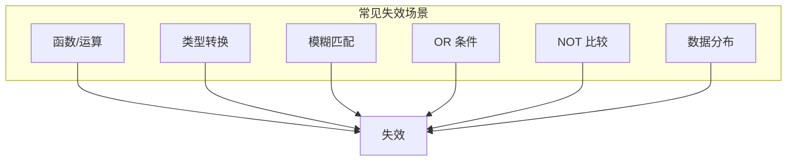
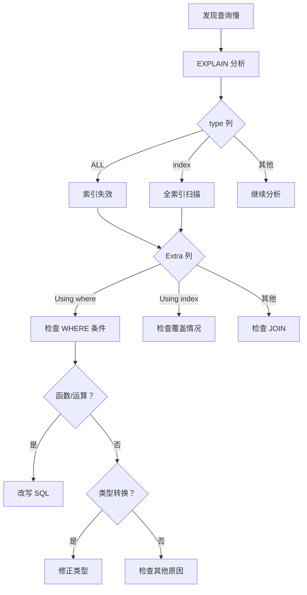

# 索引失效案例

> **目标级别**：P6
> **面试频率**：🟡 中频
> **面试官最关心的 3 个问题**：
> 1. 索引为什么会失效？
> 2. 如何避免索引失效？
> 3. 索引失效如何排查？

---

面试官问：「你建了索引，为什么查询还是慢？」你说「可能索引失效了」——然后面试官追问「哪些情况会导致索引失效？」

索引失效是 MySQL 优化中最常见的问题之一。即使建立了索引，由于查询方式不当，索引可能完全不生效。

## 一、索引失效原因汇总



| 失效原因 | 示例 | 解决方案 |
|----------|------|----------|
| **函数/运算** | `WHERE YEAR(date) = 2024` | 改写为范围查询 |
| **类型转换** | `WHERE id = '123'` | 使用正确类型 |
| **左前缀模糊** | `WHERE name LIKE '%abc'` | 使用覆盖索引 |
| **OR 条件** | `WHERE a = 1 OR b = 2` | 使用 UNION |
| **NOT 比较** | `WHERE status != 1` | 使用正向条件 |
| **数据分布不均** | 索引区分度低 | 重新设计索引 |

## 二、详细场景分析

### 2.1 场景一：索引列使用函数

```sql
-- ⚠️ 错误示例：索引失效
SELECT * FROM orders WHERE YEAR(created_at) = 2024;
SELECT * FROM orders WHERE MONTH(created_at) = 1;
SELECT * FROM orders WHERE DAY(created_at) = 15;

-- ✅ 正确方案 1：改写为范围查询
SELECT * FROM orders 
WHERE created_at `>=` '2024-01-01' 
  AND created_at `<` '2025-01-01';

-- ✅ 正确方案 2：使用虚拟列
ALTER TABLE orders ADD COLUMN order_year INT 
GENERATED ALWAYS AS (YEAR(created_at));
CREATE INDEX idx_year ON orders(order_year);

SELECT * FROM orders WHERE order_year = 2024;
```

```sql
-- ⚠️ 错误示例：索引列参与运算
SELECT * FROM orders WHERE id + 1 = 100;
SELECT * FROM orders WHERE price * 0.8 = 80;
SELECT * FROM orders WHERE SUBSTRING(name, 1, 3) = 'Tom';

-- ✅ 正确方案：等式左侧保持原值
SELECT * FROM orders WHERE id = 99;
SELECT * FROM orders WHERE price = 100;
SELECT * FROM orders WHERE name LIKE 'Tom%';
```

### 2.2 场景二：隐式类型转换

```sql
-- 表结构：id 为 BIGINT
-- ⚠️ 错误示例：传入字符串
SELECT * FROM user WHERE id = '123';  -- 字符串转数字，全表扫描

-- ✅ 正确方案：使用正确类型
SELECT * FROM user WHERE id = 123;

-- ⚠️ 错误示例：字符类型索引用数字比较
CREATE INDEX idx_phone ON user(phone);  -- phone 是 VARCHAR
SELECT * FROM user WHERE phone = 13800138000;  -- 数字转字符，部分失效
```

### 2.3 场景三：左前缀模糊匹配

```sql
-- 表结构：name VARCHAR(50)
-- ⚠️ 错误示例：左模糊匹配
SELECT * FROM user WHERE name LIKE '%Tom%';   -- 索引失效
SELECT * FROM user WHERE name LIKE '%Tom';    -- 索引失效

-- ✅ 正确方案 1：右模糊匹配
SELECT * FROM user WHERE name LIKE 'Tom%';    -- 索引生效

-- ✅ 正确方案 2：全文索引
ALTER TABLE user ADD FULLTEXT(name);
SELECT * FROM user WHERE MATCH(name) AGAINST('Tom');

-- ✅ 正确方案 3：覆盖索引 + 扫描
CREATE INDEX idx_name ON user(name);
SELECT name FROM user WHERE name LIKE '%Tom%';  -- 覆盖索引，全索引扫描
```

### 2.4 场景四：OR 条件

```sql
-- ⚠️ 错误示例：OR 导致索引部分失效
SELECT * FROM orders WHERE user_id = 1 OR status = 1;
-- 如果 user_id 有索引，status 没有，可能全表扫描

-- ✅ 正确方案 1：使用 UNION
SELECT * FROM orders WHERE user_id = 1
UNION ALL
SELECT * FROM orders WHERE status = 1 AND user_id != 1;

-- ✅ 正确方案 2：添加缺失索引
CREATE INDEX idx_status ON orders(status);
SELECT * FROM orders WHERE user_id = 1 OR status = 1;  -- 索引生效
```

### 2.5 场景五：NOT 操作

```sql
-- ⚠️ 错误示例：NOT 导致索引失效
SELECT * FROM orders WHERE status != 1;
SELECT * FROM orders WHERE status NOT IN (1, 2);
SELECT * FROM orders WHERE NOT EXISTS (SELECT 1 FROM detail WHERE detail.order_id = orders.id);

-- ✅ 正确方案 1：使用正向条件
SELECT * FROM orders WHERE status IN (2, 3, 4, 5);

-- ✅ 正确方案 2：使用覆盖索引
CREATE INDEX idx_status ON orders(status);
SELECT id FROM orders WHERE status != 1;  -- 只查主键，使用覆盖索引

-- ✅ 正确方案 3：业务层面限制
-- 只查询正常状态的订单，而不是排除异常状态
```

### 2.6 场景六：数据分布不均

```sql
-- ⚠️ 问题：索引区分度低
-- 假设 status=1 占 99%，status=0 占 1%
SELECT * FROM orders WHERE status = 0;
-- 优化器可能选择全表扫描而不是索引

-- ✅ 正确方案 1：强制使用索引
SELECT * FROM orders USE INDEX (idx_status) WHERE status = 0;

-- ✅ 正确方案 2：复合索引 + 列顺序
-- 将高选择性的列放在前面
CREATE INDEX idx_status_user ON orders(status, user_id);

-- ✅ 正确方案 3：重新评估索引设计
-- 如果查询总是查 status=1，考虑添加反向索引
```

## 三、索引失效排查

### 3.1 使用 EXPLAIN 分析

```sql
-- 查看是否使用索引
EXPLAIN SELECT * FROM orders WHERE YEAR(created_at) = 2024;
-- type: ALL, key: NULL，说明全表扫描

-- 对比优化前后
EXPLAIN SELECT * FROM orders WHERE created_at `>=` '2024-01-01' AND created_at `<` '2025-01-01';
-- type: range, key: idx_created_at
```

### 3.2 使用 optimizer_trace

```sql
-- 开启优化器追踪
SET optimizer_trace = 'enabled=on';
SET optimizer_trace_max_mem_size = 1048576;

-- 执行查询
SELECT * FROM orders WHERE YEAR(created_at) = 2024;

-- 查看追踪结果
SELECT * FROM information_schema.OPTIMIZER_TRACE;
```

### 3.3 使用 profiling

```sql
-- 开启性能分析
SET profiling = 1;

-- 执行查询
SELECT * FROM orders WHERE YEAR(created_at) = 2024;

-- 查看分析结果
SHOW PROFILES;
SHOW PROFILE FOR QUERY 1;
```

## 四、排查流程图



## 五、高频面试题

### 🔴 第一层：哪些情况会导致索引失效？

**问题**：请列举会导致索引失效的场景。

**参考答案**：

| 场景 | 示例 |
|------|------|
| 索引列使用函数 | `WHERE YEAR(date) = 2024` |
| 隐式类型转换 | `WHERE id = '123'` (id 是 INT) |
| 左模糊匹配 | `WHERE name LIKE '%abc'` |
| OR 条件 | `WHERE a = 1 OR b = 2` |
| NOT 操作 | `WHERE status != 1` |
| 数据分布不均 | 索引区分度低 |

---

### 🔴 第二层：最左前缀原则是什么？

**问题**：复合索引 (a, b, c)，哪些查询可以走索引？

**参考答案**：

```sql
-- 假设有索引 INDEX idx(a, b, c)

-- ✅ 可以走索引
WHERE a = 1
WHERE a = 1 AND b = 2
WHERE a = 1 AND b = 2 AND c = 3

-- ❌ 不能走索引
WHERE b = 2
WHERE c = 3
WHERE b = 2 AND c = 3
```

---

### 🟡 第三层：如何避免索引失效？

**问题**：有什么方法可以确保索引生效？

**参考答案**：

1. **遵循最左前缀原则**：复合索引按顺序使用
2. **避免在索引列上使用函数**
3. **使用正确的类型**
4. **避免左模糊匹配**
5. **拆分 OR 条件**
6. **使用覆盖索引**

---

## 六、常见陷阱

### ⚠️ 陷阱 1：认为有了索引就一定会用

优化器会根据统计信息选择是否使用索引。

### ⚠️ 陷阱 2：忽略隐式类型转换

Java 传入的参数类型可能与数据库不一致。

### ⚠️ 陷阱 3：过度依赖 OR

OR 条件容易导致索引失效。

### ⚠️ 陷阱 4：忽略数据量影响

小表可能直接全表扫描比索引更快。

---

## 七、加分回答

### 💡 使用索引提示

```sql
-- 强制使用某个索引
SELECT * FROM orders USE INDEX (idx_user_id) WHERE user_id = 1;

-- 忽略某个索引
SELECT * FROM orders IGNORE INDEX (idx_status) WHERE status = 1;

-- 强制使用索引（即使全表扫描更快）
SELECT * FROM orders FORCE INDEX (idx_user_id) WHERE user_id = 1;
```

### 💡 查看索引使用情况

```sql
-- 查看索引使用统计
SHOW INDEX FROM orders;

-- 查看表的统计信息
SHOW TABLE STATUS LIKE 'orders';

-- 分析表更新统计信息
ANALYZE TABLE orders;
```

---

## 八、扩展思考

为什么 InnoDB 使用 B+Tree 而不是 B-Tree？

> **答案**：
>
> 1. **范围查询友好**：B+Tree 的叶子节点是链表，范围查询更高效
> 2. **查询稳定**：所有查询都要到叶子节点，查询时间稳定
> 3. **磁盘读写友好**：非叶子节点不存储数据，可以存储更多索引
> 4. **更适合数据库**：叶子节点链表适合数据库的顺序访问模式
