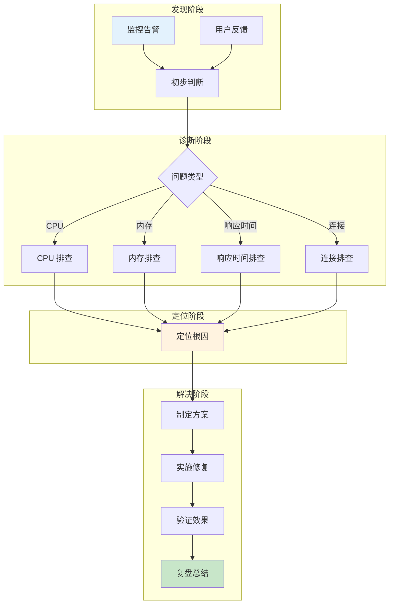
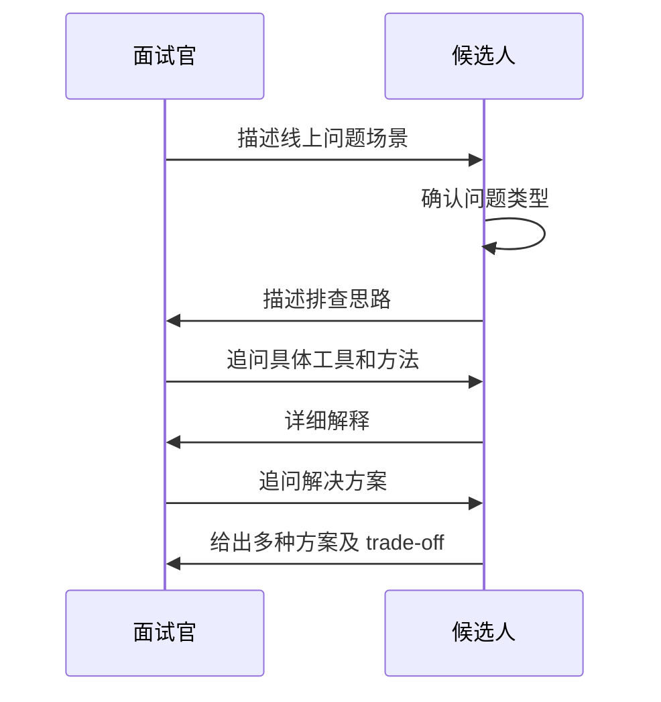

# 综合与场景题 30 题

> **目标级别**：P5/P6/P7
> **面试频率**：🔴 高频

面试官问：「线上遇到过一次 CPU 100% 的问题吗？怎么排查的？」你说「重启解决」——然后就没有然后了。

线上问题排查能力是 P6+ 工程师的核心竞争力。它不是靠运气，而是靠系统化的排查思路和工具链。场景题考察的正是这种能力：从现象到根因，从定位到解决。

## 一、面试官最关心的 5 个问题

1. 线上接口响应慢，如何快速定位瓶颈？
2. CPU 飙升怎么排查，有哪些常见原因？
3. 内存泄漏怎么排查，有哪些常见场景？
4. 数据库连接池满了怎么处理？
5. 如何设计一个高可用的系统？

---

## 二、题目分类

### 🔴 线上排查（8 题）

| 题目 | 级别 | 频率 |
|------|------|------|
| [线上 CPU 飙升排查](/questions/scenario/cpu-high) | P6 | 🔴 高频 |
| [线上内存泄漏排查](/questions/scenario/memory-leak) | P6 | 🔴 高频 |
| [GC 频繁排查](/questions/scenario/gc-frequent) | P6 | 🔴 高频 |
| [死锁排查与解决](/questions/scenario/deadlock) | P6 | 🔴 高频 |
| [接口响应慢排查](/questions/scenario/slow-response) | P6 | 🔴 高频 |
| [OOM 排查案例](/questions/scenario/oom-case) | P6 | 🟡 中频 |
| [StackOverflow 排查](/questions/scenario/stackoverflow) | P5/P6 | 🟡 中频 |
| [线程池参数设置案例](/questions/scenario/threadpool-case) | P6 | 🟡 中频 |

### 🔴 缓存场景（3 题）

| 题目 | 级别 | 频率 |
|------|------|------|
| [缓存一致性场景](/questions/scenario/cache-consistency) | P6 | 🔴 高频 |
| [Redis 大 key 排查](/questions/scenario/redis-bigkey) | P6 | 🔴 高频 |
| [Redis 热 key 处理](/questions/scenario/redis-hotkey) | P6 | 🟡 中频 |

### 🔴 分布式场景（7 题）

| 题目 | 级别 | 频率 |
|------|------|------|
| [分布式事务场景](/questions/scenario/distributed-transaction) | P6/P7 | 🔴 高频 |
| [接口幂等性设计](/questions/scenario/idempotency) | P6 | 🔴 高频 |
| [限流降级熔断场景](/questions/scenario/rate-limiting) | P6 | 🔴 高频 |
| [消息积压处理](/questions/scenario/message-backlog) | P6 | 🟡 中频 |
| [接口重放攻击防护](/questions/scenario/replay-attack) | P6 | 🟡 中频 |
| [服务雪崩处理](/questions/scenario/service-avalanche) | P6/P7 | 🟡 中频 |
| [异地多活设计](/questions/scenario/multi-active) | P7 | 🟢 低频 |

### 🟡 数据库场景（4 题）

| 题目 | 级别 | 频率 |
|------|------|------|
| [数据库连接池满排查](/questions/scenario/connection-pool) | P6 | 🔴 高频 |
| [数据库死锁案例](/questions/scenario/deadlock-case) | P6 | 🟡 中频 |
| [慢查询优化案例](/questions/scenario/slow-query-case) | P6 | 🔴 高频 |
| [索引失效案例](/questions/scenario/index-case) | P6 | 🟡 中频 |

### 🟡 架构设计类（8 题）

| 题目 | 级别 | 频率 |
|------|------|------|
| [跨库分页查询](/questions/scenario/cross-db-pagination) | P6 | 🟡 中频 |
| [数据迁移方案](/questions/scenario/data-migration) | P6 | 🟡 中频 |
| [系统兼容性设计](/questions/scenario/compatibility) | P6 | 🟢 低频 |
| [灰度发布方案](/questions/scenario/gray-release) | P6 | 🟢 低频 |
| [全链路压测设计](/questions/scenario/full-link-test) | P7 | 🟢 低频 |
| [敏感数据脱敏](/questions/scenario/data-masking) | P6 | 🟡 中频 |
| [接口安全设计](/questions/scenario/api-security) | P6 | 🟡 中频 |
| [系统容量评估](/questions/scenario/capacity-assessment) | P7 | 🟡 中频 |

---

## 三、排查思路总览

## 四、学习路径建议

### P5 阶段（1-3 年）

重点掌握：**线上排查** 8 题中的前 5 题 + **接口幂等性**

- 理解常见的性能问题类型
- 掌握基本的排查工具和方法
- 能够独立解决简单的线上问题

### P6 阶段（3-5 年）

重点掌握：**缓存场景** 3 题 + **分布式场景** 前 4 题 + **数据库场景** 4 题

- 能够处理复杂的线上问题
- 掌握系统设计的基本原则
- 能够设计高可用的系统架构

### P7 阶段（5 年以上）

重点掌握：**分布式场景** 后 3 题 + **架构设计类** 8 题

- 能够设计大规模分布式系统
- 掌握容量规划和性能优化
- 能够处理极端场景和边界问题

---

## 五、面试技巧总结

### 回答模式

### 必备工具链

| 场景 | 工具 | 用途 |
|------|------|------|
| CPU 排查 | `top`, `jstack`, `Arthas` | 分析线程 CPU 占用 |
| 内存排查 | `jmap`, `MAT`, ` Arthas` | 分析内存使用 |
| GC 排查 | `jstat`, `GCViewer`, `GCEasy` | 分析 GC 日志 |
| 线程排查 | `jstack`, `Arthas` | 分析线程状态和死锁 |
| 数据库排查 | `EXPLAIN`, `SHOW PROCESSLIST` | 分析慢查询和锁等待 |
| 缓存排查 | `Redis MONITOR`, `INFO` | 分析缓存使用 |

> **💡 面试加分点**：能说出一套完整的线上问题应急响应流程，包括：发现、定位、止血、恢复、复盘。
