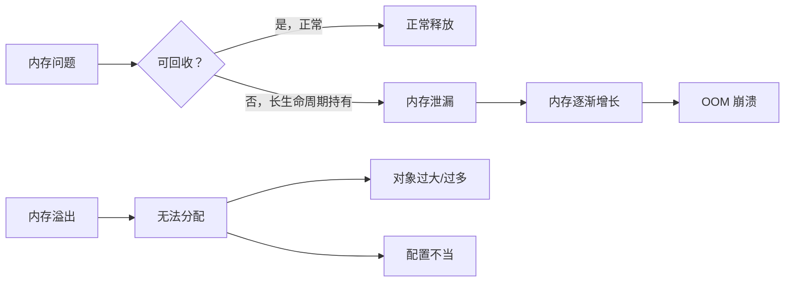
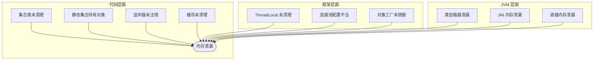
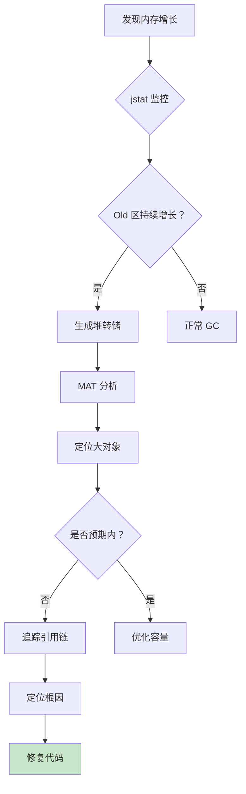

# 线上内存泄漏排查

> **目标级别**：P6
> **面试频率**：🔴 高频
> **面试官最关心的 3 个问题**：
> 1. 如何判断是内存泄漏还是内存溢出？
> 2. 常见的内存泄漏场景有哪些？
> 3. 如何定位内存泄漏的根因？

---

面试官问：「遇到过内存泄漏吗？怎么排查的？」你说「用过 MAT」——然后面试官追问「MAT 里怎么看泄漏嫌疑？」你沉默了。

内存泄漏是 Java 服务最头疼的问题之一。它不像 OOM 那样直接崩溃，而是慢慢蚕食内存，直到服务不可用。

## 一、内存泄漏 vs 内存溢出



| 对比维度 | 内存泄漏 | 内存溢出 |
|----------|----------|----------|
| **表现** | 内存缓慢增长 | 内存突然不足 |
| **原因** | 对象无法被 GC 回收 | 确实需要大量内存 |
| **排查难度** | 较难，需要多次对比 | 较易，直接看堆转储 |
| **解决方式** | 修复持有引用 | 优化内存使用/增大堆 |

## 二、常见内存泄漏场景



### 2.1 集合类未清理

```java
// ⚠️ 错误示例：集合不断添加，从不清理
public class CacheManager {
    private static Map<String, Object> cache = new HashMap<>();
    
    public void put(String key, Object value) {
        cache.put(key, value);  // 永远不清理
    }
}

// ✅ 正确示例：使用 WeakHashMap 或定期清理
public class CacheManager {
    private static Map<String, WeakReference<Object>> cache = new WeakHashMap<>();
    
    public void put(String key, Object value) {
        cache.put(key, new WeakReference<>(value));
    }
}
```

### 2.2 静态集合持有对象

```java
// ⚠️ 错误示例：静态 List 持有大量对象
public class DataHolder {
    private static List<User> users = new ArrayList<>();
    
    public void addUser(User user) {
        users.add(user);  // 生命周期与类相同，永远不会被 GC
    }
}

// ✅ 正确示例：使用有限队列
public class DataHolder {
    private static BlockingQueue<User> users = new LinkedBlockingQueue<>(1000);
    
    public void addUser(User user) {
        users.offer(user);  // 超过容量自动丢弃
    }
}
```

### 2.3 ThreadLocal 未清理

```java
// ⚠️ 错误示例：使用 ThreadLocal 后未清理
public class UserContext {
    private static ThreadLocal<User> currentUser = new ThreadLocal<>();
    
    public static void set(User user) {
        currentUser.set(user);  // 线程复用时不会自动清理
    }
}

// ✅ 正确示例：在 finally 中清理
public class UserContext {
    private static ThreadLocal<User> currentUser = new ThreadLocal<>();
    
    public static void set(User user) {
        currentUser.set(user);
    }
    
    public static void clear() {
        currentUser.remove();  // 线程归还前必须清理
    }
}

// ✅ 正确示例：使用线程池时配合拦截器
@Aspect
@Component
public class ThreadLocalCleaner {
    @Around("execution(* com.example..*.*(..))")
    public Object cleanThreadLocal(ProceedingJoinPoint pjp) throws Throwable {
        try {
            return pjp.proceed();
        } finally {
            UserContext.clear();
        }
    }
}
```

### 2.4 缓存未清理

```java
// ⚠️ 错误示例：无限缓存
public class ProductCache {
    private static Map<Long, Product> cache = new ConcurrentHashMap<>();
    
    public Product get(Long id) {
        return cache.computeIfAbsent(id, this::loadFromDB);
    }
}

// ✅ 正确示例：使用过期缓存
public class ProductCache {
    private LoadingCache<Long, Product> cache = CacheBuilder.newBuilder()
        .maximumSize(10000)           // 最多 10000 条
        .expireAfterWrite(10, TimeUnit.MINUTES)  // 10 分钟过期
        .build(CacheLoader.from(this::loadFromDB));
    
    public Product get(Long id) {
        return cache.getUnchecked(id);
    }
}
```

## 三、排查步骤

### 3.1 第一步：确认内存泄漏

```bash
# 1. 查看内存使用趋势
jstat -gc <pid> 1000

# 输出示例
S0C    S1C    S0U    S1U      EC       EU        OC         OU       MC      MU    CCSC   CCSU   YGC     YGCT    FGC    FGCT     GCT   
1024.0 1024.0  0.0    0.0   83840.0  50000.0   163840.0   150000.0  0.0     0.0    0.0     0.0       0    0.000      0    0.000    0.000

# 2. 观察 Old 区使用率
# 如果 Old 区持续增长且不下降，说明可能有内存泄漏
```

### 3.2 第二步：生成堆转储

```bash
# 方法一：OOM 时自动生成
-XX:+HeapDumpOnOutOfMemoryError
-XX:HeapDumpPath=/var/log/heap.hprof

# 方法二：手动生成
jmap -dump:format=b,file=/tmp/heap.hprof <pid>

# 方法三：使用 Arthas
heapdump /tmp/heap.hprof
```

### 3.3 第三步：分析堆转储

```bash
# 使用 MAT 分析
# 1. 打开 heap.hprof 文件
# 2. 使用 Leak Suspects 报告
# 3. 分析 Histogram（按类统计）
# 4. 分析 Dominator Tree（支配树）
```

## 四、MAT 分析技巧

### 4.1 Histogram 视图

按类名统计对象数量和内存占用：

```
Class Name                                    | Objects | Shallow Heap
----------------------------------------------|---------|------------
java.lang.String                              | 1,234,567 | 24,691,340
java.util.HashMap$Node                        | 987,654  | 31,604,928
com.example.entity.User                       | 500,000  | 40,000,000
```

**查找泄漏对象**：
1. 找出数量异常大的对象
2. 右键 → List objects → with incoming references
3. 追踪引用链，找到持有者

### 4.2 Dominator Tree 视图

找出占用内存最大的对象链：

```
|- com.example.service.CacheService [50MB]
|  |- cache: HashMap [45MB]
|  |  |- table: HashMap$Node[] [40MB]
```

### 4.3 Leak Suspects 报告

自动分析最可能的泄漏点：

```markdown
## Leak Suspect 1

Problem: 45.3% of memory is used by 1 instance of "com.example.Cache"

Reason: The cache is stored in a static field and grows unbounded.

Shortest path to GC root:
com.example.Cache.serviceCache → java.util.HashMap
```

## 五、排查流程图



## 六、高频面试题

### 🔴 第一层：如何判断内存泄漏？

**问题**：线上内存不断增长，如何判断是内存泄漏还是正常增长？

**参考答案**：

1. **观察 GC 日志**：如果 Old 区持续增长且不下降，说明可能是泄漏
2. **多次堆转储对比**：生成多个堆转储，对比对象数量变化
3. **监控内存趋势**：使用 Grafana 监控堆内存使用趋势

---

### 🔴 第二层：常见的内存泄漏场景？

**问题**：Java 中有哪些常见的内存泄漏场景？

**参考答案**：

| 场景 | 说明 | 严重程度 |
|------|------|----------|
| **集合类未清理** | HashMap/ArrayList 不断添加 | 🔴 严重 |
| **静态集合持有对象** | static 变量持有大量对象 | 🔴 严重 |
| **ThreadLocal 未清理** | 线程池复用时未清理 | 🔴 严重 |
| **缓存无过期机制** | Guava Cache / ConcurrentHashMap | 🟡 中等 |
| **监听器/回调未注销** | 事件监听器持有引用 | 🟡 中等 |
| **连接池配置不当** | 数据库连接未关闭 | 🟡 中等 |

---

### 🟡 第三层：如何定位内存泄漏根因？

**问题**：已经确定是内存泄漏，如何定位具体代码？

**参考答案**：

```bash
# 1. 生成多个堆转储（间隔 10-20 分钟）
jmap -dump:format=b,file=heap1.hprof <pid>
# 等待 15 分钟
jmap -dump:format=b,file=heap2.hprof <pid>

# 2. 使用 MAT 对比
# File → Compare → Heap With Another Heap

# 3. 查看增长最大的对象类型
# Histogram → Group by class → 对比两次的数量差异
```

---

## 七、常见陷阱

### ⚠️ 陷阱 1：只增大堆内存

增大堆只是延迟 OOM，不解决根因。泄漏对象会继续累积直到堆满。

### ⚠️ 陷阱 2：忽略直接内存

NIO 的直接内存（`ByteBuffer.allocateDirect()`）不受堆大小限制，需要单独监控。

### ⚠️ 陷阱 3：忽略元空间

JDK8+ 的类元数据存储在元空间，动态代理、反射会导致元空间泄漏。

### ⚠️ 陷阱 4：只看 Shallow Heap

Shallow Heap 是对象自身内存，Retained Heap 才是真正释放后能回收的内存。

---

## 八、加分回答

### 💡 使用 Arthas 在线诊断

```bash
# 1. 查看内存使用
dashboard

# 2. 监控对象创建
monitor -c 5 com.example.Service createObject

# 3. 查看对象大小
ognl '@com.example.Cache@cache.size()'

# 4. 生成堆转储
heapdump /tmp/heap.hprof
```

### 💡 使用阿里诊断工具 Arthas Tunnel

```bash
# 启动 Tunnel Server
java -jar arthas-tunnel-server.jar

# Agent 连接到 Tunnel
java -jar arthas-agent.jar \
    --tunnel-server ws://tunnel-server:7777 \
    --app-name myapp
```

---

## 九、对比总结表

| 工具 | 适用场景 | 优点 | 缺点 |
|------|----------|------|------|
| **jstat** | 实时监控 GC | 系统自带，可观测趋势 | 无法定位代码 |
| **jmap** | 生成堆转储 | 简单易用 | 生成文件大 |
| **MAT** | 分析堆转储 | 功能强大，可视化 | 需要离线分析 |
| **Arthas** | 在线诊断 | 实时，无需重启 | 需要引入依赖 |
| **GCEasy** | 分析 GC 日志 | 在线使用，简单 | 仅限日志分析 |

---

## 十、预防措施

```java
// 1. 使用弱引用缓存
Map<K, WeakReference<V>> cache = new WeakHashMap<>();

// 2. 使用有限队列
BlockingQueue<Object> queue = new LinkedBlockingQueue<>(1000);

// 3. 使用自动过期缓存
LoadingCache<K, V> cache = CacheBuilder.newBuilder()
    .expireAfterWrite(10, TimeUnit.MINUTES)
    .build(loader);

// 4. ThreadLocal 必须在 finally 中清理
try {
    // 业务代码
} finally {
    threadLocal.remove();
}

// 5. 监听器使用弱引用
WeakHashMap<Listener, Object> listeners = new WeakHashMap<>();
```

---

## 十一、扩展思考

如果内存泄漏无法复现，如何提前发现？

> **答案**：
>
> 1. **监控 Old 区增长**：设置告警阈值，Old 区使用率超过 70% 告警
> 2. **定期堆转储**：每天自动生成堆转储，保留 7 天
> 3. **代码审查**：重点审查集合、缓存、ThreadLocal 相关代码
> 4. **压测观察**：压测时观察内存是否正常回收
> 5. **使用 Profiler**：定期使用 YourKit/JProfiler 进行内存分析
