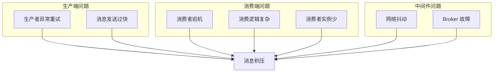

# 消息积压处理

> **目标级别**：P6
> **面试频率**：🟡 中频
> **面试官最关心的 3 个问题**：
> 1. 消息积压的原因是什么？
> 2. 如何快速处理消息积压？
> 3. 如何避免消息积压？

---

面试官问：「线上消息队列积压了 10 万条，怎么处理？」你说「增加消费者」——然后面试官追问「增加消费者能解决问题吗？如果消息本身处理慢呢？」

消息积压是 MQ 使用中常见的问题。快速处理积压只是治标，找到根因才是治本。

## 一、消息积压的原因



| 原因 | 说明 | 紧急程度 |
|------|------|----------|
| **消费者实例少** | 消费者数量不够 | 🔴 紧急 |
| **消费逻辑复杂** | 单条消息处理时间长 | 🔴 紧急 |
| **消费者宕机** | 消费者异常退出 | 🟡 一般 |
| **网络抖动** | 消息拉取失败 | 🟡 一般 |
| **Broker 故障** | Kafka/RocketMQ 异常 | 🔴 紧急 |

## 二、快速处理积压

### 2.1 扩容消费者

```bash
# Kubernetes HPA 自动扩容
apiVersion: autoscaling/v2
kind: HorizontalPodAutoscaler
metadata:
  name: consumer-hpa
spec:
  scaleTargetRef:
    apiVersion: apps/v1
    kind: Deployment
    name: message-consumer
  minReplicas: 5
  maxReplicas: 50
  metrics:
  - type: Resource
    resource:
      name: cpu
      target:
        type: Utilization
        averageUtilization: 70
```

### 2.2 跳过积压消息

```java
// 跳过无法处理的消息，快速消费积压
@RabbitListener(queues = "order-queue")
public void handleMessage(Message message, Channel channel) {
    try {
        processMessage(message);
        channel.basicAck(message.getMessageProperties().getDeliveryTag(), false);
    } catch (Exception e) {
        // 记录异常，跳过继续处理
        log.error("处理消息失败，跳过", e);
        // 记录到死信队列
        channel.basicNack(message.getMessageProperties().getDeliveryTag(), false, false);
    }
}
```

### 2.3 并行处理

```java
// 多线程并行消费
@RabbitListener(queues = "order-queue", concurrency = "10-20")
public void handleMessage(Message message) {
    // 单个消费者内部多线程处理
    CompletableFuture.runAsync(() -> processMessage(message));
}
```

## 三、排查消息积压

### 3.1 RabbitMQ 排查

```bash
# 查看队列状态
rabbitmqctl list_queues name messages messages_ready messages_unacknowledged

# 查看消费者数量
rabbitmqctl list_queues name consumers

# 查看消息积压情况
rabbitmqctl list_queues name messages | grep -v "0$"

# 查看消费者处理速度
rabbitmqctl list_consumers queue_name ack_latency
```

### 3.2 Kafka 排查

```bash
# 查看消费者 Lag
kafka-consumer-groups.sh --bootstrap-server localhost:9092 \
    --group my-group --describe

# 查看 Topic 积压
kafka-consumer-groups.sh --bootstrap-server localhost:9092 \
    --all-groups --describe

# 查看消费者列表
kafka-consumer-groups.sh --bootstrap-server localhost:9092 \
    --list
```

### 3.3 RocketMQ 排查

```bash
# 查看消费堆积
mqadmin consumerProgress -n localhost:9876 -g my-consumer-group

# 查看 Topic 状态
mqadmin topicStatus -n localhost:9876 -t my-topic
```

## 四、解决方案

### 4.1 消费者端优化

```java
// ✅ 优化消费逻辑，减少单条消息处理时间
@Service
public class OptimizedConsumer {
    
    @RabbitListener(queues = "order-queue", concurrency = "10")
    public void handleOrder(OrderMessage message) {
        // 1. 异步处理非核心逻辑
        CompletableFuture.runAsync(() -> sendNotification(message));
        
        // 2. 批量处理
        processInBatch(message);
        
        // 3. 简化主流程
        updateOrderStatus(message.getOrderId());
    }
    
    private void processInBatch(OrderMessage message) {
        // 收集到队列，定时批量处理
        BatchProcessor.add(message);
    }
}
```

### 4.2 限流保护

```java
// 消费端限流，防止压垮下游
@Service
public class RateLimitedConsumer {
    
    private RateLimiter rateLimiter = RateLimiter.create(1000); // 每秒1000条
    
    @RabbitListener(queues = "order-queue")
    public void handleOrder(OrderMessage message) {
        rateLimiter.acquire();
        processOrder(message);
    }
}
```

### 4.3 多 Consumer Group

```java
// 不同的业务使用不同的 Consumer Group
@RabbitListener(queues = "order-queue", containerFactory = "rabbitListenerContainerFactory1")
public void handleOrderPart1(OrderMessage message) {
    // 处理订单状态相关
    updateOrderStatus(message.getOrderId());
}

@RabbitListener(queues = "order-queue", containerFactory = "rabbitListenerContainerFactory2")
public void handleOrderPart2(OrderMessage message) {
    // 处理库存相关
    updateInventory(message.getProductId());
}
```

## 五、预防措施

### 5.1 监控告警

```yaml
# Prometheus 告警规则
- alert: MessageQueueBacklog
  expr: rabbitmq_queue_messages{queue="order-queue"} > 10000
  for: 5m
  labels:
    severity: warning
  annotations:
    summary: "消息队列积压告警"
    description: "队列 {{ $labels.queue }} 积压 {{ $value }} 条消息"

# Kafka Lag 告警
- alert: KafkaConsumerLag
  expr: kafka_consumer_lag_seconds > 300
  for: 5m
  labels:
    severity: warning
```

### 5.2 容量规划

```java
// 根据吞吐量规划消费者数量
public class ConsumerPlanning {
    
    public int calculateConsumerCount(long msgPerSecond, long processTimeMs) {
        // 单消费者处理能力
        long consumerCapacity = 1000 / processTimeMs;
        
        // 需要的消费者数量
        int consumerCount = (int) Math.ceil((double) msgPerSecond / consumerCapacity);
        
        // 额外冗余
        return consumerCount * 2;
    }
}
```

## 六、高频面试题

### 🔴 第一层：消息积压怎么处理？

**问题**：线上消息队列积压了，怎么快速处理？

**参考答案**：

```bash
# 1. 扩容消费者
kubectl scale deployment message-consumer --replicas=20

# 2. 跳过异常消息
channel.basicNack(tag, false, false);

# 3. 临时降级非核心消费
# 暂停非核心消费者的监听

# 4. 多 Consumer Group 分担
```

---

### 🔴 第二层：如何避免消息积压？

**问题**：有什么方法可以预防消息积压？

**参考答案**：

1. **监控告警**：设置积压阈值告警
2. **容量规划**：根据吞吐量规划消费者
3. **限流保护**：消费端限流防止压垮下游
4. **消费者隔离**：核心业务独立队列
5. **异步处理**：非核心逻辑异步化

---

### 🟡 第三层：Kafka 和 RocketMQ 消费模式有什么区别？

**问题**：Kafka 和 RocketMQ 在消费模式上有什么区别？

**参考答案**：

| 对比 | Kafka | RocketMQ |
|------|-------|----------|
| 消费模式 | 拉取模式 | 推拉结合 |
| 顺序消费 | 支持分区顺序 | 支持全局/分区顺序 |
| 消息重试 | 无限重试 | 可配置重试次数 |
| 延迟消息 | 不支持 | 支持 |

---

## 七、常见陷阱

### ⚠️ 陷阱 1：消费者无限扩容

消费者太多会增加数据库/下游服务压力。

### ⚠️ 陷阱 2：跳过所有异常消息

跳过消息可能导致业务数据不一致。

### ⚠️ 陷阱 3：忽略消息顺序

并发消费可能导致消息乱序。

### ⚠️ 陷阱 4：消费端无限重试

死循环重试会加重积压。

---

## 八、加分回答

### 💡 使用 RocketMQ 优先级队列

```java
// 消息优先级处理
@RocketMQMessageListener(
    topic = "order-topic",
    consumerGroup = "high-priority-group",
    selectorExpression = "priority = 1"
)
public void handleHighPriorityOrder(OrderMessage message) {
    // 高优先级订单优先处理
}
```

### 💡 消息消费监控

```java
// 自定义监控埋点
@RabbitListener(queues = "order-queue")
public void handleOrder(OrderMessage message) {
    long startTime = System.currentTimeMillis();
    try {
        processOrder(message);
        metrics.increment("mq.consume.success");
    } catch (Exception e) {
        metrics.increment("mq.consume.failed");
        throw e;
    } finally {
        long cost = System.currentTimeMillis() - startTime;
        metrics.record("mq.consume.latency", cost);
    }
}
```

---

## 九、扩展思考

为什么 Kafka 不支持消息优先级？

> **答案**：
>
> 1. **设计理念**：Kafka 追求高吞吐，优先级队列会增加复杂度
> 2. **分区模型**：消息分散在不同分区，分区内有序但跨分区无优先级
> 3. **替代方案**：使用多个 Topic 实现不同优先级
> 4. **RocketMQ 支持**：通过设置消息优先级，Broker 内部排序
