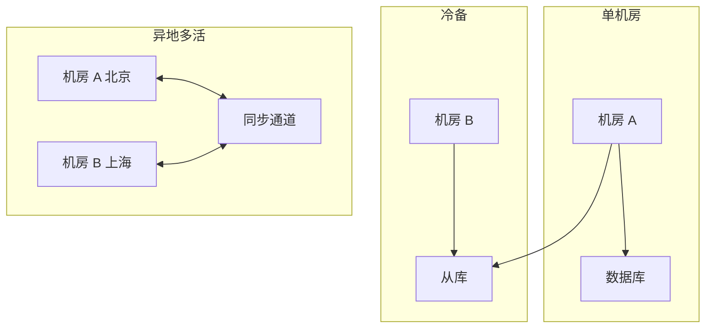
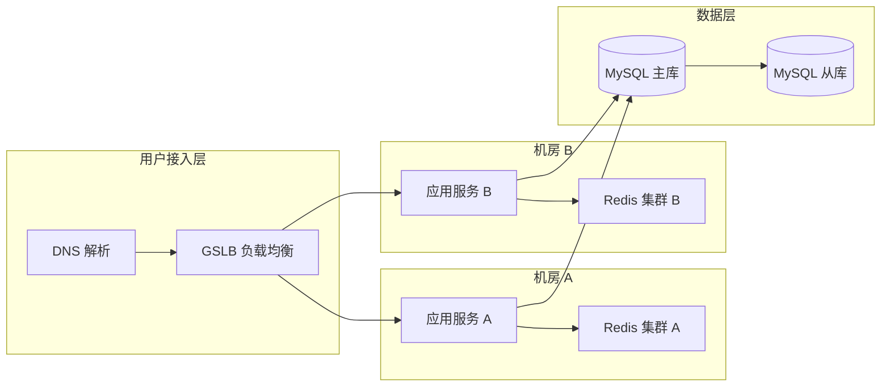
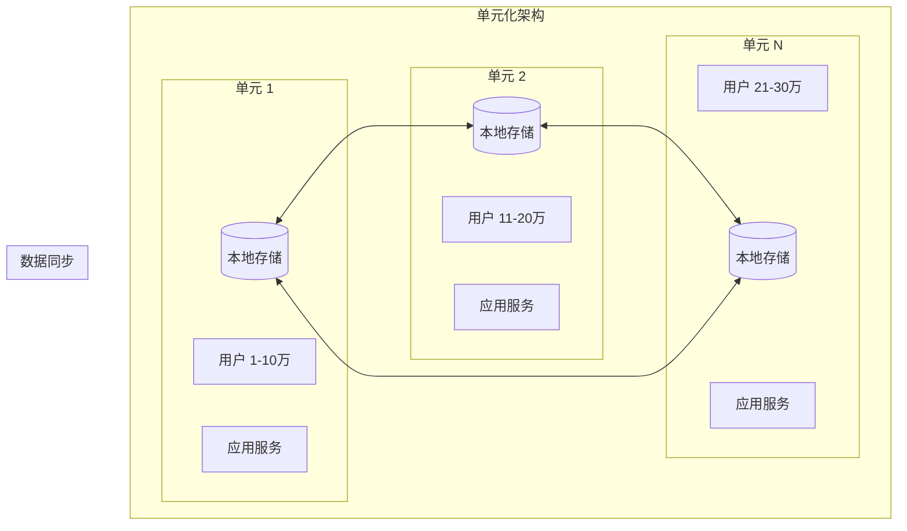
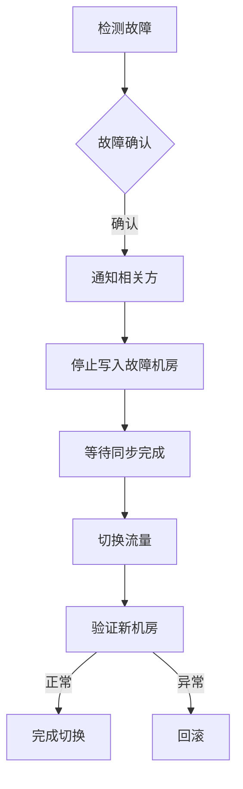

# 异地多活设计

> **目标级别**：P7
> **面试频率**：🟢 低频
> **面试官最关心的 3 个问题**：
> 1. 什么是异地多活？和双机房的区别？
> 2. 如何实现异地多活？
> 3. 异地多活面临哪些挑战？

---

面试官问：「你们系统支持异地多活吗？怎么实现的？」你说「用了数据库主从」——然后面试官追问「主从能算多活吗？切换的时候能做到无感吗？」

异地多活是大型互联网系统的标配，但实现复杂度也很高。

## 一、异地多活的概念



| 架构 | 说明 | 切换时间 | 成本 |
|------|------|----------|------|
| **冷备** | 主从备份，手动切换 | 小时级 | 低 |
| **热备** | 主从自动切换 | 分钟级 | 中 |
| **同城双活** | 同城两机房 | 秒级 | 高 |
| **异地多活** | 异地多机房同时提供服务 | 秒级 | 很高 |

## 二、异地多活架构

### 2.1 同城双活



### 2.2 异地多活



## 三、异地多活的关键技术

### 3.1 数据同步

```java
// Canal 数据同步
@Configuration
public class CanalConfig {
    
    @Bean
    public CanalConnector canalConnector() {
        return Canal.connectors()
            .addConnector(new CanalConnector(
                "127.0.0.1", 11111, 
                "example", "", ""
            ));
    }
}

// 监听数据变更
@Canal(table = "orders")
public class OrderSyncListener {
    
    @Insert
    public void onInsert(Entry entry) {
        RowChange rowChange = RowChange.parseFrom(entry.getStoreValue());
        rowChange.getRowDatasList().forEach(row -> {
            // 同步到其他机房
            syncToRemote(row);
        });
    }
}
```

### 3.2 流量切换

```yaml
# DNS 智能解析
dns:
  rules:
    - name: beijing-shanghai
      source: Beijing
      targets:
        - host: api.example.com
          weight: 100
          region: Beijing
        - host: api-sh.example.com
          weight: 0
          region: Shanghai

# GSLB 配置
gsbl:
  health-check:
    interval: 5s
    timeout: 3s
    unhealthy-threshold: 3
  failover:
    auto: true
    delay: 10s
```

### 3.3 分布式 ID

```java
// 单元化 ID 设计
public class CellIdGenerator {
    
    // 单元 ID（2 位）：01 北京，02 上海，03 广州
    private static final int CELL_BITS = 2;
    private static final int CELL_MASK = (1 << CELL_BITS) - 1;
    
    // 时间戳（41 位）
    private static final int TIMESTAMP_BITS = 41;
    private static final long TIMESTAMP_MASK = (1L << TIMESTAMP_BITS) - 1;
    
    // 序列号（10 位）
    private static final int SEQUENCE_BITS = 10;
    private static final int SEQUENCE_MASK = (1 << SEQUENCE_BITS) - 1;
    
    private int cellId;
    private long lastTimestamp;
    private long sequence;
    
    public long nextId() {
        long timestamp = System.currentTimeMillis() - EPOCH;
        
        if (timestamp == lastTimestamp) {
            sequence = (sequence + 1) & SEQUENCE_MASK;
            if (sequence == 0) {
                timestamp = waitForNextTimestamp();
            }
        } else {
            sequence = 0;
        }
        
        lastTimestamp = timestamp;
        
        return (timestamp & TIMESTAMP_MASK) << (CELL_BITS + SEQUENCE_BITS)
             | (cellId & CELL_MASK) << SEQUENCE_BITS
             | sequence;
    }
    
    public int getCellId(long id) {
        return (int) ((id >> SEQUENCE_BITS) & CELL_MASK);
    }
}
```

### 3.4 路由策略

```java
// 单元化路由
@Service
public class CellRouter {
    
    public String route(String userId) {
        // 根据用户 ID 计算所属单元
        int cellId = calculateCellId(userId);
        return "cell-" + cellId;
    }
    
    private int calculateCellId(String userId) {
        // 哈希取模
        int hash = userId.hashCode();
        return Math.abs(hash % cellCount) + 1;
    }
}

// 强制路由到特定单元
@RestController
public class UserController {
    
    @GetMapping("/user/{id}")
    public User getUser(@PathVariable String id) {
        // 检查是否需要强制路由
        String targetCell = RequestContext.getTargetCell();
        if (StringUtils.isNotBlank(targetCell)) {
            return remoteCall(targetCell, id);
        }
        return userService.getUser(id);
    }
}
```

## 四、异地多活的挑战

| 挑战 | 说明 | 解决方案 |
|------|------|----------|
| **数据一致性** | 跨机房同步延迟 | 最终一致、本地优先 |
| **网络延迟** | 异地网络延迟高 | 就近访问、读写分离 |
| **切换复杂性** | 切换时数据丢失 | 切换窗口、数据校验 |
| **成本高昂** | 多机房多套系统 | 按需建设、逐步迁移 |

## 五、高频面试题

### 🔴 第一层：异地多活和双机房的区别？

**问题**：异地多活和普通的双机房有什么区别？

**参考答案**：

| 对比 | 双机房 | 异地多活 |
|------|--------|----------|
| **服务状态** | 主备分离 | 同时提供服务 |
| **数据同步** | 异步复制 | 同步/准同步 |
| **切换时间** | 分钟级 | 秒级 |
| **用户体验** | 切换时不可用 | 无感知 |
| **成本** | 较低 | 很高 |

---

### 🟡 第二层：如何实现异地多活？

**问题**：异地多活需要哪些技术支持？

**参考答案**：

1. **单元化架构**：用户分片到不同单元
2. **数据同步**：跨机房数据实时同步
3. **流量调度**：DNS/GSLB 智能调度
4. **分布式 ID**：包含单元信息的 ID
5. **路由策略**：同单元访问优先

---

### 🟢 第三层：异地多活的难点是什么？

**问题**：异地多活面临哪些挑战？

**参考答案**：

1. **数据一致性**：跨地域同步存在延迟
2. **网络延迟**：异地网络延迟高达几十毫秒
3. **切换复杂性**：切换时可能丢失数据
4. **成本问题**：多机房建设和运维成本高
5. **业务改造**：需要改造现有架构

---

## 六、常见陷阱

### ⚠️ 陷阱 1：跨机房调用

跨机房调用延迟高，应该避免。

### ⚠️ 陷阱 2：数据同步不及时

跨机房同步有延迟，需要接受最终一致。

### ⚠️ 陷阱 3：切换窗口数据丢失

切换时未同步的数据会丢失。

### ⚠️ 陷阱 4：过度建设

不是所有系统都需要异地多活。

---

## 七、加分回答

### 💡 单元化架构设计

```java
// 单元化部署
@Configuration
public class CellConfiguration {
    
    @Value("${cell.id}")
    private int cellId;
    
    @Bean
    public CellContext cellContext() {
        return new CellContext(cellId);
    }
}

// 单元上下文
public class CellContext {
    
    private final int cellId;
    private final String cellName;
    
    // 本单元优先访问
    public boolean isLocalOperation(String resource) {
        return calculateCellId(resource) == cellId;
    }
}
```

### 💡 故障切换流程



---

## 八、扩展思考

为什么很多公司不选择异地多活？

> **答案**：
>
> 1. **成本太高**：多机房、多套系统成本巨大
> 2. **收益不明显**：大多数公司不需要这么高的可用性
> 3. **复杂度高**：运维和开发复杂度大幅增加
> 4. **网络延迟**：跨地域延迟影响用户体验
> 5. **替代方案**：同城双活 + 异地灾备 更经济
