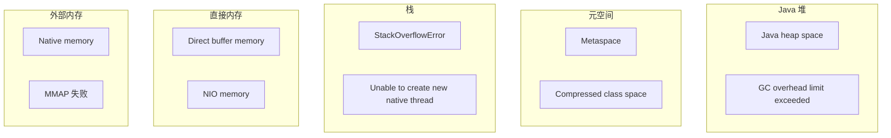
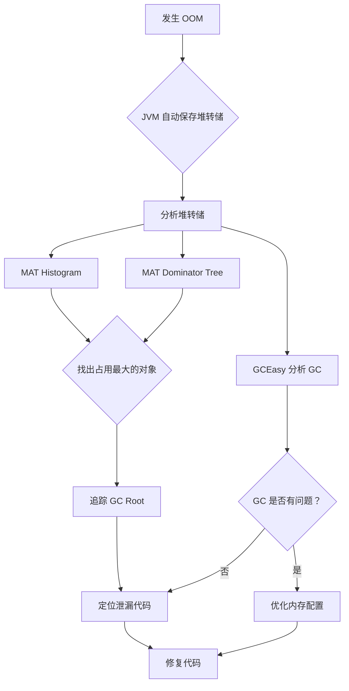

# OOM 排查案例

> **目标级别**：P6
> **面试频率**：🟡 中频
> **面试官最关心的 3 个问题**：
> 1. 常见的 OOM 类型有哪些？
> 2. 如何排查 OOM 根因？
> 3. 如何避免 OOM 发生？

---

面试官问：「线上服务 OOM 了，你怎么排查的？」你说「看日志」——然后面试官追问「OOM 时怎么保留现场？怎么找到泄漏点？」你愣住了。

OOM（Out Of Memory）是生产环境最严重的问题之一。它不像性能慢那样有缓冲时间，而是直接导致服务崩溃。

## 一、OOM 类型分类



### 1.1 堆内存溢出（Java heap space）

```java
// 常见原因
public class HeapOOM {
    // 1. 内存泄漏
    static List<Object> cache = new ArrayList<>();  // 无限增长
    
    // 2. 大对象
    public void createLargeObject() {
        byte[] data = new byte[1024 * 1024 * 1024];  // 1GB
    }
    
    // 3. 递归调用
    public void recursive() {
        int[] arr = new int[1024];  // 每次递归都创建
        recursive();
    }
}
```

### 1.2 元空间溢出（Metaspace）

```java
// 常见原因：动态生成大量类
public class MetaspaceOOM {
    public static void main(String[] args) {
        while (true) {
            // CGLIB 动态代理
            Enhancer enhancer = new Enhancer();
            enhancer.setSuperclass(MetaspaceOOM.class);
            enhancer.setCallback((MethodInterceptor) (obj, method, args, proxy) -> 
                proxy.invokeSuper(obj, args));
            enhancer.create();  // 每次都生成新类
        }
    }
}
```

### 1.3 栈溢出（StackOverflowError）

```java
// 常见原因：递归调用过深
public class StackOverflow {
    private static int depth = 0;
    
    public static void main(String[] args) {
        try {
            recursive();
        } catch (StackOverflowError e) {
            System.out.println("递归深度: " + depth);
        }
    }
    
    public static void recursive() {
        depth++;
        int[] local = new int[1024];  // 增大栈帧
        recursive();
    }
}
```

## 二、OOM 排查步骤

### 2.1 第一步：配置 OOM 时生成堆转储

```bash
# JVM 参数配置
java -Xmx2g -Xms2g \
    -XX:+HeapDumpOnOutOfMemoryError \
    -XX:HeapDumpPath=/var/log/oom.hprof \
    -XX:+PrintGCDetails \
    -XX:+PrintGCDateStamps \
    -Xloggc:/var/log/gc.log \
    Application
```

### 2.2 第二步：分析 OOM 原因

```bash
# 查看 GC 日志
# 分析 GC 原因和频率

# 使用 GCEasy 分析
# https://gceasy.io

# 查看堆转储
jmap -heap <pid>
jmap -histo <pid>
```

### 2.3 第三步：使用 MAT 分析

```bash
# 生成更详细的报告
jhat /var/log/oom.hprof
# 访问 http://localhost:7000 查看

# 或使用 MAT 打开文件分析
```

## 三、实战案例分析

### 3.1 案例一：HashMap 无限增长

```java
// ⚠️ 问题代码
@Service
public class UserSessionCache {
    private static Map<String, UserSession> sessions = new HashMap<>();
    
    public void put(String token, UserSession session) {
        sessions.put(token, session);  // ⚠️ 永不清理
    }
}

// ✅ 优化方案：使用 WeakHashMap 或定时清理
@Service
public class UserSessionCache {
    private Map<String, UserSession> sessions = new ConcurrentHashMap<>();
    private ScheduledExecutorService cleaner = Executors.newSingleThreadScheduledExecutor();
    
    @PostConstruct
    public void init() {
        // 每 30 分钟清理过期会话
        cleaner.scheduleAtFixedRate(() -> {
            sessions.entrySet().removeIf(e -> e.getValue().isExpired());
        }, 30, 30, TimeUnit.MINUTES);
    }
}
```

### 3.2 案例二：ThreadLocal 未清理

```java
// ⚠️ 问题代码
public class RequestContext {
    private static ThreadLocal<UserContext> context = new ThreadLocal<>();
    
    public static void set(UserContext ctx) {
        context.set(ctx);
        // ⚠️ 没有清理
    }
}

// 使用线程池时
@RestController
public class UserController {
    @GetMapping("/user/{id}")
    public User getUser(@PathVariable Long id) {
        UserContext ctx = new UserContext(id);
        RequestContext.set(ctx);
        // ...
        // ⚠️ 方法结束但线程归还线程池，ThreadLocal 仍持有引用
    }
}

// ✅ 优化方案：使用拦截器清理
@Component
public class ThreadLocalCleanerInterceptor implements HandlerInterceptor {
    @Override
    public void afterCompletion(HttpServletRequest request, 
            HttpServletResponse response, Object handler, Exception ex) {
        RequestContext.clear();  // 请求完成后清理
    }
}
```

### 3.3 案例三：连接池配置不当

```java
// ⚠️ 问题配置
DruidDataSource dataSource = new DruidDataSource();
dataSource.setInitialSize(10);
dataSource.setMaxActive(100);  // 连接池过大
// 但数据库最大连接数只有 50

// ✅ 优化方案
dataSource.setInitialSize(5);
dataSource.setMaxActive(50);  // 与数据库一致
dataSource.setMaxWait(3000);  // 设置等待超时
```

## 四、排查流程图



## 五、高频面试题

### 🔴 第一层：有哪些常见的 OOM 类型？

**问题**：Java 中常见的 OOM 类型有哪些？

**参考答案**：

| OOM 类型 | 原因 | 排查方法 |
|----------|------|----------|
| **Java heap space** | 内存泄漏/大对象 | MAT 分析堆转储 |
| **Metaspace** | 类加载过多 | jstat -gc 或 jcmd |
| **StackOverflowError** | 递归过深 | jstack 查看栈深度 |
| **Unable to create native thread** | 线程数过多 | jstack 统计线程 |
| **Direct buffer memory** | NIO 直接内存 | NMT 分析 |

---

### 🔴 第二层：如何排查 OOM？

**问题**：线上 OOM 了，怎么排查？

**参考答案**：

```bash
# 1. 配置 OOM 时生成堆转储
-XX:+HeapDumpOnOutOfMemoryError
-XX:HeapDumpPath=/var/log/oom.hprof

# 2. 分析 GC 日志
-XX:+PrintGCDetails -Xloggc:/var/log/gc.log

# 3. 使用 MAT 分析堆转储
# - Histogram: 按类统计对象
# - Dominator Tree: 找最大对象
# - Leak Suspects: 自动分析泄漏

# 4. 使用 Arthas
heapdump /tmp/heap.hprof
dashboard
```

---

### 🟡 第三层：如何避免 OOM？

**问题**：有什么方法可以从根本上避免 OOM？

**参考答案**：

| 方法 | 说明 |
|------|------|
| **设置合理堆大小** | 根据服务需求设置 -Xmx |
| **对象池** | 复用高频创建的对象 |
| **缓存清理** | 使用带过期机制的缓存 |
| **ThreadLocal 清理** | 请求结束时清理 |
| **监控告警** | 设置内存使用率告警 |
| **代码审查** | 审查集合、缓存相关代码 |

---

## 六、常见陷阱

### ⚠️ 陷阱 1：增大堆内存只是延迟问题

增大堆内存不解决根因，泄漏对象会继续累积。

### ⚠️ 陷阱 2：忽略元空间

JDK8+ 的类元数据存储在元空间，不是堆内存。

### ⚠️ 陷阱 3：忽略直接内存

`ByteBuffer.allocateDirect()` 分配的直接内存不在堆内。

### ⚠️ 陷阱 4：OOM 后服务直接退出

没有配置 `-XX:OnOutOfMemoryError` 做兜底处理。

---

## 七、加分回答

### 💡 使用 Arthas 在线诊断

```bash
# 1. 启动 Arthas
java -jar arthas-boot.jar <pid>

# 2. 查看内存
dashboard

# 3. 生成堆转储
heapdump /tmp/heap.hprof

# 4. 查看对象
ognl '@com.example.Cache@map.size()'

# 5. 监控对象创建
monitor -c 5 com.example.Service createObject
```

### 💡 设置 OOM 时的兜底处理

```bash
# JVM 参数
-XX:OnOutOfMemoryError="/app/restart.sh %p"
```

```bash
#!/bin/bash
# restart.sh
PID=$1
echo "OOM occurred, PID: $PID" | mail -s "OOM Alert" admin@example.com
# 生成堆转储
jstack $PID > /var/log/oom_stack_$(date +%s).log
# 发送告警
curl -X POST "http://alert.example.com/alert" \
    -d "service=myapp&type=oom&pid=$PID"
# 优雅重启
kill -SIGTERM $PID
```

---

## 八、对比总结表

| OOM 类型 | 堆/非堆 | JDK 版本 | 解决方案 |
|----------|---------|----------|----------|
| Java heap space | 堆 | 所有 | 修复泄漏/增大堆 |
| Metaspace | 非堆 | 8+ | 清理类加载器/增大元空间 |
| StackOverflowError | 栈 | 所有 | 修复递归/增大栈 |
| Unable to create native thread | - | 所有 | 减小栈/线程池 |
| Direct buffer memory | 直接内存 | 所有 | 限制直接内存大小 |

---

## 九、扩展思考

如果 OOM 无法复现，如何提前发现潜在风险？

> **答案**：
>
> 1. **监控内存使用趋势**：使用 Prometheus 监控堆内存使用率
> 2. **分析 GC 日志**：使用 GCEasy 分析 GC 行为
> 3. **定期堆转储**：每周自动生成堆转储，对比分析
> 4. **代码审查**：重点审查可能导致泄漏的代码模式
> 5. **压测观察**：压测时观察内存是否正常回收
