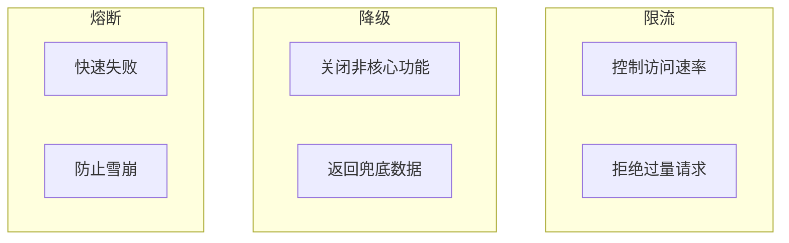
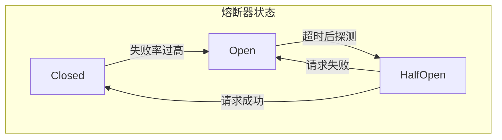
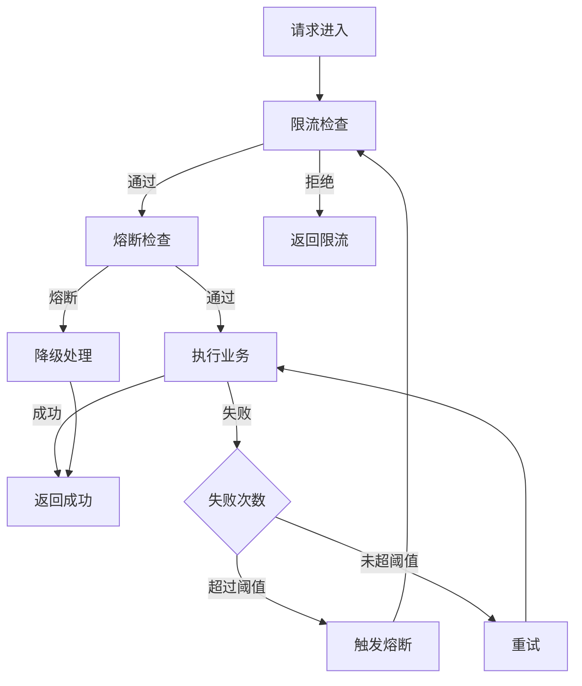

# 限流降级熔断场景

> **目标级别**：P6
> **面试频率**：🔴 高频
> **面试官最关心的 3 个问题**：
> 1. 限流、降级、熔断有什么区别？
> 2. 常用的限流算法有哪些？
> 3. 如何设计一个完整的容错机制？

---

面试官问：「系统扛不住突发流量怎么办？」你说「加机器」——然后面试官追问「加机器也扛不住呢？有没有其他方案？」

限流、降级、熔断是保障系统高可用的三板斧。没有它们，系统在突发流量下会直接崩溃。

## 一、限流、降级、熔断的区别



| 概念 | 目的 | 手段 | 触发条件 |
|------|------|------|----------|
| **限流** | 保护系统 | 拒绝请求 | 超过阈值 |
| **降级** | 保证核心 | 返回兜底 | 服务不可用 |
| **熔断** | 防止雪崩 | 快速失败 | 下游持续超时 |

## 二、限流算法

### 2.1 计数器算法

```java
// 简单计数器 - 有临界问题
@Component
public class SimpleRateLimiter {
    
    private AtomicInteger count = new AtomicInteger(0);
    private long windowStart = System.currentTimeMillis();
    private int limit = 100;
    
    public boolean tryAcquire() {
        long now = System.currentTimeMillis();
        // 窗口滑动
        if (now - windowStart >= 1000) {
            count.set(0);
            windowStart = now;
        }
        return count.incrementAndGet() <= limit;
    }
}
```

### 2.2 滑动窗口算法

```java
// 滑动窗口限流
@Component
public class SlidingWindowRateLimiter {
    
    private LinkedList<Long> windows = new LinkedList<>();
    private int limit = 100;
    private long windowSize = 1000;  // 1 秒
    
    public synchronized boolean tryAcquire() {
        long now = System.currentTimeMillis();
        long windowStart = now - windowSize;
        
        // 移除窗口外的请求
        while (!windows.isEmpty() && windows.peekFirst() <= windowStart) {
            windows.pollFirst();
        }
        
        if (windows.size() `<` limit) {
            windows.addLast(now);
            return true;
        }
        return false;
    }
}
```

### 2.3 令牌桶算法

```java
// 令牌桶算法 - 推荐
@Component
public class TokenBucketRateLimiter {
    
    private int capacity;  // 桶容量
    private int rate;      // 每秒补充令牌数
    private double currentTokens;
    private long lastRefillTime;
    
    public TokenBucketRateLimiter(int capacity, int rate) {
        this.capacity = capacity;
        this.rate = rate;
        this.currentTokens = capacity;
        this.lastRefillTime = System.currentTimeMillis();
    }
    
    public synchronized boolean tryAcquire(int permits) {
        refill();
        
        if (currentTokens >= permits) {
            currentTokens -= permits;
            return true;
        }
        return false;
    }
    
    private void refill() {
        long now = System.currentTimeMillis();
        double elapsed = (now - lastRefillTime) / 1000.0;
        double tokensToAdd = elapsed * rate;
        
        currentTokens = Math.min(capacity, currentTokens + tokensToAdd);
        lastRefillTime = now;
    }
}

// 使用 Guava RateLimiter
@RestController
public class RateLimitController {
    
    // 每秒 100 个请求
    private RateLimiter rateLimiter = RateLimiter.create(100);
    
    @GetMapping("/api/resource")
    public String getResource() {
        // 获取令牌，获取不到会阻塞
        rateLimiter.acquire();
        return "OK";
    }
}
```

### 2.4 漏桶算法

```java
// 漏桶算法
@Component
public class LeakyBucketRateLimiter {
    
    private int capacity;       // 桶容量
    private int leakRate;       // 漏出速率（每秒）
    private double currentLevel; // 当前水位
    private long lastLeakTime;  // 上次漏水时间
    
    public synchronized boolean tryAcquire() {
        long now = System.currentTimeMillis();
        
        // 漏水
        double elapsed = (now - lastLeakTime) / 1000.0;
        currentLevel = Math.max(0, currentLevel - elapsed * leakRate);
        lastLeakTime = now;
        
        if (currentLevel `<` capacity) {
            currentLevel++;
            return true;
        }
        return false;
    }
}
```

## 三、限流方案对比

| 算法 | 优点 | 缺点 | 适用场景 |
|------|------|------|----------|
| **计数器** | 简单 | 有临界问题 | 粗粒度限流 |
| **滑动窗口** | 精确 | 实现复杂 | 精细限流 |
| **令牌桶** | 支持突发 | 实现复杂 | 允许突发 |
| **漏桶** | 平滑 | 浪费容量 | 流量整形 |

## 四、降级方案

### 4.1 降级策略

```java
// 降级示例
@Service
public class ProductService {
    
    @HystrixCommand(fallbackMethod = "getProductFallback")
    public Product getProduct(Long id) {
        // 调用商品服务
        return productClient.get(id);
    }
    
    // 兜底方法
    public Product getProductFallback(Long id) {
        // 返回缓存数据或默认值
        return productCache.get(id).orElse(Product.DEFAULT);
    }
}

// 使用 Sentinel 实现降级
@RestController
public class SentinelController {
    
    @GetMapping("/api/product/{id}")
    @SentinelResource(value = "getProduct",
        fallback = "getProductFallback",
        blockHandler = "getProductBlock")
    public Product getProduct(@PathVariable Long id) {
        return productService.getProduct(id);
    }
    
    // 降级方法
    public Product getProductFallback(Long id, Throwable ex) {
        return Product.DEFAULT;
    }
    
    // 限流处理
    public Product getProductBlock(Long id, BlockException ex) {
        throw new BusinessException("系统繁忙，请稍后重试");
    }
}
```

### 4.2 降级策略配置

```yaml
# Sentinel 降级配置
sentinel:
  rules:
    degradation:
      - resource: getProduct
        grade: 2  # 响应时间降级
        count: 100  # 响应时间阈值(ms)
        timeWindow: 10  # 降级时间窗口(s)
```

## 五、熔断方案

### 5.1 熔断器原理



| 状态 | 说明 | 行为 |
|------|------|------|
| **Closed** | 熔断器关闭 | 正常调用 |
| **Open** | 熔断器打开 | 快速失败 |
| **HalfOpen** | 半开状态 | 探测恢复 |

### 5.2 Sentinel 熔断配置

```java
// Sentinel 熔断配置
@Configuration
public class SentinelConfig {
    
    @PostConstruct
    public void init() {
        // 慢调用比例熔断
        DegradeRule slowRatioRule = new DegradeRule("getProduct")
            .setGrade(CircuitBreakerStrategy.SLOW_REQUEST_RATIO.getType())
            .setCount(0.5)           // 比例阈值
            .setSlowRatioThreshold(200)  // 慢调用阈值(ms)
            .setMinRequestAmount(5)  // 最小请求数
            .setStatInterval(10)     // 统计时间(s)
            .setTimeWindow(10);      // 熔断时长(s)
        
        // 异常比例熔断
        DegradeRule errorRatioRule = new DegradeRule("getProduct")
            .setGrade(CircuitBreakerStrategy.ERROR_RATIO.getType())
            .setCount(0.5)           // 异常比例 50%
            .setMinRequestAmount(5)
            .setStatInterval(10)
            .setTimeWindow(10);
        
        DegradeRuleManager.loadRules(Arrays.asList(slowRatioRule, errorRatioRule));
    }
}
```

### 5.3 Resilience4j 熔断配置

```yaml
# Resilience4j 配置
resilience4j:
  circuitbreaker:
    instances:
      productService:
        registerHealthIndicator: true
        slidingWindowSize: 100
        slidingWindowType: COUNT_BASED
        minimumNumberOfCalls: 10
        permittedNumberOfCallsInHalfOpenState: 3
        automaticTransitionFromOpenToHalfOpenEnabled: true
        waitDurationInOpenState: 10s
        failureRateThreshold: 50
        eventConsumerBufferSize: 10
```

## 六、完整容错机制设计



## 七、高频面试题

### 🔴 第一层：限流算法有哪些？

**问题**：常用的限流算法是什么？有什么区别？

**参考答案**：

| 算法 | 原理 | 特点 |
|------|------|------|
| **计数器** | 统计固定时间窗口请求数 | 简单，有临界问题 |
| **滑动窗口** | 滑动时间窗口统计 | 精确，无临界问题 |
| **令牌桶** | 按固定速率添加令牌 | 支持突发 |
| **漏桶** | 按固定速率消费请求 | 平滑，浪费容量 |

---

### 🔴 第二层：限流、降级、熔断的区别？

**问题**：限流、降级、熔断分别解决什么问题？

**参考答案**：

- **限流**：控制访问速率，保护系统不被压垮
- **降级**：关闭非核心功能，保证核心功能可用
- **熔断**：当下游持续失败时，快速失败防止雪崩

---

### 🟡 第三层：如何选择限流算法？

**问题**：什么场景下用什么限流算法？

**参考答案**：

- **需要精确限流**：滑动窗口
- **允许一定突发**：令牌桶
- **需要流量整形**：漏桶
- **简单场景**：计数器

---

## 八、常见陷阱

### ⚠️ 陷阱 1：限流阈值设置不当

阈值太低影响正常请求，阈值太高起不到保护作用。

### ⚠️ 陷阱 2：降级策略不完善

降级后返回的数据要保证基本可用，不能直接报错。

### ⚠️ 陷阱 3：熔断后不恢复

熔断后要有恢复机制，否则服务永久不可用。

### ⚠️ 陷阱 4：只限流不做监控

限流应该有监控，了解被限流的请求比例。

---

## 九、加分回答

### 💡 分布式限流

```java
// 使用 Redis 实现分布式限流
@Service
public class RedisRateLimiter {
    
    @Autowired
    private RedisTemplate<String, String> redisTemplate;
    
    public boolean tryAcquire(String key, int limit, int windowSeconds) {
        String lua = """
            local current = redis.call('INCR', KEYS[1])
            if current == 1 then
                redis.call('EXPIRE', KEYS[1], ARGV[1])
            end
            return current
            """;
        
        Long count = redisTemplate.execute(
            new DefaultRedisScript<>(lua, Long.class),
            Collections.singletonList(key),
            String.valueOf(windowSeconds)
        );
        
        return count != null && count <= limit;
    }
}
```

### 💡 Sentinel 注解方式

```java
// 使用注解定义限流和降级
@RestController
public class AnnotationController {
    
    @GetMapping("/api/resource")
    @SentinelResource(value = "resource",
        blockHandler = "blockHandler",
        fallback = "fallback")
    public String getResource() {
        return "OK";
    }
    
    // 限流处理
    public String blockHandler(BlockException ex) {
        return "请求过于频繁，请稍后重试";
    }
    
    // 降级处理
    public String fallback(Throwable ex) {
        return "服务暂时不可用";
    }
}
```

---

## 十、扩展思考

为什么需要降级而不是直接熔断？

> **答案**：
>
> 1. **熔断是保护下游**，降级是保护自己
> 2. **熔断后服务不可用**，降级后核心功能仍可用
> 3. **降级提供兜底方案**，让用户体验不至于太差
> 4. **两者配合使用**：先降级，频繁降级后熔断
