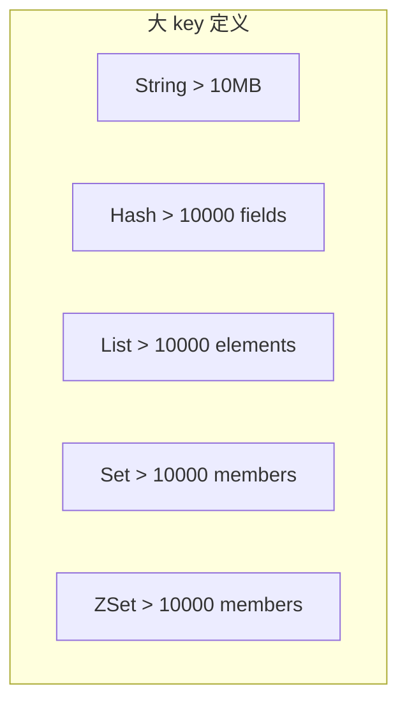
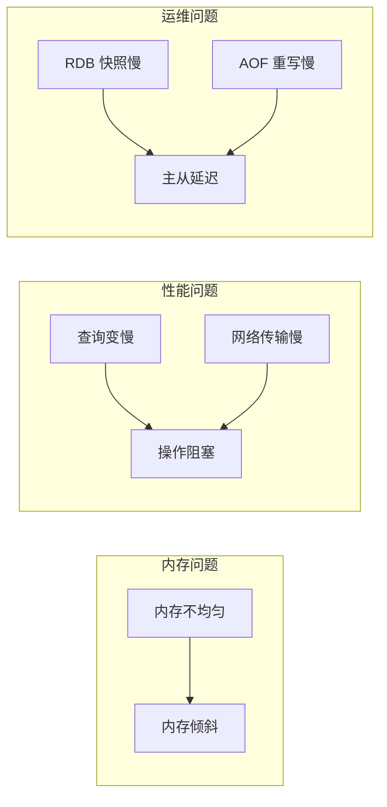
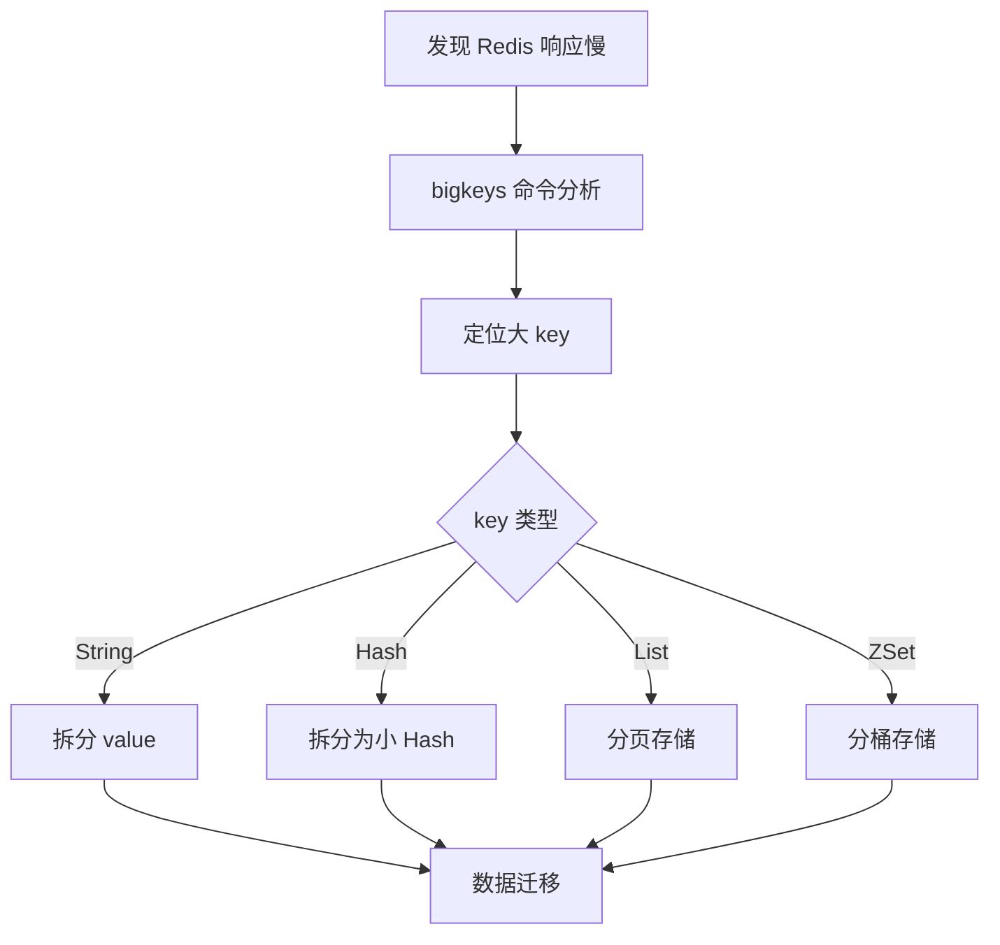

# Redis 大 key 排查

> **目标级别**：P6
> **面试频率**：🔴 高频
> **面试官最关心的 3 个问题**：
> 1. 什么是 Redis 大 key？有什么危害？
> 2. 如何发现和定位大 key？
> 3. 如何优化和避免大 key？

---

面试官问：「线上 Redis 响应慢，怎么排查？」你说「可能是大 key」——然后面试官追问「大 key 有什么危害？怎么定位和解决？」

Redis 大 key 是生产环境中常见的问题。它会导致内存不均、查询变慢、主从同步延迟等系列问题。

## 一、什么是大 key



| 类型 | 大 key 阈值 | 说明 |
|------|------------|------|
| **String** | > 10MB | value 过大 |
| **Hash** | > 10000 fields | 字段过多 |
| **List** | > 10000 elements | 元素过多 |
| **Set** | > 10000 members | 成员过多 |
| **ZSet** | > 10000 members | 成员过多 |

## 二、大 key 的危害



| 问题类型 | 具体表现 | 影响程度 |
|----------|----------|----------|
| **内存倾斜** | 节点内存不均匀 | 🔴 严重 |
| **操作阻塞** | 单命令执行时间长 | 🔴 严重 |
| **网络阻塞** | 大 value 传输慢 | 🟡 中等 |
| **主从延迟** | 同步时间长 | 🟡 中等 |
| **fork 阻塞** | RDB 生成慢 | 🟡 中等 |

## 三、如何发现大 key

### 3.1 使用 bigkeys 命令

```bash
# Redis 5.0+ 内置命令
redis-cli --bigkeys

# 输出示例
# Scanning 1000000 keys
# -----------
# big keys that took most memory
# 0) type: string, key: user:session:abc123, size: 15MB
# 1) type: hash, key: product:details, num: 100000
# 2) type: list, key: log:access, num: 50000
```

### 3.2 使用 SCAN + STRLEN

```bash
# 扫描所有 key 并分析大小
redis-cli --scan | head -1000 | \
    while read key; do
        echo -n "$key: ";
        redis-cli strlen "$key";
    done | sort -t: -k2 -nr | head -10
```

### 3.3 使用 MEMORY USAGE

```bash
# Redis 4.0+ 查看单个 key 内存使用
redis-cli MEMORY USAGE user:12345

# 扫描大 hash
redis-cli --scan --pattern "product:*" | \
    while read key; do
        info=$(redis-cli HLEN "$key")
        if [ "$info" -gt 10000 ]; then
            echo "$key: $info fields"
        fi
    done
```

### 3.4 使用 Redis RDB 分析工具

```bash
# 使用 rdb-tools 分析 RDB 文件
rdb --command memory /var/redis/dump.rdb --sorted | head -20

# 分析大 key 分布
rdb -c memory dump.rdb --bytes 10240 --topkeys 20
```

## 四、大 key 优化方案

### 4.1 String 类型大 key

```java
// ⚠️ 问题：存储大 JSON
String key = "user:12345";
String value = JSON.toJSONString(userObject);  // 可能 10MB
redis.set(key, value);

// ✅ 优化方案1：拆分存储
Map<String, String> userMap = new HashMap<>();
userMap.put("name", user.getName());
userMap.put("email", user.getEmail());
userMap.put("profile", user.getProfile());
redis.hmset("user:12345", userMap);

// ✅ 优化方案2：压缩存储
byte[] compressed = compress(JSON.toJSONString(userObject));
redis.set("user:12345:compressed", compressed);

// ✅ 优化方案3：使用 Hash 结构
redis.hset("user:12345", "name", user.getName());
redis.hset("user:12345", "data", user.getLargeData());
```

### 4.2 Hash 类型大 key

```java
// ⚠️ 问题：Hash 字段过多
redis.hset("product:all", "p1", json1);
redis.hset("product:all", "p2", json2);
// ... 10 万个字段

// ✅ 优化方案：拆分为小 Hash
redis.hset("product:page:1", "p1", json1);
redis.hset("product:page:1", "p2", json2);
// 分页存储，每页 1000 个
redis.hset("product:page:100", "p9999", json9999);

// ✅ 优化方案：Hash 改用 String
redis.set("product:1", json1);
redis.set("product:2", json2);
// 用 SET 存储 key 列表
redis.sadd("product:ids", "1", "2", "3");
```

### 4.3 List 类型大 key

```java
// ⚠️ 问题：列表无限增长
redis.lpush("log:all", logMessage);  // 永不清理

// ✅ 优化方案1：固定长度列表
redis.lpush("log:recent", logMessage);
redis.ltrim("log:recent", 0, 999);  // 只保留 1000 条

// ✅ 优化方案2：分页存储
public void addLog(String log) {
    long size = redis.llen("log:page:current");
    if (size >= 1000) {
        // 创建新页面
        redis.incr("log:page:index");
    }
    String currentPage = redis.get("log:page:current");
    redis.lpush("log:" + currentPage, log);
}

// ✅ 优化方案3：使用 Sorted Set 按时间分片
redis.zadd("log:2024:01", timestamp, logMessage);
redis.zremrangebyrank("log:2024:01", 0, -10001);  // 只保留最新 10000 条
```

### 4.4 ZSet 类型大 key

```java
// ⚠️ 问题：ZSet 成员过多
redis.zadd("ranking:global", score, userId);  // 千万级用户

// ✅ 优化方案1：分桶
redis.zadd("ranking:bucket:0", score, userId);
redis.zadd("ranking:bucket:1", score, userId);
// ...
// 查询时聚合多个桶

// ✅ 优化方案2：定时归档
// 活跃用户和非活跃用户分开
if (isActive) {
    redis.zadd("ranking:active", score, userId);
} else {
    redis.zadd("ranking:inactive", score, userId);
}
```

## 五、大 key 删除

```bash
# ⚠️ 普通 DEL 阻塞问题
redis-cli DEL big:key  # 阻塞主线程

# ✅ 优化删除：分批删除
redis-cli --scan --pattern "big:list:*" | \
    while read key; do
        redis-cli LTRIM "$key" 0 -1001  # 每次删 1000 个
        redis-cli DEL "$key"            # 最后删除空列表
    done

# ✅ 使用 UNLINK（非阻塞删除）
redis-cli UNLINK big:key  # 异步删除，不阻塞主线程

# ✅ 使用 SCAN 迭代删除
SCAN 0 MATCH big:hash:* COUNT 1000
# 对每批结果执行 DEL/UNLINK
```

## 六、排查流程图



## 七、高频面试题

### 🔴 第一层：什么是大 key？有什么危害？

**问题**：Redis 大 key 是指什么？有什么问题？

**参考答案**：

- **定义**：String > 10MB，Hash/List/Set/ZSet > 10000 元素
- **危害**：
  - 内存不均匀（集群环境下）
  - 单命令执行时间长（阻塞）
  - 网络传输慢
  - 主从复制延迟
  - RDB/AOF 快照慢

---

### 🔴 第二层：如何发现大 key？

**问题**：怎么找到 Redis 中的大 key？

**参考答案**：

```bash
# 1. bigkeys 命令
redis-cli --bigkeys

# 2. MEMORY USAGE（Redis 4.0+）
redis-cli MEMORY USAGE key

# 3. SCAN 扫描
redis-cli --scan | while read key; do 
    echo "$key: $(redis-cli STRLEN $key)"
done

# 4. RDB 分析工具
rdb --command memory dump.rdb
```

---

### 🟡 第三层：如何优化大 key？

**问题**：大 key 应该怎么优化？

**参考答案**：

| 类型 | 优化方案 |
|------|----------|
| **String** | 拆分存储、压缩存储 |
| **Hash** | 拆分为小 Hash |
| **List** | 分页存储、固定长度 |
| **ZSet** | 分桶存储 |

---

## 八、常见陷阱

### ⚠️ 陷阱 1：使用 DEL 删除大 key

DEL 会阻塞主线程，应该使用 UNLINK。

### ⚠️ 陷阱 2：直接读取大 value

应该使用 SCAN 分批读取。

### ⚠️ 陷阱 3：忽略内存监控

没有监控就无法提前发现大 key。

### ⚠️ 陷阱 4：删除后不清理关联数据

删除大 key 时要注意关联的过期 key。

---

## 九、加分回答

### 💡 使用 Redis-Memory-Analyzer

```bash
# 安装
pip install redis-memory-analyzer

# 分析
rma -h 127.0.0.1 -p 6379 --pattern "user:*"
```

### 💡 使用 Redis 监控告警

```yaml
# Prometheus + Redis Exporter
# 配置大 key 告警规则
- alert: RedisBigKey
  expr: redis_biggestkey_size_bytes > 10485760
  for: 5m
  labels:
    severity: warning
  annotations:
    summary: "Redis 大 key 告警"
    description: "Key {{ $labels.key }} size: {{ $value }}"
```

---

## 十、扩展思考

如何设计一个防止大 key 的机制？

> **答案**：
>
> 1. **写入前校验**：写入前检查 value 大小
> 2. **定期扫描**：定时任务扫描大 key 并告警
> 3. **容量规划**：根据业务预估数据量
> 4. **代码审查**：review 缓存使用代码
> 5. **技术约束**：使用 Redis Module 限制大小
