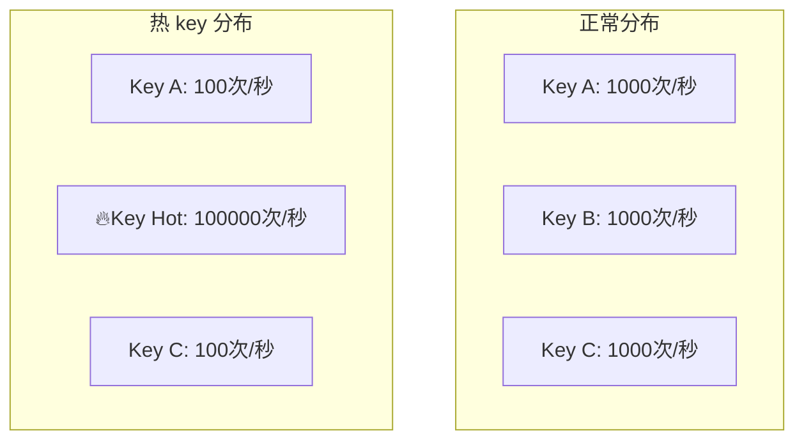
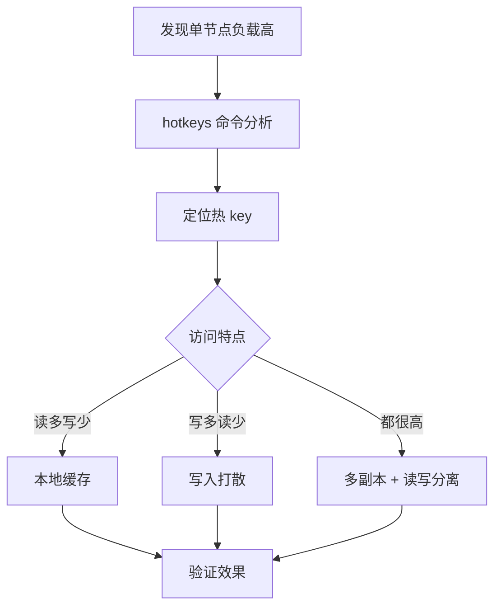

# Redis 热 key 处理

> **目标级别**：P6
> **面试频率**：🟡 中频
> **面试官最关心的 3 个问题**：
> 1. 什么是热 key？有什么危害？
> 2. 如何发现热 key？
> 3. 如何解决热 key 问题？

---

面试官问：「线上 Redis 集群有个节点 CPU 特别高，怎么回事？」你说「可能是热 key」——然后面试官追问「热 key 是什么？怎么解决？」

热 key 是分布式系统中的经典问题。当某个 key 的访问量远超其他 key 时，会导致 Redis 集群负载不均，单节点成为瓶颈。

## 一、什么是热 key



| 特征 | 说明 |
|------|------|
| **访问集中** | 某个 key 访问量远超其他 key |
| **热点数据** | 通常是热门商品、明星、热词等 |
| **集中访问** | 短时间内大量请求访问同一个 key |

## 二、热 key 的危害

| 问题 | 说明 | 影响 |
|------|------|------|
| **负载不均** | 单节点压力过大 | Redis 集群不均衡 |
| **CPU 高** | 单线程处理大量请求 | 响应变慢 |
| **内存高** | 单节点内存占用大 | 可能触发淘汰 |
| **请求倾斜** | 大部分请求打到某节点 | 集群效率低 |
| **故障扩散** | 热点节点故障影响大 | 服务不可用 |

## 三、如何发现热 key

### 3.1 使用 Redis-CLI --hotkeys

```bash
# Redis 4.0+ 内置热 key 发现
redis-cli --hotkeys

# 输出示例
# scanning for keys with 10 accesses in the sample
# 0) type: string, key: "hot:product:12345", samples: 1000, size: 1024
# 1) type: string, key: "hot:user:100", samples: 500, size: 512
```

### 3.2 使用 MONITOR 采样分析

```bash
# 采样分析（生产环境慎用）
redis-cli MONITOR | head -10000 | \
    awk '{print $2}' | \
    sort | uniq -c | sort -rn | head -10

# Python 脚本方式
```python
import redis
from collections import Counter

client = redis.Redis()
key_counter = Counter()

for _ in range(100000):
    key = client.randomkey()
    key_counter[key] += 1

for key, count in key_counter.most_common(10):
    print(f"{key}: {count}")
```

### 3.3 使用 Redis 流量统计

```bash
# 使用 Redis-Faina（Facebook 开源工具）
redis-cli --monitor | python redis-faina.py
```

### 3.4 使用 Proxy 层统计

```bash
# 如果使用 Twemproxy/Codis
# 查看代理层统计

# 如果使用 Redis Cluster
redis-cli -h <node-ip> INFO commandstats
# 查看命令统计
```

## 四、热 key 解决方案

### 4.1 方案一：本地缓存

```java
// ✅ 使用本地缓存存储热 key
@Component
public class HotKeyCache {
    
    private LoadingCache<String, Object> localCache = Caffeine.newBuilder()
        .maximumSize(10000)
        .expireAfterWrite(30, TimeUnit.SECONDS)
        .build();
    
    @Autowired
    private RedisTemplate<String, Object> redisTemplate;
    
    public Object getHotKey(String key) {
        // 1. 先查本地缓存
        Object value = localCache.getIfPresent(key);
        if (value != null) {
            return value;
        }
        
        // 2. 查 Redis
        value = redisTemplate.opsForValue().get(key);
        if (value != null) {
            // 写入本地缓存
            localCache.put(key, value);
        }
        return value;
    }
}
```

### 4.2 方案二：热点 key 打散

```java
// ✅ 将热点 key 打散到多个 key
@Component
public class HotKeySharding {
    
    private static final int SHARD_COUNT = 10;
    
    public String getShardingKey(String key) {
        // 根据 key 哈希到不同的分片
        int shard = Math.abs(key.hashCode() % SHARD_COUNT);
        return key + ":" + shard;
    }
    
    public void setHotValue(String key, Object value) {
        for (int i = 0; i < SHARD_COUNT; i++) {
            String shardedKey = key + ":" + i;
            redisTemplate.opsForValue().set(shardedKey, value, 60, TimeUnit.SECONDS);
        }
    }
    
    public Object getHotValue(String key) {
        // 随机选择一个分片
        int shard = ThreadLocalRandom.current().nextInt(SHARD_COUNT);
        String shardedKey = key + ":" + shard;
        return redisTemplate.opsForValue().get(shardedKey);
    }
}
```

### 4.3 方案三：读写分离

```java
// ✅ 使用 Redis 读写分离
@Configuration
public class RedisConfig {
    
    @Bean
    public RedisTemplate<String, Object> readRedisTemplate() {
        // 读从节点
        RedisTemplate<String, Object> template = new RedisTemplate<>();
        template.setConnectionFactory(readConnectionFactory);
        return template;
    }
    
    @Bean
    public RedisTemplate<String, Object> writeRedisTemplate() {
        // 写主节点
        RedisTemplate<String, Object> template = new RedisTemplate<>();
        template.setConnectionFactory(writeConnectionFactory);
        return template;
    }
}

@Service
public class HotKeyService {
    
    @Autowired
    private RedisTemplate<String, Object> readTemplate;
    
    @Autowired
    private RedisTemplate<String, Object> writeTemplate;
    
    // 读操作走从节点
    public Object getHotKey(String key) {
        return readTemplate.opsForValue().get(key);
    }
    
    // 写操作走主节点
    public void setHotKey(String key, Object value) {
        writeTemplate.opsForValue().set(key, value, 60, TimeUnit.SECONDS);
    }
}
```

### 4.4 方案四：Redis Cluster 多副本

```bash
# 使用 Redis Cluster 并开启副本读
# 配置 replica-read-only no

# 客户端读从节点
redis-cli -c -h <slave-ip> GET hot:key
```

### 4.5 方案五：热点探测 + 预热

```java
// ✅ 热点 key 自动识别和预热
@Component
public class HotKeyDetector {
    
    private ConcurrentHashMap<String, AtomicLong> keyCounter = new ConcurrentHashMap<>();
    private ScheduledExecutorService scheduler = Executors.newSingleThreadScheduledExecutor();
    
    @PostConstruct
    public void init() {
        // 每秒统计
        scheduler.scheduleAtFixedRate(this::reportHotKeys, 1, 1, TimeUnit.SECONDS);
    }
    
    public void recordAccess(String key) {
        keyCounter.computeIfAbsent(key, k -> new AtomicLong())
                  .incrementAndGet();
    }
    
    private void reportHotKeys() {
        // 找出访问量超过阈值的 key
        keyCounter.entrySet().stream()
            .filter(e -> e.getValue().get() > 10000)
            .forEach(e -> {
                // 触发告警和预热
                alertHotKey(e.getKey(), e.getValue().get());
            });
        
        // 重置计数器
        keyCounter.clear();
    }
}
```

## 五、排查流程图



## 六、高频面试题

### 🔴 第一层：什么是热 key？有什么危害？

**问题**：Redis 热 key 是指什么？会带来什么问题？

**参考答案**：

- **热 key**：访问量远高于其他 key 的热点数据
- **危害**：
  - 单节点负载过高
  - 集群请求不均衡
  - 响应延迟增加
  - 可能导致服务不可用

---

### 🔴 第二层：如何发现热 key？

**问题**：怎么找到 Redis 中的热 key？

**参考答案**：

```bash
# 1. Redis 内置 hotkeys
redis-cli --hotkeys

# 2. MONITOR 采样
redis-cli MONITOR | head -10000 | sort | uniq -c

# 3. Proxy 层统计
# 如果使用 Twemproxy/Codis

# 4. Redis-Faina
redis-cli --monitor | python redis-faina.py
```

---

### 🟡 第三层：热 key 怎么解决？

**问题**：有什么方案可以解决热 key 问题？

**参考答案**：

| 方案 | 适用场景 | 说明 |
|------|----------|------|
| **本地缓存** | 读多写少 | 使用本地缓存分担压力 |
| **热点打散** | 读多写少 | 将热点 key 分片 |
| **多副本** | 读多写少 | 从节点分担读请求 |
| **预热** | 可预测热点 | 提前加载热点数据 |

---

## 七、常见陷阱

### ⚠️ 陷阱 1：本地缓存和 Redis 不一致

本地缓存有更新延迟，需要合理设置过期时间。

### ⚠️ 陷阱 2：热 key 统计影响性能

MONITOR 在生产环境对性能影响大，建议采样分析。

### ⚠️ 陷阱 3：热点数据变化后未刷新

需要监控热点 key 的变化，及时更新。

### ⚠️ 陷阱 4：只缓存不监控

应该持续监控热 key 的访问情况。

---

## 八、加分回答

### 💡 使用 Redis 6.0 Threaded I/O

```bash
# redis.conf 配置
io-threads 4
io-threads-do-reads yes
```

### 💡 使用阿里云 Redis 热key探测

```java
// 使用阿里云 Redis 的热 key 探测功能
JedisPooled jedis = new JedisPooled("localhost", 6379);
HotKeyDetector detector = new HotKeyDetector(jedis);
detector.startMonitor();
```

---

## 九、扩展思考

热 key 和大 key 有什么区别？

> **答案**：
>
> | 对比维度 | 热 key | 大 key |
> |----------|--------|--------|
> | **定义** | 访问量高的 key | 数据量大的 key |
> | **问题** | 请求倾斜 | 内存/操作阻塞 |
> | **影响** | 负载不均 | 单操作慢 |
> | **解决** | 缓存/分片 | 拆分/压缩 |
