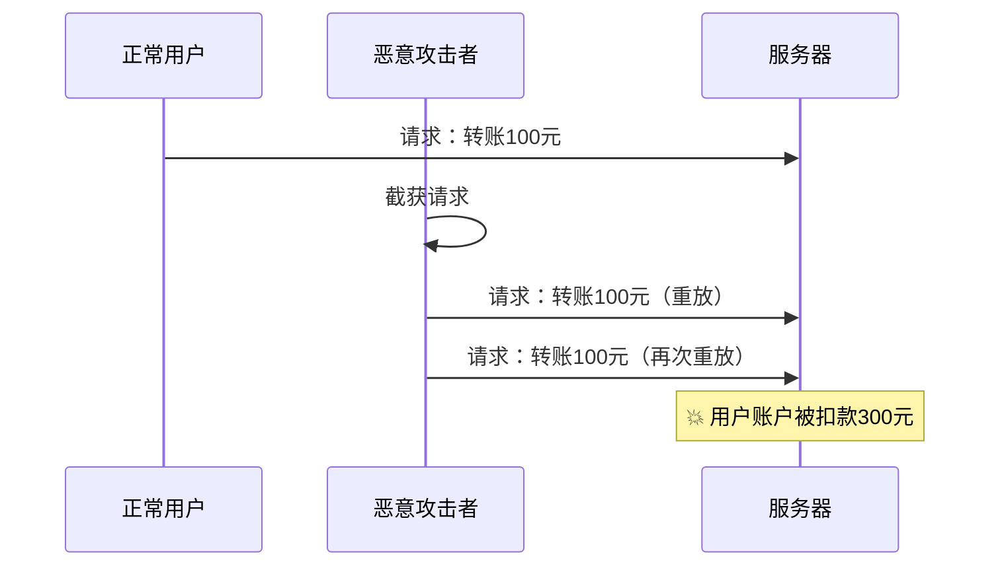
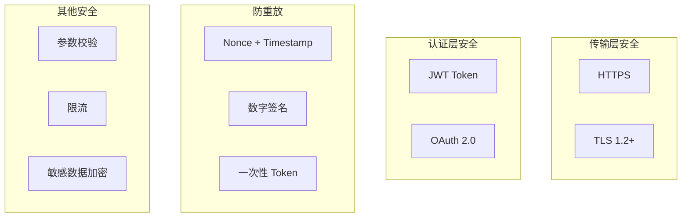

# 接口重放攻击防护

> **目标级别**：P6
> **面试频率**：🟡 中频
> **面试官最关心的 3 个问题**：
> 1. 什么是重放攻击？
> 2. 如何防止重放攻击？
> 3. 接口安全还需要注意哪些问题？

---

面试官问：「你设计的接口安全吗？能防止重放攻击吗？」你说「用了 HTTPS」——然后面试官追问「HTTPS 能防止重放吗？还需要什么？」

接口安全不仅仅是 HTTPS。重放攻击是网络安全中最常见的攻击方式之一，需要从多个层面进行防护。

## 一、什么是重放攻击



重放攻击：攻击者截获正常请求后，重复发送该请求进行恶意操作。

## 二、重放攻击的危害

| 攻击类型 | 危害 | 举例 |
|----------|------|------|
| **金融交易** | 财产损失 | 重复扣款、转账 |
| **认证请求** | 身份伪造 | 登录请求重放获取 Token |
| **数据篡改** | 数据不一致 | 修改请求参数 |
| **DoS 攻击** | 服务不可用 | 大量重放消耗资源 |

## 三、防重放方案

### 3.1 方案一：Nonce + Timestamp

```java
// 客户端生成唯一 nonce
public class NonceGenerator {
    
    public static String generateNonce() {
        return UUID.randomUUID().toString().replace("-", "");
    }
    
    public static String generateTimestamp() {
        return String.valueOf(System.currentTimeMillis());
    }
}

// 客户端请求
public class ClientRequest {
    
    public void sendRequest(String data) {
        String nonce = NonceGenerator.generateNonce();
        String timestamp = NonceGenerator.generateTimestamp();
        
        // 发送请求
        HttpRequest request = HttpRequest.newBuilder()
            .uri(URI.create("https://api.example.com/order"))
            .header("X-Nonce", nonce)
            .header("X-Timestamp", timestamp)
            .header("X-Signature", sign(data, nonce, timestamp))
            .POST(HttpRequest.BodyPublishers.ofString(data))
            .build();
    }
}

// 服务端验证
@Service
public class AntiReplayService {
    
    private RedisTemplate<String, String> redisTemplate;
    
    public boolean validateRequest(String nonce, String timestamp) {
        // 1. 验证时间戳（5分钟内有效）
        long requestTime = Long.parseLong(timestamp);
        long now = System.currentTimeMillis();
        if (Math.abs(now - requestTime) > 5 * 60 * 1000) {
            return false;  // 时间戳过期
        }
        
        // 2. 验证 Nonce（防止重放）
        String key = "nonce:" + nonce;
        Boolean exists = redisTemplate.hasKey(key);
        if (Boolean.TRUE.equals(exists)) {
            return false;  // Nonce 已使用过
        }
        
        // 3. 记录 Nonce（有效期 10 分钟）
        redisTemplate.opsForValue().set(key, "1", 10, TimeUnit.MINUTES);
        return true;
    }
}
```

### 3.2 方案二：Token 机制

```java
// 一次性 Token
@Service
public class TokenService {
    
    private RedisTemplate<String, String> redisTemplate;
    
    // 生成一次性 Token
    public String generateOnceToken(String userId, String action) {
        String token = UUID.randomUUID().toString();
        String key = "token:" + token;
        
        Map<String, String> tokenInfo = new HashMap<>();
        tokenInfo.put("userId", userId);
        tokenInfo.put("action", action);
        tokenInfo.put("used", "false");
        
        redisTemplate.opsForHash().putAll(key, tokenInfo);
        redisTemplate.expire(key, 10, TimeUnit.MINUTES);
        
        return token;
    }
    
    // 验证并消费 Token
    public boolean consumeToken(String token) {
        String key = "token:" + token;
        String used = (String) redisTemplate.opsForHash().get(key, "used");
        
        if (!"false".equals(used)) {
            return false;  // Token 已使用
        }
        
        // 标记为已使用
        redisTemplate.opsForHash().put(key, "used", "true");
        return true;
    }
}
```

### 3.3 方案三：数字签名

```java
// 请求签名
@Service
public class SignatureService {
    
    private static final String SECRET_KEY = "your-secret-key";
    
    public String sign(String data, String nonce, String timestamp) {
        // 签名算法：data + nonce + timestamp + secretKey
        String content = data + nonce + timestamp + SECRET_KEY;
        return DigestUtils.sha256Hex(content);
    }
    
    public boolean verify(String data, String nonce, String timestamp, String signature) {
        String expectedSignature = sign(data, nonce, timestamp);
        return expectedSignature.equals(signature);
    }
}

// 签名验证拦截器
@Component
public class SignatureInterceptor implements HandlerInterceptor {
    
    @Autowired
    private SignatureService signatureService;
    
    @Override
    public boolean preHandle(HttpServletRequest request, HttpServletResponse response, Object handler) {
        String data = readRequestBody(request);
        String nonce = request.getHeader("X-Nonce");
        String timestamp = request.getHeader("X-Timestamp");
        String signature = request.getHeader("X-Signature");
        
        // 验证签名
        if (!signatureService.verify(data, nonce, timestamp, signature)) {
            response.setStatus(401);
            return false;
        }
        
        return true;
    }
}
```

### 3.4 方案四：JWT 黑名单

```java
// JWT Token 携带时间戳和随机数
@Service
public class JwtService {
    
    public String generateToken(String userId) {
        Map<String, Object> claims = new HashMap<>();
        claims.put("userId", userId);
        claims.put("nonce", UUID.randomUUID().toString());
        claims.put("issuedAt", System.currentTimeMillis());
        
        return Jwts.builder()
            .setClaims(claims)
            .signWith(SignatureAlgorithm.HS256, SECRET_KEY)
            .compact();
    }
    
    public boolean validateToken(String token) {
        try {
            Claims claims = Jwts.parser()
                .setSigningKey(SECRET_KEY)
                .parseClaimsJws(token)
                .getBody();
            
            // 验证时间戳（5分钟内有效）
            long issuedAt = claims.get("issuedAt", Long.class);
            if (System.currentTimeMillis() - issuedAt > 5 * 60 * 1000) {
                return false;
            }
            
            return true;
        } catch (JwtException e) {
            return false;
        }
    }
}
```

## 四、接口安全最佳实践



| 安全措施 | 说明 |
|----------|------|
| **HTTPS** | 加密传输，防窃听 |
| **参数签名** | 防篡改 |
| **Nonce** | 防重放 |
| **时间戳** | 防过期请求 |
| **限流** | 防暴力请求 |
| **JWT** | 身份认证 |

## 五、高频面试题

### 🔴 第一层：什么是重放攻击？如何防护？

**问题**：什么是重放攻击？怎么防止？

**参考答案**：

- **重放攻击**：截获正常请求后重复发送
- **防护方案**：
  1. **Nonce + Timestamp**：唯一标识 + 时间戳
  2. **数字签名**：签名验证防篡改
  3. **一次性 Token**：每个请求使用不同的 Token
  4. **序列号**：类似 TCP 序列号

---

### 🟡 第二层：HTTPS 能防止重放吗？

**问题**：HTTPS 能防止重放攻击吗？

**参考答案**：

- **不能完全防止**：HTTPS 只加密传输，防窃听和篡改，但不防重放
- **需要配合其他措施**：Nonce、时间戳、签名等

---

### 🟢 第三层：接口安全还需要注意什么？

**问题**：接口安全还需要注意哪些问题？

**参考答案**：

1. **SQL 注入**：参数化查询
2. **XSS**：输出编码
3. **CSRF**：Token 验证
4. **参数校验**：类型、长度、范围
5. **敏感数据加密**：密码、身份证等

---

## 六、常见陷阱

### ⚠️ 陷阱 1：Nonce 存储无限增长

Nonce 存储要设置过期时间，定期清理。

### ⚠️ 陷阱 2：时间戳验证不严格

时间戳验证范围太小可能导致正常请求被拒绝。

### ⚠️ 陷阱 3：签名算法不完善

使用简单哈希可能被破解。

### ⚠️ 陷阱 4：只做前端验证

前端验证不可靠，必须在后端也验证。

---

## 七、加分回答

### 💡 使用 Web 应用防火墙（WAF）

```yaml
# AWS WAF 规则示例
- Name: rate-limit-rule
  Priority: 1
  Action:
    Block: {}
  Statement:
    RateBasedStatement:
      Limit: 1000
      AggregateKeyType: IP
```

### 💡 Spring Security 接口安全

```java
@Configuration
@EnableWebSecurity
public class SecurityConfig extends WebSecurityConfigurerAdapter {
    
    @Override
    protected void configure(HttpSecurity http) throws Exception {
        http
            .csrf().disable()
            .addFilterBefore(new AntiReplayFilter(), UsernamePasswordAuthenticationFilter.class)
            .authorizeRequests()
                .anyRequest().authenticated();
    }
}
```

---

## 八、扩展思考

如何设计一个安全的支付接口？

> **答案**：
>
> 1. **接口签名**：使用 RSA 签名
> 2. **商户认证**：API Key + Secret Key
> 3. **Nonce + Timestamp**：防重放
> 4. **金额限制**：单笔/日累计限额
> 5. **风险监控**：异常请求检测
> 6. **回调验证**：回调 URL 签名验证
