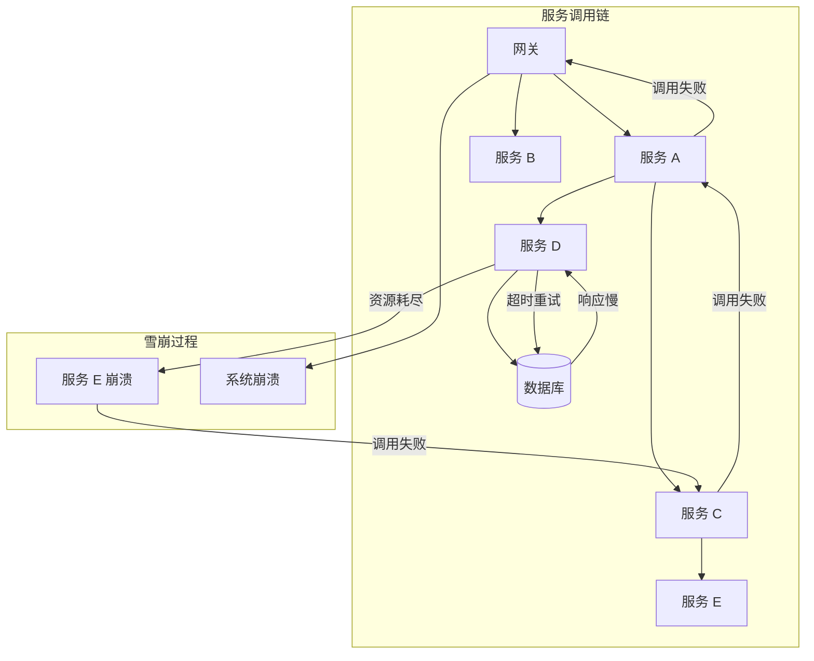
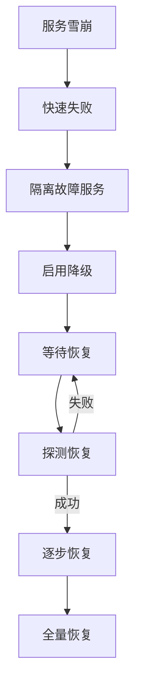

# 服务雪崩处理

> **目标级别**：P6/P7
> **面试频率**：🟡 中频
> **面试官最关心的 3 个问题**：
> 1. 什么是服务雪崩？如何发生的？
> 2. 如何防止服务雪崩？
> 3. 服务雪崩后如何恢复？

---

面试官问：「线上某个服务挂了，整个系统都崩了，怎么回事？」你说「服务依赖」——然后面试官追问「为什么会这样？怎么防止？」

服务雪崩是分布式系统中灾难性的问题。一个服务的故障可能导致整个系统崩溃。

## 一、什么是服务雪崩



服务雪崩：**一个服务的故障导致调用方资源耗尽，进而引发连锁故障，最终导致整个系统不可用**。

## 二、服务雪崩的原因

| 原因 | 说明 | 示例 |
|------|------|------|
| **服务宕机** | 服务突然不可用 | 进程崩溃、机器故障 |
| **网络抖动** | 网络延迟增加 | 网络分区 |
| **流量激增** | 突发流量压垮服务 | 秒杀、热点事件 |
| **级联失败** | 依赖服务故障 | 下游服务超时 |
| **资源泄漏** | 内存/连接耗尽 | 连接池泄漏 |

## 三、如何防止服务雪崩

### 3.1 熔断器

```java
// Resilience4j 熔断器
@Configuration
public class Resilience4jConfig {
    
    @Bean
    public CircuitBreakerFactory circuitBreakerFactory() {
        CircuitBreakerConfig config = CircuitBreakerConfig.custom()
            .slidingWindowType(SlidingWindowType.COUNT_BASED)
            .slidingWindowSize(100)
            .minimumNumberOfCalls(10)
            .failureRateThreshold(50)
            .waitDurationInOpenState(Duration.ofSeconds(30))
            .permittedNumberOfCallsInHalfOpenState(5)
            .build();
        
        return new Resilience4jCircuitBreakerFactory(config);
    }
}

// 使用熔断器
@Service
public class OrderService {
    
    private final CircuitBreaker circuitBreaker;
    
    public OrderService(CircuitBreakerFactory factory) {
        this.circuitBreaker = factory.create("inventoryService");
    }
    
    public Inventory getInventory(Long productId) {
        return circuitBreaker.executeSupplier(() -> {
            return inventoryClient.get(productId);
        });
    }
}
```

### 3.2 限流保护

```java
// Sentinel 限流
@Service
public class ProductService {
    
    @SentinelResource(value = "getProduct",
        blockHandler = "getProductBlock")
    public Product getProduct(Long id) {
        return productClient.get(id);
    }
    
    // 限流处理
    public Product getProductBlock(Long id, BlockException ex) {
        // 返回降级数据
        return ProductCache.get(id).orElse(Product.DEFAULT);
    }
}
```

### 3.3 超时控制

```java
// 配置合理的超时时间
@Configuration
public class FeignConfig {
    
    @Bean
    public Request.Options feignOptions() {
        // 连接超时：2秒
        // 读取超时：3秒
        return new Request.Options(2000, 3000);
    }
}

// Ribbon 超时配置
ribbon:
  ConnectTimeout: 2000
  ReadTimeout: 3000
  OkToRetryOnAllOperations: true
  MaxAutoRetries: 2
  MaxAutoRetriesNextServer: 1
```

### 3.4 重试限制

```java
// 重试配置（慎用）
@Configuration
public class RetryConfig {
    
    @Bean
    public RetryTemplate retryTemplate() {
        SimpleRetryPolicy retryPolicy = new SimpleRetryPolicy();
        retryPolicy.setMaxAttempts(2);  // 只重试1次
        
        ExponentialBackOffPolicy backOffPolicy = new ExponentialBackOffPolicy();
        backOffPolicy.setInitialInterval(100);
        backOffPolicy.setMultiplier(2);
        backOffPolicy.setMaxInterval(1000);
        
        RetryTemplate template = new RetryTemplate();
        template.setRetryPolicy(retryPolicy);
        template.setBackOffPolicy(backOffPolicy);
        return template;
    }
}
```

### 3.5 舱壁隔离

```java
// 不同服务使用不同的线程池
@Configuration
public class BulkheadConfig {
    
    @Bean("inventoryThreadPool")
    public Executor inventoryThreadPool() {
        return new ThreadPoolExecutor(10, 20, 60, 
            TimeUnit.SECONDS, new LinkedBlockingQueue<>(100),
            new ThreadFactoryBuilder().setNamePrefix("inventory-").build());
    }
    
    @Bean("orderThreadPool")
    public Executor orderThreadPool() {
        return new ThreadPoolExecutor(20, 50, 60,
            TimeUnit.SECONDS, new LinkedBlockingQueue<>(200),
            new ThreadFactoryBuilder().setNamePrefix("order-").build());
    }
}

// 使用不同的线程池
@Service
public class InventoryService {
    
    @Bulkhead(name = "inventoryService", fallbackMethod = "fallback")
    public Inventory getInventory(Long productId) {
        return inventoryClient.get(productId);
    }
}
```

## 四、服务雪崩恢复



### 4.1 快速失败

```java
// 熔断后快速失败，不占用资源
@Service
public class FallbackService {
    
    public Inventory fallback(Long productId, Throwable ex) {
        // 返回缓存或默认值
        log.warn("获取库存失败，使用降级数据", ex);
        return InventoryCache.get(productId).orElse(Inventory.ZERO);
    }
}
```

### 4.2 降级策略

```java
// 分级降级
@Service
public class DegradedProductService {
    
    public ProductVO getProduct(Long id) {
        try {
            // 一级：正常获取
            return productClient.get(id);
        } catch (Exception e) {
            log.warn("获取商品失败，尝试缓存", e);
            try {
                // 二级：获取缓存
                return ProductCache.get(id);
            } catch (Exception ex) {
                log.error("获取商品缓存也失败，返回默认值", ex);
                // 三级：返回默认值
                return ProductVO.DEFAULT;
            }
        }
    }
}
```

### 4.3 隔离策略

```java
// 线程池隔离
@Service
public class IsolatedService {
    
    private static final ExecutorService inventoryPool = 
        Executors.newFixedThreadPool(10);
    
    private static final ExecutorService orderPool = 
        Executors.newFixedThreadPool(20);
    
    public Future<Inventory> getInventory(Long productId) {
        return inventoryPool.submit(() -> inventoryClient.get(productId));
    }
}
```

## 五、高频面试题

### 🔴 第一层：什么是服务雪崩？

**问题**：服务雪崩是怎么发生的？

**参考答案**：

- **定义**：一个服务的故障导致调用方资源耗尽，引发连锁故障
- **过程**：
  1. 服务 C 响应变慢
  2. 调用方 B 等待超时
  3. 调用方 B 资源耗尽（线程、连接）
  4. 调用方 A 也受影响
  5. 最终整个系统不可用

---

### 🔴 第二层：如何防止服务雪崩？

**问题**：有什么方案可以防止服务雪崩？

**参考答案**：

| 方案 | 说明 |
|------|------|
| **熔断器** | 快速失败，防止资源耗尽 |
| **限流** | 控制请求速率 |
| **超时控制** | 避免长时间等待 |
| **重试限制** | 避免无限重试 |
| **舱壁隔离** | 隔离不同服务的资源 |

---

### 🟡 第三层：服务雪崩后如何恢复？

**问题**：发生雪崩后怎么恢复？

**参考答案**：

1. **快速失败**：立即返回降级数据
2. **隔离故障**：熔断故障服务
3. **逐步恢复**：探测确认服务可用后再恢复
4. **扩容**：增加服务实例
5. **流量切换**：切换到备用服务

---

## 六、常见陷阱

### ⚠️ 陷阱 1：无限重试

重试会放大流量，加剧雪崩。

### ⚠️ 陷阱 2：超时时间过长

超时时间过长会导致资源被长时间占用。

### ⚠️ 陷阱 3：没有降级方案

没有降级方案会导致服务完全不可用。

### ⚠️ 陷阱 4：依赖单点

单点依赖会放大故障影响。

---

## 七、加分回答

### 💡 Sentinel 的热点参数限流

```java
// 热点参数限流
@SentinelResource(value = "getProduct",
    blockHandler = "blockHandler",
    paramFlowRule = @ParamFlow(
        resource = "getProduct",
        index = 0,  // 第一个参数
        count = 10,  // 每秒10次
        grade = ParamFlowGrade.QPS
    )
)
public Product getProduct(Long id) {
    return productClient.get(id);
}
```

### 💡 流量控制策略

```java
// Warm Up 预热
FlowRule rule = new FlowRule("getProduct")
    .setGrade(RuleConstant.FLOW_GRADE_QPS)
    .setControlBehavior(RuleConstant.CONTROL_BEHAVIOR_WARM_UP)
    .setCount(100)
    .setWarmUpPeriodSec(10);

// 排队等待
FlowRule rule = new FlowRule("getProduct")
    .setGrade(RuleConstant.FLOW_GRADE_QPS)
    .setControlBehavior(RuleConstant.CONTROL_BEHAVIOR_RATE_LIMITER)
    .setMaxQueueingTimeMs(500);
```

---

## 八、扩展思考

为什么重试会加剧雪崩？

> **答案**：
>
> 1. **放大流量**：每次重试都是一次新请求
> 2. **资源竞争**：重试请求和正常请求竞争资源
> 3. **恢复延迟**：大量重试会拖慢服务恢复
> 4. **建议**：限制重试次数，使用指数退避
