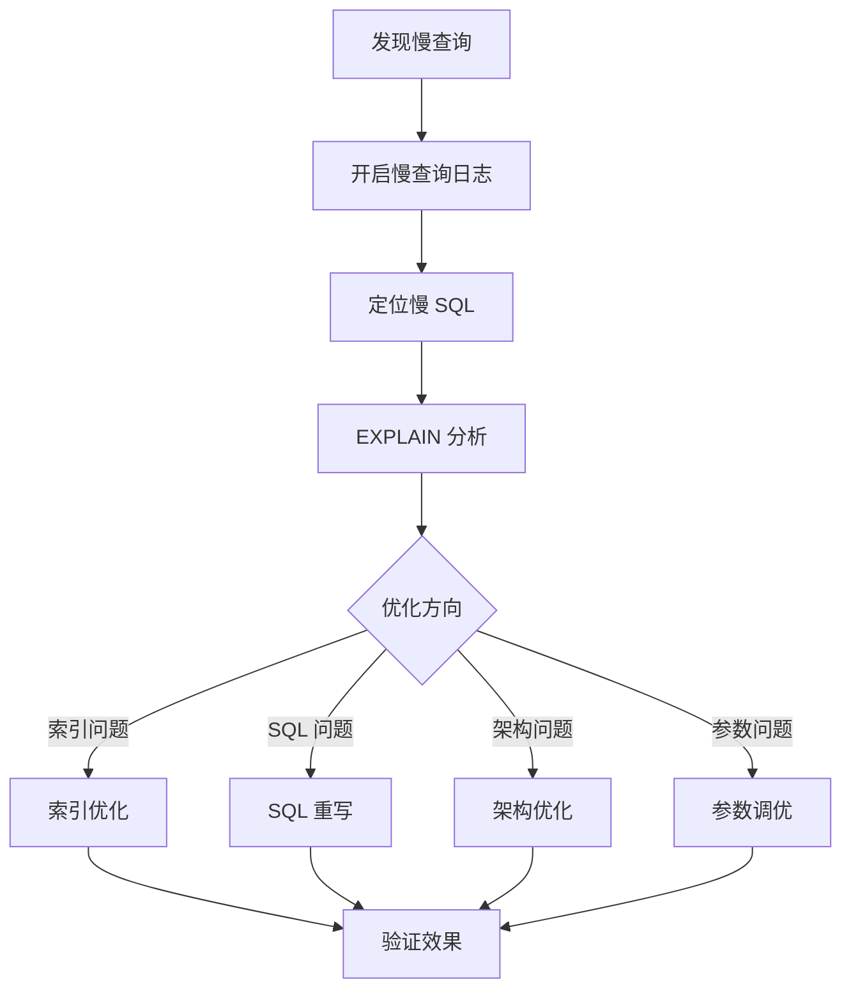
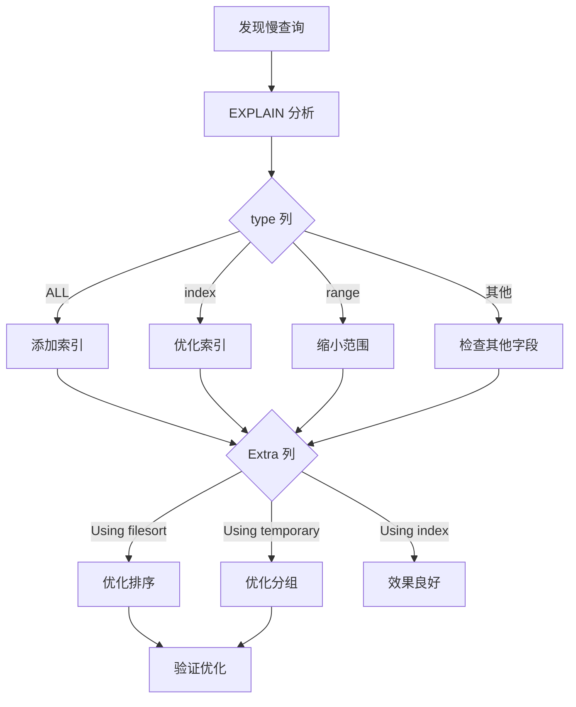

# 慢查询优化案例

> **目标级别**：P6
> **面试频率**：🔴 高频
> **面试官最关心的 3 个问题**：
> 1. 如何分析慢查询？
> 2. 常见的慢查询优化方法？
> 3. 如何避免慢查询？

---

面试官问：「线上有个查询特别慢，怎么优化？」你说「加索引」——然后面试官追问「加索引能解决所有问题吗？如果索引生效了还是慢呢？」

慢查询优化是数据库面试的经典话题。但加索引只是其中一种方法，真正的优化需要系统化的分析和思路。

## 一、慢查询分析流程



## 二、慢查询定位

### 2.1 开启慢查询日志

```sql
-- 查看慢查询配置
SHOW VARIABLES LIKE 'slow_query%';
SHOW VARIABLES LIKE 'long_query_time';

-- 临时开启
SET GLOBAL slow_query_log = 'ON';
SET GLOBAL long_query_time = 1;  -- 超过 1 秒记录

-- 永久开启（my.cnf）
[mysqld]
slow_query_log = 1
slow_query_log_file = /var/log/mysql/slow.log
long_query_time = 1
log_queries_not_using_indexes = 1
```

### 2.2 分析慢查询日志

```bash
# 使用 mysqldumpslow
mysqldumpslow -s t -t 10 /var/log/mysql/slow.log

# 参数说明：
# -s t: 按执行时间排序
# -s c: 按执行次数排序
# -s l: 按锁时间排序
# -s r: 按返回行数排序
# -t 10: 取前 10 条

# 使用 pt-query-digest
pt-query-digest /var/log/mysql/slow.log
```

## 三、EXPLAIN 分析

### 3.1 EXPLAIN 输出解读

```sql
EXPLAIN SELECT * FROM orders WHERE user_id = 1 ORDER BY created_at DESC LIMIT 10;

-- 输出示例
+----+-------------+--------+------+---------------+------+---------+-------+------+-------+
| id | select_type| table  | type | key           | rows | filtered| Extra |
+----+-------------+--------+------+---------------+------+---------+-------+-------+
|  1 | SIMPLE     | orders | ref  | idx_user_id   |   50 |  100.00 | Using |
+----+-------------+--------+------+---------------+------+---------+-------+-------+
```

| 字段 | 说明 | 优化目标 |
|------|------|----------|
| **type** | 访问类型 | 最好为 const/eq_ref/ref |
| **key** | 使用索引 | 非 NULL |
| **rows** | 扫描行数 | 越少越好 |
| **Extra** | 附加信息 | 避免 Using filesort/temporary |

### 3.2 type 字段详解

| type | 说明 | 性能 |
|------|------|------|
| const | 主键或唯一索引 | ⭐⭐⭐⭐⭐ |
| eq_ref | 唯一索引查找 | ⭐⭐⭐⭐⭐ |
| ref | 索引查找 | ⭐⭐⭐⭐ |
| range | 索引范围查询 | ⭐⭐⭐ |
| index | 全索引扫描 | ⭐⭐ |
| ALL | 全表扫描 | ⭐ |

## 四、常见慢查询场景与优化

### 4.1 场景一：深分页查询

```sql
-- ⚠️ 错误示例：深分页
SELECT * FROM orders 
ORDER BY id DESC 
LIMIT 1000000, 10;
-- 扫描 1000010 行，只返回 10 行

-- ✅ 优化方案 1：延迟关联
SELECT o.* FROM orders o
INNER JOIN (
    SELECT id FROM orders
    ORDER BY id DESC
    LIMIT 1000000, 10
) t ON o.id = t.id;

-- ✅ 优化方案 2：游标分页
SELECT * FROM orders
WHERE id < 1000000
ORDER BY id DESC
LIMIT 10;

-- ✅ 优化方案 3：记录上次位置
SELECT * FROM orders
WHERE id < #{lastId}
ORDER BY id DESC
LIMIT 10;
```

### 4.2 场景二：全表扫描

```sql
-- ⚠️ 错误示例：函数导致索引失效
SELECT * FROM orders 
WHERE YEAR(created_at) = 2024;

SELECT * FROM orders 
WHERE LEFT(order_no, 6) = '202401';

-- ✅ 优化方案 1：改写为范围查询
SELECT * FROM orders
WHERE created_at `>=` '2024-01-01'
  AND created_at `<` '2025-01-01';

-- ✅ 优化方案 2：使用虚拟列
ALTER TABLE orders 
ADD COLUMN order_year INT AS (YEAR(created_at));
CREATE INDEX idx_order_year ON orders(order_year);

SELECT * FROM orders WHERE order_year = 2024;
```

### 4.3 场景三：JOIN 过多

```sql
-- ⚠️ 错误示例：多表 JOIN
SELECT * FROM orders o
LEFT JOIN user u ON o.user_id = u.id
LEFT JOIN product p ON o.product_id = p.id
LEFT JOIN category c ON p.category_id = c.id
WHERE o.status = 1;
-- 产生大量中间结果

-- ✅ 优化方案 1：减少 JOIN 列
SELECT o.id, o.amount, u.name, p.name
FROM orders o
LEFT JOIN user u ON o.user_id = u.id
LEFT JOIN product p ON o.product_id = p.id
WHERE o.status = 1;

-- ✅ 优化方案 2：分解查询
SELECT * FROM orders WHERE status = 1;  -- 应用层处理关联
```

### 4.4 场景四：排序不使用索引

```sql
-- ⚠️ 错误示例：排序字段无索引
SELECT * FROM orders WHERE user_id = 1 ORDER BY amount DESC;
-- Using filesort

-- ✅ 优化方案：创建覆盖索引
CREATE INDEX idx_user_amount ON orders(user_id, amount DESC);

EXPLAIN SELECT * FROM orders WHERE user_id = 1 ORDER BY amount DESC;
-- Extra: Using index condition
```

## 五、排查流程图



## 六、高频面试题

### 🔴 第一层：如何定位慢查询？

**问题**：如何找到线上最慢的 SQL？

**参考答案**：

```bash
# 1. 开启慢查询日志
# 2. 使用 mysqldumpslow 分析
mysqldumpslow -s t -t 10 /var/log/mysql/slow.log

# 3. 使用 pt-query-digest
pt-query-digest /var/log/mysql/slow.log

# 4. 实时查看
SHOW FULL PROCESSLIST;
```

---

### 🔴 第二层：EXPLAIN 怎么看？

**问题**：EXPLAIN 输出中哪些字段最重要？

**参考答案**：

| 字段 | 重要程度 | 说明 |
|------|----------|------|
| type | ⭐⭐⭐⭐⭐ | 访问类型，越好越好 |
| key | ⭐⭐⭐⭐⭐ | 使用的索引 |
| rows | ⭐⭐⭐⭐ | 扫描行数，越少越好 |
| Extra | ⭐⭐⭐⭐ | Using filesort/temporary 需要优化 |

---

### 🟡 第三层：分页查询怎么优化？

**问题**：深分页查询（Limit 100000, 10）怎么优化？

**参考答案**：

| 方案 | 说明 | 适用场景 |
|------|------|----------|
| **延迟关联** | 先查 ID 再关联 | 无主键/复杂查询 |
| **游标分页** | 使用 ID > lastId | 有主键/有序 |
| **记录位置** | 记录上次查询位置 | 用户体验优先 |
| **禁止跳页** | 只允许前N页 | 产品层面限制 |

---

## 七、常见陷阱

### ⚠️ 陷阱 1：只看 rows 不看实际扫描

rows 是估算值，可能不准确。

### ⚠️ 陷阱 2：过度索引

索引会占用空间，影响写入性能。

### ⚠️ 陷阱 3：忽略覆盖索引

回表查询会影响性能。

### ⚠️ 陷阱 4：OR 导致索引失效

```sql
-- ⚠️ OR 可能导致索引失效
SELECT * FROM orders WHERE user_id = 1 OR status = 1;
-- 建议拆分为 UNION
SELECT * FROM orders WHERE user_id = 1
UNION
SELECT * FROM orders WHERE status = 1;
```

---

## 八、加分回答

### 💡 使用索引提示（HINT）

```sql
-- 强制使用某个索引
SELECT * FROM orders USE INDEX (idx_user_id) 
WHERE user_id = 1;

-- 忽略某个索引
SELECT * FROM orders IGNORE INDEX (idx_status) 
WHERE status = 1;

-- 强制索引
SELECT * FROM orders FORCE INDEX (idx_user_id) 
WHERE user_id = 1;
```

### 💡 使用 SQL 诊断工具

```bash
# 使用 pt-query-advisor 检查 SQL 问题
pt-query-advisor /var/log/mysql/slow.log

# 使用 sqlexplain 分析
sqlexplain "SELECT * FROM orders WHERE user_id = 1"
```

---

## 九、扩展思考

为什么加了索引查询还是慢？

> **答案**：
>
> 1. **数据量太大**：即使走索引，数据量本身很大
> 2. **索引选择不当**：优化器可能选择全表扫描
> 3. **统计信息不准确**：ANALYZE TABLE 更新统计信息
> 4. **回表查询**：索引未覆盖，需要回表
> 5. **多表 JOIN**：JOIN 顺序不当
> 6. **锁等待**：其他事务持有锁
