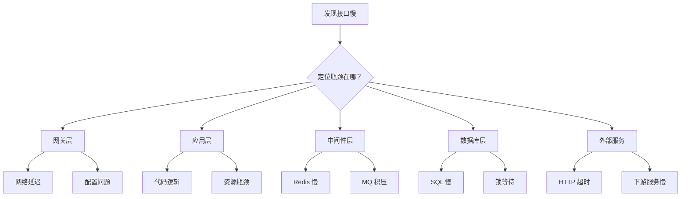
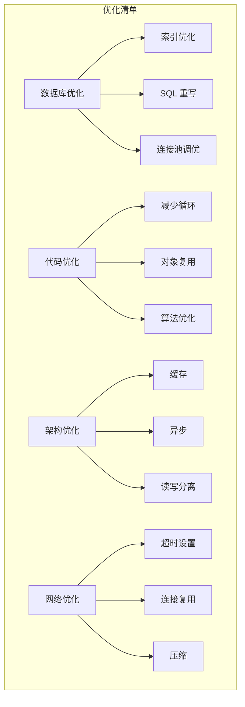

# 接口响应慢排查

> **目标级别**：P6
> **面试频率**：🔴 高频
> **面试官最关心的 3 个问题**：
> 1. 如何快速定位接口响应慢的原因？
> 2. 接口响应慢的常见原因有哪些？
> 3. 如何系统性排查链路上的性能瓶颈？

---

面试官问：「线上有个接口特别慢，怎么排查？」你说「加索引」——然后面试官追问「不只是数据库问题呢？如果是微服务链路慢呢？」你沉默了。

接口响应慢是最常见的线上问题之一。但加索引只是其中一种解决方案，真正的系统性排查需要覆盖整个请求链路。

## 一、排查思路总览



## 二、排查工具链

| 工具 | 用途 | 使用场景 |
|------|------|----------|
| ** Arthas** | 方法追踪、性能分析 | 在线诊断 |
| **SkyWalking** | 链路追踪 | 分布式环境 |
| **Grafana + Prometheus** | 监控告警 | 性能趋势 |
| **JMeter /wrk** | 压测工具 | 复现问题 |
| **MySQL EXPLAIN** | SQL 分析 | 数据库问题 |
| **Redis MONITOR** | 缓存分析 | 缓存问题 |

## 三、分层排查方法

### 3.1 第一层：网络层排查

```bash
# 1. 查看网络连接状态
netstat -an | grep TIME_WAIT | wc -l
netstat -an | grep ESTABLISHED | wc -l

# 2. 查看网络延迟
ping -c 10 downstream-service

# 3. 查看 DNS 解析
dig downstream-service

# 4. 查看 TCP 重传
netstat -s | grep retransmission
```

### 3.2 第二层：应用层排查

```bash
# 1. 使用 Arthas 追踪方法执行时间
trace com.example.Service methodA '#cost > 100'

# 2. 查看方法调用链路
stack com.example.Service methodA

# 3. 监控方法调用
monitor -c 5 com.example.Service methodA

# 4. 生成火焰图
profiler start --duration 30
profiler stop --format html
```

### 3.3 第三层：数据库层排查

```sql
-- 1. 查看慢查询
SHOW FULL PROCESSLIST;
SELECT * FROM performance_schema.events_statements_summary_by_digest 
ORDER BY SUM_TIMER_WAIT DESC LIMIT 10;

-- 2. 分析执行计划
EXPLAIN SELECT * FROM orders WHERE user_id = 123;

-- 3. 查看锁等待
SELECT * FROM information_schema.INNODB_LOCK_WAITS;

-- 4. 查看连接数
SHOW STATUS LIKE 'Threads_connected';
SHOW VARIABLES LIKE 'max_connections';
```

### 3.4 第四层：缓存层排查

```bash
# 1. Redis 慢查询日志
SLOWLOG GET 10

# 2. 监控 Redis
redis-cli INFO stats | grep -E 'instantaneous_ops|total_commands|hits|misses'

# 3. 查看大 key
redis-cli --bigkeys

# 4. 查看热 key
redis-cli --hotkeys

# 5. 实时监控
redis-cli MONITOR | grep -E 'slow|blocked'
```

## 四、常见慢接口场景

### 4.1 场景一：SQL 慢查询

```sql
-- ⚠️ 错误示例：全表扫描
SELECT * FROM orders WHERE status = 0 ORDER BY created_at DESC;

-- ✅ 优化方案 1：添加索引
CREATE INDEX idx_status_created ON orders(status, created_at DESC);

-- ✅ 优化方案 2：覆盖索引
CREATE INDEX idx_status_created_cover ON orders(status, created_at DESC, id);

-- ✅ 优化方案 3：分页优化
SELECT * FROM orders WHERE id > #{lastId} AND status = 0 
ORDER BY id DESC LIMIT 20;
```

### 4.2 场景二：循环查询数据库

```java
// ⚠️ 错误示例：N+1 查询
public List<OrderVO> getOrdersByUserIds(List<Long> userIds) {
    List<OrderVO> result = new ArrayList<>();
    for (Long userId : userIds) {
        // 每次循环都查询数据库
        List<Order> orders = orderDao.findByUserId(userId);
        result.addAll(convert(orders));
    }
    return result;
}

// ✅ 正确示例：批量查询
public List<OrderVO> getOrdersByUserIds(List<Long> userIds) {
    // 一次查询获取所有订单
    List<Order> orders = orderDao.findByUserIds(userIds);
    return convert(orders);
}
```

### 4.3 场景三：同步调用外部服务

```java
// ⚠️ 错误示例：串行调用多个外部服务
public OrderDetail getOrderDetail(Long orderId) {
    Order order = orderService.getOrder(orderId);      // 100ms
    User user = userService.getUser(order.getUserId()); // 50ms
    Product product = productService.getProduct(order.getProductId()); // 80ms
    // 总耗时: 230ms
}

// ✅ 正确示例：并行调用
public OrderDetail getOrderDetail(Long orderId) {
    Order order = orderService.getOrder(orderId);
    
    // 并行调用
    CompletableFuture<User> userFuture = 
        CompletableFuture.supplyAsync(() -> userService.getUser(order.getUserId()));
    CompletableFuture<Product> productFuture = 
        CompletableFuture.supplyAsync(() -> productService.getProduct(order.getProductId()));
    
    // 等待所有结果
    User user = userFuture.get(1, TimeUnit.SECONDS);
    Product product = productFuture.get(1, TimeUnit.SECONDS);
    
    return new OrderDetail(order, user, product);
    // 总耗时: max(100, 50, 80) = 100ms
}
```

### 4.4 场景四：内存分配过多

```java
// ⚠️ 错误示例：大对象频繁分配
public void process(List<Order> orders) {
    for (Order order : orders) {
        // 每个订单都创建新对象
        String json = JSON.toJSONString(order);
        String md5 = DigestUtils.md5Hex(json);
        // 处理...
    }
}

// ✅ 正确示例：复用对象或优化
public void process(List<Order> orders) {
    // 预估大小，减少扩容
    List<String> jsons = new ArrayList<>(orders.size());
    List<String> md5s = new ArrayList<>(orders.size());
    
    for (Order order : orders) {
        jsons.add(JSON.toJSONString(order));
        md5s.add(DigestUtils.md5Hex(jsons.get(jsons.size() - 1)));
    }
    // 处理...
}
```

## 五、排查流程图

```mermaid
flowchart TB
    A[接口响应慢] --> B[确认问题范围]
    
    B --> C{单个接口还是全部？}
    C -->|单个| D[定位接口]
    C -->|全部| E[资源瓶颈]
    
    D --> F[APM 链路分析]
    E --> E1[CPU/内存/网络]
    
    F --> G{数据库？}
    F --> H{缓存？}
    F --> I{外部服务？}
    F --> J[代码逻辑？}
    
    G -->|是| K[SQL 分析优化]
    H -->|是| L[缓存分析优化]
    I -->|是| M[超时/重试优化]
    J -->|是| N[代码逻辑优化]
    
    K --> O[验证优化]
    L --> O
    M --> O
    N --> O
```

## 六、高频面试题

### 🔴 第一层：接口响应慢怎么排查？

**问题**：线上有个接口特别慢，怎么快速定位原因？

**参考答案**：

```bash
# 1. 确认慢的范围
# - 单个接口慢还是所有接口都慢？
# - 是一直慢还是偶尔慢？

# 2. APM 链路分析
# 使用 SkyWalking / Pinpoint 查看链路耗时分布

# 3. 应用层分析
trace com.example.Controller method

# 4. 数据库分析
SHOW FULL PROCESSLIST;

# 5. 缓存分析
redis-cli MONITOR | head -20
```

---

### 🔴 第二层：如何系统性排查微服务链路？

**问题**：微服务架构下，如何定位是哪个服务慢？

**参考答案**：

```bash
# 1. 查看全链路追踪
# SkyWalking / Zipkin 显示每个服务的耗时

# 2. 逐级排查
# 网关 → 服务 A → 服务 B → 数据库

# 3. 记录各服务耗时
# 在入口处记录时间戳
long start = System.currentTimeMillis();
// 调用链路
log.info("total time: {}", System.currentTimeMillis() - start);
```

---

### 🟡 第三层：如何避免接口响应慢？

**问题**：有什么方法可以从设计层面避免接口慢？

**参考答案**：

| 方法 | 说明 |
|------|------|
| **异步处理** | 非核心流程异步化 |
| **缓存** | 热点数据缓存 |
| **预计算** | 提前计算复杂结果 |
| **读写分离** | 读请求走从库 |
| **分页限制** | 控制返回数据量 |
| **超时降级** | 防止下游拖垮上游 |

---

## 七、常见陷阱

### ⚠️ 陷阱 1：只优化数据库

接口慢不一定是数据库问题，可能是网络、外部服务、代码逻辑问题。

### ⚠️ 陷阱 2：忽略索引失效

索引建立后，由于查询方式不当，可能导致索引失效。

### ⚠️ 陷阱 3：过度优化

不是所有接口都需要优化到 10ms，先确定业务需求。

### ⚠️ 陷阱 4：忽略连接池

连接池配置不当也会导致响应慢。

---

## 八、接口性能优化清单



---

## 九、加分回答

### 💡 使用 SkyWalking 进行链路追踪

```yaml
# skywalking-agent 配置
agent:
  collector:
    backend_services: oap-server:11800
  sample:
    per_period: 10  # 每 10 个请求采样 1 个
```

### 💡 使用 Arthas 进行在线诊断

```bash
# 1. 追踪方法调用
trace com.example.Service * '#cost > 100'

# 2. 查看方法参数和返回值
watch com.example.Service methodA '{params, returnObj}'

# 3. 性能分析
profiler start --event cpu --duration 30
```

---

## 十、扩展思考

如果接口平时很快，偶尔很慢，如何排查？

> **答案**：
>
> 1. **GC 问题**：GC 时所有线程暂停，可能是 CMS/G1 GC 导致
> 2. **外部依赖波动**：下游服务偶尔变慢
> 3. **数据库锁竞争**：偶发的锁等待
> 4. **网络抖动**：网络偶尔不稳定
> 5. **定时任务冲突**：与批量任务同时执行
>
> **排查方法**：记录每次请求的耗时分布，分析慢请求的特征。
