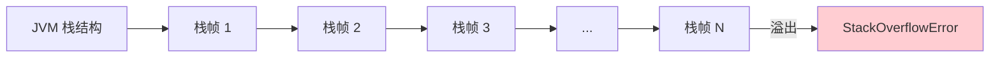
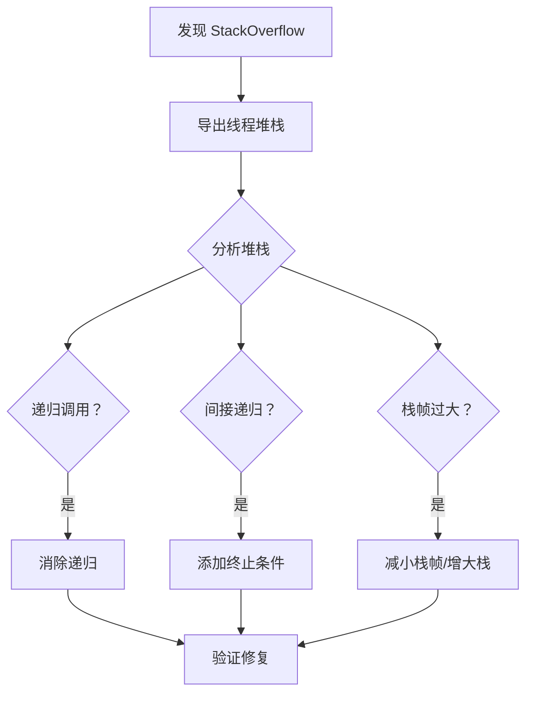

# StackOverflow 排查

> **目标级别**：P5/P6
> **面试频率**：🟡 中频
> **面试官最关心的 3 个问题**：
> 1. 什么情况下会发生 StackOverflow？
> 2. 如何避免栈溢出？
> 3. 栈大小如何设置？

---

面试官问：「线上服务报 StackOverflowError，怎么排查？」你说「增加栈大小」——然后面试官追问「增加栈大小能解决根本问题吗？」

StackOverflow 是 Java 服务中相对少见但一旦出现就很难排查的问题。它的特点是：发生快、定位难、影响大。

## 一、什么是 StackOverflowError



每个线程都有自己的调用栈（Call Stack），用于存储方法调用和局部变量。当调用层次过深或单个栈帧过大时，就会抛出 StackOverflowError。

## 二、常见原因

### 2.1 递归调用过深

```java
// ⚠️ 错误示例：无限递归
public class RecursiveError {
    public static long fibonacci(int n) {
        // ⚠️ 没有终止条件
        return fibonacci(n - 1) + fibonacci(n - 2);
    }
    
    public static void main(String[] args) {
        fibonacci(100000);
    }
}
```

### 2.2 间接递归

```java
// ⚠️ 错误示例：间接递归
public class IndirectRecursive {
    public void methodA() {
        methodB();
    }
    
    public void methodB() {
        methodA();  // ⚠️ 形成循环调用
    }
}
```

### 2.3 大量局部变量

```java
// ⚠️ 错误示例：每个栈帧占用过多空间
public class LargeFrame {
    public void process() {
        // 每个方法调用都创建 1MB 的数组
        byte[] buffer1 = new byte[1024 * 1024];
        byte[] buffer2 = new byte[1024 * 1024];
        byte[] buffer3 = new byte[1024 * 1024];
        process();  // 递归调用，栈帧很大
    }
}
```

### 2.4 异常栈过深

```java
// ⚠️ 错误示例：深层异常
public class DeepException {
    public void level1() throws Exception { level2(); }
    public void level2() throws Exception { level3(); }
    public void level3() throws Exception { level4(); }
    // ... 100 层
    public void level100() throws Exception { 
        throw new RuntimeException("Deep exception"); 
    }
}
```

## 三、排查步骤

### 3.1 第一步：确认问题

```bash
# 查看错误日志
# StackOverflowError 通常会打印调用栈

# 找到调用深度
# 计算日志中 "at xxx.xxx.xxx.methodName(Unknown Source)" 的层数
```

### 3.2 第二步：分析堆栈

```bash
# 导出线程堆栈
jstack <pid> > /tmp/thread.log

# 查看 StackOverflow 线程的堆栈
grep -A 100 'StackOverflowError' /tmp/thread.log
```

### 3.3 第三步：定位问题代码

```java
// 从堆栈中可以看到方法调用链
// 例如：
at com.example.service.OrderService.calculate(OrderService.java:45)
at com.example.service.OrderService.calculate(OrderService.java:50)
at com.example.service.OrderService.calculate(OrderService.java:50)
at com.example.service.OrderService.calculate(OrderService.java:50)
// ... 重复 1000+ 次

// 问题出在 OrderService.java:50 的递归调用
```

## 四、解决方案

### 4.1 方案一：消除递归

```java
// ✅ 正确示例：使用循环替代递归
public class FibLoop {
    public static long fibonacci(int n) {
        if (n <= 1) return n;
        
        long a = 0, b = 1;
        for (int i = 2; i <= n; i++) {
            long c = a + b;
            a = b;
            b = c;
        }
        return b;
    }
}
```

### 4.2 方案二：尾递归优化

```java
// ✅ 正确示例：尾递归
public class FibTailRecursive {
    public static long fibonacci(int n) {
        return fibHelper(0, 1, n);
    }
    
    private static long fibHelper(long a, long b, int count) {
        if (count == 0) return a;
        return fibHelper(b, a + b, count - 1);
    }
}
```

### 4.3 方案三：增加栈大小

```bash
# 增加栈大小
java -Xss2m Application  # 默认 1MB 改为 2MB
java -Xss512k Application # 减小栈大小，节省内存
```

### 4.4 方案四：减少栈帧大小

```java
// ✅ 正确示例：减少局部变量
public class SmallFrame {
    public void process() {
        // 不要创建大数组
        processSmall();
        processSmall();
        processSmall();
    }
    
    private void processSmall() {
        int a = 1;  // 只占用基本类型
        // 处理...
    }
}
```

## 五、排查流程图



## 六、高频面试题

### 🔴 第一层：什么情况下会发生 StackOverflow？

**问题**：StackOverflowError 是什么原因导致的？

**参考答案**：

- **递归调用过深**：没有终止条件的递归
- **间接递归**：方法 A 调用 B，B 调用 A
- **单个栈帧过大**：方法中有大量局部变量
- **线程数过多**：每个线程都占用栈空间

---

### 🟡 第二层：如何避免 StackOverflow？

**问题**：有什么方法可以避免栈溢出？

**参考答案**：

| 方法 | 说明 |
|------|------|
| **消除递归** | 使用循环或栈数据结构替代递归 |
| **添加终止条件** | 确保递归有正确的终止条件 |
| **尾递归优化** | 使用尾递归（需要编译器支持） |
| **减小局部变量** | 避免在方法中创建大数组 |
| **增大栈大小** | 使用 `-Xss` 参数 |

---

### 🟢 第三层：线程栈大小如何设置？

**问题**：如何合理设置线程栈大小？

**参考答案**：

```bash
# 默认值
# 32 位 JVM: 320KB
# 64 位 JVM: 1MB

# 设置建议
java -Xss512k    # 内存受限场景
java -Xss1m       # 默认值
java -Xss2m       # 需要深递归的场景
java -Xss4m       # 极端情况
```

**计算公式**：
```
线程数 × 栈大小 + 堆内存 + 元空间 = 进程总内存
```

---

## 七、常见陷阱

### ⚠️ 陷阱 1：增大栈大小只是延迟问题

如果递归调用没有终止条件，无论栈多大最终都会溢出。

### ⚠️ 陷阱 2：忽略间接递归

直接递归容易发现，但 A → B → A 的间接递归容易被忽略。

### ⚠️ 陷阱 3：第三方库导致

某些框架（如 ORM、模板引擎）内部可能使用递归。

### ⚠️ 陷阱 4：异常包装过深

每次异常包装都会增加栈深度。

---

## 八、加分回答

### 💡 使用 -XX:+PrintStackTraceAtFullGC

```bash
# Full GC 时打印栈信息
java -XX:+PrintStackTraceAtFullGC Application
```

### 💡 使用 -XX:+UseTLAB 优化

```bash
# 线程本地分配缓冲区，减少栈操作
java -XX:+UseTLAB -XX:TLABSize=512k Application
```

### 💡 使用 ArgunentPreservingBB

```java
// 使用 Stream 替代递归
public class Stream替代 {
    public static void main(String[] args) {
        // 使用 Stream 的惰性求值
        Stream.iterate(new long[]{0, 1}, p -> new long[]{p[1], p[0] + p[1]})
            .limit(100)
            .forEach(p -> System.out.println(p[0]));
    }
}
```

---

## 九、扩展思考

JDK8 和 JDK17 在栈处理上有什么区别？

> **答案**：
>
> 1. **默认栈大小**：JDK17 默认可能使用更小的栈
> 2. ** JIT 优化**：JDK17 的 JIT 可能更好地优化尾递归
> 3. **逃逸分析**：JDK17 的逃逸分析更激进，栈分配更多
> 4. **监控工具**：JDK17 自带更好的诊断工具
