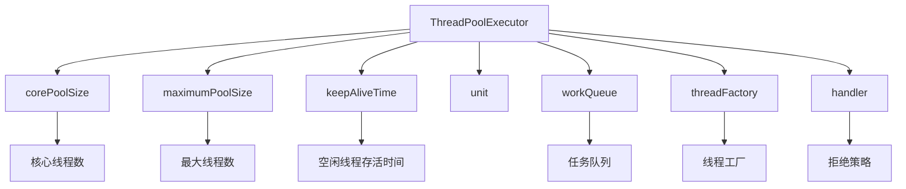
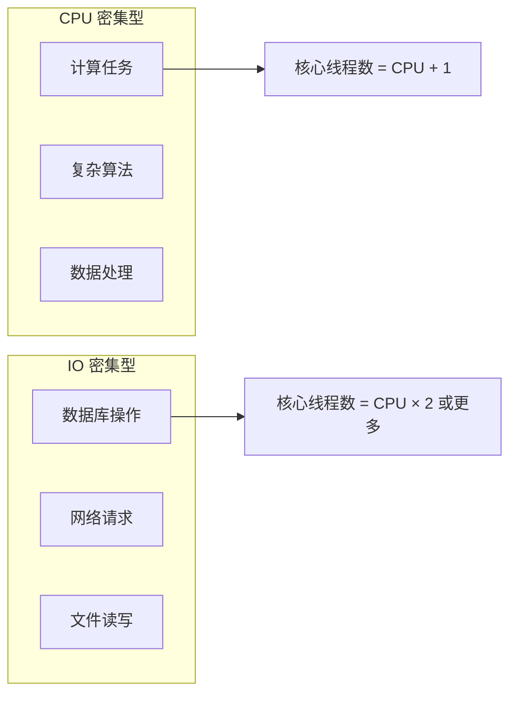

# 线程池参数设置案例

> **目标级别**：P6
> **面试频率**：🟡 中频
> **面试官最关心的 3 个问题**：
> 1. 线程池的核心参数有哪些？
> 2. 如何设置合理的线程池参数？
> 3. 线程池参数设置不当会有什么后果？

---

面试官问：「你们系统用线程池吗？参数怎么设置的？」你说「用的，网上说 corePoolSize=CPU核数」——然后面试官追问「这个业务是 CPU 密集型还是 IO 密集型？」你犹豫了。

线程池参数设置是 Java 开发的经典问题。但「CPU 核数」只是参考值，真正的参数设置需要结合业务特性来定。

## 一、线程池核心参数



| 参数 | 说明 | 默认值 |
|------|------|--------|
| **corePoolSize** | 核心线程数 | - |
| **maximumPoolSize** | 最大线程数 | - |
| **keepAliveTime** | 空闲线程存活时间 | - |
| **unit** | 时间单位 | TimeUnit |
| **workQueue** | 任务队列 | - |
| **threadFactory** | 线程工厂 | Executors.defaultThreadFactory() |
| **handler** | 拒绝策略 | AbortPolicy |

## 二、如何计算线程池参数

### 2.1 CPU 密集型 vs IO 密集型



### 2.2 计算公式

```java
// CPU 密集型
int corePoolSize = Runtime.getRuntime().availableProcessors() + 1;

// IO 密集型（推荐）
int corePoolSize = Runtime.getRuntime().availableProcessors() * 2;
// 或更激进
int corePoolSize = Runtime.getRuntime().availableProcessors() * N;  // N = 等待时间/计算时间

// 经验公式
线程数 = CPU 核数 × (1 + 等待时间/计算时间)
```

### 2.3 实际案例

```java
// ✅ 案例 1：CPU 密集型任务（图像处理）
public class ImageProcessor {
    private static final ExecutorService executor = 
        new ThreadPoolExecutor(
            // CPU 核数 + 1
            Runtime.getRuntime().availableProcessors() + 1,
            Runtime.getRuntime().availableProcessors() + 1,
            0L, TimeUnit.MILLISECONDS,
            new LinkedBlockingQueue<>(100),
            new ThreadFactoryBuilder().setNamePrefix("img-pool-").build(),
            new ThreadPoolExecutor.CallerRunsPolicy()
        );
}

// ✅ 案例 2：IO 密集型任务（数据库查询）
public class DatabaseService {
    private static final ExecutorService executor = 
        new ThreadPoolExecutor(
            // IO 密集型，可以设置更多线程
            Runtime.getRuntime().availableProcessors() * 2,
            Runtime.getRuntime().availableProcessors() * 2,
            60L, TimeUnit.SECONDS,
            new LinkedBlockingQueue<>(500),
            new ThreadFactoryBuilder().setNamePrefix("db-pool-").build(),
            new ThreadPoolExecutor.AbortPolicy()
        );
}

// ✅ 案例 3：混合型任务
public class MixedService {
    private static final ExecutorService executor = 
        new ThreadPoolExecutor(
            10,  // 核心线程数
            50,  // 最大线程数（应对突发）
            60L, TimeUnit.SECONDS,
            new LinkedBlockingQueue<>(200),
            new ThreadFactoryBuilder().setNamePrefix("mixed-pool-").build(),
            new ThreadPoolExecutor.CallerRunsPolicy()
        );
}
```

## 三、常见配置问题

### 3.1 问题一：队列容量设置不当

```java
// ⚠️ 错误示例：队列过大
new ThreadPoolExecutor(10, 20, 0L, TimeUnit.MILLISECONDS,
    new LinkedBlockingQueue<>(Integer.MAX_VALUE));  // ⚠️ 无界队列

// ✅ 正确示例：设置合理队列大小
new ThreadPoolExecutor(10, 20, 60L, TimeUnit.SECONDS,
    new LinkedBlockingQueue<>(200));  // ✅ 有界队列
```

### 3.2 问题二：最大线程数设置过小

```java
// ⚠️ 错误示例
new ThreadPoolExecutor(10, 10, 0L, TimeUnit.MILLISECONDS,
    new LinkedBlockingQueue<>(100));
// corePoolSize == maximumPoolSize，队列满了无法扩容

// ✅ 正确示例
new ThreadPoolExecutor(10, 50, 60L, TimeUnit.SECONDS,
    new LinkedBlockingQueue<>(200));
// 队列满后会扩容到最大线程数
```

### 3.3 问题三：忽略拒绝策略

```java
// ⚠️ 错误示例：使用默认拒绝策略（丢弃任务）
new ThreadPoolExecutor(10, 20, 0L, TimeUnit.MILLISECONDS,
    new LinkedBlockingQueue<>(100));
// 默认 AbortPolicy，直接抛出 RejectedExecutionException

// ✅ 正确示例：根据业务选择策略
new ThreadPoolExecutor(10, 20, 60L, TimeUnit.SECONDS,
    new LinkedBlockingQueue<>(100),
    new ThreadPoolExecutor.CallerRunsPolicy());  // ✅ 由调用线程执行
```

## 四、不同业务场景的配置

| 场景 | corePoolSize | maxPoolSize | 队列类型 | 拒绝策略 |
|------|--------------|-------------|----------|----------|
| **快速失败** | CPU+1 | CPU+1 | 有界 | AbortPolicy |
| **削峰填谷** | CPU×2 | CPU×N | 有界 | CallerRunsPolicy |
| **优先级任务** | CPU+1 | CPU+1 | PriorityBlockingQueue | CallerRunsPolicy |
| **延迟任务** | - | - | DelayQueue | - |
| **定时任务** | - | - | ScheduledFuture | - |

## 五、监控与调优

### 5.1 添加监控

```java
public class MonitoredThreadPool extends ThreadPoolExecutor {
    
    private final AtomicLong submittedCount = new AtomicLong();
    private final AtomicLong completedCount = new AtomicLong();
    
    public MonitoredThreadPool(...) {
        super(...);
    }
    
    @Override
    public void execute(Runnable command) {
        submittedCount.incrementAndGet();
        super.execute(command);
    }
    
    @Override
    protected void afterExecute(Runnable r, Throwable t) {
        completedCount.incrementAndGet();
        super.afterExecute(r, t);
    }
    
    // 监控指标
    public long getPendingCount() {
        return submittedCount.get() - completedCount.get();
    }
}
```

### 5.2 动态调整

```java
// ✅ 使用 ThreadPoolExecutor 提供的方法
public class DynamicThreadPool {
    private final ThreadPoolExecutor executor;
    
    // 增加核心线程数
    public void setCorePoolSize(int size) {
        executor.setCorePoolSize(size);
    }
    
    // 增加最大线程数
    public void setMaximumPoolSize(int size) {
        executor.setMaximumPoolSize(size);
    }
    
    // 设置核心线程超时
    public void allowCoreThreadTimeOut(boolean value) {
        executor.allowCoreThreadTimeOut(value);
    }
}
```

## 六、高频面试题

### 🔴 第一层：线程池参数怎么设置？

**问题**：线程池的 corePoolSize 和 maximumPoolSize 怎么设置？

**参考答案**：

```java
// 计算公式
// CPU 密集型：corePoolSize = CPU 核数 + 1
// IO 密集型：corePoolSize = CPU 核数 × 2（或者更多，取决于 IO 等待比例）

// 公式
线程数 = CPU 核数 × (1 + 等待时间/计算时间)
```

---

### 🔴 第二层：线程池的拒绝策略有哪些？

**问题**：线程池满时的拒绝策略？

**参考答案**：

| 策略 | 说明 | 适用场景 |
|------|------|----------|
| **AbortPolicy** | 抛出异常 | 需要明确知道任务被拒绝 |
| **CallerRunsPolicy** | 由调用线程执行 | 限流、削峰 |
| **DiscardPolicy** | 直接丢弃 | 不关心任务丢失 |
| **DiscardOldestPolicy** | 丢弃最老的任务 | 优先级队列 |

---

### 🟡 第三层：如何选择队列类型？

**问题**：SynchronousQueue、LinkedBlockingQueue、ArrayBlockingQueue 怎么选？

**参考答案**：

| 队列 | 说明 | 适用场景 |
|------|------|----------|
| **SynchronousQueue** | 不存储元素，每个插入必须等待删除 | 任务量小、需要快速响应 |
| **LinkedBlockingQueue** | 无界或有界链表队列 | 默认选择，高吞吐量 |
| **ArrayBlockingQueue** | 有界数组队列 | 固定大小，控制内存 |

---

## 七、常见陷阱

### ⚠️ 陷阱 1：使用 Executors 创建线程池

```java
// ⚠️ 阿里规范禁止
ExecutorService executor = Executors.newFixedThreadPool(100);
// 内部使用无界队列，可能导致 OOM

// ✅ 正确方式：手动创建
ExecutorService executor = new ThreadPoolExecutor(
    10, 50, 60L, TimeUnit.SECONDS,
    new LinkedBlockingQueue<>(200),
    new ThreadFactoryBuilder().setNamePrefix("biz-pool-").build()
);
```

### ⚠️ 陷阱 2：队列容量设置过大

队列过大意味着任务堆积过多，一旦发生问题，影响范围很大。

### ⚠️ 陷阱 3：核心线程超时设置不当

如果 allowCoreThreadTimeOut=true，核心线程也会被回收，失去「核心」的意义。

### ⚠️ 陷阱 4：忽略线程工厂

默认线程工厂创建的线程没有业务标识，出问题难以排查。

---

## 八、加分回答

### 💡 使用阿里的 TransmittableThreadLocal

```java
// 线程池中传递 ThreadLocal
import com.alibaba.ttl.TtlRunnable;

public class ThreadPoolWithTTL {
    private static final ExecutorService executor = 
        Executors.newFixedThreadPool(10);
    
    public static void execute(Runnable task) {
        // 使用 TTL 包装
        executor.execute(TtlRunnable.get(task));
    }
}
```

### 💡 统一线程池管理

```java
// 统一管理线程池配置
@Component
public class ThreadPoolManager {
    
    @Bean("ioIntensivePool")
    public ThreadPoolExecutor ioIntensivePool() {
        return new ThreadPoolExecutor(
            Runtime.getRuntime().availableProcessors() * 2,
            Runtime.getRuntime().availableProcessors() * 4,
            60L, TimeUnit.SECONDS,
            new LinkedBlockingQueue<>(500),
            new CustomThreadFactory("io-pool"),
            new ThreadPoolExecutor.CallerRunsPolicy()
        );
    }
    
    @Bean("cpuIntensivePool")
    public ThreadPoolExecutor cpuIntensivePool() {
        return new ThreadPoolExecutor(
            Runtime.getRuntime().availableProcessors() + 1,
            Runtime.getRuntime().availableProcessors() + 1,
            0L, TimeUnit.MILLISECONDS,
            new LinkedBlockingQueue<>(100),
            new CustomThreadFactory("cpu-pool")
        );
    }
}
```

---

## 九、扩展思考

为什么阿里规范要求不使用 Executors 创建线程池？

> **答案**：
>
> 1. **FixedThreadPool / SingleThreadPool**：使用无界队列，可能导致 OOM
> 2. **CachedThreadPool**：最大线程数无限制，可能创建过多线程
> 3. **ScheduledThreadPool**：核心线程数固定但队列无界
> 4. **内存风险**：无界队列 = 无限堆积 = OOM
>
> **正确做法**：手动创建 ThreadPoolExecutor，设置合理的队列大小和拒绝策略。
