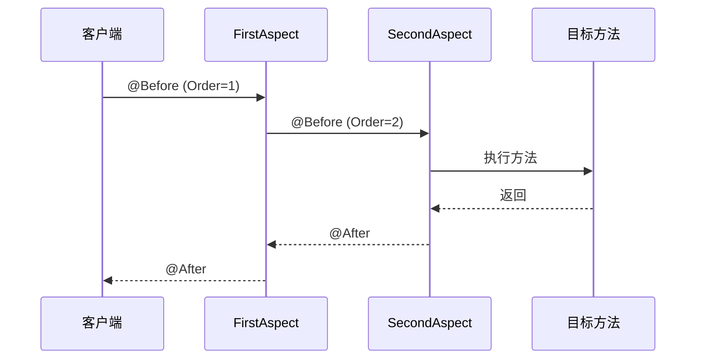

# 通知执行顺序

**目标级别**：P6

## 开场：执行顺序至关重要

面试官问：「如果有多个切面同时作用于同一个方法，它们的执行顺序是什么？」你说：「按切面类的字母顺序。」面试官追问：「那同一个切面中的多个通知，它们的执行顺序呢？」

通知执行顺序是 AOP 面试中的高频深挖题。理解执行顺序，才能正确设计切面，避免出现意想不到的副作用。

## 面试官最关心的 3 个问题（快速自测）

1. **🟡 同一个切面中，五种通知的执行顺序是什么？**
2. **🟡 多个切面同时作用于同一个方法时，执行顺序如何确定？**
3. **🟡 @Order 注解和 Ordered 接口有什么区别？**

## 一、同一切面中的通知执行顺序

### 1.1 执行流程图

```mermaid
flowchart TD
    A[方法调用] --> B{Around Before}
    B --> C[@Before]
    C --> D[目标方法]
    D --> E{方法执行结果}
    
    E -->|正常返回| F[@AfterReturning]
    E -->|抛出异常| G[@AfterThrowing]
    
    F --> H[@After]
    G --> H
    
    H --> I{Around After}
    I --> J[返回/抛出]
    
    style B fill:#fcc419
    style C fill:#51cf66
    style F fill:#339af0
    style G fill:#ff6b6b
    style H fill:#339af0
    style I fill:#fcc419
```

### 1.2 正常执行顺序

```java
@Aspect
@Component
public class LoggingAspect {
    
    @Around("execution(* com.example..*.*(..))")
    public Object around(ProceedingJoinPoint pjp) {
        System.out.println("1. Around - Before");
        Object result = pjp.proceed();
        System.out.println("2. Around - After");
        return result;
    }
    
    @Before("execution(* com.example..*.*(..))")
    public void before() {
        System.out.println("3. @Before");
    }
    
    @After("execution(* com.example..*.*(..))")
    public void after() {
        System.out.println("4. @After");
    }
    
    @AfterReturning("execution(* com.example..*.*(..))")
    public void afterReturning() {
        System.out.println("5. @AfterReturning");
    }
}
```

**输出顺序**：

```
1. Around - Before
3. @Before
[目标方法执行]
4. @After
5. @AfterReturning
2. Around - After
```

### 1.3 异常执行顺序

```java
@Aspect
@Component
public class ExceptionAspect {
    
    @Around("execution(* com.example..*.*(..))")
    public Object around(ProceedingJoinPoint pjp) {
        try {
            return pjp.proceed();
        } catch (Exception e) {
            System.out.println("Around - Exception Caught");
            throw e;
        }
    }
    
    @After("execution(* com.example..*.*(..))")
    public void after() {
        System.out.println("@After");
    }
    
    @AfterThrowing("execution(* com.example..*.*(..))")
    public void afterThrowing() {
        System.out.println("@AfterThrowing");
    }
}
```

**异常输出顺序**：

```
Around - Before
@Before
[目标方法抛出异常]
@After
@AfterThrowing
Around - Exception Caught
```

## 二、多个切面的执行顺序

### 2.1 切面优先级

Spring AOP 按 **切面优先级** 决定执行顺序：

| 方式 | 说明 | 优先级值 |
|------|------|---------|
| @Order 注解 | 在 @Aspect 类上标注 | 值越小优先级越高 |
| Ordered 接口 | 实现 getOrder() | 值越小优先级越高 |

### 2.2 执行顺序示例

```java
@Aspect
@Component
@Order(1)  // 优先级最高
public class FirstAspect {
    
    @Before("execution(* com.example..*.*(..))")
    public void before() {
        System.out.println("FirstAspect - Before");
    }
}

@Aspect
@Component
@Order(2)  // 优先级次之
public class SecondAspect {
    
    @Before("execution(* com.example..*.*(..))")
    public void before() {
        System.out.println("SecondAspect - Before");
    }
}
```

**输出顺序**：

```
FirstAspect - Before
SecondAspect - Before
[目标方法执行]
SecondAspect - After
FirstAspect - After
```

### 2.3 执行流程图



## 三、源码解析

### 3.1 通知执行链

Spring AOP 通过 `MethodInterceptor` 链执行通知：

```java title="CglibAopProxy.java"
public Object intercept(Object proxy, Method method, Object[] args, 
                        MethodProxy methodProxy) {
    List<Object> interceptors = this.advised.getInterceptorsAndDynamicInterceptionAdvice(
        method, targetClass);
    
    InvocationHandler invocation = new CglibMethodInvocation(
        joinpoint, method, args, targetClass, interceptors);
    
    return invocation.invoke();
}
```

### 3.2 执行链的构建

```java title="DefaultAdvisorChainFactory.java"
public List<Object> getInterceptorsAndDynamicInterceptionAdvice(
        AdvisedSupport config, Method method, Class<?> targetClass) {
    
    List<Object> interceptorList = new ArrayList<>();
    
    // 遍历所有切面
    for (Advisor advisor : config.getAdvisors()) {
        if (advisor instanceof PointcutAdvisor) {
            PointcutAdvisor pca = (PointcutAdvisor) advisor;
            if (pca.getPointcut().getMethodMatcher().matches(method, targetClass)) {
                interceptorList.add(advisor.getAdvice());
            }
        }
    }
    
    // 按优先级排序
    interceptorList.sort((a, b) -> {
        int orderA = ((Ordered) a).getOrder();
        int orderB = ((Ordered) b).getOrder();
        return orderA - orderB;
    });
    
    return interceptorList;
}
```

## 四、@Order vs Ordered

### 4.1 @Order 注解

```java
@Aspect
@Component
@Order(1)  // 越小优先级越高
public class HighPriorityAspect {
}

@Aspect
@Component
@Order(Ordered.LOWEST_PRECEDENCE)  // 最低优先级
public class LowPriorityAspect {
}
```

### 4.2 Ordered 接口

```java
@Aspect
@Component
public class CustomAspect implements Ordered {
    
    @Override
    public int getOrder() {
        return 100;  // 越小优先级越高
    }
}
```

### 4.3 执行顺序对比

| 场景 | @Order | Ordered 接口 | 默认值 |
|------|--------|-------------|--------|
| 值越小优先级越高 | ✅ | ✅ | ✅ |
| 实现方式 | 注解 | 方法 | 无 |
| 灵活性 | 编译时确定 | 运行时可计算 | - |
| 推荐程度 | ⭐⭐⭐⭐⭐ | ⭐⭐⭐ | - |

## 五、实战应用

### 5.1 记录执行时间

```java
@Aspect
@Component
@Order(1)  // 先执行
public class TimingAspect {
    
    private static final Logger logger = LoggerFactory.getLogger(TimingAspect.class);
    
    @Around("execution(* com.example..service.*.*(..))")
    public Object around(ProceedingJoinPoint pjp) throws Throwable {
        long start = System.currentTimeMillis();
        
        try {
            return pjp.proceed();
        } finally {
            long duration = System.currentTimeMillis() - start;
            logger.info("{} 执行耗时：{}ms", 
                pjp.getSignature().toShortString(), duration);
        }
    }
}
```

### 5.2 事务管理

```java
@Aspect
@Component
@Order(Ordered.LOWEST_PRECEDENCE - 1)  // 最后执行
public class TransactionAspect {
    
    @Around("execution(* com.example..service.*.*(..))")
    public Object around(ProceedingJoinPoint pjp) throws Throwable {
        TransactionManager tm = getTransactionManager();
        TransactionStatus status = tm.getTransaction();
        
        try {
            Object result = pjp.proceed();
            tm.commit(status);
            return result;
        } catch (Exception e) {
            tm.rollback(status);
            throw e;
        }
    }
}
```

### 5.3 安全校验

```java
@Aspect
@Component
@Order(Ordered.HIGHEST_PRECEDENCE)  // 最先执行
public class SecurityAspect {
    
    @Before("execution(* com.example..service.*.*(..))")
    public void before() {
        if (!SecurityContextHolder.hasAccess()) {
            throw new AccessDeniedException("无权限访问");
        }
    }
}
```

## 六、面试高频追问

### 追问链 1：@Around 的特殊地位

> **第一层**：@Around 通知有什么特殊之处？
> 
> @Around 可以控制目标方法的执行，可以在执行前、后甚至不执行。

> **第二层**：@Around 和其他通知的区别是什么？
> 
> 其他通知无法阻止目标方法执行，@Around 可以。

> **第三层**：@Around 中不调用 proceed() 会怎样？
> 
> 目标方法不会被执行，直接返回。

### 追问链 2：同优先级时的顺序

> **第一层**：两个切面优先级相同时，执行顺序是什么？
> 
> 按切面 Bean 的注册顺序。

> **第二层**：Bean 注册顺序如何确定？
> 
> 按 @Bean 方法定义顺序或 @Component 扫描顺序。

> **第三层**：如何确保顺序确定性？
> 
> 使用 @Order 注解明确指定优先级。

### 追问链 3：异常对通知的影响

> **第一层**：目标方法抛出异常时，哪些通知会执行？
> 
> @After 和 @AfterThrowing 会执行。

> **第二层**：@Around 中捕获异常后，后续通知还执行吗？
> 
> 取决于异常处理。如果重新抛出，@After 会执行但 @AfterReturning 不会。

> **第三层**：如何保证清理逻辑一定执行？
> 
> 使用 try-finally 或 @After 通知。

## 七、常见错误与陷阱

### 错误 1：忘记在 @Around 中调用 proceed()

```java
@Aspect
@Component
public class BadAspect {
    
    @Around("execution(* com.example..*.*(..))")
    public Object around(ProceedingJoinPoint pjp) {
        // ⚠️ 忘记调用 pjp.proceed()
        // 目标方法永远不会执行！
        return null;
    }
}
```

### 错误 2：混淆 @After 和 @AfterReturning

```java
@Aspect
@Component
public class BadAspect {
    
    @AfterReturning("execution(* com.example..*.*(..))")
    public void afterReturning() {
        // ⚠️ 只在正常返回时执行
        // 抛出异常时不会执行！
    }
    
    @After("execution(* com.example..*.*(..))")
    public void after() {
        // ✅ 无论正常返回还是异常，都会执行
    }
}
```

### 错误 3：优先级设置错误

```java
@Aspect
@Component
@Order(100)  // ⚠️ 默认优先级可能更低
public class TransactionAspect { }

@Aspect
@Component
@Order(1)  // ✅ 更高优先级
public class LoggingAspect { }
```

> **⚠️ 陷阱**：如果事务切面优先级低于日志切面，可能导致日志记录不完整。

## 八、对比总结

### 通知类型对比

| 通知 | 执行时机 | 参数 | 异常时执行 |
|------|---------|------|-----------|
| @Before | 目标方法前 | JoinPoint | ✅ |
| @AfterReturning | 目标方法正常返回后 | JoinPoint, 返回值 | ❌ |
| @AfterThrowing | 目标方法抛出异常后 | JoinPoint, 异常 | ✅ |
| @After | 目标方法后（finally） | JoinPoint | ✅ |
| @Around | 完全控制 | ProceedingJoinPoint | 取决于实现 |

### 优先级对比

| 设置方式 | 优先级 | 说明 |
|---------|--------|------|
| @Order(Ordered.HIGHEST_PRECEDENCE) | Integer.MIN_VALUE | 最高 |
| @Order(1) | 1 | 高 |
| @Order(Ordered.LOWEST_PRECEDENCE) | Integer.MAX_VALUE | 最低 |
| implements Ordered | getOrder() 返回值 | 灵活 |

## 九、扩展知识

### 9.1 AspectJ 优先级

AspectJ 支持 `@annotation()` 方式指定优先级：

```java
@Aspect
@Component
@DeclarePrecedence("Security, Logging, Transaction")
public class OrderedAspect {
}
```

### 9.2 织入顺序与 AspectJ

AspectJ 提供更强的顺序控制能力：

```java
// AspectJ 支持更细粒度的顺序控制
@Aspect("precedence(security, logging, transaction)")
public class SecurityAspect {
}
```

> **💡 加分回答**：Spring AOP 基于 AspectJ 的注解，但只使用了 AspectJ 的小部分功能。如果需要更复杂的织入顺序控制，可以考虑使用完整的 AspectJ。

## 下一步

理解 Spring 事务管理的原理和应用，请阅读 [Spring 事务管理](/questions/spring/transaction)。
