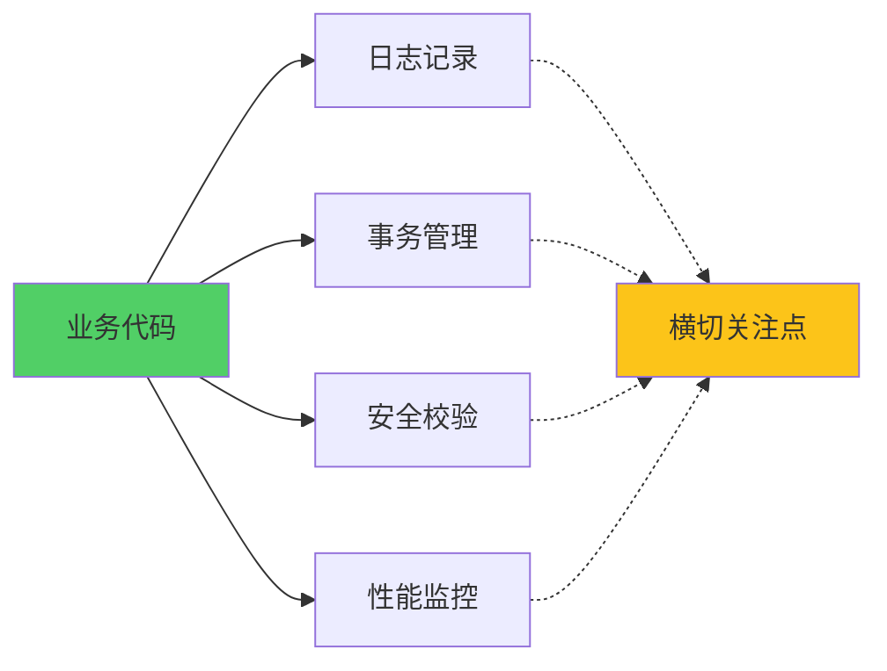
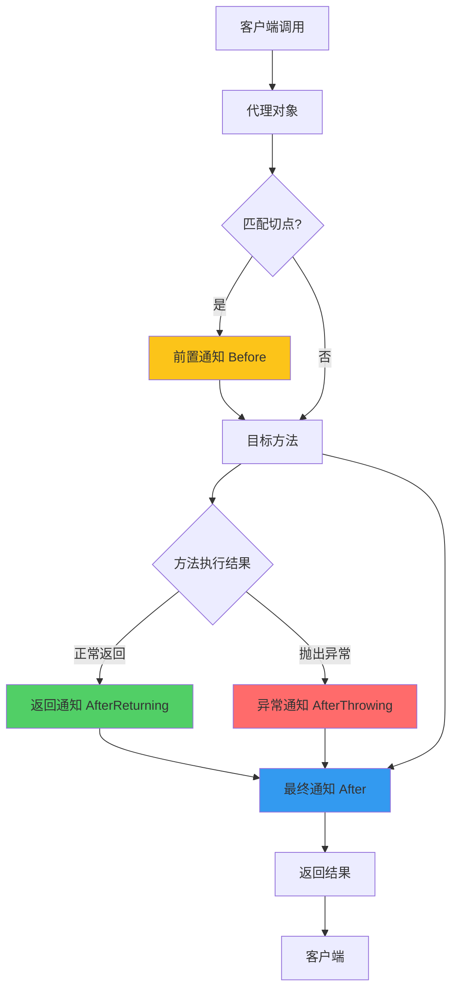
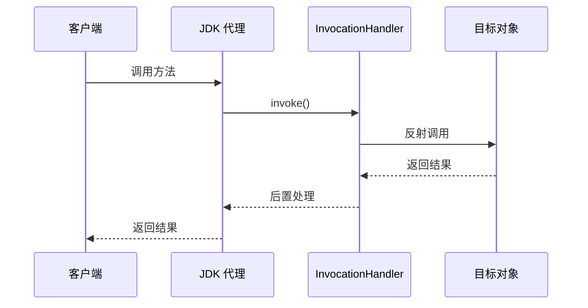
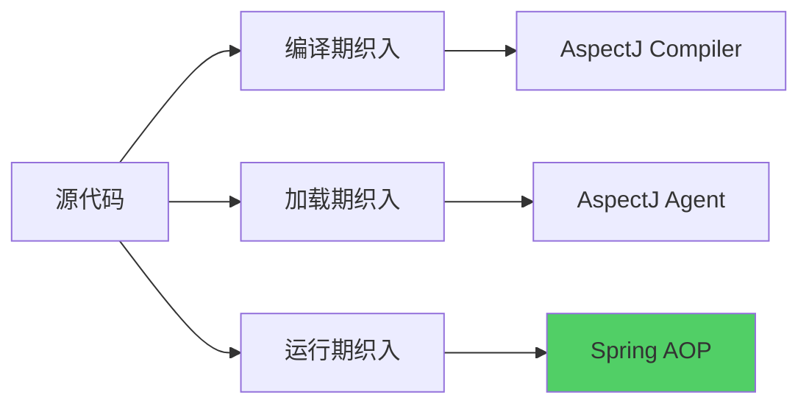

# AOP 原理与代理模式

**目标级别**：P6

## 开场：从一个问题开始

面试官问：「解释一下 Spring AOP 的原理。」你说：「通过动态代理。」面试官追问：「Spring AOP 和 AspectJ 有什么区别？为什么 Spring 最终选择了 CGLIB 而不是 JDK 动态代理？」

AOP（面向切面编程）是 Spring 最核心的机制之一，也是面试中容易被深挖的地方。理解 AOP 的原理，不仅要会用，还要能解释**为什么这样设计**。

## 面试官最关心的 3 个问题（快速自测）

1. **🔴 Spring AOP 的底层实现是什么？动态代理和 CGLIB 有什么区别？**
2. **🔴 Spring AOP 和 AspectJ 有什么区别？各有什么优缺点？**
3. **🟡 AOP 的核心概念：切点、切面、通知、织入分别是什么意思？**

## 一、AOP 核心概念

### 1.1 什么是 AOP

AOP（Aspect-Oriented Programming，面向切面编程）是一种编程范式，用于将**横切关注点**从业务逻辑中分离出来。



### 1.2 核心术语

| 术语 | 英文 | 说明 | 类比 |
|------|------|------|------|
| 切点 | Pointcut | 定义拦截哪些方法 | 订机票的目标地点 |
| 切面 | Aspect | 包含通知和切点 | 订票代理商 |
| 通知 | Advice | 拦截后执行的逻辑 | 具体服务内容 |
| 连接点 | Join Point | 可拦截的时机 | 机场入口、登机口等 |
| 织入 | Weaving | 将通知应用到目标 | 实际订票过程 |

### 1.3 AOP 流程图



## 二、Spring AOP 实现原理

### 2.1 动态代理 vs CGLIB

Spring AOP 支持两种代理方式：

| 方式 | JDK 动态代理 | CGLIB 代理 |
|------|-------------|-----------|
| 实现原理 | 实现接口，生成代理类 | 继承类，生成子类 |
| 目标类要求 | 必须实现接口 | 类不能被 final 修饰 |
| 性能 | 反射调用，性能稍差 | 直接调用，性能好 |
| Spring 默认 | ❌ | ✅（Spring 5.x） |

### 2.2 JDK 动态代理原理

```java
public class JdkDynamicProxy implements InvocationHandler {
    
    private Object target;
    
    public JdkDynamicProxy(Object target) {
        this.target = target;
    }
    
    @Override
    public Object invoke(Object proxy, Method method, Object[] args) throws Throwable {
        // 前置通知
        System.out.println("Before: " + method.getName());
        
        // 执行目标方法
        Object result = method.invoke(target, args);
        
        // 后置通知
        System.out.println("After: " + method.getName());
        
        return result;
    }
    
    public static Object createProxy(Object target) {
        return Proxy.newProxyInstance(
            target.getClass().getClassLoader(),
            target.getClass().getInterfaces(),
            new JdkDynamicProxy(target)
        );
    }
}
```



### 2.3 CGLIB 代理原理

CGLIB（Code Generation Library）通过**继承**生成子类实现代理：

```java
public class CglibProxy implements MethodInterceptor {
    
    private Object target;
    
    public CglibProxy(Object target) {
        this.target = target;
    }
    
    @Override
    public Object intercept(Object obj, Method method, Object[] args, 
                          MethodProxy proxy) throws Throwable {
        // 前置通知
        System.out.println("Before: " + method.getName());
        
        // 执行目标方法
        Object result = proxy.invokeSuper(obj, args);
        
        // 后置通知
        System.out.println("After: " + method.getName());
        
        return result;
    }
    
    public static Object createProxy(Object target) {
        Enhancer enhancer = new Enhancer();
        enhancer.setSuperclass(target.getClass());
        enhancer.setCallback(new CglibProxy(target));
        return enhancer.create();
    }
}
```

```mermaid
classDiagram
    class TargetService {
        +void method()
    }
    
    class TargetService$$CglibProxy {
        +void method()
    }
    
    TargetService <|-- TargetService$$CglibProxy
```

### 2.4 Spring 选择 CGLIB 的原因

Spring 5.x 默认使用 CGLIB，主要原因：

1. **无需接口**：JDK 代理要求目标类实现接口，CGLIB 不需要
2. **性能更好**：CGLIB 直接调用方法，JDK 代理通过反射
3. **Final 类支持**：JDK 代理无法处理 final 类，CGLIB 通过继承实现

```java
@Configuration
public class ProxyConfig {
    
    @Bean
    @Scope(proxyMode = ScopedProxyMode.TARGET_CLASS)
    public MyBean myBean() {
        return new MyBean();
    }
}
```

## 三、Spring AOP vs AspectJ

### 3.1 对比表

| 维度 | Spring AOP | AspectJ |
|------|-----------|---------|
| 织入时机 | 运行时 | 编译时/加载时 |
| 范围 | 方法级别 | 字段、方法、构造器 |
| 复杂度 | 简单 | 复杂 |
| 性能 | 略低（运行时织入） | 高（编译时织入） |
| 学习曲线 | 陡峭 | 平缓 |
| 无侵入性 | ✅ | ❌（需要编译器） |

### 3.2 织入时机对比



### 3.3 实际选择建议

- **Spring AOP**：企业应用，大多数场景足够
- **AspectJ**：性能要求极高，或需要拦截字段访问

## 四、通知类型详解

### 4.1 五种通知类型

| 通知 | 注解 | 执行时机 |
|------|------|---------|
| 前置通知 | @Before | 方法执行前 |
| 后置通知 | @After | 方法执行后（无论是否异常） |
| 返回通知 | @AfterReturning | 方法正常返回后 |
| 异常通知 | @AfterThrowing | 方法抛出异常后 |
| 环绕通知 | @Around | 方法执行前后（可控制是否执行） |

### 4.2 通知执行顺序

```java
@Aspect
@Component
public class LoggingAspect {
    
    @Around("execution(* com.example.service.*.*(..))")
    public Object around(ProceedingJoinPoint pjp) throws Throwable {
        System.out.println("1. Around - Before");
        
        Object result = pjp.proceed();  // 执行目标方法
        
        System.out.println("2. Around - After");
        return result;
    }
    
    @Before("execution(* com.example.service.*.*(..))")
    public void before() {
        System.out.println("3. Before");
    }
    
    @After("execution(* com.example.service.*.*(..))")
    public void after() {
        System.out.println("4. After");
    }
    
    @AfterReturning("execution(* com.example.service.*.*(..))")
    public void afterReturning() {
        System.out.println("5. AfterReturning");
    }
    
    @AfterThrowing("execution(* com.example.service.*.*(..))")
    public void afterThrowing() {
        System.out.println("6. AfterThrowing");
    }
}
```

**正常执行输出**：

```
1. Around - Before
3. Before
[目标方法执行]
4. After
5. AfterReturning
2. Around - After
```

## 五、切点表达式

### 5.1 语法

```java
execution([权限修饰符] [返回类型] [类全限定名].[方法名]([参数列表]))
```

### 5.2 示例

| 表达式 | 含义 |
|-------|------|
| `execution(public * *(..))` | 所有 public 方法 |
| `execution(* com.example.service.*.*(..))` | service 包下所有方法 |
| `execution(* com.example..*.*(..))` | example 包及子包下所有方法 |
| `execution(* *.find*(..))` | 所有以 find 开头的方法 |
| `execution(* com.example.UserService+.*(..))` | UserService 接口的所有方法 |

### 5.3 切点函数

| 函数 | 说明 |
|------|------|
| execution | 方法执行 |
| within | 特定类型内 |
| this | 代理对象是特定类型 |
| target | 目标对象是特定类型 |
| args | 参数是特定类型 |
| @annotation | 方法有特定注解 |

## 六、面试高频追问

### 追问链 1：AOP 代理的创建时机

> **第一层**：Spring AOP 代理是在什么时候创建的？
> 
> 在 Bean 初始化完成后，通过 BeanPostProcessor.postProcessAfterInitialization 创建。

> **第二层**：为什么要在这个时候创建？
> 
> 因为属性填充和初始化完成后，Bean 才真正可用，此时创建代理可以确保依赖注入完成。

> **第三层**：循环依赖时代理是如何创建的？
> 
> 通过三级缓存的 getEarlyBeanReference 方法，提前创建代理对象。

### 追问链 2：Spring AOP 的局限性

> **第一层**：Spring AOP 有什么局限性？
> 
> 只能拦截方法执行，不能拦截字段访问；只能拦截 Spring Bean 的方法。

> **第二层**：为什么不能拦截字段？
> 
> 因为字段访问没有 Join Point，Java 字节码没有对应的指令。

> **第三层**：如何突破这个限制？
> 
> 使用 AspectJ，或者使用反射手动访问字段。

### 追问链 3：AOP 与设计模式

> **第一层**：AOP 用到了哪些设计模式？
> 
> 代理模式、装饰器模式、策略模式。

> **第二层**：JDK 动态代理和装饰器模式有什么区别？
> 
> 装饰器模式在编译时确定，增强类是透明的；JDK 动态代理在运行时生成，增强类对客户端隐藏。

> **第三层**：AOP 和代理模式的区别是什么？
> 
> 代理模式是一种设计模式，AOP 是基于代理模式的思想，提供了更强大的横切能力。

## 七、常见错误与陷阱

### 错误 1：代理对象的 self-invocation

```java
@Service
public class UserService {
    
    @Transactional
    public void methodA() {
        // 不会生效！因为 this.methodB() 绕过了代理
        this.methodB();
    }
    
    @Transactional
    public void methodB() {
        // 这个方法有事务
    }
}
```

> **⚠️ 陷阱**：同类中方法调用不会走代理，必须通过代理对象调用。

### 错误 2：private 方法不会增强

```java
@Aspect
@Component
public class TransactionAspect {
    
    @Before("execution(* com.example..*.*(..))")
    public void before() {
        // 只匹配 public 方法
    }
}
```

> **⚠️ 陷阱**：Spring AOP 只支持方法执行，不支持 private 方法。

### 错误 3：Spring Boot 2.0+ 默认 CGLIB

```java
// Spring Boot 2.0+ 默认使用 CGLIB
// 如果需要强制使用 JDK 代理
@EnableAspectJAutoProxy(proxyTargetClass = false)
```

## 八、对比总结

### 代理方式对比

| 维度 | JDK 动态代理 | CGLIB 代理 |
|------|-------------|-----------|
| 实现方式 | 实现接口 | 继承类 |
| 目标类要求 | 必须实现接口 | 不能是 final |
| 性能 | 反射调用 | 直接调用 |
| 代理对象类型 | 实现相同接口的类 | 目标类的子类 |
| Spring 选择 | ❌ | ✅（默认） |

### AOP vs传统 OOP

| 维度 | 传统 OOP | AOP |
|------|---------|-----|
| 模块化单元 | 类 | 切面 |
| 关注点分离 | 纵向 | 横向 |
| 代码组织 | 类内 | 跨类 |
| 复杂度 | 较低 | 较高 |

## 九、实战应用

### 9.1 自定义日志切面

```java
@Aspect
@Component
public class LoggingAspect {
    
    private static final Logger logger = LoggerFactory.getLogger(LoggingAspect.class);
    
    @Around("execution(* com.example..service.*.*(..))")
    public Object logAround(ProceedingJoinPoint pjp) throws Throwable {
        String methodName = pjp.getSignature().toShortString();
        long start = System.currentTimeMillis();
        
        try {
            Object result = pjp.proceed();
            long duration = System.currentTimeMillis() - start;
            logger.info("{} 执行成功，耗时：{}ms", methodName, duration);
            return result;
        } catch (Exception e) {
            long duration = System.currentTimeMillis() - start;
            logger.error("{} 执行失败，耗时：{}ms", methodName, duration);
            throw e;
        }
    }
}
```

### 9.2 自定义缓存切面

```java
@Aspect
@Component
public class CacheAspect {
    
    private Map<String, Object> cache = new ConcurrentHashMap<>();
    
    @Around("@annotation(cacheable)")
    public Object around(ProceedingJoinPoint pjp, Cacheable cacheable) throws Throwable {
        String key = cacheable.key();
        
        if (cache.containsKey(key)) {
            return cache.get(key);
        }
        
        Object result = pjp.proceed();
        cache.put(key, result);
        return result;
    }
}
```

> **💡 加分回答**：Spring 的 `@Async` 注解也是通过 AOP 实现的，使用 `AsyncAnnotationBeanPostProcessor` 创建异步代理。

## 下一步

深入理解 JDK 动态代理和 CGLIB 的区别，请阅读 [JDK 动态代理 vs CGLIB](/questions/spring/proxy-comparison)。
