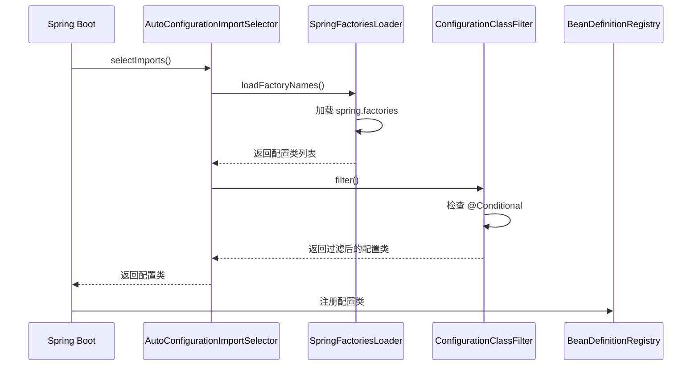

# Spring Boot 自动配置原理

**目标级别**：P6

## 开场：为什么 Spring Boot 不用配置

面试官问：「Spring Boot 是怎么实现自动配置的？」你说：「通过 spring.factories 文件。」面试官追问：「那 @EnableAutoConfiguration 注解做了什么？自动配置是什么时候生效的？」

Spring Boot 的自动配置是其最核心的特性，也是面试中的高频深挖题。理解自动配置原理，才能真正理解 Spring Boot 的设计思想。

## 面试官最关心的 3 个问题（快速自测）

1. **🔴 Spring Boot 自动配置的核心原理是什么？**
2. **🔴 spring.factories 文件和 META-INF/spring.factories 有什么区别？**
3. **🟡 @Conditional 注解有哪些？它们的作用是什么？**

## 一、自动配置核心原理

### 1.1 核心注解

```java
@SpringBootApplication
// 等价于
@EnableAutoConfiguration
@ComponentScan
@Configuration
```

### 1.2 架构图

```mermaid
flowchart TD
    A[Spring Boot 应用启动] --> B[@EnableAutoConfiguration]
    B --> C[AutoConfigurationImportSelector]
    C --> D[加载 spring.factories]
    D --> E[获取自动配置类列表]
    E --> F[排除指定的配置类]
    F --> G[过滤不满足条件的配置类]
    G --> H[注册 Bean 定义]
    
    style A fill:#339af0
    style H fill:#51cf66
```

## 二、spring.factories 文件

### 2.1 文件结构

``` properties title="META-INF/spring.factories"
# Auto Configure
org.springframework.boot.autoconfigure.EnableAutoConfiguration=\
org.springframework.boot.autoconfigure.data.redis.RedisAutoConfiguration,\
org.springframework.boot.autoconfigure.jdbc.DataSourceAutoConfiguration,\
org.springframework.boot.autoconfigure.web.servlet.WebMvcAutoConfiguration
```

### 2.2 Spring Boot 3.0+ 变化

``` properties title="META-INF/spring/org.springframework.boot.autoconfigure.AutoConfiguration.imports"
# Spring Boot 3.0+ 使用新格式
org.springframework.boot.autoconfigure.EnableAutoConfiguration=\
com.example.autoconfigure.MyAutoConfiguration
```

### 2.3 自动配置加载流程



## 三、@Conditional 注解

### 3.1 条件注解家族

| 注解 | 条件 |
|------|------|
| @ConditionalOnClass | classpath 中存在指定类 |
| @ConditionalOnMissingClass | classpath 中不存在指定类 |
| @ConditionalOnBean | 容器中存在指定 Bean |
| @ConditionalOnMissingBean | 容器中不存在指定 Bean |
| @ConditionalOnProperty | 配置属性满足条件 |
| @ConditionalOnResource | 资源文件存在 |
| @ConditionalOnWebApplication | 是 Web 应用 |
| @ConditionalOnNotWebApplication | 非 Web 应用 |

### 3.2 示例

```java
@Configuration
@ConditionalOnClass(DataSource.class)  // DataSource 类存在时生效
@ConditionalOnMissingBean(DataSource.class)  // 容器中没有 DataSource Bean 时生效
@ConditionalOnProperty(prefix = "spring.datasource", name = "enabled", havingValue = "true")
public class DataSourceAutoConfiguration {
    
    @Bean
    @ConfigurationProperties(prefix = "spring.datasource")
    public DataSource dataSource() {
        return new HikariDataSource();
    }
}
```

## 四、源码解析

### 4.1 AutoConfigurationImportSelector

```java title="AutoConfigurationImportSelector.java"
public class AutoConfigurationImportSelector 
        implements DeferredImportSelector, BeanClassLoaderAware {
    
    @Override
    public String[] selectImports(AnnotationMetadata annotationMetadata) {
        // 获取自动配置类
        List<String> configurations = getCandidateConfigurations(
            annotationMetadata, 
            getAttributes(annotationMetadata)
        );
        
        // 去重
        configurations = removeDuplicates(configurations);
        
        // 排除指定的配置类
        Set<String> exclusions = getExclusions(annotationMetadata);
        configurations.removeAll(exclusions);
        
        // 过滤
        configurations = filter(configurations, autoConfigurationMetadata);
        
        // 按 order 排序
        configurations = sort(configurations);
        
        return configurations.toArray(new String[0]);
    }
}
```

### 4.2 SpringFactoriesLoader

```java title="SpringFactoriesLoader.java"
public final class SpringFactoriesLoader {
    
    public static List<String> loadFactoryNames(
            Class<?> factoryType, 
            @Nullable ClassLoader classLoader) {
        
        String factoryTypeName = factoryType.getName();
        
        // 加载 classpath 中所有 META-INF/spring.factories
        // 解析其中的 factoryType 配置
        result = loadSpringFactories(classLoader).getOrDefault(
            factoryTypeName, 
            Collections.emptyList()
        );
        
        return result;
    }
}
```

## 五、自动配置优先级

### 5.1 配置顺序

| 顺序 | 配置来源 | 说明 |
|------|---------|------|
| 1 | 命令行参数 | 最高优先级 |
| 2 | @PropertySource | 显式指定 |
| 3 | OS 环境变量 | 系统环境变量 |
| 4 | application.yml | 应用配置 |
| 5 | @DefaultProperties | @SpringBootApplication 中指定 |
| 6 | 自动配置默认值 | 最低优先级 |

### 5.2 排除自动配置

```java
// 方式一：@SpringBootApplication 排除
@SpringBootApplication(exclude = {DataSourceAutoConfiguration.class})
public class Application {
}

// 方式二：配置文件排除
spring:
  autoconfigure:
    exclude:
      - org.springframework.boot.autoconfigure.jdbc.DataSourceAutoConfiguration
```

## 六、面试高频追问

### 追问链 1：@ConditionalOnBean vs @ConditionalOnMissingBean

> **第一层**：这两个注解有什么区别？
> 
> @ConditionalOnBean 在存在指定 Bean 时生效，@ConditionalOnMissingBean 在不存在指定 Bean 时生效。

> **第二层**：为什么要用这两个注解？
> 
> 为了避免重复配置。如果用户已经手动配置了某个 Bean，自动配置就不应该生效。

> **第三层**：@ConditionalOnMissingBean 有什么陷阱？
> 
> 如果用户配置在自动配置之后生效，@ConditionalOnMissingBean 可能无法正确判断。

### 追问链 2：自动配置的 Bean 覆盖

> **第一层**：用户配置和自动配置冲突时，谁优先？
> 
> 用户配置优先。

> **第二层**：为什么？
> 
> Spring Boot 设计原则：约定大于配置。自动配置只是提供默认值。

> **第三层**：如何强制使用自动配置？
> 
> 使用 @Primary 注解，或排除用户配置类。

### 追问链 3：自动配置加载顺序

> **第一层**：自动配置类的加载顺序如何？
> 
> 按 spring.factories 文件中的顺序。

> **第二层**：多个自动配置类之间有依赖怎么办？
> 
> 使用 @AutoConfigureBefore 和 @AutoConfigureAfter。

> **第三层**：如何控制自动配置的执行顺序？
> 
> 在自动配置类上使用 @AutoConfigureOrder。

## 七、常见错误与陷阱

### 错误 1：spring.factories 位置错误

``` properties
# ⚠️ 错误位置
src/main/resources/com/example/spring.factories

# ✅ 正确位置
src/main/resources/META-INF/spring.factories
```

### 错误 2：@Conditional 条件设置不当

```java
@Configuration
@ConditionalOnClass(RedisOperations.class)  // ⚠️ RedisOperations 可能不存在
public class RedisAutoConfiguration {
    // ...
}
```

### 错误 3：自动配置与用户配置冲突

```java
@Configuration
public class MyConfig {
    @Bean
    public DataSource dataSource() {
        // ⚠️ 用户配置可能与自动配置冲突
        return new DruidDataSource();
    }
}
```

## 八、对比总结

### 自动配置方式对比

| 方式 | Spring Boot 2.x | Spring Boot 3.0+ |
|------|-----------------|------------------|
| 文件位置 | META-INF/spring.factories | META-INF/spring/org.springframework.boot.autoconfigure.AutoConfiguration.imports |
| 注解 | @EnableAutoConfiguration | @AutoConfiguration |
| 配置格式 | properties | properties |

### @Conditional 条件对比

| 条件 | 适用场景 |
|------|---------|
| @ConditionalOnClass | 检查依赖是否存在 |
| @ConditionalOnMissingBean | 避免重复配置 |
| @ConditionalOnProperty | 检查配置属性 |
| @ConditionalOnBean | 检查 Bean 是否存在 |

## 九、实战应用

### 9.1 自定义自动配置

```java
@Configuration
@AutoConfiguration
@ConditionalOnClass(MyService.class)
@ConditionalOnMissingBean(MyService.class)
public class MyAutoConfiguration {
    
    @Bean
    public MyService myService() {
        return new MyServiceImpl();
    }
}
```

### 9.2 排除不需要的自动配置

```java
@SpringBootApplication(exclude = {
    DataSourceAutoConfiguration.class,
    RedisAutoConfiguration.class
})
public class Application {
}
```

> **💡 加分回答**：Spring Boot 3.0 引入了 `@AutoConfiguration` 注解替代 `@Configuration`，并使用 `AutoConfiguration.imports` 文件简化配置。

## 下一步

理解 @SpringBootApplication 注解的组成，请阅读 [@SpringBootApplication 注解](/questions/spring/springboot-application)。
