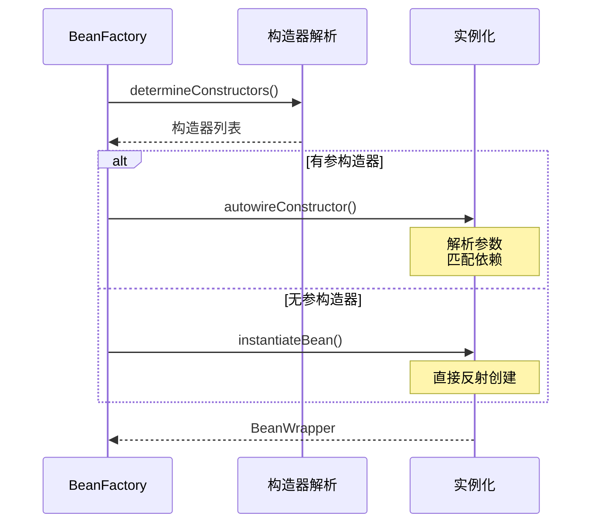
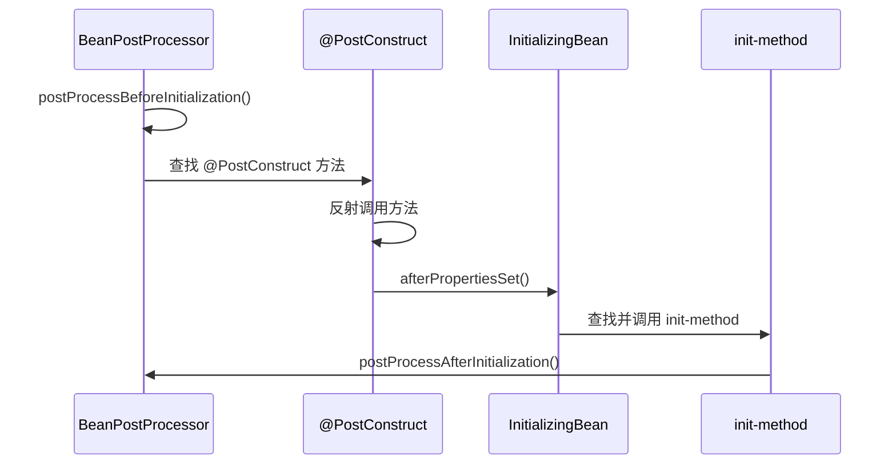
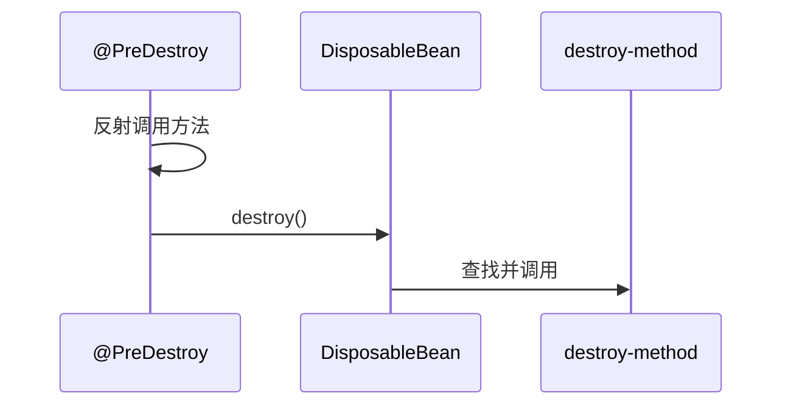

# Bean 生命周期

**目标级别**：P5/P6

## 开场：从一个问题开始

面试官问：「BeanPostProcessor 和 InitializingBean 接口分别在什么时候被调用？」你说：「初始化之前和初始化之后。」面试官追问：「那 @PostConstruct 注解呢？它在 BeanPostProcessor 的 before 方法之前还是之后执行？」你沉默了。

Bean 生命周期是 Spring 最核心的知识点之一，也是面试中容易被深挖的地方。很多候选人知道「创建 Bean → 填充属性 → 初始化 → 销毁」这个流程，却说不清**每个阶段的细粒度顺序**。

## 面试官最关心的 3 个问题（快速自测）

1. **🔴 Bean 生命周期的完整流程是什么？每个阶段的执行顺序是什么？**
2. **🟡 @PostConstruct、InitializingBean.init-method 三者有什么区别和执行顺序？**
3. **🟡 BeanPostProcessor 的两个方法分别在什么时候被调用？**

## 一、Bean 生命周期总览

### 1.1 完整流程图

```mermaid
flowchart TD
    A[1. 实例化<br/>Instantiation] --> B[2. 属性填充<br/>Populate]
    B --> C[3. Aware 接口回调]
    C --> D[4. BeanPostProcessor<br/>前置处理]
    D --> E[5. 初始化方法]
    E --> F[6. BeanPostProcessor<br/>后置处理]
    F --> G[7. Bean 就绪<br/>Ready to Use]
    G --> H[8. 销毁<br/>Destruction]
    
    C --> C1[BeanNameAware]
    C --> C2[BeanFactoryAware]
    C --> C3[ApplicationContextAware]
    
    E --> E1[@PostConstruct]
    E --> E2[InitializingBean<br/>afterPropertiesSet]
    E --> E3[init-method]
    
    style A fill:#ff6b6b
    style G fill:#51cf66
    style H fill:#fcc419
```

### 1.2 详细阶段说明

| 阶段 | 执行内容 | 扩展点 |
|------|---------|--------|
| 1. 实例化 | 调用构造器创建实例 | 可用 InstantiationAwareBeanPostProcessor |
| 2. 属性填充 | 注入依赖 | @Autowired、@Value |
| 3. Aware 回调 | 注入容器资源 | BeanNameAware、BeanFactoryAware |
| 4. 前置处理 | BeanPostProcessor | 前置增强 |
| 5. 初始化 | 执行初始化方法 | @PostConstruct、InitializingBean |
| 6. 后置处理 | BeanPostProcessor | 后置增强 |
| 7. 就绪 | Bean 可用 | - |
| 8. 销毁 | 执行销毁方法 | @PreDestroy、DisposableBean |

## 二、各阶段详解

### 2.1 实例化阶段

```java title="AbstractAutowireCapableBeanFactory.java"
protected Object createBeanInstance(String beanName, RootBeanDefinition mbd, 
                                   Object[] args) {
    // 1. 解析候选构造器
    Constructor<?>[] ctors = determineConstructors(beanName, mbd, args);
    
    if (ctors != null) {
        // 2. 使用构造器自动装配
        return autowireConstructor(beanName, mbd, ctors, args);
    }
    
    // 3. 使用无参构造器
    return instantiateBean(beanName, mbd);
}
```



### 2.2 属性填充阶段

```java title="AbstractAutowireCapableBeanFactory.java"
protected void populateBean(String beanName, RootBeanDefinition mbd, 
                           BeanWrapper bw) {
    // 1. 处理属性值
    PropertyValues pvs = mbd.getPropertyValues();
    
    // 2. InstantiationAwareBeanPostProcessor
    for (InstantiationAwareBeanPostProcessor iap : beanPostProcessors) {
        PropertyValues pvsToUse = iap.postProcessProperties(pvs, bw.getWrappedInstance(), beanName);
        if (pvsToUse == null) {
            return;
        }
        pvs = pvsToUse;
    }
    
    // 3. 注入属性（反射）
    for (PropertyValue pv : pvs) {
        applyPropertyValues(beanName, mbd, bw, pv);
    }
}
```

### 2.3 Aware 接口回调

Aware 接口用于让 Bean 获取容器底层的资源：

| 接口 | 注入内容 |
|------|---------|
| BeanNameAware | Bean 的名称 |
| BeanFactoryAware | BeanFactory 实例 |
| ApplicationContextAware | ApplicationContext 实例 |
| EnvironmentAware | Environment |
| EmbeddedValueResolverAware | StringValueResolver |
| ResourceLoaderAware | ResourceLoader |
| MessageSourceAware | MessageSource |
| ApplicationEventPublisherAware | ApplicationEventPublisher |

```java
@Service
public class UserService implements BeanNameAware, ApplicationContextAware {
    
    private String beanName;
    private ApplicationContext ctx;
    
    @Override
    public void setBeanName(String name) {
        this.beanName = name;
        System.out.println("Bean 名称：" + name);
    }
    
    @Override
    public void setApplicationContext(ApplicationContext applicationContext) {
        this.ctx = applicationContext;
        System.out.println("ApplicationContext 注入");
    }
}
```

### 2.4 BeanPostProcessor 前置处理

```java
@FunctionalInterface
public interface BeanPostProcessor {
    
    // 前置处理：在初始化方法之前调用
    @Nullable
    default Object postProcessBeforeInitialization(Object bean, String beanName) {
        return bean;
    }
    
    // 后置处理：在初始化方法之后调用
    @Nullable
    default Object postProcessAfterInitialization(Object bean, String beanName) {
        return bean;
    }
}
```

**常见实现类**：

| 实现类 | 作用 |
|-------|------|
| AutowiredAnnotationBeanPostProcessor | 处理 @Autowired、@Value |
| CommonAnnotationBeanPostProcessor | 处理 @PostConstruct、@PreDestroy |
| RequiredAnnotationBeanPostProcessor | 处理 @Required |
| AsyncAnnotationBeanPostProcessor | 处理 @Async |
| TransactionAttributeSourceAdvisor | 处理 @Transactional |

### 2.5 初始化阶段

初始化阶段的执行顺序：



### 2.6 销毁阶段

销毁阶段的执行顺序：



## 三、源码解析

### 3.1 核心方法 doCreateBean

```java title="AbstractAutowireCapableBeanFactory.java"
protected Object doCreateBean(String beanName, RootBeanDefinition mbd,
                              Object[] args) throws BeansException {
    
    // 1. 创建 Bean 实例
    BeanWrapper instanceWrapper = createBeanInstance(beanName, mbd, args);
    Object bean = instanceWrapper.getWrapperInstance();
    
    // 2. 提前暴露 Bean（解决循环依赖）
    boolean earlySingletonExposure = (mbd.isSingleton() && 
                                       allowCircularReferences &&
                                       isSingletonCurrentlyInCreation(beanName));
    if (earlySingletonExposure) {
        addSingletonFactory(beanName, () -> getEarlyBeanReference(beanName, mbd, bean));
    }
    
    // 3. 填充属性
    populateBean(beanName, mbd, instanceWrapper);
    
    // 4. 初始化 Bean
    exposedObject = initializeBean(beanName, exposedObject, mbd);
    
    return exposedObject;
}
```

### 3.2 initializeBean 方法

```java title="AbstractAutowireCapableBeanFactory.java"
protected Object initializeBean(String beanName, Object bean, RootBeanDefinition mbd) {
    
    // 1. Aware 接口回调
    invokeAwareMethods(beanName, bean);
    
    // 2. BeanPostProcessor 前置处理
    wrappedBean = applyBeanPostProcessorsBeforeInitialization(bean, beanName);
    
    // 3. 执行初始化方法
    invokeInitMethods(beanName, wrappedBean, mbd);
    
    // 4. BeanPostProcessor 后置处理
    wrappedBean = applyBeanPostProcessorsAfterInitialization(bean, beanName);
    
    return wrappedBean;
}

private void invokeInitMethods(String beanName, Object bean, RootBeanDefinition mbd) {
    // 是否实现 InitializingBean
    boolean isInitializingBean = (bean instanceof InitializingBean);
    
    if (isInitializingBean) {
        ((InitializingBean) bean).afterPropertiesSet();
    }
    
    // 执行自定义 init-method
    String initMethodName = mbd.getInitMethodName();
    if (StringUtils.hasLength(initMethodName)) {
        invokeCustomInitMethod(beanName, bean, initMethodName);
    }
}
```

## 四、面试高频追问

### 追问链 1：@PostConstruct vs InitializingBean

> **第一层**：@PostConstruct 和 InitializingBean.afterPropertiesSet() 有什么区别？
> 
> @PostConstruct 是 JSR-250 注解，属于 javax.annotation 包；InitializingBean 是 Spring 接口。前者不需要依赖 Spring。

> **第二层**：它们的执行顺序是什么？
> 
> @PostConstruct 先于 afterPropertiesSet() 执行。

> **第三层**：为什么要区分这两个？
> 
> - @PostConstruct：Java 标准注解，便于迁移到其他容器
> - InitializingBean：Spring 特定接口，与 Spring 耦合更紧
> - init-method：更灵活，支持自定义方法名

### 追问链 2：BeanPostProcessor 的作用

> **第一层**：BeanPostProcessor 的两个方法分别在什么时候调用？
> 
> postProcessBeforeInitialization 在初始化方法之前调用，postProcessAfterInitialization 在初始化方法之后调用。

> **第二层**：BeanPostProcessor 能做什么？
> 
> 1. 替换 Bean 实例
> 2. 包装 Bean（创建代理）
> 3. 修改 Bean 属性

> **第三层**：Spring 中有哪些 BeanPostProcessor？
> 
> - AutowiredAnnotationBeanPostProcessor：处理 @Autowired
> - CommonAnnotationBeanPostProcessor：处理 @PostConstruct
> - AsyncAnnotationBeanPostProcessor：处理 @Async

### 追问链 3：Bean 销毁的执行顺序

> **第一层**：Bean 销毁时哪些方法会被调用？
> 
> 1. @PreDestroy 注解的方法
> 2. DisposableBean.destroy()
> 3. 自定义 destroy-method

> **第二层**：destroy-method 如何配置？
> 
> 通过 @Bean(destroyMethod="方法名") 或 xml 配置。

> **第三层**：为什么推荐使用 @PreDestroy？
> 
> @PreDestroy 是 Java 标准注解，与 Spring 解耦，更便于测试。

## 五、常见错误与陷阱

### 错误 1：混淆 @PostConstruct 执行时机

> **⚠️ 陷阱**：认为 @PostConstruct 在 BeanPostProcessor.postProcessBeforeInitialization 之前执行。

正确顺序：

```mermaid
graph LR
    A[postProcessBeforeInitialization] --> B[@PostConstruct]
    B --> C[afterPropertiesSet]
    C --> D[postProcessAfterInitialization]
    
    style B fill:#51cf66
```

### 错误 2：在 @PostConstruct 中使用依赖注入的 Bean

```java
@Service
public class UserService {
    
    @Autowired
    private UserDao userDao;
    
    @PostConstruct
    public void init() {
        // ⚠️ 错误：userDao 可能还未注入完成
        userDao.findAll();
    }
}
```

> **⚠️ 陷阱**：@PostConstruct 确实在属性填充之后执行，但依赖注入可能通过 BeanPostProcessor 完成，所以这里使用应该是安全的。但如果是复杂的依赖关系，可能会有问题。

### 错误 3：忽略 destroy-method 的必要性

```java
@Bean(destroyMethod = "close")
public DataSource dataSource() {
    HikariConfig config = new HikariConfig();
    config.setJdbcUrl("jdbc:mysql://localhost:3306/test");
    return new HikariDataSource(config);
}
```

> **⚠️ 陷阱**：某些资源（如数据库连接池）如果不指定 destroy-method，可能导致资源泄漏。

## 六、对比总结

### 初始化方法对比

| 方法 | 所属 | 标准 | 推荐程度 |
|------|------|------|---------|
| @PostConstruct | JSR-250 | Java 标准 | ⭐⭐⭐⭐⭐ |
| InitializingBean | Spring | Spring 特定 | ⭐⭐⭐ |
| init-method | 自定义 | XML/注解配置 | ⭐⭐⭐⭐ |

### 销毁方法对比

| 方法 | 所属 | 标准 | 推荐程度 |
|------|------|------|---------|
| @PreDestroy | JSR-250 | Java 标准 | ⭐⭐⭐⭐⭐ |
| DisposableBean | Spring | Spring 特定 | ⭐⭐⭐ |
| destroy-method | 自定义 | XML/注解配置 | ⭐⭐⭐⭐ |

### BeanPostProcessor 执行顺序

| 处理器 | 执行阶段 | 作用 |
|-------|---------|------|
| BeanPostProcessor.postProcessBeforeInitialization | 初始化前 | 前置增强 |
| @PostConstruct | 初始化前 | 生命周期回调 |
| InitializingBean.afterPropertiesSet | 初始化中 | 生命周期回调 |
| init-method | 初始化中 | 自定义初始化 |
| BeanPostProcessor.postProcessAfterInitialization | 初始化后 | 后置增强、创建代理 |

## 七、实战应用

### 7.1 如何让 Bean 在初始化后执行特定逻辑

```java
@Service
public class UserService implements InitializingBean {
    
    private Map<String, User> cache = new ConcurrentHashMap<>();
    
    @Override
    public void afterPropertiesSet() {
        // 初始化完成后执行：加载缓存、预热等
        loadCache();
    }
    
    private void loadCache() {
        System.out.println("执行初始化逻辑");
    }
}
```

### 7.2 如何让 Bean 在销毁前释放资源

```java
@Service
public class UserService implements DisposableBean {
    
    private Connection connection;
    
    @Override
    public void destroy() {
        // 销毁前执行：关闭连接、清理资源等
        if (connection != null) {
            try {
                connection.close();
            } catch (SQLException e) {
                e.printStackTrace();
            }
        }
    }
}
```

### 7.3 使用 @PostConstruct 和 @PreDestroy

```java
@Service
public class CacheService {
    
    private Map<String, Object> cache = new ConcurrentHashMap<>();
    
    @PostConstruct
    public void init() {
        // 初始化
        System.out.println("CacheService 初始化");
    }
    
    @PreDestroy
    public void destroy() {
        // 销毁前清理
        cache.clear();
        System.out.println("CacheService 销毁");
    }
}
```

> **💡 推荐**：使用 @PostConstruct 和 @PreDestroy 是最佳实践，因为它们是 Java 标准注解，便于代码迁移。

## 下一步

深入理解 BeanPostProcessor 的原理和应用，请阅读 [BeanPostProcessor 原理](/questions/spring/bean-post-processor)。
