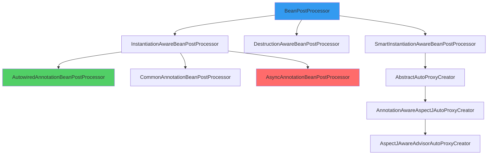

# BeanPostProcessor 原理

**目标级别**：P6

## 开场：Spring 的扩展点核心

面试官问：「Spring 中有哪些扩展点？」你说：「Aware 接口、BeanPostProcessor。」面试官追问：「BeanPostProcessor.postProcessBeforeInitialization 和 postProcessAfterInitialization 分别在什么时候调用？Spring 如何保证它们的执行顺序？」

BeanPostProcessor 是 Spring 最核心的扩展点之一。几乎所有 Spring 的高级特性，如 `@Autowired`、`@Transactional`、`@Async`，都依赖于 BeanPostProcessor。理解它的原理，才能真正理解 Spring 的设计思想。

## 面试官最关心的 3 个问题（快速自测）

1. **🟡 BeanPostProcessor 的两个方法在 Bean 生命周期中哪个阶段被调用？**
2. **🟡 @Autowired、@Transactional、@Async 是如何通过 BeanPostProcessor 实现的？**
3. **🟡 如何自定义 BeanPostProcessor？它的执行顺序如何保证？**

## 一、BeanPostProcessor 接口详解

### 1.1 接口定义

```java title="BeanPostProcessor.java"
public interface BeanPostProcessor {
    
    /**
     * 在初始化方法之前调用
     * 返回值可以是原始 Bean 或包装后的 Bean
     */
    @Nullable
    default Object postProcessBeforeInitialization(Object bean, String beanName) 
            throws BeansException {
        return bean;
    }
    
    /**
     * 在初始化方法之后调用
     * 返回值可以是原始 Bean 或包装后的 Bean
     */
    @Nullable
    default Object postProcessAfterInitialization(Object bean, String beanName) 
            throws BeansException {
        return bean;
    }
}
```

### 1.2 在生命周期中的位置

```mermaid
flowchart LR
    A[实例化] --> B[属性填充]
    B --> C[Aware 回调]
    C --> D[BeanPostProcessor<br/>postProcessBeforeInitialization]
    D --> E[@PostConstruct]
    E --> F[InitializingBean]
    F --> G[init-method]
    G --> H[BeanPostProcessor<br/>postProcessAfterInitialization]
    H --> I[Bean 就绪]
    
    style D fill:#fcc419
    style H fill:#fcc419
```

## 二、核心实现类

### 2.1 继承体系



### 2.2 主要实现类功能

| 实现类 | 作用 | 处理注解 |
|-------|------|---------|
| AutowiredAnnotationBeanPostProcessor | 依赖注入 | @Autowired、@Value |
| CommonAnnotationBeanPostProcessor | 生命周期回调 | @PostConstruct、@PreDestroy、@Resource |
| AsyncAnnotationBeanPostProcessor | 异步执行 | @Async |
| RequiredAnnotationBeanPostProcessor | 必需属性检查 | @Required |
| AnnotationTransactionAttributeSource | 事务管理 | @Transactional |

## 三、源码解析

### 3.1 后置处理器的注册

```java title="AbstractApplicationContext.java"
protected void registerBeanPostProcessors(ConfigurableListableBeanFactory beanFactory) {
    // 1. 获取所有 BeanPostProcessor 的 Bean 名称
    String[] postProcessorNames = beanFactory.getBeanNamesForType(BeanPostProcessor.class, true, false);
    
    // 2. 注册内部 BeanPostProcessor
    int beanProcessorTargetCount = beanFactory.getBeanPostProcessorCount() + 1 + postProcessorNames.length;
    beanFactory.addBeanPostProcessor(new BeanPostProcessorChecker(beanFactory, beanProcessorTargetCount));
    
    // 3. 注册外部 BeanPostProcessor
    for (String ppName : postProcessorNames) {
        BeanPostProcessor pp = beanFactory.getBean(ppName, BeanPostProcessor.class);
        beanFactory.addBeanPostProcessor(pp);
    }
}
```

### 3.2 后置处理器的执行

```java title="AbstractAutowireCapableBeanFactory.java"
protected Object initializeBean(String beanName, Object bean, RootBeanDefinition mbd) {
    
    // 1. Aware 接口回调
    invokeAwareMethods(beanName, bean);
    
    // 2. postProcessBeforeInitialization
    wrappedBean = applyBeanPostProcessorsBeforeInitialization(bean, beanName);
    
    // 3. 执行初始化方法
    invokeInitMethods(beanName, wrappedBean, mbd);
    
    // 4. postProcessAfterInitialization
    wrappedBean = applyBeanPostProcessorsAfterInitialization(bean, beanName);
    
    return wrappedBean;
}

public Object applyBeanPostProcessorsBeforeInitialization(Object existingBean, String beanName) {
    Object result = existingBean;
    // 遍历所有 BeanPostProcessor
    for (BeanPostProcessor processor : getBeanPostProcessors()) {
        Object current = processor.postProcessBeforeInitialization(result, beanName);
        if (current == null) {
            return result;
        }
        result = current;
    }
    return result;
}

public Object applyBeanPostProcessorsAfterInitialization(Object existingBean, String beanName) {
    Object result = existingBean;
    // 遍历所有 BeanPostProcessor
    for (BeanPostProcessor processor : getBeanPostProcessors()) {
        Object current = processor.postProcessAfterInitialization(result, beanName);
        if (current == null) {
            return result;
        }
        result = current;
    }
    return result;
}
```

## 四、典型应用场景

### 4.1 @Autowired 处理原理

```java title="AutowiredAnnotationBeanPostProcessor.java"
public class AutowiredAnnotationBeanPostProcessor 
        extends InstantiationAwareBeanPostProcessorAdapter {
    
    @Override
    public PropertyValues postProcessProperties(PropertyValues pvs, 
                                                Object bean, String beanName) {
        // 1. 查找所有带 @Autowired 的字段和方法
        InjectionMetadata metadata = findAutowiringMetadata(beanName, bean.getClass());
        
        // 2. 执行注入
        metadata.inject(bean, beanName, pvs);
        
        return pvs;
    }
}
```

### 4.2 @Async 处理原理

```java title="AsyncAnnotationBeanPostProcessor.java"
public class AsyncAnnotationBeanPostProcessor extends AbstractBeanPostProcessor {
    
    @Override
    public Object postProcessAfterInitialization(Object bean, String beanName) {
        // 1. 判断是否需要创建代理
        if (this.advisor == null || !AopUtils.canApply(this.advisor, bean.getClass())) {
            return bean;
        }
        
        // 2. 创建代理
        return createProxy(bean.getClass(), bean, beanName);
    }
}
```

### 4.3 @Transactional 处理原理

```java title="BeanTransactionAttributeSourceAdvisor.java"
public class TransactionInterceptor extends TransactionAspectSupport 
        implements MethodInterceptor {
    
    @Override
    public Object invoke(MethodInvocation invocation) throws Throwable {
        // 获取事务属性
        TransactionAttributeSource tas = getTransactionAttributeSource();
        TransactionAttribute ta = tas.getTransactionAttribute(
            invocation.getMethod(), invocation.getThis().getClass());
        
        // 创建或加入事务
        TransactionInfo info = createTransactionIfNecessary(ta, 
            invocation.getMethod(), invocation.getArguments());
        
        try {
            return invocation.proceed();
        } catch (Throwable ex) {
            // 异常处理
            completeTransactionAfterThrowing(info, ex);
            throw ex;
        } finally {
            // 清理事务信息
            cleanupTransactionInfo(info);
        }
    }
}
```

## 五、自定义 BeanPostProcessor

### 5.1 基本示例

```java
@Component
public class CustomBeanPostProcessor implements BeanPostProcessor {
    
    @Override
    public Object postProcessBeforeInitialization(Object bean, String beanName) {
        // 初始化前处理
        if (bean instanceof UserService) {
            System.out.println("Before: " + beanName);
        }
        return bean;
    }
    
    @Override
    public Object postProcessAfterInitialization(Object bean, String beanName) {
        // 初始化后处理
        if (bean instanceof UserService) {
            System.out.println("After: " + beanName);
        }
        return bean;
    }
}
```

### 5.2 替换原始 Bean

```java
@Component
public class ReplaceBeanPostProcessor implements BeanPostProcessor {
    
    @Override
    public Object postProcessBeforeInitialization(Object bean, String beanName) {
        // 可以返回新对象替换原始 Bean
        if ("userService".equals(beanName)) {
            return new UserServiceProxy((UserService) bean);
        }
        return bean;
    }
}
```

### 5.3 创建代理

```java
@Component
public class TimingBeanPostProcessor implements BeanPostProcessor {
    
    @Override
    public Object postProcessAfterInitialization(Object bean, String beanName) {
        // 为所有 Bean 创建性能监控代理
        if (!bean.getClass().getName().startsWith("org.springframework")) {
            return ProxyFactory.getProxy(bean);
        }
        return bean;
    }
}
```

## 六、执行顺序保证

### 6.1 后置处理器的排序

```java title="DefaultListableBeanFactory.java"
private final List<BeanPostProcessor> beanPostProcessors = new ArrayList<>();

public void addBeanPostProcessor(BeanPostProcessor beanPostProcessor) {
    this.beanPostProcessors.add(beanPostProcessor);
}

public List<BeanPostProcessor> getBeanPostProcessors() {
    return beanPostProcessors;
}
```

### 6.2 PriorityOrdered 接口

实现了 `PriorityOrdered` 接口的处理器优先执行：

```java
@Component
public class OrderedProcessor implements BeanPostProcessor, PriorityOrdered {
    
    @Override
    public int getOrder() {
        return Ordered.HIGHEST_PRECEDENCE;
    }
    
    // ...
}
```

**排序规则**：

1. 实现 `PriorityOrdered` 的处理器优先
2. 按 `order` 值从小到大排序
3. `Ordered.HIGHEST_PRECEDENCE` = `Integer.MIN_VALUE`
4. `Ordered.LOWEST_PRECEDENCE` = `Integer.MAX_VALUE`

## 七、面试高频追问

### 追问链 1：postProcessBeforeInitialization vs postProcessAfterInitialization

> **第一层**：两个方法的区别是什么？
> 
> postProcessBeforeInitialization 在初始化方法（如 @PostConstruct）之前调用，postProcessAfterInitialization 在初始化方法之后调用。

> **第二层**：能举一个实际的应用场景吗？
> 
> - before：BeanValidationPostProcessor 在这里进行数据校验
> - after：AsyncAnnotationBeanPostProcessor 在这里创建异步代理

> **第三层**：如果 before 方法返回 null 会怎样？
> 
> Bean 的后续初始化流程会被短路，直接返回 null。

### 追问链 2：BeanPostProcessor vs InstantiationAwareBeanPostProcessor

> **第一层**：两者有什么区别？
> 
> InstantiationAwareBeanPostProcessor 继承自 BeanPostProcessor，额外提供了实例化阶段的前后钩子。

> **第二层**：InstantiationAwareBeanPostProcessor 的新增方法是什么？
> 
> - `postProcessBeforeInstantiation`：在实例化之前调用，可以返回自定义 Bean
> - `postProcessAfterInstantiation`：在实例化之后、属性填充之前调用

> **第三层**：为什么需要实例化阶段的扩展？
> 
> 为了支持更早介入 Bean 的创建过程，例如创建代理对象替代原始对象。

### 追问链 3：@Autowired 执行时机

> **第一层**：@Autowired 是在哪个阶段执行的？
> 
> 在 postProcessProperties 阶段执行，属于属性填充阶段。

> **第二层**：@Autowired 和 @Resource 有什么区别？
> 
> - @Autowired 默认按类型匹配，@Resource 默认按名称匹配
> - @Autowired 支持 required 属性，@Resource 不支持
> - @Autowired 由 AutowiredAnnotationBeanPostProcessor 处理，@Resource 由 CommonAnnotationBeanPostProcessor 处理

> **第三层**：多个 Bean 匹配时如何处理？
> 
> 1. @Primary 标记的 Bean 优先
> 2. @Qualifier 指定具体 Bean 名称
> 3. 否则抛出 NoUniqueBeanDefinitionException

## 八、常见错误与陷阱

### 错误 1：忘记注册 BeanPostProcessor

> **⚠️ 陷阱**：自定义 BeanPostProcessor 必须被 Spring 容器管理，否则不会生效。

```java
// 错误：未注册
@Bean
public BeanPostProcessor myProcessor() {
    return new CustomBeanPostProcessor();
}

// 正确：显式注册
@Bean
public static BeanPostProcessor myProcessor() {
    return new CustomBeanPostProcessor();
}
```

> **💡 技巧**：BeanPostProcessor 应该用 `static` 方法定义，确保它在其他 Bean 之前被注册。

### 错误 2：BeanPostProcessor 中依赖未初始化的 Bean

```java
@Component
public class BadProcessor implements BeanPostProcessor {
    
    @Autowired
    private UserDao userDao;  // ⚠️ 可能还未初始化
    
    @Override
    public Object postProcessBeforeInitialization(Object bean, String beanName) {
        userDao.findAll();  // 可能出问题
        return bean;
    }
}
```

### 错误 3：忽略执行顺序

> **⚠️ 陷阱**：BeanPostProcessor 的执行顺序很重要，如果顺序错误可能导致问题。

```java
@Component
public class ProcessorA implements BeanPostProcessor, PriorityOrdered {
    @Override
    public int getOrder() { return 0; }
}

@Component
public class ProcessorB implements BeanPostProcessor, PriorityOrdered {
    @Override
    public int getOrder() { return 1; }  // ProcessorA 先执行
}
```

## 九、对比总结

### Spring 扩展点对比

| 扩展点 | 阶段 | 用途 |
|-------|------|------|
| BeanFactoryPostProcessor | BeanDefinition 加载后 | 修改 Bean 定义 |
| InstantiationAwareBeanPostProcessor | 实例化前后 | 替换 Bean 实例 |
| BeanPostProcessor | 初始化前后 | 增强 Bean |
| DestructionAwareBeanPostProcessor | 销毁前 | 清理资源 |

### BeanPostProcessor 子接口对比

| 子接口 | 新增方法 | 用途 |
|-------|---------|------|
| InstantiationAwareBeanPostProcessor | postProcessBeforeInstantiation<br/>postProcessAfterInstantiation | 实例化阶段扩展 |
| SmartInstantiationAwareBeanPostProcessor | predictBeanType<br/>determineCandidateConstructors<br/>getEarlyBeanReference | 智能实例化 |
| MergedBeanDefinitionPostProcessor | postProcessMergedBeanDefinition | 合并 Bean 定义 |

## 十、实战应用

### 10.1 实现自定义注解

```java
@Target(ElementType.METHOD)
@Retention(RetentionPolicy.RUNTIME)
public @interface Timing {
}

@Component
public class TimingBeanPostProcessor implements BeanPostProcessor {
    
    @Override
    public Object postProcessAfterInitialization(Object bean, String beanName) {
        return ProxyFactory.getProxy(bean, (invocation) -> {
            Method method = invocation.getMethod();
            if (method.isAnnotationPresent(Timing.class)) {
                long start = System.currentTimeMillis();
                Object result = invocation.proceed();
                System.out.println(method.getName() + " 耗时：" + 
                    (System.currentTimeMillis() - start) + "ms");
                return result;
            }
            return invocation.proceed();
        });
    }
}
```

### 10.2 实现条件化注册

```java
@Component
public class ConditionalBeanPostProcessor implements BeanPostProcessor {
    
    @Override
    public Object postProcessBeforeInitialization(Object bean, String beanName) {
        // 只处理特定条件
        if (beanName.startsWith("user") && isProdEnvironment()) {
            return new SecuredBeanWrapper(bean);
        }
        return bean;
    }
}
```

> **💡 加分回答**：Spring Boot 的自动配置大量使用了 BeanPostProcessor，例如 `AutoConfigurationImportFilter` 用于过滤自动配置类。

## 下一步

深入理解 Spring 的代理机制，请阅读 [AOP 原理与代理模式](/questions/spring/aop)。
