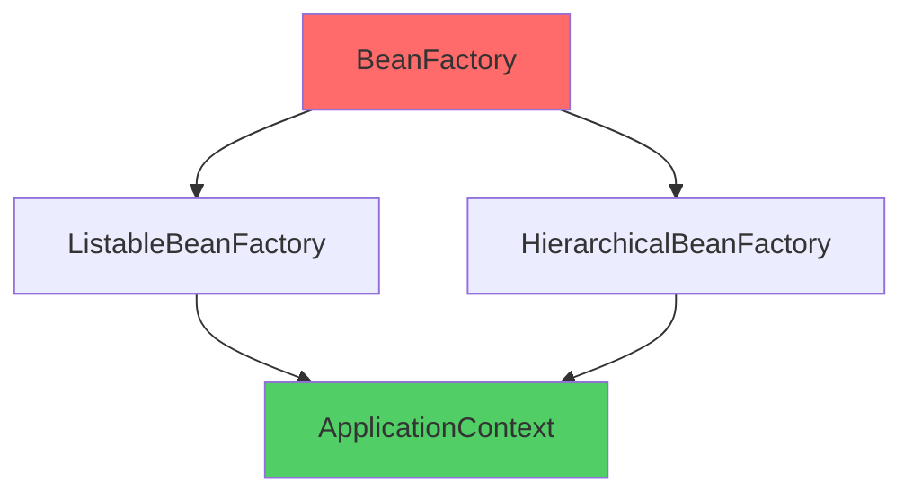
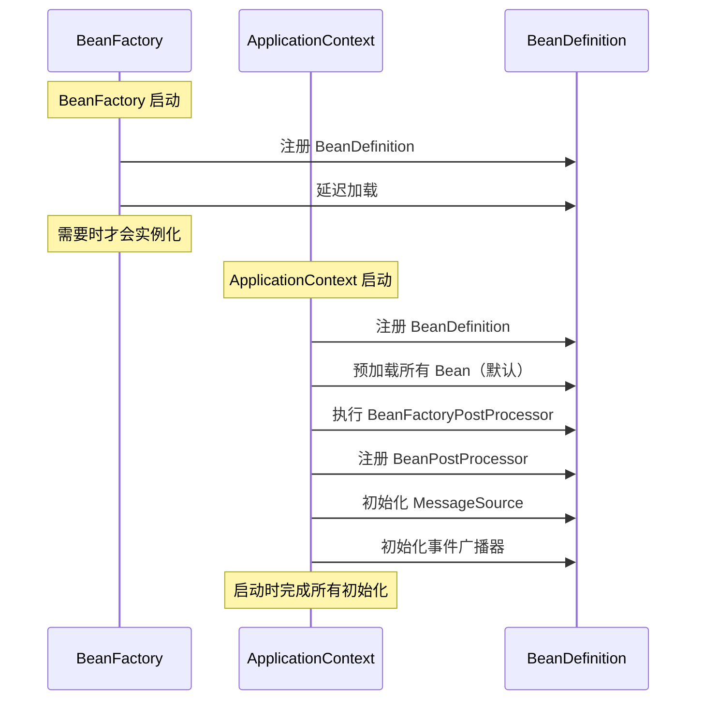

# BeanFactory vs ApplicationContext

**目标级别**：P5/P6

## 开场：一道经典的面试题

面试官问：「BeanFactory 和 ApplicationContext 有什么区别？」你回答：「ApplicationContext 是 BeanFactory 的子类，功能更强大。」面试官眉头一皱：「你怎么知道 ApplicationContext 是子类？请证明你的观点。」你开始支支吾吾。

这道题看似简单，但能完整回答的人不多。很多人只知道「ApplicationContext 功能更强」，却说不清**两者在启动阶段做了什么不同的事**。

## 面试官最关心的 3 个问题（快速自测）

1. **🟡 BeanFactory 和 ApplicationContext 在启动阶段的区别是什么？**
2. **🟡 ApplicationContext 组合了 BeanFactory，那它到底是不是子类？**
3. **🟡 为什么 Spring Boot 推荐使用 ApplicationContext 而不是 BeanFactory？**

## 一、基本概念

### 1.1 BeanFactory

**BeanFactory** 是 Spring 最底层的 IoC 容器接口，定义了容器的基本功能：

```java title="BeanFactory.java"
public interface BeanFactory {
    // 根据名称获取 Bean
    Object getBean(String name) throws BeansException;
    
    // 根据名称和类型获取 Bean
    <T> T getBean(String name, Class<T> requiredType) throws BeansException;
    
    // 获取 Bean 实例（延迟创建）
    Object getSingleton(String beanName);
    
    // 检查容器是否包含指定 Bean
    boolean containsBean(String beanName);
    
    // 检查 Bean 是否单例
    boolean isSingleton(String name);
    
    // 检查 Bean 是否原型
    boolean isPrototype(String name);
}
```

### 1.2 ApplicationContext

**ApplicationContext** 是 BeanFactory 的功能超集，添加了更多企业级功能：

```java title="ApplicationContext.java"
public interface ApplicationContext extends BeanFactory {
    // 获取应用名称
    String getApplicationName();
    
    // 获取启动时间
    long getStartupDate();
    
    // 获取父容器
    ApplicationContext getParent();
    
    // 获取 Bean 工厂
    AutowireCapableBeanFactory getAutowireCapableBeanFactory();
    
    // 获取资源加载器
    ResourceLoader getResourceLoader();
    
    // 发布事件
    void publishEvent(ApplicationEvent event);
    
    // 获取环境
    ConfigurableEnvironment getEnvironment();
}
```

### 1.3 关键区别：不是继承关系

> **⚠️ 陷阱**：说 ApplicationContext 是 BeanFactory 的子类是错误的！

**正确理解**：



`ApplicationContext` 继承自 `BeanFactory`，但不是简单的子类关系，而是 **组合关系**：

```java
public interface ApplicationContext extends BeanFactory, 
                                          ListableBeanFactory,
                                          HierarchicalBeanFactory,
                                          ResourcePatternResolver,
                                          EnvironmentCapable,
                                          MessageSource,
                                          ApplicationEventPublisher {
    // ...
}
```

## 二、核心区别对比

### 2.1 启动阶段对比



### 2.2 功能对比表

| 功能 | BeanFactory | ApplicationContext |
|------|-------------|-------------------|
| Bean 创建 | 延迟加载 | 预加载（默认） |
| 自动装配 | 需要手动配置 | 自动装配 |
| BeanFactoryPostProcessor | ❌ | ✅ |
| BeanPostProcessor | ❌ | ✅ |
| MessageSource | ❌ | ✅ |
| 事件发布 | ❌ | ✅ |
| 资源加载 | ❌ | ✅ |
| Web 应用支持 | ❌ | ✅ |
| 国际化 | ❌ | ✅ |
| AOP 支持 | ❌ | ✅ |

### 2.3 内存占用对比

| 维度 | BeanFactory | ApplicationContext |
|------|-------------|-------------------|
| 启动时间 | 短 | 长 |
| 首次访问延迟 | 高 | 低 |
| 内存占用 | 低 | 高 |
| 适合场景 | 资源受限环境 | 企业级应用 |

## 三、ApplicationContext 额外功能详解

### 3.1 资源加载

```java
// BeanFactory：需要手动加载资源
DefaultListableBeanFactory factory = new DefaultListableBeanFactory();
XmlBeanDefinitionReader reader = new XmlBeanDefinitionReader(factory);
reader.loadBeanDefinitions("classpath:beans.xml");

// ApplicationContext：自动加载资源
ApplicationContext ctx = new ClassPathXmlApplicationContext("classpath:beans.xml");
```

ApplicationContext 实现了 `ResourcePatternResolver` 接口，支持 Ant 风格路径匹配：

```java
Resource[] resources = ctx.getResources("classpath*:META-INF/*.properties");
```

### 3.2 国际化支持

```java
// 创建 MessageSource
@Bean
public MessageSource messageSource() {
    ResourceBundleMessageSource source = new ResourceBundleMessageSource();
    source.setBasename("messages");
    source.setDefaultEncoding("UTF-8");
    return source;
}

// 使用
@Service
public class MyService {
    @Autowired
    private MessageSource messageSource;
    
    public void sendMessage(String code) {
        String message = messageSource.getMessage(code, null, Locale.getDefault());
        System.out.println(message);
    }
}
```

### 3.3 事件发布与监听

```java
// 发布事件
@Service
public class OrderService {
    @Autowired
    private ApplicationEventPublisher publisher;
    
    public void createOrder(Order order) {
        // 业务逻辑
        publisher.publishEvent(new OrderCreatedEvent(this, order));
    }
}

// 监听事件
@Component
public class OrderListener {
    @EventListener
    public void handleOrderCreated(OrderCreatedEvent event) {
        System.out.println("订单已创建：" + event.getOrder());
    }
}
```

### 3.4 BeanFactoryPostProcessor

在 Bean 实例化之前修改 Bean 定义：

```java
@Component
public class CustomBeanFactoryPostProcessor implements BeanFactoryPostProcessor {
    @Override
    public void postProcessBeanFactory(ConfigurableListableBeanFactory bf) {
        // 可以修改 Bean 定义
        BeanDefinition bd = bf.getBeanDefinition("userService");
        bd.getPropertyValues().add("name", "custom");
    }
}
```

> **💡 扩展点**：Spring Boot 的 `@ConfigurationProperties` 绑定就是通过 `BeanFactoryPostProcessor` 实现的。

## 四、面试高频追问

### 追问链 1：启动阶段差异

> **第一层**：BeanFactory 和 ApplicationContext 在启动阶段有什么区别？
> 
> BeanFactory 采用延迟加载，ApplicationContext 在启动时预加载所有 Bean。

> **第二层**：为什么 ApplicationContext 要预加载所有 Bean？
> 
> 为了提前发现问题。如果 Bean 配置错误，在启动时就会失败，而不是等到运行时才报空指针异常。

> **第三层**：ApplicationContext 启动时做了哪些额外操作？
> 
> 1. 注册 BeanFactoryPostProcessor
> 2. 注册 BeanPostProcessor
> 3. 初始化 MessageSource
> 4. 初始化事件广播器
> 5. 预实例化所有 singleton Bean

### 追问链 2：BeanFactoryPostProcessor vs BeanPostProcessor

> **第一层**：BeanFactoryPostProcessor 和 BeanPostProcessor 的区别是什么？
> 
> - BeanFactoryPostProcessor：在 Bean 实例化之前修改 Bean 定义
> - BeanPostProcessor：在 Bean 实例化之后、初始化前后进行增强

> **第二层**：Spring 如何保证 BeanFactoryPostProcessor 的执行顺序？
> 
> BeanFactoryPostProcessor 有 `Order` 接口，可以控制执行顺序。

> **第三层**：Spring Boot 的自动配置是如何利用 BeanFactoryPostProcessor 的？
> 
> Spring Boot 使用 `ConfigurationClassPostProcessor` 处理 `@Configuration` 类，使用 `BeanDefinitionRegistryPostProcessor` 注册新的 Bean 定义。

### 追问链 3：为什么 Spring Boot 使用 ApplicationContext

> **第一层**：Spring Boot 默认使用哪种容器？
> 
> AnnotationConfigApplicationContext（基于注解配置的 ApplicationContext）。

> **第二层**：为什么 Spring Boot 不使用 BeanFactory？
> 
> 因为 Spring Boot 依赖大量后置处理器（如自动配置），这些处理器只有 ApplicationContext 才支持。

> **第三层**：Spring Boot 的启动流程是怎样的？
> 
> 1. 创建 ApplicationContext
> 2. 加载自动配置类
> 3. 执行 BeanFactoryPostProcessor
> 4. 注册 BeanPostProcessor
> 5. 预实例化所有 singleton Bean

## 五、常见错误与陷阱

### 错误 1：混淆继承关系

> **⚠️ 陷阱**：说 ApplicationContext 继承 BeanFactory 是对的，但说 ApplicationContext 是 BeanFactory 的子类不准确。

正确说法：**ApplicationContext 继承了 BeanFactory 接口**，同时组合了多个功能接口。

### 错误 2：忽略启动性能差异

```java
// 使用 BeanFactory：启动快，但首次 getBean 慢
BeanFactory factory = new XmlBeanFactory(new ClassPathResource("beans.xml"));
UserService userService = factory.getBean("userService");  // 这里才创建 Bean

// 使用 ApplicationContext：启动慢，但运行时 getBean 快
ApplicationContext ctx = new ClassPathXmlApplicationContext("beans.xml");
UserService userService = ctx.getBean("userService");  // Bean 已创建
```

### 错误 3：忽略循环依赖检测

> **⚠️ 陷阱**：ApplicationContext 在启动时会检测循环依赖，如果存在构造器循环依赖会直接失败。

```java
@Service
public class A {
    public A(B b) { }  // 构造器依赖 B
}

@Service
public class B {
    public B(A a) { }  // 构造器依赖 A，循环依赖！
}

// ApplicationContext 启动时会抛出 BeanCurrentlyInCreationException
```

## 六、选择建议

### 何时使用 BeanFactory

- 资源极度受限的嵌入式系统
- Bean 使用频率极低的场景
- 需要精确控制 Bean 创建时机

### 何时使用 ApplicationContext

- 企业级应用（默认选择）
- 需要 AOP、事务、事件等功能
- 需要国际化支持
- 需要提前发现配置错误

## 七、扩展知识：ApplicationContext 的实现类

| 实现类 | 适用场景 |
|-------|---------|
| ClassPathXmlApplicationContext | 从 classpath 加载 XML 配置 |
| FileSystemXmlApplicationContext | 从文件系统加载 XML 配置 |
| AnnotationConfigApplicationContext | 基于注解配置 |
| XmlWebApplicationContext | Web 应用（XML 配置） |
| AnnotationConfigWebApplicationContext | Web 应用（注解配置） |
| GenericApplicationContext | 通用场景，支持多种配置方式 |

> **💡 加分回答**：Spring Boot 使用 `AnnotationConfigApplicationContext`，支持扫描 `@Configuration` 类和自动配置。

## 下一步

深入理解 Spring Bean 的生命周期，请阅读 [Bean 生命周期](/questions/spring/bean-lifecycle)。
