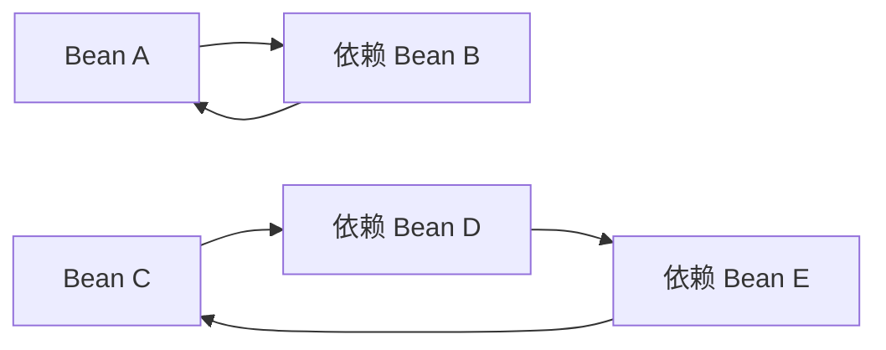
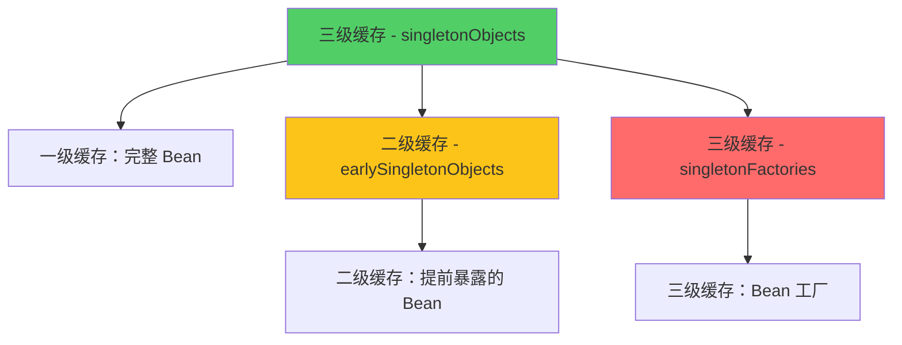
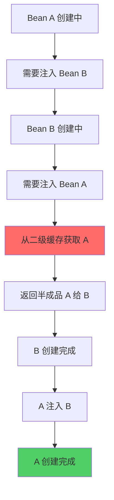

# 循环依赖与三级缓存

**目标级别**：P6

## 开场：面试官最爱的深挖题

面试官问：「Spring 是如何解决循环依赖的？」你说：「通过三级缓存。」面试官追问：「为什么需要三级缓存？两级缓存不够吗？」你开始紧张。

循环依赖是 Spring 面试中的高频深挖题。这道题不仅考察你对 Spring 源码的理解程度，还考察你是否能解释「**为什么这样设计**」。

## 面试官最关心的 3 个问题（快速自测）

1. **🔴 什么是循环依赖？Spring 如何通过三级缓存解决循环依赖？**
2. **🔴 为什么需要三级缓存？两级缓存不够吗？**
3. **🟡 哪些场景下循环依赖无法解决？为什么构造器注入无法解决循环依赖？**

如果这三个问题不能完整回答，请认真阅读本文。

## 一、什么是循环依赖

### 1.1 循环依赖的定义

循环依赖是指两个或多个 Bean 相互依赖，形成闭环：



### 1.2 循环依赖的三种类型

| 类型 | 描述 | 能否解决 | 解决方案 |
|------|------|---------|---------|
| 构造器循环依赖 | 构造器中相互依赖 | ❌ | 重构、使用 @Lazy、Setter 注入 |
| Setter 注入循环依赖 | Setter 方法相互依赖 | ✅ | Spring 三级缓存 |
| prototype 循环依赖 | prototype Bean 循环依赖 | ❌ | 重构、设计模式调整 |

### 1.3 循环依赖的代码示例

```java
// 构造器循环依赖
@Service
public class A {
    public A(B b) {
        this.b = b;
    }
}

@Service
public class B {
    public B(A a) {
        this.a = a;
    }
}
```

```java
// Setter 循环依赖（Spring 可以解决）
@Service
public class A {
    private B b;
    
    @Autowired
    public void setB(B b) {
        this.b = b;
    }
}

@Service
public class B {
    private A a;
    
    @Autowired
    public void setA(A a) {
        this.a = a;
    }
}
```

## 二、三级缓存详解

### 2.1 三级缓存的数据结构



Spring 使用 `DefaultSingletonBeanRegistry` 管理三级缓存：

```java title="DefaultSingletonBeanRegistry.java"
public class DefaultSingletonBeanRegistry extends SimpleAliasRegistry {
    
    // 一级缓存：完全成品的 singleton Bean
    private final Map<String, Object> singletonObjects = new ConcurrentHashMap<>(256);
    
    // 二级缓存：提前暴露的 Bean（未完成属性填充）
    private final Map<String, Object> earlySingletonObjects = new ConcurrentHashMap<>(16);
    
    // 三级缓存：Bean 工厂，用于创建代理对象
    private final Map<String, ObjectFactory<?>> singletonFactories = new HashMap<>(16);
    
    // 正在创建中的 Bean 名称集合
    private final Set<String> singletonsCurrentlyInCreation = 
        Collections.newSetFromMap(new ConcurrentHashMap<>(16));
}
```

### 2.2 三级缓存的作用

| 缓存 | 名称 | 存储内容 | 访问顺序 |
|------|------|---------|---------|
| 一级 | singletonObjects | 完全成品的 Bean | 最后访问 |
| 二级 | earlySingletonObjects | 提前暴露的 Bean（半成品） | 中间访问 |
| 三级 | singletonFactories | Bean 工厂（用于创建代理） | 最先访问 |

### 2.3 为什么需要三级缓存？

> **⚠️ 核心问题**：为什么需要三级缓存？两级缓存不够吗？

**答案**：三级缓存的核心目的是**处理代理对象的创建**。

如果没有三级缓存：



问题在于：如果 Bean A 需要创建代理对象，在步骤 E 中无法知道应该创建代理还是原始对象。

**三级缓存解决方案**：

```java
protected Object getSingleton(String beanName, boolean allowEarlyReference) {
    // 1. 先从一级缓存获取
    Object singleton = singletonObjects.get(beanName);
    if (singleton == null && isSingletonCurrentlyInCreation(beanName)) {
        // 2. 一级缓存没有，从二级缓存获取
        singleton = earlySingletonObjects.get(beanName);
        if (singleton == null && allowEarlyReference) {
            // 3. 二级缓存没有，从三级缓存获取
            synchronized (singletonObjects) {
                ObjectFactory<?> factory = singletonFactories.get(beanName);
                if (factory != null) {
                    singleton = factory.getObject();
                    // 获取后放入二级缓存，移除三级缓存
                    earlySingletonObjects.put(beanName, singleton);
                    singletonFactories.remove(beanName);
                }
            }
        }
    }
    return singleton;
}
```

## 三、循环依赖解决流程

### 3.1 完整流程图

```mermaid
sequenceDiagram
    participant User as 用户代码
    participant AC as ApplicationContext
    participant GF as getSingleton()
    participant Factory as 三级缓存
    participant Create as 创建 Bean
    participant Populate as 属性填充
    
    User->>AC: ctx.getBean("a")
    AC->>GF: getSingleton("a")
    GF->>Factory: 检查缓存
    Note over GF: a 不在一级缓存<br/>a 正在创建中
    GF-->>AC: 返回 null
    AC->>Create: createBean("a")
    
    Create->>Create: 实例化 A
    Create->>Factory: 放入三级缓存<br/>singletonFactories.put("a", factory)
    
    Create->>Populate: 填充属性 b
    Populate->>GF: getSingleton("b")
    GF->>Factory: 检查缓存
    Note over GF: b 不在缓存<br/>b 正在创建中
    GF-->>Populate: 返回 null
    Populate->>Create: createBean("b")
    
    Create->>Create: 实例化 B
    Create->>Factory: 放入三级缓存<br/>singletonFactories.put("b", factory)
    Create->>Populate: 填充属性 a
    Populate->>GF: getSingleton("a")
    
    GF->>Factory: a 在三级缓存中
    Factory-->>Populate: 返回原始对象 A
    Populate-->>Create: B 填充完成
    Create->>Factory: 从三级缓存移除 b
    Factory-->>AC: B 创建完成，放入一级缓存
    
    Populate-->>Create: A 填充完成
    Create->>Factory: 从三级缓存移除 a
    Create->>Create: A 创建完成，放入一级缓存
    Create-->>AC: A 创建完成
    AC-->>User: 返回 A
```

### 3.2 关键源码解析

#### 第一步：获取 Bean A

```java title="AbstractBeanFactory.java"
public Object getBean(String name) {
    return doGetBean(name, null, null, false);
}

protected <T> T doGetBean(String name, Class<T> requiredType, 
                          Object[] args, boolean typeCheckOnly) {
    // 从缓存获取
    Object sharedInstance = getSingleton(beanName);
    if (sharedInstance != null) {
        return sharedInstance;
    }
    
    // 缓存没有，创建新 Bean
    return createBean(beanName, mbd, args);
}
```

#### 第二步：创建 Bean A

```java title="AbstractAutowireCapableBeanFactory.java"
protected Object createBean(String beanName, RootBeanDefinition mbd, Object[] args) {
    // 实例化前处理
    Object bean = resolveBeforeInstantiation(beanName, mbd);
    if (bean != null) {
        return bean;
    }
    
    // 创建 Bean 实例
    return doCreateBean(beanName, mbd, args);
}

protected Object doCreateBean(String beanName, RootBeanDefinition mbd, 
                               Object[] args) {
    // 1. 创建 Bean 实例
    BeanWrapper instanceWrapper = createBeanInstance(beanName, mbd, args);
    Object bean = instanceWrapper.getWrapperInstance();
    
    // 2. 提前暴露 Bean（解决循环依赖的关键）
    boolean earlySingletonExposure = (mbd.isSingleton() && 
                                       allowCircularReferences &&
                                       isSingletonCurrentlyInCreation(beanName));
    if (earlySingletonExposure) {
        // 放入三级缓存
        addSingletonFactory(beanName, () -> getEarlyBeanReference(beanName, mbd, bean));
    }
    
    // 3. 填充属性（这里会触发循环依赖）
    populateBean(beanName, mbd, instanceWrapper);
    
    // 4. 初始化
    initializeBean(beanName, bean, mbd);
    
    return bean;
}
```

#### 第三步：填充属性，触发 Bean B 的创建

```java title="AbstractAutowireCapableBeanFactory.java"
protected void populateBean(String beanName, RootBeanDefinition mbd, BeanWrapper bw) {
    // 获取所有属性值
    PropertyValues pvs = mbd.getPropertyValues();
    
    for (PropertyValue pv : pvs) {
        if ("b".equals(pv.getName())) {
            // 需要注入 Bean B，递归调用 getBean("b")
            Object b = beanFactory.getBean("b");
            // ...
        }
    }
}
```

#### 第四步：获取 Bean A（此时 A 还在创建中）

```java title="DefaultSingletonBeanRegistry.java"
public Object getSingleton(String beanName) {
    return getSingleton(beanName, true);
}

protected Object getSingleton(String beanName, boolean allowEarlyReference) {
    // 1. 检查一级缓存
    Object singleton = singletonObjects.get(beanName);
    if (singleton == null && isSingletonCurrentlyInCreation(beanName)) {
        // 2. 检查二级缓存
        singleton = earlySingletonObjects.get(beanName);
        if (singleton == null && allowEarlyReference) {
            // 3. 检查三级缓存
            synchronized (singletonObjects) {
                ObjectFactory<?> factory = singletonFactories.get(beanName);
                if (factory != null) {
                    singleton = factory.getObject();
                    // 移动到二级缓存
                    earlySingletonObjects.put(beanName, singleton);
                    singletonFactories.remove(beanName);
                }
            }
        }
    }
    return singleton;
}
```

## 四、为什么构造器注入无法解决循环依赖

### 4.1 原因分析

构造器注入在**实例化阶段**就需要所有依赖，而此时还没有将 Bean 放入三级缓存：

```mermaid
sequenceDiagram
    participant Create as 创建 Bean A
    participant Constructor as 构造器
    participant Cache as 三级缓存
    
    Create->>Create: new A()
    Create->>Constructor: 调用构造器 A(B b)
    Constructor->>Create: 需要 B 参数
    Create->>Cache: 检查 B 是否在缓存中
    Cache-->>Create: B 不在缓存中
    
    Note over Create: 无法获取 B<br/>Bean A 还未放入缓存<br/>循环依赖无法解决！
    
    Create-->>Constructor: 抛出异常
```

### 4.2 源码验证

```java title="AbstractAutowireCapableBeanFactory.java"
protected BeanWrapper createBeanInstance(String beanName, RootBeanDefinition mbd, 
                                         Object[] args) {
    // 使用构造器创建实例
    Constructor<?>[] constructorsToUse = 
        determineConstructors(beanName, mbd, args);
    
    if (constructorsToUse == null) {
        // 无参构造器
        return instantiateBean(beanName, mbd);
    }
    
    // 有参构造器 - 这里会立即调用构造器
    return autowireConstructor(beanName, mbd, constructorsToUse, args);
}
```

关键点：**构造器调用发生在 Bean 放入缓存之前**，因此无法利用三级缓存解决循环依赖。

### 4.3 解决方案

| 方案 | 代码示例 | 适用场景 |
|------|---------|---------|
| 使用 @Lazy | `@Autowired public A(@Lazy B b)` | 临时解决方案 |
| Setter 注入 | `public void setB(B b) { this.b = b; }` | 推荐方案 |
| 重构代码 | 消除循环依赖 | 最佳方案 |

```java
// 方案一：@Lazy 延迟加载
@Service
public class A {
    public A(@Lazy B b) {
        this.b = b;
    }
}

// 方案二：Setter 注入
@Service
public class A {
    private B b;
    
    @Autowired
    public void setB(B b) {
        this.b = b;
    }
}
```

## 五、面试高频追问

### 追问链 1：为什么需要二级缓存

> **第一层**：三级缓存中，二级缓存的作用是什么？
> 
> 二级缓存用于存储从三级缓存获取的 Bean，避免重复调用工厂方法。

> **第二层**：如果不使用二级缓存会怎样？
> 
> 每次获取 Bean 时都会调用工厂方法，可能导致代理对象被多次创建。

> **第三层**：工厂方法可能有什么副作用？
> 
> 工厂方法（如 `getEarlyBeanReference`）可能被调用多次，必须保证幂等性。二级缓存确保只调用一次。

### 追问链 2：原型 Bean 循环依赖

> **第一层**：为什么 prototype Bean 的循环依赖无法解决？
> 
> 原型 Bean 不缓存，每次获取都会创建新实例，无法提前暴露。

> **第二层**：Spring 是如何处理原型 Bean 循环依赖的？
> 
> 直接抛出 `BeanCurrentlyInCreationException` 异常。

> **第三层**：如何解决原型 Bean 的循环依赖？
> 
> 1. 重构代码，消除循环依赖
> 2. 将其中一个 Bean 改为 singleton
> 3. 使用 @Lazy 延迟加载

### 追问链 3：@Async 与循环依赖

> **第一层**：@Async 注解会导致什么问题？
> 
> @Async 会生成代理对象，与循环依赖结合时可能导致问题。

> **第二层**：为什么 @Async 会导致问题？
> 
> 因为 @Async 需要在 Bean 初始化完成后创建异步代理，但循环依赖时 Bean 可能还未完成初始化。

> **第三层**：如何解决？
> 
> 1. 避免循环依赖
> 2. 将 @Async Bean 提取到单独的类
> 3. 使用 ApplicationContextAware 获取依赖

## 六、常见错误与陷阱

### 错误 1：认为两级缓存就够了

> **⚠️ 陷阱**：简单认为只要能存储正在创建的 Bean 就可以解决循环依赖。

正确理解：两级缓存无法处理代理对象的创建，三级缓存是必须的。

### 错误 2：忽略循环依赖的检测

```java
// Spring 默认会检测循环依赖
@Bean
public A a(B b) {
    return new A(b);
}

@Bean
public B b(A a) {
    return new B(a);
}
```

> **⚠️ 陷阱**：Spring Boot 2.6+ 默认禁止了循环依赖，需要显式配置。

### 错误 3：@Async 与构造函数注入

```java
@Service
public class MyService {
    private AsyncService asyncService;
    
    @Async
    public void doAsync() {
        asyncService.execute();
    }
    
    @Autowired
    public MyService(AsyncService asyncService) {
        this.asyncService = asyncService;
    }
}
```

> **⚠️ 陷阱**：如果 MyService 被其他 Bean 循环依赖，@Async 可能不会生效。

## 七、对比总结

### 循环依赖解决方案对比

| 方案 | 适用场景 | 优缺点 |
|------|---------|--------|
| 三级缓存 | Setter 注入单例 Bean | 优点：自动解决；缺点：复杂 |
| @Lazy | 构造器注入 | 优点：临时解决；缺点：代码侵入 |
| 重构代码 | 所有场景 | 优点：彻底解决；缺点：需要改设计 |

### 缓存对比

| 缓存 | 内容 | 用途 | 访问频率 |
|------|------|------|---------|
| 一级 | 完整 Bean | 正式使用 | 最高 |
| 二级 | 半成品 Bean | 循环依赖 | 中等 |
| 三级 | Bean 工厂 | 代理创建 | 最低 |

## 下一步

深入理解为什么需要三级缓存的设计细节，请阅读 [为什么需要三级缓存](/questions/spring/three-level-cache)。
