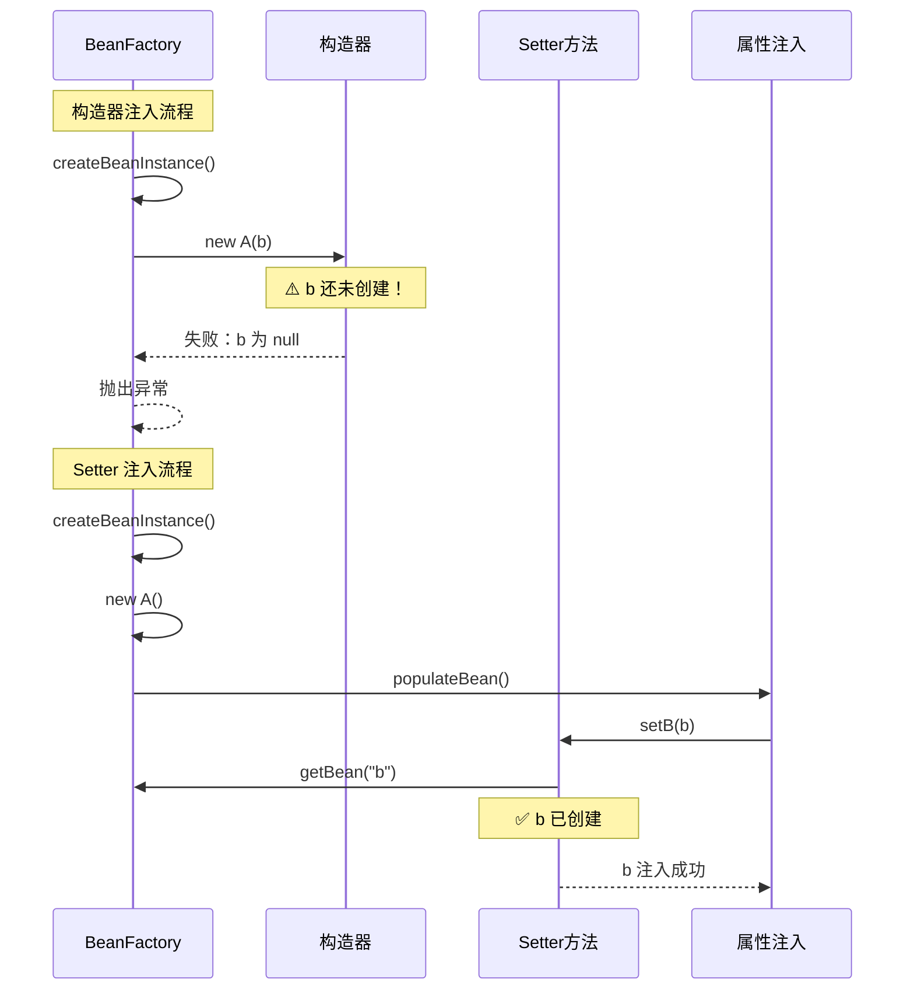
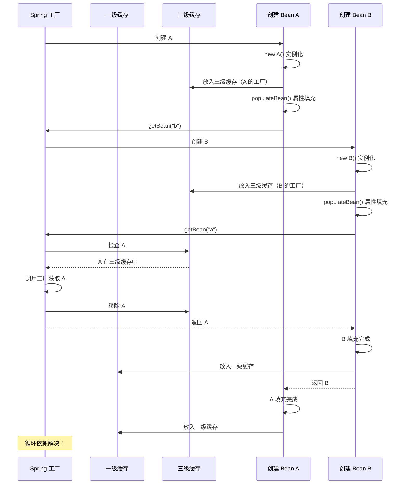

# 构造器注入循环依赖

**目标级别**：P6

## 开场：为什么构造器注入会失败

面试官问：「为什么构造器注入无法解决循环依赖？」你说：「因为构造器在 Bean 创建时就调用了，此时还没有放入缓存。」面试官追问：「那 Setter 注入为什么可以？它们的具体区别是什么？」

这道题考察的是你对 **Spring Bean 创建流程** 的理解深度。构造器注入和 Setter 注入在底层机制上有本质区别，理解这一点才能真正理解循环依赖的成因。

## 面试官最关心的 3 个问题（快速自测）

1. **🔴 为什么构造器注入无法解决循环依赖？**
2. **🔴 构造器注入和 Setter 注入在底层机制上有什么区别？**
3. **🟡 如何解决构造器注入的循环依赖问题？**

## 一、构造器注入 vs Setter 注入

### 1.1 基本语法对比

```java
// 构造器注入
@Service
public class UserService {
    private final UserDao userDao;
    private final OrderService orderService;
    
    public UserService(UserDao userDao, OrderService orderService) {
        this.userDao = userDao;
        this.orderService = orderService;
    }
}

// Setter 注入
@Service
public class UserService {
    private UserDao userDao;
    private OrderService orderService;
    
    @Autowired
    public void setUserDao(UserDao userDao) {
        this.userDao = userDao;
    }
    
    @Autowired
    public void setOrderService(OrderService orderService) {
        this.orderService = orderService;
    }
}
```

### 1.2 执行时机对比

| 阶段 | 构造器注入 | Setter 注入 |
|------|-----------|-------------|
| 实例化 | 构造器调用 | 无参构造器调用 |
| 属性填充 | 构造器参数传入 | 反射注入 |
| 初始化 | 构造器返回后 | 方法调用时 |

### 1.3 底层机制对比



## 二、构造器注入循环依赖详解

### 2.1 问题根源

构造器注入的循环依赖发生在 **Bean 实例化阶段**，这个阶段发生在：

1. Bean 实例创建之前
2. 三级缓存注册之前
3. Spring 无法提前暴露 Bean

### 2.2 问题分析

```java
@Service
public class A {
    private final B b;
    
    // 构造器注入 B
    public A(B b) {
        this.b = b;  // ← 问题在这里：需要 B，但 B 还不存在
    }
}

@Service
public class B {
    private final A a;
    
    // 构造器注入 A
    public B(A a) {
        this.a = a;  // ← 问题在这里：需要 A，但 A 还不存在
    }
}
```

**执行流程**：

```mermaid
sequenceDiagram
    participant User as 用户
    participant Factory as Spring 工厂
    participant Create as 创建 Bean A
    participant CTor as 调用构造器
    
    User->>Factory: getBean("a")
    Factory->>Create: createBean("a")
    Create->>Create: 实例化 A
    
    Note over Create: 准备调用构造器 A(B b)
    
    Create->>CTor: 需要 B 参数
    CTor->>Factory: getBean("b")
    Factory->>Create: createBean("b")
    Create->>Create: 实例化 B
    
    Note over Create: 准备调用构造器 B(A a)
    
    Create->>CTor: 需要 A 参数
    CTor->>Factory: getBean("a")
    Factory->>Create: 检查缓存
    Create-->>CTor: A 不在缓存中！
    
    Note over CTor: 循环依赖检测失败！
    CTor-->>Factory: 抛出异常
    Factory-->>User: BeanCurrentlyInCreationException
```

### 2.3 源码分析

```java title="AbstractAutowireCapableBeanFactory.java"
protected BeanWrapper createBeanInstance(String beanName, RootBeanDefinition mbd, 
                                         Object[] args) {
    // 使用构造器创建实例
    Constructor<?>[] constructorsToUse = 
        determineConstructors(beanName, mbd, args);
    
    if (constructorsToUse != null) {
        // 有参构造器 - 立即调用
        return autowireConstructor(beanName, mbd, constructorsToUse, args);
    }
    
    // 无参构造器
    return instantiateBean(beanName, mbd);
}
```

关键问题：**构造器调用是同步阻塞的**，在构造器返回之前，Bean 不会注册到任何缓存。

## 三、Setter 注入循环依赖详解

### 3.1 为什么 Setter 注入可以解决循环依赖

Setter 注入通过以下机制解决循环依赖：

1. **无参构造器先创建实例**
2. **Bean 注册到三级缓存（提前暴露）**
3. **属性填充时发现循环依赖，从缓存获取**

### 3.2 执行流程

```java title="AbstractAutowireCapableBeanFactory.java"
protected Object doCreateBean(String beanName, RootBeanDefinition mbd, 
                               Object[] args) {
    // 1. 创建 Bean 实例（使用无参构造器）
    BeanWrapper instanceWrapper = createBeanInstance(beanName, mbd, args);
    Object bean = instanceWrapper.getWrapperInstance();
    
    // 2. 提前暴露 Bean（解决循环依赖的关键！）
    boolean earlySingletonExposure = (mbd.isSingleton() && 
                                       allowCircularReferences &&
                                       isSingletonCurrentlyInCreation(beanName));
    if (earlySingletonExposure) {
        addSingletonFactory(beanName, () -> getEarlyBeanReference(beanName, mbd, bean));
        // 此时 A 已在缓存中
    }
    
    // 3. 属性填充（Setter 注入在这里执行）
    populateBean(beanName, mbd, instanceWrapper);
    
    // 4. 初始化
    initializeBean(beanName, bean, mbd);
    
    return bean;
}
```

### 3.3 循环依赖解决过程



## 四、解决方案

### 4.1 使用 @Lazy 延迟加载

```java
@Service
public class A {
    private final B b;
    
    // 使用 @Lazy 延迟加载 B
    public A(@Lazy B b) {
        this.b = b;
    }
}

@Service
public class B {
    private final A a;
    
    public B(A a) {
        this.a = a;
    }
}
```

**原理**：`@Lazy` 注解会使 Spring 创建一个代理对象，在真正使用时才加载真正的 Bean。

```java
@Lazy
public A(@Lazy B b) {
    this.b = b;  // b 是一个代理对象
}

// 真正使用 b 时
b.doSomething();  // 触发代理加载真正的 B
```

### 4.2 改用 Setter 注入

```java
@Service
public class A {
    private B b;
    
    @Autowired
    public void setB(B b) {
        this.b = b;
    }
}

@Service
public class B {
    private A a;
    
    @Autowired
    public void setA(A a) {
        this.a = a;
    }
}
```

### 4.3 重构代码消除循环依赖

```java
// 重构前：循环依赖
@Service
public class OrderService {
    private final UserService userService;
    
    public OrderService(UserService userService) {
        this.userService = userService;
    }
}

@Service
public class UserService {
    private final OrderService orderService;
    
    public UserService(OrderService orderService) {
        this.orderService = orderService;
    }
}

// 重构后：引入中间层
@Service
public class OrderService {
    private final UserService userService;
    
    public OrderService(UserService userService) {
        this.userService = userService;
    }
}

@Service
public class UserService {
    // UserService 不直接依赖 OrderService
    // 如果需要，在方法参数中注入
    public void createUser(OrderService orderService) {
        // ...
    }
}
```

### 4.4 使用 ApplicationContextAware

```java
@Service
public class A {
    private B b;
    
    public A() {
        // 构造器不注入
    }
    
    @PostConstruct
    public void init() {
        // 在初始化方法中获取 B
        this.b = SpringContextHolder.getBean(B.class);
    }
}
```

> **⚠️ 警告**：不推荐使用 ApplicationContextAware，会增加代码耦合度。

## 五、面试高频追问

### 追问链 1：@Lazy 注解的实现原理

> **第一层**：@Lazy 是如何实现延迟加载的？
> 
> @Lazy 会创建一个代理对象，代理对象在第一次使用时才加载真正的 Bean。

> **第二层**：@Lazy 代理是什么类型？
> 
> 通常是 JDK 动态代理或 CGLIB 代理，取决于被注入的类是否有接口。

> **第三层**：@Lazy 能解决所有循环依赖吗？
> 
> 不能。@Lazy 只能解决部分场景，如果是强制的构造器依赖，@Lazy 只能延迟加载时机，不能解决根本问题。

### 追问链 2：Spring 如何检测循环依赖

> **第一层**：Spring 是如何检测循环依赖的？
> 
> 通过 `singletonsCurrentlyInCreation` 集合检测。

> **第二层**：检测发生在什么时候？
> 
> 在 Bean 创建前检查该 Bean 是否已经在创建中。

> **第三层**：为什么要用集合而不是计数器？
> 
> 可能有多个 Bean 同时创建，需要记录每个正在创建的 Bean。

### 追问链 3：prototype Bean 的循环依赖

> **第一层**：为什么 prototype Bean 无法解决循环依赖？
> 
> prototype Bean 不被缓存，每次获取都会创建新实例。

> **第二层**：Spring 如何处理 prototype 循环依赖？
> 
> 直接抛出 `BeanCurrentlyInCreationException`。

> **第三层**：如何避免 prototype 循环依赖？
> 
> 1. 避免在 prototype Bean 中注入其他 prototype Bean
> 2. 使用 `ObjectFactory` 或 `Provider` 延迟获取
> 3. 重构设计

## 六、常见错误与陷阱

### 错误 1：误以为 @Lazy 能完全解决问题

```java
// ⚠️ 错误：@Lazy 只能延迟加载，不能解决根本问题
@Service
public class A {
    private final B b;
    
    public A(@Lazy B b) {
        this.b = b;
    }
    
    public void doSomething() {
        // 第一次调用时触发加载
        b.process();
    }
}
```

> **⚠️ 陷阱**：@Lazy 只是延迟加载时机，如果 A 在某个方法中必然使用 B，延迟加载只是把问题推迟了。

### 错误 2：使用 prototype Bean 时忽略循环依赖

```java
// ⚠️ 错误：prototype Bean 循环依赖无法解决
@Bean
@Scope("prototype")
public A a(B b) {
    return new A(b);
}

@Bean
@Scope("prototype")
public B b(A a) {
    return new B(a);
}
```

### 错误 3：混合使用构造器注入和 Setter 注入

```java
// ⚠️ 不好：混合使用增加复杂度
@Service
public class UserService {
    private final UserDao userDao;  // 构造器注入
    private OrderService orderService;  // Setter 注入
    
    public UserService(UserDao userDao) {
        this.userDao = userDao;
    }
    
    @Autowired
    public void setOrderService(OrderService orderService) {
        this.orderService = orderService;
    }
}
```

## 七、对比总结

### 注入方式对比

| 维度 | 构造器注入 | Setter 注入 |
|------|-----------|-------------|
| 循环依赖支持 | ❌ | ✅ |
| 依赖不可变 | ✅ | ❌ |
| 代码简洁性 | 中等 | 好 |
| 可选依赖支持 | ❌ | ✅ |
| 可测试性 | 好 | 中等 |
| 推荐程度 | **高** | 中等 |

### 循环依赖解决方案对比

| 方案 | 优点 | 缺点 | 推荐程度 |
|------|------|------|---------|
| 重构代码 | 根本解决 | 需要改设计 | ⭐⭐⭐⭐⭐ |
| @Lazy | 临时解决 | 代码侵入 | ⭐⭐⭐ |
| Setter 注入 | 简单 | 增加可变状态 | ⭐⭐⭐⭐ |
| ApplicationContextAware | 灵活 | 增加耦合 | ⭐ |

## 下一步

深入理解 Spring Bean 的生命周期，请阅读 [Bean 生命周期](/questions/spring/bean-lifecycle)。
