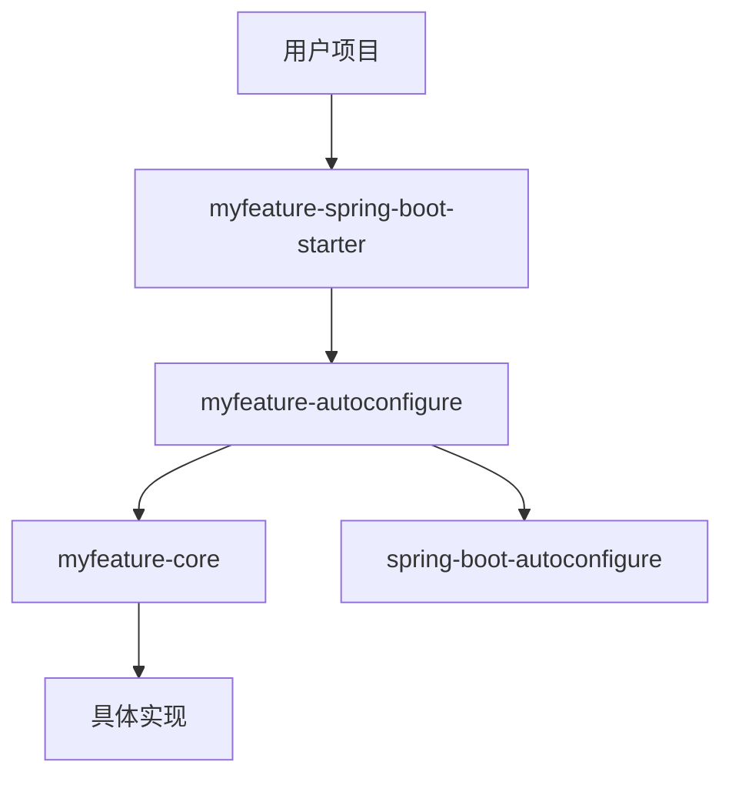

# 自定义 Starter 实现

**目标级别**：P6

## 开场：从使用到实现

面试官问：「你在项目中使用过自定义 Starter 吗？它是怎么实现的？」你说：「用过，但是别人写的。」面试官追问：「那你能自己实现一个 Starter 吗？」

自定义 Starter 是 Spring Boot 的高级特性，也是面试中展示技术深度的好话题。本节将手把手教你实现一个完整的自定义 Starter。

## 面试官最关心的 3 个问题（快速自测）

1. **🟡 自定义 Starter 的项目结构是怎样的？**
2. **🟡 如何实现配置属性类的自动绑定？**
3. **🟡 自动配置类需要满足哪些条件才能生效？**

## 一、Starter 项目结构

### 1.1 目录结构

```
myfeature-spring-boot-starter/
├── myfeature-spring-boot-starter/           # Starter POM
│   └── pom.xml
├── myfeature-autoconfigure/
│   ├── pom.xml
│   └── src/main/java/
│       └── com/example/myfeature/
│           ├── MyFeatureAutoConfiguration.java
│           ├── MyFeatureProperties.java
│           ├── MyFeatureService.java
│           └── MyFeatureImportSelector.java
│   └── src/main/resources/
│       └── META-INF/
│           └── spring.factories
└── pom.xml (parent)
```

### 1.2 依赖关系



## 二、实现步骤

### 2.1 Step 1：创建核心模块

```java
// MyFeatureProperties.java - 配置属性类
@ConfigurationProperties(prefix = "myfeature")
public class MyFeatureProperties {
    
    private boolean enabled = true;
    private String host = "localhost";
    private int port = 8080;
    private int timeout = 5000;
    private Map<String, String> headers = new HashMap<>();
    
    // getters and setters
}

// MyFeatureService.java - 服务类
public class MyFeatureService {
    
    private final MyFeatureProperties properties;
    
    public MyFeatureService(MyFeatureProperties properties) {
        this.properties = properties;
    }
    
    public String call(String path) {
        // 使用配置进行调用
        return String.format("Calling %s:%d%s", 
            properties.getHost(), 
            properties.getPort(), 
            path);
    }
}
```

### 2.2 Step 2：创建自动配置模块

```java
// MyFeatureAutoConfiguration.java
@Configuration
@ConditionalOnClass(MyFeatureService.class)           // 依赖类存在
@ConditionalOnProperty(                                 // 配置存在
    prefix = "myfeature", 
    name = "enabled", 
    havingValue = "true", 
    matchIfMissing = true
)
@EnableConfigurationProperties(MyFeatureProperties.class)  // 启用配置属性
public class MyFeatureAutoConfiguration {
    
    private final MyFeatureProperties properties;
    
    public MyFeatureAutoConfiguration(MyFeatureProperties properties) {
        this.properties = properties;
    }
    
    @Bean
    @ConditionalOnMissingBean  // 不存在该 Bean 时才注册
    public MyFeatureService myFeatureService() {
        return new MyFeatureService(properties);
    }
}
```

### 2.3 Step 3：配置 spring.factories

``` properties title="META-INF/spring.factories"
# Spring Boot 2.x
org.springframework.boot.autoconfigure.EnableAutoConfiguration=\
com.example.myfeature.autoconfigure.MyFeatureAutoConfiguration
```

``` properties title="META-INF/spring/org.springframework.boot.autoconfigure.AutoConfiguration.imports"
# Spring Boot 3.0+
com.example.myfeature.autoconfigure.MyFeatureAutoConfiguration
```

### 2.4 Step 4：创建 Starter POM

```xml title="myfeature-spring-boot-starter/pom.xml"
<project>
    <groupId>com.example</groupId>
    <artifactId>myfeature-spring-boot-starter</artifactId>
    <version>1.0.0</version>
    <packaging>jar</packaging>
    
    <dependencies>
        <!-- 依赖自动配置模块 -->
        <dependency>
            <groupId>com.example</groupId>
            <artifactId>myfeature-autoconfigure</artifactId>
            <version>1.0.0</version>
        </dependency>
        
        <!-- 可选：传递核心依赖 -->
        <dependency>
            <groupId>org.springframework.boot</groupId>
            <artifactId>spring-boot-starter</artifactId>
            <optional>true</optional>
        </dependency>
    </dependencies>
</project>
```

## 三、高级特性

### 3.1 多环境配置

```java
// 通用配置
@Configuration
@ConditionalOnClass(MyFeatureService.class)
public class MyFeatureAutoConfiguration {
    // ...
}

// 生产环境配置
@Configuration
@Profile("prod")
@ConditionalOnClass(MyFeatureService.class)
public class MyFeatureProdConfiguration {
    // 生产环境特定配置
}

// 开发环境配置
@Configuration
@Profile("dev")
@ConditionalOnClass(MyFeatureService.class)
public class MyFeatureDevConfiguration {
    // 开发环境特定配置
}
```

### 3.2 条件化 Bean 注册

```java
@Configuration
public class MyFeatureAutoConfiguration {
    
    @Bean
    @ConditionalOnMissingBean(MyFeatureService.class)
    public MyFeatureService myFeatureService() {
        return new MyFeatureService();
    }
    
    @Bean
    @ConditionalOnProperty(
        prefix = "myfeature",
        name = "async-enabled",
        havingValue = "true"
    )
    @ConditionalOnBean(TaskExecutor.class)
    public MyFeatureAsyncService asyncMyFeatureService() {
        return new MyFeatureAsyncService();
    }
}
```

### 3.3 自动配置排除

```java
// 用户可以在启动类中排除
@SpringBootApplication(exclude = MyFeatureAutoConfiguration.class)
public class Application {
}

// 或者在配置文件中排除
spring:
  autoconfigure:
    exclude:
      - com.example.myfeature.autoconfigure.MyFeatureAutoConfiguration
```

## 四、配置属性自动提示

### 4.1 spring-configuration-metadata.json

``` json title="META-INF/spring/spring-configuration-metadata.json"
{
  "groups": [
    {
      "name": "myfeature",
      "type": "com.example.myfeature.MyFeatureProperties",
      "sourceType": "com.example.myfeature.MyFeatureProperties"
    }
  ],
  "properties": [
    {
      "name": "myfeature.enabled",
      "type": "java.lang.Boolean",
      "description": "是否启用功能"
    },
    {
      "name": "myfeature.host",
      "type": "java.lang.String",
      "description": "服务器地址"
    },
    {
      "name": "myfeature.port",
      "type": "java.lang.Integer",
      "description": "服务器端口"
    }
  ],
  "hints": [
    {
      "name": "myfeature.host",
      "values": [
        { "value": "localhost", "description": "本地开发" },
        { "value": "127.0.0.1", "description": "本地 IP" }
      ]
    }
  ]
}
```

### 4.2 IDE 提示效果

```yaml
myfeature:
  enabled: true  # IDE 自动补全
  host: localhost
  port: 8080
```

## 五、测试 Starter

### 5.1 集成测试

```java
@SpringBootTest
@AutoConfigureMockMvc
class MyFeatureIntegrationTest {
    
    @Autowired
    private MockMvc mockMvc;
    
    @Test
    void testAutoConfiguration() {
        // 测试自动配置生效
        assertThat(mockMvc).isNotNull();
    }
}
```

### 5.2 条件测试

```java
@Test
@ConditionalOnProperty(prefix = "myfeature", name = "enabled", havingValue = "true")
void testEnabled() {
    // 测试启用时的行为
}

@Test
@ConditionalOnProperty(prefix = "myfeature", name = "enabled", havingValue = "false")
void testDisabled() {
    // 测试禁用时的行为
}
```

## 六、面试高频追问

### 追问链 1：为什么需要 @ConditionalOnMissingBean

> **第一层**：@ConditionalOnMissingBean 有什么作用？
> 
> 只有当容器中不存在该 Bean 时才注册。

> **第二层**：为什么要用这个注解？
> 
> 为了避免覆盖用户自定义配置。

> **第三层**：如果不用这个注解会怎样？
> 
> 自动配置的 Bean 会覆盖用户配置，可能导致问题。

### 追问链 2：spring.factories vs AutoConfiguration.imports

> **第一层**：两种配置方式有什么区别？
> 
> spring.factories 是 Spring Boot 2.x 方式，AutoConfiguration.imports 是 Spring Boot 3.0+ 方式。

> **第二层**：Spring Boot 3.0 为什么改用 AutoConfiguration.imports？
> 
> 更清晰，性能更好，支持延迟加载。

> **第三层**：如何兼容两个版本？
> 
> 同时提供两个文件。

### 追问链 3：自动配置优先级

> **第一层**：多个自动配置类之间有依赖怎么办？
> 
> 使用 @AutoConfigureBefore 和 @AutoConfigureAfter。

> **第二层**：如何控制加载顺序？
> 
> @AutoConfigureOrder 注解指定顺序。

> **第三层**：配置类和配置属性谁先加载？
> 
> @EnableConfigurationProperties 先注册配置属性类。

## 七、常见错误与陷阱

### 错误 1：缺少依赖

```xml
<!-- ⚠️ 错误：自动配置依赖需要声明 -->
<dependency>
    <groupId>org.springframework.boot</groupId>
    <artifactId>spring-boot-autoconfigure</artifactId>
    <optional>true</optional>  <!-- ⚠️ optional 不会传递 -->
</dependency>
```

### 错误 2：配置属性不生效

```java
// ⚠️ 错误：类上缺少 @Configuration 或 @Component
@ConfigurationProperties(prefix = "myfeature")
public class MyFeatureProperties {
    // 配置不生效
}

// ✅ 正确：配合 @EnableConfigurationProperties
@Configuration
@EnableConfigurationProperties(MyFeatureProperties.class)
public class MyFeatureAutoConfiguration {
}
```

### 错误 3：条件注解位置错误

```java
// ⚠️ 错误：条件注解应该加在配置类或 @Bean 方法上
@ConditionalOnClass(MyFeatureService.class)  // ⚠️ 无效
public class MyFeatureProperties {
}

@Configuration
public class MyFeatureAutoConfiguration {
    @ConditionalOnClass(MyFeatureService.class)  // ✅ 正确
    @Bean
    public MyFeatureService service() {
        return new MyFeatureService();
    }
}
```

## 八、对比总结

### 配置方式对比

| 方式 | Spring Boot 2.x | Spring Boot 3.0+ |
|------|-----------------|------------------|
| 文件位置 | META-INF/spring.factories | META-INF/spring/org.springframework.boot.autoconfigure.AutoConfiguration.imports |
| 格式 | properties | properties |
| 注解 | @EnableAutoConfiguration | @AutoConfiguration |

### 条件注解对比

| 注解 | 作用 | 常用场景 |
|------|------|---------|
| @ConditionalOnClass | 类存在时生效 | 检查依赖 |
| @ConditionalOnMissingBean | Bean 不存在时生效 | 避免覆盖 |
| @ConditionalOnProperty | 配置存在时生效 | 检查配置 |

## 九、实战应用

### 9.1 完整 Starter 清单

``` properties title="META-INF/spring/org.springframework.boot.autoconfigure.AutoConfiguration.imports"
com.example.myfeature.autoconfigure.MyFeatureAutoConfiguration
com.example.myfeature.autoconfigure.MyFeature健康检查Configuration
```

### 9.2 使用示例

```xml
<!-- 用户项目 pom.xml -->
<dependency>
    <groupId>com.example</groupId>
    <artifactId>myfeature-spring-boot-starter</artifactId>
    <version>1.0.0</version>
</dependency>
```

```yaml
# application.yml
myfeature:
  enabled: true
  host: localhost
  port: 8080
```

```java
// 用户代码
@Service
public class UserService {
    
    @Autowired
    private MyFeatureService myFeatureService;
    
    public void doSomething() {
        myFeatureService.call("/api/data");
    }
}
```

> **💡 加分回答**：Spring Boot 3.0 提供了 `@AutoConfiguration` 注解替代 `@Configuration`，使用 `AutoConfiguration.imports` 文件替代 `spring.factories`，使配置更简洁清晰。

## 下一步

理解 Spring Boot 启动流程，请阅读 [Spring Boot 启动流程](/questions/spring/startup-process)。
