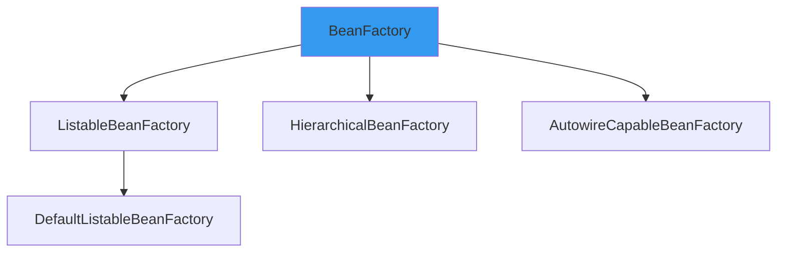
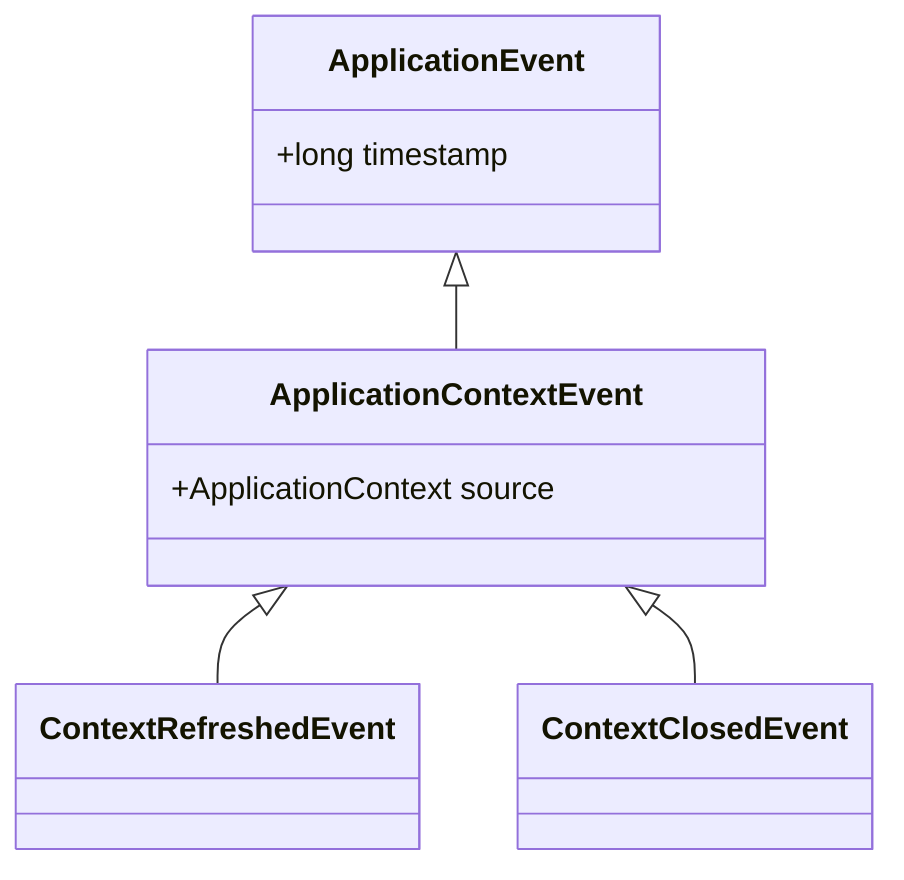

# Spring 设计模式总结

**目标级别**：P5/P6

## 开场：Spring 中的设计模式

面试官问：「Spring 源码中用到了哪些设计模式？」你说：「代理模式。」面试官追问：「还有呢？」

Spring 源码是学习设计模式的最佳教材。理解 Spring 中使用的设计模式，不仅能帮助理解 Spring 原理，还能提升代码设计能力。

## 面试官最关心的 3 个问题（快速自测）

1. **🟡 Spring 用到了哪些设计模式？**
2. **🟡 代理模式在 Spring 中是如何应用的？**
3. **🟡 工厂模式在 Spring 中是如何应用的？**

## 一、设计模式总览

### 1.1 核心模式

| 设计模式 | 应用场景 |
|---------|---------|
| 工厂模式 | BeanFactory |
| 单例模式 | Bean 默认作用域 |
| 代理模式 | AOP |
| 模板方法模式 | JdbcTemplate |
| 策略模式 | 事务管理器 |
| 观察者模式 | 事件监听 |
| 装饰器模式 | BufferedInputStream |
| 适配器模式 | HandlerAdapter |

## 二、工厂模式

### 2.1 BeanFactory

```java title="BeanFactory.java"
public interface BeanFactory {
    Object getBean(String name);
    <T> T getBean(Class<T> requiredType);
}
```

### 2.2 Spring 中的工厂模式



## 三、单例模式

### 3.1 Spring 单例

```java
// Spring 默认使用单例模式
@Service  // 等价于 @Scope("singleton")
public class UserService {
}
```

### 3.2 单例注册表

```java title="DefaultSingletonBeanRegistry.java"
private final Map<String, Object> singletonObjects = new ConcurrentHashMap<>();

public Object getSingleton(String beanName) {
    return singletonObjects.get(beanName);
}
```

## 四、代理模式

### 4.1 AOP 代理

```java
// Spring AOP 使用代理模式
@Configuration
@EnableAspectJAutoProxy
public class AppConfig {
}
```

### 4.2 代理创建

```java
public class ProxyFactory {
    
    public Object getProxy() {
        if (useJdkProxy) {
            return new JdkDynamicProxy().getProxy();
        } else {
            return new CglibProxy().getProxy();
        }
    }
}
```

## 五、模板方法模式

### 5.1 JdbcTemplate

```java title="JdbcTemplate.java"
public <T> T execute(ConnectionCallback<T> action) {
    Connection conn = getConnection();
    try {
        return action.doInConnection(conn);
    } finally {
        closeConnection(conn);
    }
}

// 用户只需实现回调
List<User> users = jdbcTemplate.execute(conn -> {
    PreparedStatement ps = conn.prepareStatement("SELECT * FROM users");
    return ps.executeQuery();
});
```

### 5.2 Spring 中的模板方法

| 模板类 | 用途 |
|-------|------|
| JdbcTemplate | JDBC 操作 |
| RestTemplate | HTTP 调用 |
| RedisTemplate | Redis 操作 |
| TransactionTemplate | 事务管理 |

## 六、策略模式

### 6.1 事务管理器

```java
public interface PlatformTransactionManager {
    TransactionStatus getTransaction(TransactionDefinition definition);
    void commit(TransactionStatus status);
    void rollback(TransactionStatus status);
}
```

### 6.2 多种实现

| 实现类 | 适用场景 |
|-------|---------|
| DataSourceTransactionManager | JDBC |
| JpaTransactionManager | JPA |
| JtaTransactionManager | 分布式事务 |

## 七、观察者模式

### 7.1 事件机制

```java
// 发布事件
@Service
public class OrderService {
    @Autowired
    private ApplicationEventPublisher publisher;
    
    public void createOrder(Order order) {
        publisher.publishEvent(new OrderCreatedEvent(order));
    }
}

// 监听事件
@Component
public class OrderListener {
    @EventListener
    public void handleOrderCreated(OrderCreatedEvent event) {
        // 处理订单创建事件
    }
}
```

### 7.2 Spring 事件类图



## 八、适配器模式

### 8.1 HandlerAdapter

```java
public interface HandlerAdapter {
    boolean supports(Object handler);
    ModelAndView handle(HttpServletRequest request, 
                        HttpServletResponse response, 
                        Object handler);
}

@Bean
public RequestMappingHandlerAdapter handlerAdapter() {
    return new RequestMappingHandlerAdapter();
}
```

### 8.2 多种处理器适配器

| 适配器 | 处理器类型 |
|-------|----------|
| RequestMappingHandlerAdapter | @RequestMapping |
| SimpleControllerHandlerAdapter | Controller 接口 |
| HttpRequestHandlerAdapter | HttpRequestHandler |

## 九、装饰器模式

### 9.1 BufferedInputStream

```java
// Java IO 中的装饰器模式
InputStream is = new FileInputStream("file.txt");
InputStream buffered = new BufferedInputStream(is);
```

### 9.2 Spring 中的装饰器

```java
// TransactionAwareInputStream 包装原始输入流
TransactionAwareInputStream wrapped = 
    new TransactionAwareInputStream(originalStream);
```

## 十、面试高频追问

### 追问链 1：代理模式 vs 装饰器模式

> **第一层**：代理模式和装饰器模式有什么区别？
> 
> 代理模式强调控制访问，装饰器模式强调功能增强。

> **第二层**：Spring AOP 是代理模式还是装饰器模式？
> 
> 代理模式。

> **第三层**：Spring 中的装饰器模式有哪些？
> 
> HttpServletRequestWrapper、HttpServletResponseWrapper。

### 追问链 2：工厂模式 vs 抽象工厂

> **第一层**：Spring 用的是工厂模式还是抽象工厂？
> 
> 主要是工厂模式，如 BeanFactory。

> **第二层**：BeanFactory 和 FactoryBean 的区别？
> 
> BeanFactory 是工厂接口，FactoryBean 是创建 Bean 的工厂。

## 十一、对比总结

### 设计模式对比

| 模式 | Spring 应用 | 说明 |
|------|-----------|------|
| 工厂模式 | BeanFactory | 创建 Bean |
| 单例模式 | Bean 默认作用域 | 提高性能 |
| 代理模式 | AOP | 方法增强 |
| 模板方法 | JdbcTemplate | 流程固定 |
| 策略模式 | 事务管理器 | 算法可切换 |
| 观察者模式 | 事件机制 | 解耦组件 |
| 适配器模式 | HandlerAdapter | 接口适配 |
| 装饰器模式 | InputStream | 动态增强 |

## 十二、实战应用

### 12.1 在项目中使用设计模式

```java
// 策略模式：多数据源切换
@Service
public class DataSourceStrategy {
    
    @Autowired
    private Map<String, DataSource> dataSources;
    
    public void switchDataSource(String key) {
        DataSource ds = dataSources.get(key);
        DataSourceContextHolder.setDataSource(ds);
    }
}

// 模板方法模式：通用 DAO
public abstract class BaseDao<T> {
    
    @Autowired
    private JdbcTemplate jdbcTemplate;
    
    public void save(T entity) {
        String sql = buildSaveSql();
        jdbcTemplate.update(sql, getParams(entity));
    }
    
    protected abstract String buildSaveSql();
    protected abstract Object[] getParams(T entity);
}
```

> **💡 加分回答**：Spring 的 `Environment` 接口使用了策略模式，根据不同的配置源（properties、yaml、环境变量）选择不同的解析策略。

## 下一步

理解 MyBatis 执行流程，请阅读 [MyBatis 执行流程](/questions/spring/mybatis-execution-flow)。
