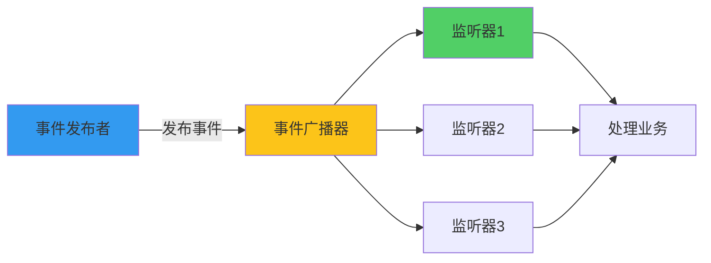
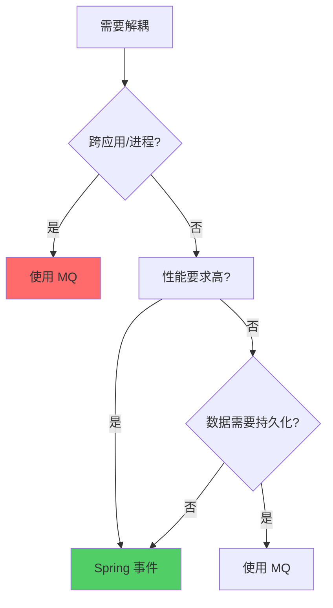

# Spring 事件监听机制

**目标级别**：P5

## 开场：解耦的艺术

面试官问：「Spring 事件机制有什么用？」你说：「解耦。」面试官追问：「那它和 MQ 消息队列有什么区别？什么时候用 Spring 事件，什么时候用 MQ？」

Spring 事件机制是实现应用内松耦合的一种方式，但很多人分不清它和消息队列的区别。这道题考察的是你对系统解耦方案的理解深度。

## 面试官最关心的 3 个问题（快速自测）

1. **🟡 Spring 事件机制的核心组件是什么？**
2. **🟡 @EventListener 和实现 ApplicationListener 接口有什么区别？**
3. **🟡 Spring 事件和 MQ 消息队列有什么区别？**

## 一、核心概念

### 1.1 事件三要素

| 组件 | 说明 | 对应类 |
|------|------|--------|
| 事件 | 要传递的信息 | ApplicationEvent |
| 发布者 | 发送事件 | ApplicationEventPublisher |
| 监听器 | 接收并处理事件 | ApplicationListener |

### 1.2 架构图



## 二、基本用法

### 2.1 定义事件

```java
// 方式一：继承 ApplicationEvent
public class OrderCreatedEvent extends ApplicationEvent {
    
    private final Order order;
    
    public OrderCreatedEvent(Object source, Order order) {
        super(source);
        this.order = order;
    }
    
    public Order getOrder() {
        return order;
    }
}

// 方式二：使用 PayloadApplicationEvent（Spring 4.2+）
public class OrderEvent {
    private final Order order;
    
    public OrderEvent(Order order) {
        this.order = order;
    }
}
```

### 2.2 发布事件

```java
@Service
public class OrderService {
    
    @Autowired
    private ApplicationEventPublisher publisher;
    
    public void createOrder(Order order) {
        orderDao.save(order);
        
        // 发布事件
        publisher.publishEvent(new OrderCreatedEvent(this, order));
    }
}
```

### 2.3 监听事件

```java
// 方式一：实现 ApplicationListener 接口
@Component
public class OrderCreatedListener implements ApplicationListener<OrderCreatedEvent> {
    
    @Override
    public void onApplicationEvent(OrderCreatedEvent event) {
        Order order = event.getOrder();
        System.out.println("订单已创建：" + order.getId());
        
        // 发送邮件通知
        emailService.sendOrderEmail(order);
    }
}

// 方式二：使用 @EventListener 注解（推荐）
@Component
public class OrderEventHandler {
    
    @EventListener
    public void handleOrderCreated(OrderCreatedEvent event) {
        Order order = event.getOrder();
        emailService.sendOrderEmail(order);
    }
    
    @EventListener
    public void handleOrderEvent(OrderEvent event) {
        System.out.println("收到事件：" + event.getOrder());
    }
}
```

## 三、异步事件

### 3.1 启用异步

```java
@Configuration
@EnableAsync
public class AsyncConfig {
}

// 监听器异步执行
@Component
public class OrderListener {
    
    @Async
    @EventListener
    public void handleOrderCreated(OrderCreatedEvent event) {
        // 异步执行，不阻塞主线程
        emailService.sendOrderEmail(event.getOrder());
    }
}
```

### 3.2 条件监听

```java
@Component
public class ConditionalListener {
    
    @EventListener(condition = "#event.order.status == 'PAID'")
    public void handlePaidOrder(OrderCreatedEvent event) {
        // 只处理已支付订单
        System.out.println("处理已支付订单：" + event.getOrder().getId());
    }
}
```

## 四、事务绑定事件

### 4.1 @TransactionalEventListener

```java
@Component
public class TransactionalListener {
    
    // 事件在事务提交后才触发
    @TransactionalEventListener(phase = TransactionPhase.AFTER_COMMIT)
    public void handleAfterCommit(OrderCreatedEvent event) {
        // 事务提交后才执行
        System.out.println("事务已提交，处理订单：" + event.getOrder().getId());
    }
    
    @TransactionalEventListener(phase = TransactionPhase.BEFORE_COMMIT)
    public void handleBeforeCommit(OrderCreatedEvent event) {
        // 事务提交前执行
    }
    
    @TransactionalEventListener(phase = TransactionPhase.AFTER_ROLLBACK)
    public void handleAfterRollback(OrderCreatedEvent event) {
        // 事务回滚后执行
    }
}
```

### 4.2 事务阶段

| 阶段 | 说明 |
|------|------|
| BEFORE_COMMIT | 事务提交前 |
| AFTER_COMMIT | 事务提交后（默认） |
| AFTER_ROLLBACK | 事务回滚后 |
| AFTER_COMPLETION | 事务完成后（提交或回滚） |

## 五、源码解析

### 5.1 事件发布流程

```java title="SimpleApplicationEventMulticaster.java"
public class SimpleApplicationEventMulticaster {
    
    public void multicastEvent(ApplicationEvent event) {
        multicastEvent((ApplicationEvent) event, resolveEventType(event));
    }
    
    public void multicastEvent(ApplicationEvent event, @Nullable ResolvableType eventType) {
        // 获取所有匹配的监听器
        for (ApplicationListener<?> listener : getApplicationListeners(event, type)) {
            // 逐个调用监听器
            invokeListener(listener, event);
        }
    }
}
```

### 5.2 @EventListener 处理

```java title="EventListenerMethodProcessor.java"
public class EventListenerMethodProcessor implements SmartInitializingSingleton {
    
    @Override
    public void afterSingletonsInstantiated() {
        // 扫描 @EventListener 注解的方法
        for (Method method : annotatedMethods) {
            ApplicationListenerMethodAdapter adapter = 
                createApplicationListener(method, beanName, bean);
            applicationContext.addListener(adapter);
        }
    }
}
```

## 六、Spring 事件 vs MQ

### 6.1 核心区别

| 维度 | Spring 事件 | MQ 消息队列 |
|------|------------|------------|
| 范围 | 同一 JVM | 跨应用/进程 |
| 可靠性 | JVM 内进程崩溃丢失 | 持久化可靠 |
| 性能 | 高 | 受 MQ 影响 |
| 事务绑定 | 支持 | 需要配合 |
| 适用场景 | 同进程解耦 | 跨系统解耦 |

### 6.2 选择建议



## 七、面试高频追问

### 追问链 1：事件监听顺序

> **第一层**：多个监听器监听同一事件，顺序如何？
> 
> 按监听器 Bean 的注册顺序。

> **第二层**：如何控制监听顺序？
> 
> 使用 @Order 注解或实现 Ordered 接口。

> **第三层**：@Async 的监听器顺序如何？
> 
> @Async 的监听器在不同线程执行，顺序无法保证。

### 追问链 2：异常处理

> **第一层**：监听器抛出异常会怎样？
> 
> 其他监听器继续执行，但异常会向上传播。

> **第二层**：如何处理监听器异常？
> 
> 使用 try-catch 包裹，或使用 ErrorHandler。

> **第三层**：@TransactionalEventListener 异常了会回滚事务吗？
> 
> 不会，因为事件在事务提交后触发，事务已经结束。

## 八、常见错误与陷阱

### 错误 1：事件同步发布

```java
@Service
public class BadOrderService {
    
    public void createOrder(Order order) {
        orderDao.save(order);
        
        // ⚠️ 同步发布，其他监听器执行完才返回
        publisher.publishEvent(new OrderCreatedEvent(this, order));
        
        // 用户需要等待所有监听器执行完
    }
}
```

### 错误 2：事务内发布事件

```java
@Service
public class BadService {
    
    @Transactional
    public void saveAndNotify() {
        userDao.save(user);
        
        // ⚠️ 事务未提交，监听器可能看不到数据
        publisher.publishEvent(new UserCreatedEvent(this, user));
    }
}

// 正确做法：使用 @TransactionalEventListener
@Component
public class UserListener {
    
    @TransactionalEventListener(phase = TransactionPhase.AFTER_COMMIT)
    public void handleAfterCommit(UserCreatedEvent event) {
        // 事务提交后才发送通知
        emailService.sendWelcome(event.getUser());
    }
}
```

## 九、对比总结

### 监听器实现方式对比

| 方式 | 优点 | 缺点 |
|------|------|------|
| ApplicationListener | 显式控制 | 代码较多 |
| @EventListener | 简洁 | 不够显式 |
| @TransactionalEventListener | 事务绑定 | 限制较多 |

### 事件发布方式对比

| 方式 | 说明 |
|------|------|
| ApplicationEventPublisher | 通用方式 |
| ApplicationEventPublisherAware | 注入方式 |
| @Autowired ApplicationEventPublisher | 自动注入 |

## 十、实战应用

### 10.1 审计日志

```java
// 事件
public class AuditEvent extends ApplicationEvent {
    private final String action;
    private final String operator;
    
    public AuditEvent(Object source, String action, String operator) {
        super(source);
        this.action = action;
        this.operator = operator;
    }
}

// 发布者
@Service
public class AuditService {
    
    @Autowired
    private ApplicationEventPublisher publisher;
    
    public void audit(String action) {
        publisher.publishEvent(new AuditEvent(this, action, getCurrentUser()));
    }
}

// 监听器
@Component
public class AuditListener {
    
    @TransactionalEventListener(phase = TransactionPhase.AFTER_COMMIT)
    public void handleAudit(AuditEvent event) {
        auditLogDao.save(new AuditLog(event.getAction(), event.getOperator()));
    }
}
```

### 10.2 缓存刷新

```java
@Component
public class CacheRefreshListener {
    
    @TransactionalEventListener(phase = TransactionPhase.AFTER_COMMIT)
    public void handleUserUpdated(UserUpdatedEvent event) {
        cacheManager.evict("user:" + event.getUserId());
    }
}
```

> **💡 加分回答**：Spring Boot 的 `@ConfigurationProperties` 绑定就使用了 `Binder` 绑定机制，类似事件驱动的绑定方式。

## 下一步

理解 FactoryBean 和 BeanFactory 的区别，请阅读 [FactoryBean vs BeanFactory](/questions/spring/factory-bean)。
