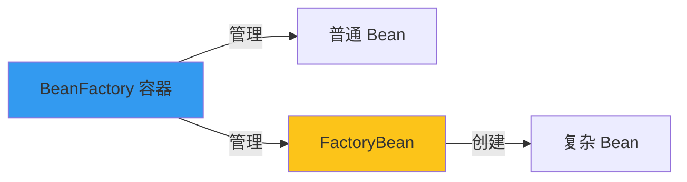
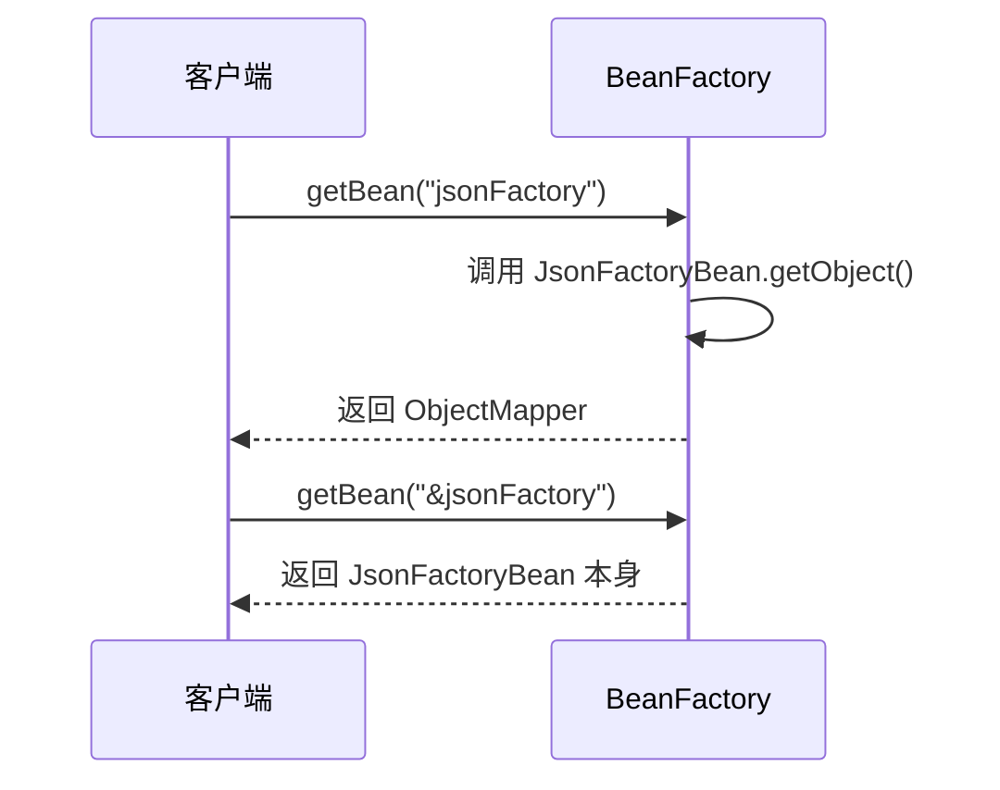

# FactoryBean vs BeanFactory

**目标级别**：P5/P6

## 开场：一个容易混淆的概念

面试官问：「FactoryBean 和 BeanFactory 有什么区别？」你说：「FactoryBean 是创建 Bean 的工厂，BeanFactory 是 Bean 的容器。」面试官追问：「那你用过 FactoryBean 吗？它和用 @Bean 方法创建 Bean 有什么区别？」

FactoryBean 是 Spring 提供的一个特殊接口，很多人用过却不知道。理解它的用途，才能理解 Spring 的 Bean 创建机制。

## 面试官最关心的 3 个问题（快速自测）

1. **🟡 FactoryBean 和 BeanFactory 有什么区别？**
2. **🟡 FactoryBean 的 getObject() 在什么时候被调用？**
3. **🟡 @Bean 和 FactoryBean 各适合什么场景？**

## 一、核心概念对比

### 1.1 BeanFactory

**BeanFactory** 是 Spring IoC 容器的顶层接口，定义了容器的基本功能：

```java title="BeanFactory.java"
public interface BeanFactory {
    Object getBean(String name);
    <T> T getBean(Class<T> requiredType);
    boolean containsBean(String name);
    boolean isSingleton(String name);
}
```

### 1.2 FactoryBean

**FactoryBean** 是用于创建复杂 Bean 的工厂接口：

```java title="FactoryBean.java"
public interface FactoryBean<T> {
    // 返回创建的 Bean 对象
    T getObject();
    
    // 返回创建的 Bean 类型
    Class<?> getObjectType();
    
    // 是否单例
    default boolean isSingleton() {
        return true;
    }
}
```

### 1.3 核心区别

| 维度 | BeanFactory | FactoryBean |
|------|------------|-------------|
| 角色 | 容器 | Bean |
| 作用 | 管理 Bean | 创建 Bean |
| 用途 | 通用容器 | 复杂 Bean 创建 |



## 二、FactoryBean 使用场景

### 2.1 SqlSessionFactory

MyBatis 集成 Spring 时使用 FactoryBean：

```java
@Bean
public SqlSessionFactory sqlSessionFactory(DataSource dataSource) {
    SqlSessionFactoryBean factory = new SqlSessionFactoryBean();
    factory.setDataSource(dataSource);
    factory.setMapperLocations(...);
    // SqlSessionFactoryBean 实现了 FactoryBean
    // Spring 容器调用 getObject() 获取 SqlSessionFactory
    return factory.getObject();
}
```

### 2.2 RabbitMQ ConnectionFactory

```java
@Bean
public ConnectionFactory connectionFactory() {
    CachingConnectionFactory factory = new CachingConnectionFactory();
    factory.setHost("localhost");
    factory.setPort(5672);
    factory.setUsername("guest");
    factory.setPassword("guest");
    return factory;
}
```

### 2.3 代理 Bean

Spring AOP 使用 FactoryBean 创建代理对象：

```java
public class ProxyFactoryBean<T> implements FactoryBean<T> {
    
    private final T target;
    private final Class<T> interfaceType;
    
    public ProxyFactoryBean(T target, Class<T> interfaceType) {
        this.target = target;
        this.interfaceType = interfaceType;
    }
    
    @Override
    public T getObject() {
        return createProxy();
    }
    
    @Override
    public Class<?> getObjectType() {
        return interfaceType;
    }
}
```

## 三、自定义 FactoryBean

### 3.1 基本实现

```java
@Component
public class JsonFactoryBean implements FactoryBean<ObjectMapper> {
    
    @Override
    public ObjectMapper getObject() {
        ObjectMapper mapper = new ObjectMapper();
        mapper.configure(DeserializationFeature.FAIL_ON_UNKNOWN_PROPERTIES, false);
        mapper.setDateFormat(new SimpleDateFormat("yyyy-MM-dd HH:mm:ss"));
        return mapper;
    }
    
    @Override
    public Class<?> getObjectType() {
        return ObjectMapper.class;
    }
    
    @Override
    public boolean isSingleton() {
        return true;  // 单例
    }
}
```

### 3.2 带参数

```java
@Component
public class RedisClientFactory implements FactoryBean<RedisClient> {
    
    @Value("${redis.host}")
    private String host;
    
    @Value("${redis.port}")
    private int port;
    
    @Override
    public RedisClient getObject() {
        RedisClient client = new RedisClient(host, port);
        client.connect();
        return client;
    }
    
    @Override
    public Class<?> getObjectType() {
        return RedisClient.class;
    }
}
```

## 四、获取 FactoryBean 本身

### 4.1 使用 & 前缀

```java
@Service
public class UserService {
    
    @Autowired
    private ObjectMapper jsonFactory;  // 获取 getObject() 返回的对象
    
    @Autowired
    private BeanFactory beanFactory;
    
    public void demo() {
        // 获取 FactoryBean 本身
        JsonFactoryBean factoryBean = beanFactory.getBean("&jsonFactory", JsonFactoryBean.class);
    }
}
```

### 4.2 Bean 名称规则

| Bean 名称 | 获取方式 | 返回类型 |
|-----------|---------|---------|
| `jsonFactory` | getBean("jsonFactory") | ObjectMapper |
| `&jsonFactory` | getBean("&jsonFactory") | JsonFactoryBean |



## 五、FactoryBean 与 @Bean 对比

### 5.1 @Bean 用法

```java
@Configuration
public class RedisConfig {
    
    @Bean
    public RedisTemplate<String, Object> redisTemplate(RedisConnectionFactory factory) {
        RedisTemplate<String, Object> template = new RedisTemplate<>();
        template.setConnectionFactory(factory);
        template.setKeySerializer(new StringRedisSerializer());
        template.setValueSerializer(new GenericJackson2JsonRedisSerializer());
        return template;
    }
}
```

### 5.2 对比表

| 维度 | @Bean | FactoryBean |
|------|-------|------------|
| 声明位置 | @Configuration 类 | 实现 FactoryBean 接口 |
| 控制权 | 开发者 | Spring 容器 |
| 灵活性 | 高 | 中 |
| 适用场景 | 简单创建 | 复杂创建 |
| 后置处理 | 支持 | 支持 |
| 代理支持 | 需要手动 | 可自动代理 |

### 5.3 选择建议

| 场景 | 推荐方式 |
|------|---------|
| 简单对象创建 | @Bean |
| 需要实现接口 | FactoryBean |
| 需要动态创建 | FactoryBean |
| 第三方库集成 | FactoryBean |

## 六、源码解析

### 6.1 FactoryBean 注册

```java title="AbstractBeanFactory.java"
protected <T> T doGetBean(String name, Class<T> requiredType, 
                         Object[] args, boolean typeCheckOnly) {
    // 去除 & 前缀
    String beanName = transformedBeanName(name);
    
    Object bean;
    
    // 获取单例 Bean
    Object singletonInstance = getSingleton(beanName);
    if (singletonInstance != null) {
        // 如果请求的是 FactoryBean 本身
        if (containsBeanDefinition(beanName) || 
            beanName.startsWith(FACTORY_BEAN_PREFIX)) {
            // 返回 FactoryBean 本身
            return getObjectForBeanInstance(singletonInstance, name, beanName, null);
        }
        return singletonInstance;
    }
    
    // ...
}

protected Object getObjectForBeanInstance(Object beanInstance, String name, 
                                         String beanName, RootBeanDefinition mbd) {
    // 如果 Bean 名称以 & 开头，直接返回
    if (name.startsWith("&") && beanInstance instanceof FactoryBean) {
        return beanInstance;
    }
    
    // 否则调用 FactoryBean.getObject()
    if (beanInstance instanceof FactoryBean) {
        Object object = ((FactoryBean<?>) beanInstance).getObject();
        return object;
    }
    
    return beanInstance;
}
```

## 七、面试高频追问

### 追问链 1：FactoryBean 创建时机

> **第一层**：FactoryBean 的 getObject() 在什么时候被调用？
> 
> 在容器获取该 Bean 时调用。

> **第二层**：单例 FactoryBean 和原型 FactoryBean 的区别？
> 
> 单例 FactoryBean 的 getObject() 只调用一次，原型 FactoryBean 每次获取都会调用。

> **第三层**：如何控制 getObject() 的调用时机？
> 
> 可以通过 BeanPostProcessor 在实例化后立即调用。

### 追问链 2：FactoryBean 与代理

> **第一层**：FactoryBean 创建的 Bean 会经过 BeanPostProcessor 吗？
> 
> 会，FactoryBean.getObject() 返回的 Bean 同样会经过后置处理器。

> **第二层**：如何让 FactoryBean 返回的 Bean 使用代理？
> 
> 在 FactoryBean 内部使用 ProxyFactory 创建代理。

> **第三层**：FactoryBean 本身会被代理吗？
> 
> 不会，代理只作用于 getObject() 返回的对象。

### 追问链 3：FactoryBean 的 isSingleton

> **第一层**：isSingleton() 方法的作用是什么？
> 
> 告诉容器该 FactoryBean 创建的 Bean 是否是单例。

> **第二层**：isSingleton() 和 Bean 作用域有什么关系？
> 
> isSingleton() 只影响 getObject() 的调用次数，Bean 作用域由容器控制。

> **第三层**：返回 false 会怎样？
> 
> 每次 getBean() 都会调用 getObject() 创建新实例。

## 八、常见错误与陷阱

### 错误 1：混淆 FactoryBean 和 BeanFactory

```java
// ⚠️ 错误：把 FactoryBean 当作 BeanFactory 使用
@Autowired
private FactoryBean factory;

// 正确：获取实际 Bean
@Autowired
private ObjectMapper objectMapper;

// 或者获取 FactoryBean 本身
@Bean
public FactoryBean<ObjectMapper> jsonFactory() {
    return new JsonFactoryBean();
}
```

### 错误 2：忘记重写 isSingleton

```java
@Component
public class NonSingletonFactory implements FactoryBean<MyClass> {
    
    @Override
    public MyClass getObject() {
        return new MyClass();  // ⚠️ 每次返回新实例
    }
    
    // ⚠️ 默认返回 true，但实际返回新实例！
    // 应该重写 isSingleton() 返回 false
}
```

### 错误 3：FactoryBean 中注入依赖

```java
@Component
public class BadFactory implements FactoryBean<MyClass> {
    
    @Autowired
    private MyService myService;  // ⚠️ 可能注入失败
    
    @Override
    public MyClass getObject() {
        // 构造函数中无法使用 myService
        return new MyClass();
    }
}

// 正确做法
@Component
public class GoodFactory implements FactoryBean<MyClass> {
    
    private final MyService myService;
    
    public GoodFactory(MyService myService) {  // 构造器注入
        this.myService = myService;
    }
    
    @Override
    public MyClass getObject() {
        return new MyClass(myService);
    }
}
```

## 九、对比总结

### FactoryBean vs 普通 Bean

| 维度 | FactoryBean | 普通 Bean |
|------|------------|----------|
| 创建方式 | getObject() | 构造函数 |
| 后置处理 | 作用于返回对象 | 作用于本身 |
| 获取方式 | & 前缀 | 普通方式 |
| 适用场景 | 复杂创建 | 简单创建 |

### FactoryBean vs @Bean

| 维度 | FactoryBean | @Bean |
|------|------------|------|
| 声明方式 | 实现接口 | 注解方法 |
| Spring 管理 | 自动 | @Configuration 类 |
| 生命周期 | 独立 | 依赖配置类 |
| 适用场景 | 框架集成 | 自定义配置 |

## 十、实战应用

### 10.1 动态数据源

```java
public class DynamicDataSourceFactory implements FactoryBean<DataSource> {
    
    @Value("${datasource.url}")
    private String url;
    
    @Value("${datasource.driver}")
    private String driver;
    
    @Override
    public DataSource getObject() {
        DruidDataSource dataSource = new DruidDataSource();
        dataSource.setUrl(url);
        dataSource.setDriverClassName(driver);
        return dataSource;
    }
    
    @Override
    public Class<?> getObjectType() {
        return DataSource.class;
    }
}
```

### 10.2 动态代理

```java
public class ProxyFactoryBean<T> implements FactoryBean<T> {
    
    private final Class<T> interfaceType;
    private final T target;
    
    public ProxyFactoryBean(Class<T> interfaceType, T target) {
        this.interfaceType = interfaceType;
        this.target = target;
    }
    
    @Override
    public T getObject() {
        return ProxyFactory.getProxy(interfaceType, new MethodInterceptor() {
            @Override
            public Object intercept(Object proxy, Method method, 
                                  Object[] args, MethodProxy methodProxy) {
                System.out.println("Before: " + method.getName());
                Object result = method.invoke(target, args);
                System.out.println("After: " + method.getName());
                return result;
            }
        });
    }
    
    @Override
    public Class<?> getObjectType() {
        return interfaceType;
    }
}
```

> **💡 加分回答**：Spring Boot 的自动配置大量使用了 FactoryBean 模式，例如 `DataSourceInitializerOperation` 等。

## 下一步

理解 Spring 中使用的设计模式，请阅读 [Spring 设计模式总结](/questions/spring/design-patterns)。
