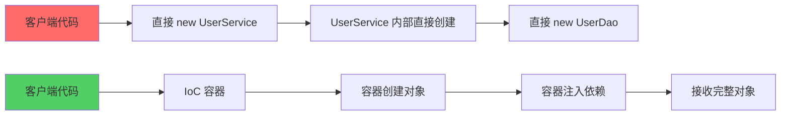
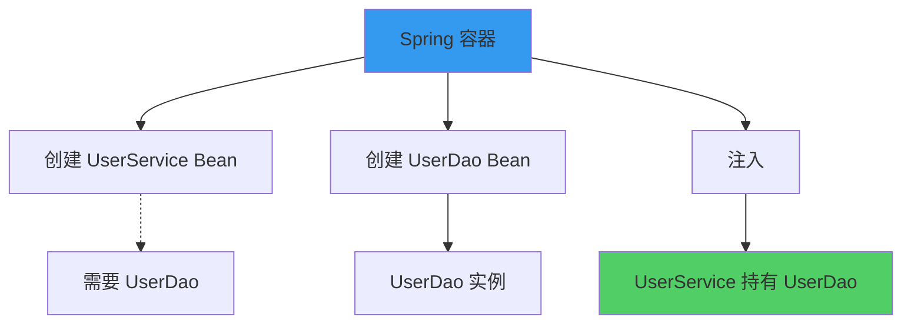
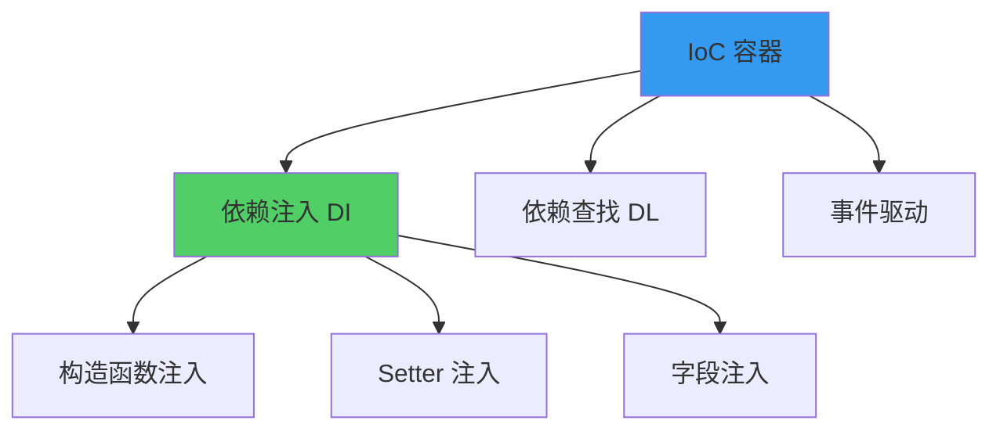
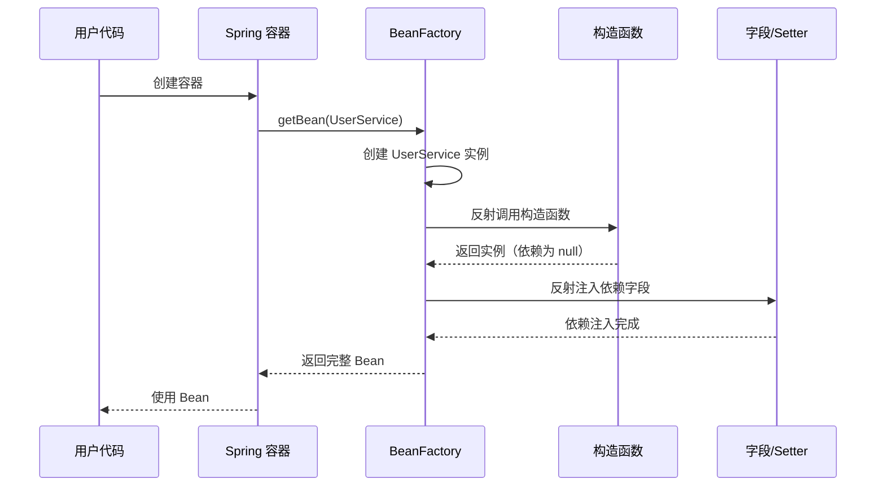

# IoC 与 DI 原理

**目标级别**：P5/P6

## 开场：为什么面试官必问 IoC/DI

面试官问：「解释一下 Spring 的 IoC 和 DI？」你说：「IoC 是控制反转，DI 是依赖注入。」面试官点点头，又问：「那 Spring 是怎么实现依赖注入的？为什么要用反射而不是直接 new？」你沉默了。

这不是一道可以靠背概念回答的题目。IoC/DI 是 Spring 最核心的机制，理解它的实现原理，才能理解 Spring 为什么这样设计框架，以及为什么有时候会出现一些「奇怪」的问题。

## 面试官最关心的 3 个问题（快速自测）

1. **🔴 IoC 和 DI 有什么区别？IoC 是设计思想还是实现方式？**
2. **🔴 Spring 是如何通过反射实现依赖注入的？有哪些注入方式？**
3. **🟡 为什么推荐使用构造器注入而不是 Setter 注入？循环依赖的根本原因是什么？**

如果这三个问题不能完整回答，请认真阅读本文。

## 一、IoC 与 DI 的核心概念

### 1.1 什么是 IoC（控制反转）

**IoC（Inversion of Control，控制反转）** 是一种软件设计原则，而不是具体的实现技术。它将对象的创建和依赖关系的管理从应用代码中转移到框架容器中。

传统方式 vs IoC 方式：



**核心区别**：

| 对比维度 | 传统方式 | IoC 方式 |
|---------|---------|---------|
| 对象创建 | 应用代码主动 new | 容器被动创建 |
| 依赖管理 | 对象自己管理 | 容器统一管理 |
| 代码耦合度 | 高耦合 | 低耦合 |
| 可测试性 | 难测试 | 易测试 |
| 可扩展性 | 差 | 好 |

### 1.2 什么是 DI（依赖注入）

**DI（Dependency Injection，依赖注入）** 是 IoC 的一种具体实现方式，指的是容器在创建对象时，将对象所依赖的其他对象通过构造函数、Setter 方法或字段注入进来。



### 1.3 IoC vs DI：不是一回事

很多人把 IoC 和 DI 混为一谈，这是一个**常见的面试陷阱**：

> **⚠️ 陷阱**：认为 IoC = DI，两者是一回事

**正确理解**：

- **IoC 是一种设计思想**：强调将控制权从应用代码转移到框架
- **DI 是实现 IoC 的一种手段**：通过注入方式完成对象依赖管理
- **IoC 还有其他实现方式**：如依赖查找（Dependency Lookup）、模板方法模式等



## 二、依赖注入的三种方式

### 2.1 构造函数注入（推荐）

通过构造函数注入依赖，这是 **Spring 推荐的注入方式**。

```java
@Service
public class UserService {
    private final UserDao userDao;
    private final OrderService orderService;
    
    // 构造函数注入
    public UserService(UserDao userDao, OrderService orderService) {
        this.userDao = userDao;
        this.orderService = orderService;
    }
}
```

**优点**：

- 依赖不可变（final 字段）
- 确保依赖不为 null
- 更容易测试
- 强制要求所有依赖在构造时提供

**缺点**：

- 构造函数参数过多时代码冗长
- 需要配合 @Autowired 使用

### 2.2 Setter 注入（可选）

通过 Setter 方法注入依赖，适用于可选依赖。

```java
@Service
public class UserService {
    private UserDao userDao;
    
    // Setter 注入
    @Autowired
    public void setUserDao(UserDao userDao) {
        this.userDao = userDao;
    }
}
```

**适用场景**：

- 可选依赖（有默认值）
- 需要在对象创建后动态更改依赖

> **⚠️ 陷阱**：Setter 注入可能导致对象处于不完整状态。如果忘记注入某个依赖，运行时才会发现 NPE。

### 2.3 字段注入（不推荐）

直接注入到字段，不推荐使用。

```java
@Service
public class UserService {
    @Autowired
    private UserDao userDao;
}
```

**为什么不推荐**：

- 不符合单一职责原则
- 难以测试（需要反射或 Spring 测试框架）
- 不清晰依赖来源

| 注入方式 | 可变性 | 可测试性 | 强制性 | 推荐程度 |
|---------|-------|---------|-------|---------|
| 构造函数注入 | 不可变 | 易测试 | 强 | **⭐⭐⭐⭐⭐** |
| Setter 注入 | 可变 | 中等 | 弱 | ⭐⭐⭐ |
| 字段注入 | 可变 | 难测试 | 无 | ⭐ |

## 三、Spring 实现依赖注入的原理

### 3.1 核心流程

Spring 实现依赖注入的核心流程如下：



### 3.2 源码解析

Spring 通过 **反射** 完成依赖注入，核心代码在 `AbstractAutowireCapableBeanFactory.doCreateBean()` 方法中：

```java title="AbstractAutowireCapableBeanFactory.java" {3,8,15}
protected Object doCreateBean(String beanName, RootBeanDefinition mbd,
                              @Nullable Object[] args) throws BeansException {
    // 1. 创建 Bean 实例
    BeanWrapper instanceWrapper = createBeanInstance(beanName, mbd, args);
    Object bean = instanceWrapper.getWrapperInstance();
    
    // 2. 解决循环依赖（提前暴露 Bean）
    boolean earlySingletonExposure = (mbd.isSingleton() && 
                                       allowCircularReferences &&
                                       isSingletonCurrentlyInCreation(beanName));
    if (earlySingletonExposure) {
        addSingletonFactory(beanName, () -> getEarlyBeanReference(beanName, mbd, bean));
    }
    
    // 3. 填充属性（依赖注入）
    populateBean(beanName, mbd, instanceWrapper);
    
    // 4. 初始化 Bean
    initializeBean(beanName, bean, mbd);
    
    return bean;
}
```

关键方法 `populateBean()` 负责属性填充：

```java title="AbstractAutowireCapableBeanFactory.java"
protected void populateBean(String beanName, RootBeanDefinition mbd, BeanWrapper bw) {
    // 遍历所有属性
    PropertyValues pvs = mbd.getPropertyValues();
    
    for (PropertyDescriptor pd : pvs) {
        if (pvs.contains(pd.getName())) {
            continue;
        }
        
        // 核心：通过反射注入属性
        Method writeMethod = pd.getWriteMethod();
        if (writeMethod != null) {
            Object value = resolveValue(pd.getName());
            // 暴力访问私有方法
            ReflectionUtils.makeAccessible(writeMethod);
            writeMethod.invoke(bean, value);
        }
    }
}
```

### 3.3 @Autowired 注解的处理

`@Autowired` 注解通过 `AutowiredAnnotationBeanPostProcessor` 处理：

```java title="AutowiredAnnotationBeanPostProcessor.java"
public class AutowiredAnnotationBeanPostProcessor extends InstantiationAwareBeanPostProcessorAdapter {
    
    private void inject(Object bean, String beanName, PropertyDescriptor pd) {
        Method writeMethod = pd.getWriteMethod();
        Object value = findAutowiringMetadata(beanName, bean.getClass());
        
        // 反射调用 Setter 方法
        ReflectionUtils.makeAccessible(writeMethod);
        writeMethod.invoke(bean, value);
    }
}
```

## 四、面试高频追问

### 追问链 1：Spring 如何解决循环依赖？

> **第一层**：什么是循环依赖？
> 
> 循环依赖是指两个或多个 Bean 相互依赖，形成闭环。例如：Bean A 依赖 Bean B，Bean B 依赖 Bean A。

> **第二层**：Spring 三级缓存是如何解决循环依赖的？
> 
> Spring 通过三级缓存解决循环依赖：
> - **一级缓存**：存放完全成品的 Bean
> - **二级缓存**：存放提前暴露的 Bean（未完成属性填充）
> - **三级缓存**：存放 Bean 工厂，用于创建代理对象

> **第三层**：为什么需要三级缓存？二级缓存不够吗？
> 
> 三级缓存的核心目的是**处理代理对象的创建**。如果只有二级缓存，无法在循环依赖时正确创建代理对象。三级缓存确保代理对象的创建逻辑只执行一次。

### 追问链 2：构造器注入 vs Setter 注入

> **第一层**：为什么推荐构造器注入？
> 
> 构造器注入强制要求所有依赖在创建时就确定，确保对象不可变，更容易测试。

> **第二层**：构造器注入会导致什么问题？
> 
> 构造器注入可能导致**循环依赖问题**。如果 A 的构造器依赖 B，B 的构造器依赖 A，Spring 无法确定创建顺序。

> **第三层**：如何解决构造器注入的循环依赖？
> 
> 有三种方案：
> 1. 使用 @Lazy 延迟加载
> 2. 改用 Setter 注入
> 3. 重构代码，消除循环依赖

### 追问链 3：Bean 的作用域与依赖注入

> **第一层**：有哪些 Bean 作用域？
> 
> - `singleton`：单例（默认）
> - `prototype`：原型（每次获取创建新实例）
> - `request`：请求级别
> - `session`：会话级别
> - `application`：ServletContext 级别

> **第二层**：prototype 作用域的 Bean 能否注入到 singleton Bean？
> 
> 可以注入，但有陷阱：**每次从容器获取 singleton Bean 时，注入的 prototype Bean 都是新创建的**。但如果通过 singleton Bean 的方法间接获取 prototype Bean，则不会创建新实例。

## 五、对比总结

### IoC 实现方式对比

| 实现方式 | 代表框架 | 特点 |
|---------|---------|------|
| 依赖注入 | Spring、Google Guice | 容器主动注入 |
| 依赖查找 | JNDI、EJB | 应用主动获取 |
| 模板方法 | JUnit、Apache Commons | 子类扩展父类 |

### 注入方式对比

| 维度 | 构造器注入 | Setter 注入 | 字段注入 |
|------|-----------|-------------|---------|
| 依赖不可变 | ✅ | ❌ | ❌ |
| 易于测试 | ✅ | ⚠️ | ❌ |
| 强制性 | 强 | 弱 | 无 |
| 代码简洁 | ⚠️ | ✅ | ✅ |
| 可选依赖 | ❌ | ✅ | ✅ |
| 推荐程度 | **最高** | 中等 | 不推荐 |

## 六、常见错误与陷阱

### 错误 1：@Autowired 注解放置位置错误

```java
// 错误：@Autowired 放在字段上
@Service
public class UserService {
    @Autowired
    private UserDao userDao;  // 不推荐
}

// 正确：@Autowired 放在构造器上
@Service
public class UserService {
    private final UserDao userDao;
    
    @Autowired  // 构造器注入是 Spring 4.x 推荐的写法
    public UserService(UserDao userDao) {
        this.userDao = userDao;
    }
}
```

> **💡 加分回答**：Spring 4.x 之后推荐构造器注入，配合 `@RequiredArgsConstructor` 可以自动生成构造函数。

### 错误 2：循环依赖不自知

```java
// 错误示例：循环依赖
@Service
public class A {
    private final B b;
    
    public A(B b) {
        this.b = b;  // 依赖 B
    }
}

@Service
public class B {
    private final A a;
    
    public B(A a) {
        this.a = a;  // 依赖 A，循环依赖！
    }
}
```

> **⚠️ 陷阱**：构造器注入的循环依赖无法通过三级缓存解决，会抛出 `BeanCurrentlyInCreationException`。

### 错误 3：忽略依赖注入的顺序

```java
@Service
public class OrderService {
    private final UserService userService;
    private final ProductService productService;
    
    public OrderService(UserService userService, ProductService productService) {
        // 注意：Spring 按照参数类型匹配 Bean
        // 如果有多个相同类型的 Bean，需要使用 @Qualifier 指定
        this.userService = userService;
        this.productService = productService;
    }
}
```

> **⚠️ 陷阱**：如果容器中存在多个相同类型的 Bean，Spring 默认按类型匹配会报错，需要配合 `@Qualifier` 或 `@Primary` 使用。

## 七、延伸思考

### 为什么 Spring 选择反射而不是其他方式？

1. **性能可接受**：反射调用的性能开销在现代 JVM 中已大幅降低，且只在 Bean 初始化时执行一次
2. **灵活性高**：通过反射可以动态获取类的结构和属性
3. **无需编译期依赖**：用户代码无需实现特定接口或继承特定类

> **💡 加分回答**：Spring 5.x 引入了 `ConstructorResolver` 优化构造函数解析，使用了内联缓存等技巧提升反射性能。

### 依赖注入的未来趋势

1. **Java 16+**：`jpackage` 和 `jlink` 推动更轻量的容器
2. **Jakarta EE 9+**：从 `javax.inject` 迁移到 `jakarta.inject`
3. **GraalVM 原生镜像**：Spring Native 项目探索 AOT 编译，减少反射使用

## 下一步

深入理解 Spring 循环依赖的处理机制，请阅读 [循环依赖与三级缓存](/questions/spring/circular-dependency)。
